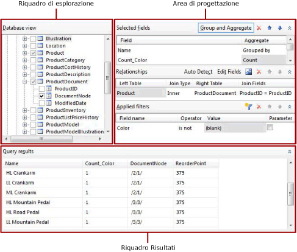
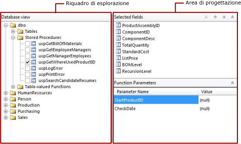

# Interfaccia utente di Progettazione query relazionale (Generatore report)
  Generatore report e Progettazione report in [!INCLUDE[ssBIDevStudioFull](../../includes/ssbidevstudiofull-md.md)]forniscono entrambi una finestra Progettazione query con interfaccia grafica e una finestra Progettazione query basata su testo che semplificano la creazione di una query per specificare i dati da recuperare dai database relazionali di [!INCLUDE[msCoName](../../includes/msconame-md.md)] [!INCLUDE[ssNoVersion](../../includes/ssnoversion-md.md)] e [!INCLUDE[msCoName](../../includes/msconame-md.md)] [!INCLUDE[ssSDS](../../includes/sssds-md.md)] relational databases e [!INCLUDE[msCoName](../../includes/msconame-md.md)] [!INCLUDE[ssDWCurrentFull](../../includes/ssdwcurrentfull-md.md)] per un set di dati di report. Utilizzare la finestra Progettazione query con interfaccia grafica per esplorare i metadati, compilare in modo interattivo una query e visualizzarne i risultati. Utilizzare Progettazione query basata su testo per visualizzare la query compilata nella finestra Progettazione query con interfaccia grafica o per modificare una query. È inoltre possibile importare una query esistente da un file o un report.  
  
> [!NOTE]  
>  Per specificare in Generatore report una query per i tipi di origine dati Oracle, OLE DB, ODBC e Teradata, è necessario utilizzare la finestra Progettazione query basata su testo. Per altre informazioni, vedere [Interfaccia utente di Progettazione query basata su testo &#40;Generatore report &#41;](../../reporting-services/report-data/text-based-query-designer-user-interface-report-builder.md).  
  
> [!IMPORTANT]  
>  Gli utenti accedono alle origini dati quando creano ed eseguono query. È necessario concedere autorizzazioni minime per le origini dati, ad esempio autorizzazioni di sola lettura.  
  
## Finestra Progettazione query con interfaccia grafica  
 Nella finestra Progettazione query con interfaccia grafica è possibile esplorare le tabelle e le viste dei database e compilare in modo interattivo l'istruzione SQL SELECT che specifica le tabelle e le colonne del database da cui recuperare i dati per un set di dati. È possibile scegliere i campi da includere nel set di dati e, facoltativamente, specificare filtri che limitano i dati nel set di dati. È possibile specificare che i filtri vengono utilizzati come parametri e forniscono il valore del filtro in fase di esecuzione. Se si scelgono più tabelle correlate, la finestra Progettazione query descrive la relazione tra set di due tabelle.  
  
 La finestra Progettazione query con interfaccia grafica è suddivisa in tre aree. A seconda che la query utilizzi tabelle/viste o stored procedure/funzioni con valori di tabella, il layout di Progettazione query cambia.  
  
> [!NOTE]  
>  [!INCLUDE[ssDWCurrentFull](../../includes/ssdwcurrentfull-md.md)] non supporta stored procedure o funzioni con valori di tabella.  
  
 Nella figura seguente è illustrata la finestra Progettazione query con interfaccia grafica nell'utilizzo con tabelle o viste.  
  
   
  
 Nella figura seguente viene illustrata la finestra Progettazione query con interfaccia grafica quando viene utilizzata con stored procedure o funzioni con valori di tabella.  
  
   
  
 Nella tabella seguente viene descritta la funzione di ogni riquadro.  
  
 [Vista di database](#DatabaseView)  
 Consente di visualizzare gerarchicamente tabelle, viste, stored procedure e funzioni con valori di tabella organizzate in base allo schema del database.  
  
 [Campi selezionati](#SelectedFields)  
 Visualizza l'elenco dei nomi di campo del database dagli elementi selezionati nel riquadro Vista di database. Questi campi diventano la raccolta dei campi per il set di dati del report.  
  
 [Parametri di funzione](#FunctionParameters)  
 Visualizza l'elenco dei parametri di input per stored procedure o funzioni con valori di tabella presenti nel riquadro Vista di database.  
  
 [Relazioni](#Relationships)  
 Visualizza un elenco delle relazioni derivate dai campi selezionati per tabelle o viste nel riquadro Vista di database o delle relazioni create manualmente.  
  
 [Filtri applicati](#AppliedFilters)  
 Visualizza l'elenco dei campi e i criteri di filtro per tabelle o viste presenti nella Vista di database.  
  
 [Risultati query](#QueryResults)  
 Visualizza i dati di esempio per il set di risultati per la query generata automaticamente.  
  
###   Riquadro Vista di database  
 Nel riquadro Vista di database vengono visualizzati i metadati per gli oggetti di database per cui si dispone delle autorizzazioni per la visualizzazione, determinate dalla connessione all'origine dati e dalle credenziali. Nella visualizzazione gerarchica, gli oggetti di database sono organizzati in base allo schema del database. Espandere il nodo di ogni schema per visualizzare tabelle, viste, stored procedure e funzioni con valori di tabella. Espandere la tabella o la vista per visualizzare le colonne.  
  
###   Riquadro Campi selezionati  
 Nel riquadro Campi selezionati sono visualizzati i campi del set di dati del report e i gruppi e le aggregazioni da includere nella query.  
  
 Vengono visualizzate le opzioni seguenti:  
  
-   **Campi selezionati** Visualizza i campi del database selezionati per tabelle o viste oppure i parametri di input per stored procedure o funzioni con valori di tabella. I campi visualizzati in questo riquadro diventano la raccolta dei campi per il set di dati del report.  
  
     Utilizzare il riquadro dei dati del report per visualizzare la raccolta di campi di un set di dati del report. Questi campi rappresentano i dati che si possono visualizzare in tabelle, grafici e altri elementi del report quando si visualizza un report.  
  
-   **Raggruppa e aggrega** Attiva e disattiva l'uso del raggruppamento e delle aggregazioni nella query. Se la funzionalità in questione viene disabilitata dopo avere aggiunto raggruppamento e aggregazioni, questi vengono rimossi. Il testo **(nessuno)**indica che non vengono usati raggruppamenti e aggregazioni. Se questa funzionalità viene riattivata, il raggruppamento e le aggregazioni precedenti vengono ripristinati.  
  
-   **Elimina campo** Elimina il campo selezionato.  
  
#### Raggruppa e aggrega  
 Le query a database con tabelle di grandi dimensioni potrebbero restituire un numero di righe di dati eccessivo per essere utile in un report e influenzano le prestazioni nella rete in cui viene trasportata la grande quantità di dati e nel server di report in cui viene elaborato il report. Per limitare il numero delle righe di dati, la query può includere aggregazioni SQL in cui sono riepilogati i dati sul server di database. Le aggregazioni SQL sono diverse dalle aggregazioni sul lato client, le quali vengono applicate quando viene eseguito il rendering del report.  
  
 Le aggregazioni forniscono un riepilogo dei dati. Per supportare l'aggregazione che recapita i dati di riepilogo, i dati vengono raggruppati. Quando si utilizza un'aggregazione nella query, gli altri campi restituiti dalla query vengono raggruppati automaticamente e la query include la clausola SQL GROUP BY. È possibile riepilogare i dati senza aggiungere un'aggregazione semplicemente usando l'opzione **Raggruppato per** nell'elenco **Raggruppa e aggrega** . In gran parte delle aggregazioni è inclusa una versione che utilizza la parola chiave DISTINCT. L'inclusione di DISTINCT consente di eliminare i valori duplicati.  
  
 [!INCLUDE[msCoName](../../includes/msconame-md.md)] [!INCLUDE[ssNoVersion](../../includes/ssnoversion-md.md)] uses [!INCLUDE[tsql](../../includes/tsql-md.md)] and [!INCLUDE[msCoName](../../includes/msconame-md.md)] [!INCLUDE[ssDWCurrentFull](../../includes/ssdwcurrentfull-md.md)] uses [!INCLUDE[DWsql](../../includes/dwsql-md.md)]. Entrambi i dialetti del linguaggio SQL supportano la clausola, la parola chiave e le aggregazioni fornite dalla finestra Progettazione query.  
  
 Per altre informazioni su [!INCLUDE[tsql](../../includes/tsql-md.md)], vedere la [Guida di riferimento a Transact-SQL &#40;Motore di database&#41;](../../t-sql/transact-sql-reference-database-engine.md) nella [documentazione online](http://go.microsoft.com/fwlink/?LinkId=141687) di [!INCLUDE[ssNoVersion](../../includes/ssnoversion-md.md)] sul sito msdn.microsoft.com.  
  
 Nella tabella seguente sono elencate le aggregazioni per le quali vengono fornite brevi descrizioni.  
  
|Aggregate|Description|  
|---------------|-----------------|  
|Avg|Restituisce la media dei valori di un gruppo. Implementa l'aggregazione SQL AVG.|  
|Count|Restituisce il numero degli elementi contenuti in un gruppo. Implementa l'aggregazione SQL COUNT.|  
|Count Big|Consente di restituire il numero di elementi di un gruppo. Si tratta dell'aggregazione SQL COUNT_BIG. La differenza tra COUNT e COUNT_BIG è che la seconda restituisce sempre un valore del tipo di dati **bigint** .|  
|Min|Restituisce il valore minimo in un gruppo. Implementa l'aggregazione SQL MIN.|  
|Max|Restituisce il valore massimo in un gruppo. Implementa l'aggregazione SQL MAX.|  
|StDev|Restituisce la deviazione statistica standard di tutti i valori di un gruppo. Implementa l'aggregazione SQL STDEV.|  
|StDevP|Restituisce la deviazione statistica standard relativa al popolamento di tutti i valori nell'espressione specificata di un gruppo. Implementa l'aggregazione SQL STDEVP.|  
|Sum|Restituisce la somma di tutti i valori del gruppo. Implementa l'aggregazione SQL SUM.|  
|Var|Restituisce la varianza statistica di tutti i valori del gruppo. Implementa l'aggregazione SQL VAR.|  
|VarP|Restituisce la varianza statistica del popolamento per tutti i valori del gruppo. Implementa l'aggregazione SQL VARP.|  
|Avg Distinct|Restituisce medie univoche. Implementa una combinazione dell'aggregazione AVG e della parola chiave DISTINCT.|  
|Count Distinct|Restituisce conteggi univoci. Implementa una combinazione dell'aggregazione COUNT e della parola chiave DISTINCT.|  
|Count Big Distinct|Restituisce il conteggio univoco degli elementi contenuti in un gruppo. Implementa una combinazione dell'aggregazione COUNT_BIG e della parola chiave DISTINCT.|  
|StDev Distinct|Restituisce deviazioni statistiche standard univoche. Implementa una combinazione dell'aggregazione STDEV e della parola chiave DISTINCT.|  
|StDevP Distinct|Restituisce deviazioni statistiche standard univoche. Implementa una combinazione dell'aggregazione STDEVP e della parola chiave DISTINCT.|  
|Sum Distinct|Restituisce somme univoche. Implementa una combinazione dell'aggregazione SUM e della parola chiave DISTINCT.|  
|Var Distinct|Restituisce varianze statistiche univoche. Implementa una combinazione dell'aggregazione VAR e della parola chiave DISTINCT.|  
|VarP Distinct|Restituisce varianze statistiche univoche. Implementa una combinazione dell'aggregazione VARP e della parola chiave DISTINCT.|  
  
###   Riquadro Parametri di funzione  
 Nel riquadro Parametri di funzione vengono visualizzati i parametri per una stored procedure o una funzione con valori di tabella. Vengono visualizzate le colonne seguenti:  
  
-   **Nome parametro** Visualizza il nome del parametro definito dalla stored procedure o dalla funzione con valori di tabella.  
  
-   **Valore** Valore da usare per il parametro quando la query viene eseguita per recuperare dati da visualizzare nel riquadro Risultati query in fase di progettazione. Questo valore non è utilizzato quando il report viene eseguito in fase di esecuzione.  
  
###   Riquadro Relazioni  
 Il riquadro Relazioni visualizza le relazioni di join. Le relazioni possono essere rilevate automaticamente dalle relazioni di chiave esterna recuperate dai metadati del database o possono essere create manualmente.  
  
 Vengono visualizzate le opzioni seguenti:  
  
-   **Rilevamento automatico** Attiva e disattiva la funzionalità di rilevamento automatico che crea automaticamente le relazioni tra tabelle. Se il rilevamento automatico è abilitato, Progettazione query crea relazioni dalle chiavi esterne delle tabelle. In caso contrario, è necessario creare le relazioni manualmente. Quando si selezionano tabelle nel riquadro **Vista di database** , la funzione di rilevamento automatico tenta di creare relazioni. Se si abilita il rilevamento automatico dopo avere creato manualmente join, tali join verranno rimossi.  
  
    > [!IMPORTANT]  
    >  Se vengono usati con [!INCLUDE[ssDWCurrentFull](../../includes/ssdwcurrentfull-md.md)] , i metadati necessari a creare join non vengono forniti e non è possibile rilevare le relazioni automaticamente. Se la query recupera dati da [!INCLUDE[ssDWCurrentFull](../../includes/ssdwcurrentfull-md.md)], è necessario creare tutti i join della tabella manualmente.  
  
-   **Aggiungi relazione** Aggiunge una relazione all'elenco **Relazione** .  
  
     Se il rilevamento automatico è abilitato, le tabelle, le cui colonne vengono usate nella query, vengono aggiunte automaticamente all'elenco **Relazione** . Quando il rilevamento automatico identifica la relazione tra due tabelle, una tabella viene aggiunta alla colonna **Tabella a sinistra** , l'altra alla colonna **Tabella a destra** e viene creato un inner join tra di esse. Ogni relazione genera una clausola JOIN nella query. Se le tabelle non sono correlate, vengono tutte elencate nella colonna **Tabella a sinistra** e la colonna **Tipo di join** indica che non sono correlate ad altre tabelle. Quando il rilevamento automatico è abilitato, non è possibile aggiungere manualmente relazioni tra le tabelle identificate da tale funzionalità come non correlate.  
  
     Se il rilevamento automatico è disabilitato, è possibile aggiungere e modificare le relazioni tra tabelle. Fare clic su **Modifica campi** per specificare i campi da usare per il join delle due tabelle.  
  
     L'ordine di visualizzazione delle relazioni nell'elenco **Relazione** coincide con quello di esecuzione dei join nella query. È possibile modificare l'ordine delle relazioni spostandole verso l'alto e il basso nell'elenco.  
  
     Quando si utilizzano più relazioni in una query, è necessario che a una delle tabelle di ogni relazione, ad eccezione della prima, venga fatto riferimento nelle relazioni precedenti.  
  
     Se a entrambe le tabelle di una relazione viene fatto riferimento da una relazione precedente, la relazione non genera una clausola join separata. Viene invece aggiunta una condizione di join alla clausola join generata per la relazione precedente. Il tipo di join viene derivato dalla relazione precedente che faceva riferimento alle stesse tabelle.  
  
-   **Modifica campi** Apre la finestra di dialogo **Modifica campi correlati** in cui è possibile aggiungere e modificare le relazioni tra tabelle. È possibile scegliere i campi di cui creare un join nelle tabelle a destra e a sinistra. È possibile creare un join di più campi delle tabelle a sinistra e a destra per specificare più condizioni di join in una relazione. I due campi che uniscono in join le tabelle a sinistra e a destra non devono presentare lo stesso nome. I campi di join devono presentare tipi di dati compatibili.  
  
-   **Elimina relazione**  Elimina la relazione selezionata**.**  
  
-   **Sposta su** e **Sposta giù** Consentono di spostare le relazioni verso l'alto o il basso nell'elenco **Relazione** . La sequenza di inserimento delle relazioni nella query può avere un impatto sui risultati della query. Le relazioni vengono aggiunte alla query nell'ordine in cui sono visualizzate nell'elenco **Relazione** .  
  
 Vengono visualizzate le colonne seguenti:  
  
-   **Tabella a sinistra** Visualizza il nome della prima tabella che fa parte di una relazione di join.  
  
-   **Tipo di join** Visualizza il tipo di istruzione SQL JOIN usata nella query generata automaticamente. Per impostazione predefinita, se viene rilevato un vincolo di chiave esterna, viene utilizzato INNER JOIN. Altri tipi di join possono essere LEFT JOIN o RIGHT JOIN. Se nessuno di questi tipi di join è applicabile, nella colonna **Tipo di join** viene visualizzato **Nessuna relazione**. Non vengono creati join CROSS JOIN per le tabelle non correlate. È invece necessario creare manualmente relazioni mediante la creazione di un join delle colonne presenti nelle tabelle a sinistra e a destra. Per altre informazioni su tipi di JOIN, vedere "Nozioni fondamentali sui join" nella [!INCLUDE[ssNoVersion](../../includes/ssnoversion-md.md)][Books Online](http://go.microsoft.com/fwlink/?LinkId=141687) on msdn.microsoft.com.  
  
-   **Tabella a destra** Visualizza il nome della seconda tabella nella relazione di join.  
  
-   **Campi di join** Elenca le coppie di campi di join. Se una relazione presenta più condizioni di join, le coppie di campi di join sono separate da virgole (,).  
  
###   Riquadro Filtri applicati  
 Nel riquadro Filtri applicati vengono visualizzati i criteri utilizzati per limitare il numero delle righe di dati recuperate in fase di esecuzione. I criteri specificati in questo riquadro vengono utilizzati per generare una clausola SQL WHERE. Quando si seleziona l'opzione di parametro, viene creato automaticamente un parametro del report. I parametri del report basati sui parametri di query consentono all'utente di specificare i valori affinché la query controlli i dati nel report.  
  
 Vengono visualizzate le colonne seguenti:  
  
-   **Nome campo** Visualizza il nome del campo al quale applicare i criteri.  
  
-   **Operatore** Visualizza l'operazione da usare nell'espressione di filtro.  
  
-   **Valore** Visualizza il valore da usare nell'espressione di filtro.  
  
-   **Parametro** Visualizza l'opzione per aggiungere un parametro di query alla query. Per visualizzare la relazione tra il parametro del report e il parametro della query, utilizzare Proprietà set di dati.  
  
###   Riquadro Risultati query  
 Nel riquadro Risultati query vengono visualizzati i risultati della query generata automaticamente in base alle selezioni negli altri riquadri. Le colonne nel set di risultati sono costituite dai campi che si specificano nel riquadro Campi selezionati e i dati di riga sono limitati dai filtri che si specificano nel riquadro Filtri applicati. Se la query include aggregazioni, il set di risultati include le nuove colonne di aggregazione. Ad esempio, se la colonna **Colore** viene aggregata usando l'aggregazione Count, i risultati della query includono una nuova colonna. Per impostazione predefinita, questa colonna è denominata **Count_Color**.  
  
 Questi dati rappresentano i valori dell'origine dati al momento dell'esecuzione della query. I dati non sono salvati nella definizione del report. I dati effettivi del report vengono recuperati quando il report viene elaborato.  
  
 L'ordinamento nel set dei risultati è determinato dall'ordine in base al quale i dati vengono recuperati dall'origine dati. L'ordinamento può essere cambiato tramite la modifica della query oppure dopo il recupero dei dati per il report.  
  
### Barra degli strumenti della finestra Progettazione query con interfaccia grafica  
 Nella barra degli strumenti di Progettazione query relazionale sono disponibili i pulsanti seguenti, che consentono di specificare o visualizzare i risultati di una query.  
  
|Pulsante|Description|  
|------------|-----------------|  
|**Modifica come testo**|Consente di passare alla finestra Progettazione query basata su testo per visualizzare la query generata automaticamente o per modificare la query.|  
|**Importa**|Consente di importare una query esistente da un file o un report. Sono supportati i tipi di file con estensione sql e rdl.|  
|**Esegui query**|Consente di eseguire la query. Il set di risultati viene visualizzato nel riquadro Risultati query.|  
  
## Informazioni sulle query generate automaticamente  
 Quando nel riquadro Vista di database si selezionano tabelle e colonne o stored procedure e viste, Progettazione query recupera le relazioni di chiave esterna e di chiave primaria sottostanti dallo schema del database. Grazie all'analisi di queste relazioni, Progettazione query rileva le relazioni tra due tabelle e aggiunge join alla query. È quindi possibile modificare la query aggiungendo gruppi e aggregazioni, aggiungendo o modificando relazioni e aggiungendo filtri. Per visualizzare il testo della query che mostra le colonne dalle quali recuperare i dati, i join tra tabelle e i gruppi o le aggregazioni, fare clic su **Modifica come testo**.  
  
## Progettazione query basata su testo  
 Per disporre del massimo controllo sulla query, utilizzare la finestra Progettazione query basata su testo. Per passare alla finestra Progettazione query basata su testo, fare clic su **Modifica come testo**sulla barra degli strumenti. Una volta modificata una query nella finestra Progettazione query basata su testo, non è più possibile utilizzare la finestra Progettazione query relazionale. La query verrà quindi sempre aperta nella finestra Progettazione query basata su testo. Per altre informazioni, vedere [Interfaccia utente di Progettazione query basata su testo &#40;Generatore report &#41;](../../reporting-services/report-data/text-based-query-designer-user-interface-report-builder.md).  
  
## Vedere anche  
 [Finestre di progettazione query &#40;Generatore report&#41;](http://msdn.microsoft.com/library/553f0d4e-8b1d-4148-9321-8b41a1e8e1b9)  
  
  
