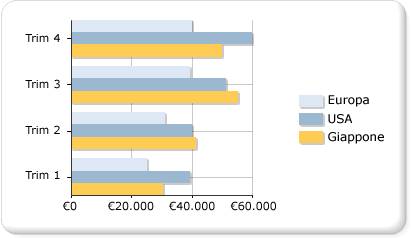

# Grafici a barre (Generatore report e SSRS)
  Nei grafici a barre le serie vengono visualizzate come set di barre orizzontali. Il grafico a barre semplice è strettamente correlato all'istogramma, in cui le serie vengono visualizzate come set di barre verticali, e al grafico a barre a intervalli, in cui le serie vengono visualizzate come set di barre orizzontali con punti iniziali e finali variabili.  
  
 Il grafico a barre è l'unico tipo di grafico in cui i dati vengono visualizzati in orizzontale. Per questo motivo, viene utilizzato di frequente per rappresentare i dati che si verificano nel corso del tempo, con una data di inizio e una data di fine definite. Viene inoltre utilizzato per mostrare informazioni sotto forma di categorie, in quanto le categorie possono essere visualizzate in orizzontale. Per altre informazioni su come aggiungere dati a un grafico a barre, vedere [Grafici &#40;Generatore report e SSRS&#41;](../../reporting-services/report-design/charts-report-builder-and-ssrs.md).  
  
 Nell'immagine seguente è illustrato un grafico a barre. Il grafico a barre è particolarmente indicato per questi dati, perché tutte e tre le serie condividono lo stesso periodo di tempo, consentendo di eseguire confronti validi.  
  
   
  
> [!NOTE]  
>  [!INCLUDE[ssRBRDDup](../../includes/ssrbrddup-md.md)]  
  
## Variazioni del grafico a barre  
  
-   **In pila**. Grafico a barre con più serie impilate in verticale. Se il grafico contiene una sola serie, il grafico a barre in pila verrà visualizzato come grafico a barre.  
  
-   **In pila 100%**. Grafico a barre con più serie impilate in verticale per occupare il 100% dell'area del grafico. Se il grafico contiene una sola serie, tutte le barre si adatteranno al 100% dell'area del grafico.  
  
-   **Cluster 3D**. Grafico a barre con le singole serie visualizzate in righe distinte in un grafico 3D.  
  
-   **Cilindro 3D**. Grafico a barre con le barre a forma di cilindri in un grafico 3D.  
  
## Considerazioni sui dati per i grafici a barre  
  
-   Gli assi dei grafici a barre sono invertiti. L'asse delle categorie corrisponde all'asse verticale (asse Y), mentre l'asse dei valori a quello orizzontale (asse X). In un grafico a barre è quindi disponibile più spazio per la visualizzazione delle etichette delle categorie lungo l'asse Y in un elenco leggibile dall'alto verso il basso.  
  
-   Gli istogrammi e i grafici a barre vengono utilizzati principalmente per indicare i confronti tra gruppi. Se in un grafico sono presenti più di tre serie, è consigliabile utilizzare un grafico a barre o un istogramma in pila. È anche possibile raccogliere i grafici a barre o gli istogrammi in pila in più gruppi, se il grafico contiene diverse serie.  
  
-   In un grafico a barre i valori vengono visualizzati da sinistra a destra, una modalità che può risultare più intuitiva quando i dati sono relativi a durate.  
  
-   Se si prevede di aggiungere barre a una tabella o a una matrice nel report, utilizzare un misuratore lineare anziché un grafico a barre. Il misuratore lineare è progettato per visualizzare un unico valore anziché più gruppi, offrendo una maggiore flessibilità per l'utilizzo in un elenco o in un'area dati tabella. Per altre informazioni, vedere [Misuratori &#40;Generatore report e SSRS&#41;](../../reporting-services/report-design/gauges-report-builder-and-ssrs.md).  
  
-   È possibile aggiungere stili di disegno speciali alle singole barre di un grafico a barre per aumentarne l'impatto visivo. Tra gli stili di disegno figurano Spicchio, Rilievo, Cilindro e Chiaroscuro. Tali effetti sono progettati per migliorare l'aspetto del grafico 2D. Se si utilizza un grafico 3D, gli stili di disegno vengono comunque applicati, ma non producono lo stesso effetto. Per altre informazioni su come aggiungere uno stile di disegno a un grafico a barre, vedere [Aggiungere stili smussato, rilievo e trama a un grafico &#40;Generatore report e SSRS&#41;](../../reporting-services/report-design/chart-effects-add-bevel-emboss-or-texture-report-builder.md).  
  
-   Nei grafici a barre in pila le serie vengono posizionate una sull'altra in modo da creare una pila a barre. È possibile separare il grafico a barre in pila in più set di pile per ogni categoria. Le pile raggruppate nel grafico vengono visualizzate affiancate. Un grafico può contenere un numero qualsiasi di serie in pila raggruppate.  
  
-   Quando vengono visualizzate etichette dei punti dati nei grafici a barre, le etichette vengono posizionate all'esterno di ogni barra. Ciò può determinare una sovrapposizione delle etichette quando le barre occupano tutto lo spazio assegnato all'interno dell'area del grafico. Per modificare la posizione delle etichette dei punti dati visualizzate per ogni barra, è possibile impostare la proprietà **BarLabelStyle** nel riquadro Proprietà.  
  
-   In presenza di più punti dati nel set di dati relativo alla dimensione del grafico, vengono ridotte la dimensione delle colonne o delle barre e la spaziatura tra di esse. Per impostare manualmente la larghezza delle colonne in un grafico, sostituirne il valore in pixel modificando la proprietà **PointWidth** . Il valore predefinito di questa proprietà è 0,8. Aumentando la larghezza delle colonne o delle barre di un grafico si riduce lo spazio tra di esse.  
  
## Vedere anche  
 [Grafici &#40;Generatore report e SSRS&#41;](../../reporting-services/report-design/charts-report-builder-and-ssrs.md)   
 [Tipi di grafico &#40;Generatore report e SSRS&#41;](../../reporting-services/report-design/chart-types-report-builder-and-ssrs.md)   
 [Punti dati vuoti e Null nei grafici &#40;Generatore report e SSRS&#41;](../../reporting-services/report-design/empty-and-null-data-points-in-charts-report-builder-and-ssrs.md)   
 [Istogrammi &#40;Generatore report e SSRS&#41;](../../reporting-services/report-design/column-charts-report-builder-and-ssrs.md)   
 [Grafici a intervalli &#40;Generatore report e SSRS&#41;](../../reporting-services/report-design/range-charts-report-builder-and-ssrs.md)   
 [Formattazione dei colori delle serie in un grafico &#40;Generatore report e SSRS&#41;](../../reporting-services/report-design/formatting-series-colors-on-a-chart-report-builder-and-ssrs.md)   
 [Formattazione delle etichette degli assi in un grafico &#40;Generatore report e SSRS&#41;](../../reporting-services/report-design/formatting-axis-labels-on-a-chart-report-builder-and-ssrs.md)   
 [Formattazione della legenda in un grafico &#40;Generatore report e SSRS&#41;](../../reporting-services/report-design/chart-legend-formatting-report-builder.md)   
 [Aggiungere stili smussato, rilievo e trama a un grafico &#40;Generatore report e SSRS&#41;](../../reporting-services/report-design/chart-effects-add-bevel-emboss-or-texture-report-builder.md)   
 [Esercitazione: Aggiunta di un grafico a barre a un report (Generatore report)](http://go.microsoft.com/fwlink/?LinkId=198052)   
 [Esercitazione: Aggiunta di un grafico a barre a un report](http://go.microsoft.com/fwlink/?LinkId=198042)  
  
  
