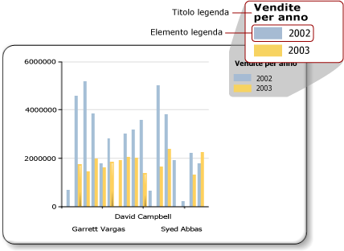

# Legenda del grafico - Formattazione (Generatore report)
  Nella legenda del grafico sono contenute le descrizioni per ogni categoria del grafico. In una legenda sono contenuti sempre uno o più elementi, ciascuno dei quali è costituito da una casella colorata che rappresenta la serie e da una stringa di testo che la descrive, come indicato nell'illustrazione seguente.  
  
   
  
 Un elemento della legenda è collegato a una singola serie nel grafico, ad eccezione dei grafici con forme in cui la legenda è collegata a punti dati singoli. Nel grafico vengono aggiunti automaticamente elementi alla legenda in base alla serie generata dai dati inseriti dall'utente.  
  
 Per formattare una legenda, è possibile usare la finestra di dialogo **Proprietà legenda** oppure il riquadro Proprietà. Fare clic con il pulsante destro del mouse sulla legenda, quindi scegliere **Proprietà legenda** per modificare i valori per il testo della legenda, il colore di sfondo, i bordi e gli effetti 3D. Per modificare i valori per il titolo della legenda, selezionare la legenda, fare clic con il pulsante destro del mouse sul titolo, quindi scegliere **Proprietà titolo legenda**.  
  
 Non è possibile aggiungere immagini né colonne o altri elementi supplementari alla legenda.  
  
> [!NOTE]  
>  [!INCLUDE[ssRBRDDup](../../includes/ssrbrddup-md.md)]  
  
## Ordinamento degli elementi nella legenda  
 Nella legenda le serie vengono ordinate in base all'ordine con cui vengono elaborate dal motore di elaborazione di [!INCLUDE[ssRSnoversion](../../includes/ssrsnoversion-md.md)] . Per modificare l'ordine, è possibile cambiare la posizione dei campi nell'area di rilascio dei campi dati. Se si utilizza il raggruppamento di serie, i dati della serie non sono noti fino al momento dell'elaborazione e non è pertanto possibile riordinare tali elementi. Le modifiche possono essere visualizzate in anteprima. Per altre informazioni sul raggruppamento di serie, vedere [Grafici &#40;Generatore report e SSRS&#41;](../../reporting-services/report-design/charts-report-builder-and-ssrs.md).  
  
 È possibile nascondere la visualizzazione di qualsiasi serie nella legenda. Se si usa il raggruppamento di serie, tutte le serie correlate al campo dati verranno nascoste. Per altre informazioni, vedere [Nascondere elementi legenda nel grafico &#40;Generatore report e SSRS&#41;](../../reporting-services/report-design/chart-legend-hide-items-report-builder.md).  
  
## Modifica del testo o del colore di un elemento della legenda  
 Quando un campo viene posizionato nell'area di rilascio del campo dati di un grafico, viene generato automaticamente un elemento della legenda contenente il nome di tale campo. Per impostazione predefinita, come testo di ogni elemento della legenda viene usato il nome del campo dati. Ogni elemento della legenda è collegato a una singola serie nel grafico, ad eccezione dei grafici con forme in cui la legenda è collegata a singoli punti dati anziché a singole serie. Quando un gruppo di categorie viene definito su un grafico con forme, il testo di ogni elemento della legenda viene ricavato dalla rappresentazione di stringa del gruppo di categorie. È possibile specificare un testo personalizzato per l'etichetta in modo da visualizzare sui grafici a torta, ad anello e a imbuto informazioni diverse da quelle contenute nell'etichetta del gruppo di categorie che si riferisce a singoli punti dati nella legenda. A tale scopo, selezionare la legenda e specificarne il testo nella finestra di dialogo **Proprietà serie** o nella proprietà **LegendText** del riquadro Proprietà. Per altre informazioni, vedere [Modificare il testo di un elemento legenda &#40;Generatore report e SSRS&#41;](../../reporting-services/report-design/chart-legend-change-item-text-report-builder.md).  
  
 È anche possibile immettere parole chiave specifiche del grafico e con distinzione tra maiuscole e minuscole per gli attributi a cui si fa spesso riferimento nella proprietà **LegendText** o nella finestra di dialogo **Proprietà serie** . In fase di esecuzione, il controllo del grafico sostituisce le parole chiave con la rappresentazione dei dati. Questo approccio risulta molto utile con i grafici con forme perché consente di visualizzare informazioni relative a punti dati specifici. Per altre informazioni, vedere [Formattazione dei punti dati di un grafico &#40;Generatore report e SSRS&#41;](../../reporting-services/report-design/formatting-data-points-on-a-chart-report-builder-and-ssrs.md).  
  
 Il colore della casella visualizzata per ogni elemento della legenda viene ereditato dal colore di riempimento della serie corrispondente. Se si desidera modificare il colore visualizzato in un elemento della legenda, sarà necessario modificare il colore della serie corrispondente. Per altre informazioni, vedere [Formattazione dei colori delle serie in un grafico &#40;Generatore report e SSRS&#41;](../../reporting-services/report-design/formatting-series-colors-on-a-chart-report-builder-and-ssrs.md).  
  
## Rimozione di elementi aggiuntivi dalla legenda  
 La legenda è sempre collegata a una serie. Se un elemento della legenda viene visualizzato nella legenda, ma la serie corrispondente non viene visualizzata nel grafico, la causa più probabile è l'assenza di valori nella serie. Per rimuovere l'elemento dalla legenda, è necessario rimuovere tale serie. Per rimuovere una serie dal grafico, è possibile fare clic con il pulsante destro del mouse sulla serie specificata, quindi selezionare l'opzione Elimina serie.  
  
## Riposizionamento della legenda  
 L'area del grafico è costituita dall'area rettangolare che include le etichette degli assi e l'area del tracciato. Quando la legenda viene posizionata all'esterno dell'area del grafico, sono disponibili dodici posizioni diverse in cui è possibile trascinarla. Per impostazione predefinita, la legenda viene visualizzata all'esterno dell'area del grafico. È inoltre possibile impostare la posizione nella finestra di dialogo **Proprietà legenda** .  
  
 Non è possibile trascinare la legenda all'interno o all'esterno dell'area del grafico. Se si desidera posizionare la legenda all'interno dell'area del grafico, in **Ancoraggio** nella finestra di dialogo **Proprietà legenda**selezionare **Predefinito** dall'elenco a discesa e deselezionare l'opzione **Mostra legenda al di fuori dell'area del grafico** . Se si posiziona la legenda all'interno dell'area del grafico, è possibile ingrandire lo spazio per i punti dati nel grafico. In base al set di dati, tuttavia, se si esegue questa operazione la legenda potrebbe sovrapporsi ad alcuni punti dati nell'area del grafico, riducendo di conseguenza la leggibilità del grafico stesso.  
  
## Visualizzazione orizzontale degli elementi della legenda  
 Per impostazione predefinita, la legenda viene formattata come un elenco di una o più righe contenenti ciascuna un elemento della legenda. L'area della legenda si espande in base al numero di elementi presenti. Se la legenda non può espandersi, vengono visualizzati i puntini di sospensione (...). In base allo stile specificato, la legenda può espandersi orizzontalmente o verticalmente. È possibile modificare lo stile di layout nella finestra di dialogo **Proprietà legenda** o modificare lo spazio allocato per visualizzare tutti gli elementi della legenda.  
  
 Per visualizzare orizzontalmente la legenda, ancorarla alla parte superiore o inferiore del grafico in modo da espanderla orizzontalmente. È inoltre possibile impostare la proprietà Layout su **Riga** o **Tabella estesa in larghezza**. Impostare la proprietà MaxAutoSize nel riquadro Proprietà per controllare lo spazio verticale allocato per la legenda quando è ancorata alla parte superiore o inferiore dell'area del grafico.  
  
## Formattazione del testo della legenda  
 È possibile modificare il tipo di carattere, le dimensioni, lo stile e il colore del testo della legenda nella pagina **Carattere** della finestra di dialogo **Proprietà legenda** .  
  
 Per impostazione predefinita, il testo della legenda non viene ottimizzato in base alle dimensioni dell'area della legenda. Per fare in modo che il testo della legenda si adatti automaticamente allo spazio allocato, impostare la proprietà AutoFitTextDisabled su **False** e la proprietà MinFontSize sulle dimensioni minime del tipo di carattere che si ritengono leggibili e che consentano comunque l'ottimizzazione della legenda.  
  
## Vedere anche  
 [Finestra di dialogo Proprietà legenda, Generale &#40;Generatore report e SSRS&#41;](http://msdn.microsoft.com/library/db718f8f-f185-422f-871c-96f0749e5893)   
 [Modificare il testo di un elemento legenda &#40;Generatore report e SSRS&#41;](../../reporting-services/report-design/chart-legend-change-item-text-report-builder.md)   
 [Formattazione di un grafico &#40;Generatore report e SSRS&#41;](../../reporting-services/report-design/formatting-a-chart-report-builder-and-ssrs.md)   
 [Formattazione dei colori delle serie in un grafico &#40;Generatore report e SSRS&#41;](../../reporting-services/report-design/formatting-series-colors-on-a-chart-report-builder-and-ssrs.md)   
 [Grafici &#40;Generatore report e SSRS&#41;](../../reporting-services/report-design/charts-report-builder-and-ssrs.md)   
 [Nascondere elementi legenda nel grafico &#40;Generatore report e SSRS&#41;](../../reporting-services/report-design/chart-legend-hide-items-report-builder.md)   
 [Definire i colori in un grafico mediante la tavolozza &#40;Generatore report e SSRS&#41;](../../reporting-services/report-design/define-colors-on-a-chart-using-a-palette-report-builder-and-ssrs.md)  
  
  
