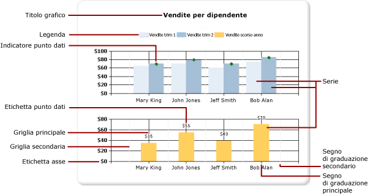
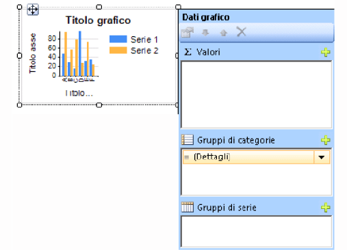
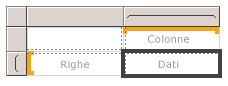
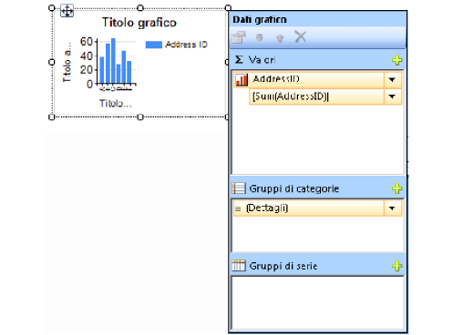

# Grafici (Generatore report e SSRS)
Informazioni sull'uso delle aree dati dei grafici per consentire agli utenti dei report impaginati [!INCLUDE[ssRSnoversion_md](../../includes/ssrsnoversion-md.md)] di interpretare a colpo d'occhio grandi volumi di dati aggregati.  

Maggiore è la cura dedicata all'interpretazione e alla preparazione dei dati prima della creazione del grafico, più facile sarà progettare i grafici in modo rapido ed efficiente. Per informazioni su come scegliere il grafico da usare, vedere [Tipi di grafico](../../reporting-services/report-design/chart-types-report-builder-and-ssrs.md). Per iniziare a lavorare con i grafici vedere le esercitazioni relative a grafici a barre, istogrammi, grafici sparkline e grafici a torta in [Esercitazioni di Generatore Report](../../reporting-services/report-builder-tutorials.md).  
  
 Nella figura seguente sono illustrati molti dei diversi elementi usati nel grafico.  
  
   
  
 È possibile pubblicare grafici separatamente da un report come *parti del report*. Per altre informazioni, vedere [Parti del report](../../reporting-services/report-design/report-parts-report-builder-and-ssrs.md).
  
 
##   Progettazione di un grafico  
 Dopo avere aggiunto un'area dati del grafico all'area di progettazione, è possibile trascinare campi del set di dati del report relativi a dati numerici e non numerici nel riquadro Dati grafico del grafico. Quando si fa clic sul grafico nell'area di progettazione, viene visualizzato il riquadro Dati grafico con le tre aree Gruppi di categorie, Gruppi di serie e Valori. Se il report dispone di un set di dati condiviso o incorporato, i campi del set di dati vengono visualizzati nel riquadro dei dati del report. Trascinare i campi dal set di dati all'area appropriata del riquadro Dati grafico. Per impostazione predefinita, quando si aggiunge un campo a una delle aree del grafico, in [!INCLUDE[ssRSnoversion](../../includes/ssrsnoversion-md.md)] viene calcolata un'aggregazione per il campo. È inoltre possibile usare il raggruppamento di serie per generare dinamicamente le serie. Un grafico è [organizzato come una matrice](#SimilarMatrix).  
  
   
  
> [!NOTE]  
>  I dati nel grafico nella fase di progettazione sono diversi da quelli disponibili durante l'elaborazione del report. Non si tratta dei dati effettivi, ma piuttosto di dati generati che sono stati aggiunti allo scopo di consentire la progettazione del grafico con un'idea più chiara dell'aspetto che assumerà.  
  
##   Perché un grafico è simile a una matrice  
 Per comprendere l'utilizzo dei grafici è possibile confrontarli con le matrici.  
  
   
  
 Dal punto di vista concettuale, l'organizzazione è identica:  
  
-   Il gruppo Colonne nella matrice è analogo all'area Gruppi di categorie nel grafico.  
  
-   Il gruppo Righe nella matrice è analogo all'area Gruppi di serie nel grafico.  
  
-   L'area Dati nella matrice è analoga all'area Valori nel grafico.  
  
 
##   Aggiunta di dati al grafico  
 Si supponga di avere un report in cui sono riportate le vendite (Sales) per nome (Name). Il campo Full Name viene rilasciato nell'area Gruppi di categorie, mentre il campo Sales viene rilasciato nell'area Valori.  
  
 Quando si aggiunge il campo Sales all'area Valori, il testo del campo dati viene visualizzato nella legenda e i dati di questo campo numerico vengono aggregati in un unico valore. Per impostazione predefinita, il valore viene aggregato utilizzando la funzione predefinita Sum. L'area Dati grafico conterrà un'espressione semplice per il campo. Nell'esempio verrà visualizzato `[Sum(Sales)]` per l'espressione di campo `=Sum(Fields!Sales.Value)`. Se non vengono specificati gruppi, nel grafico verrà mostrato un solo punto dati. Per visualizzare più punti dati, è necessario raggruppare i dati aggiungendo un campo di raggruppamento. Quando si aggiunge il campo Name all'area Gruppi di categorie, al grafico viene automaticamente aggiunto un campo di raggruppamento con lo stesso nome del campo aggiunto. Quando si aggiungono campi che definiscono i valori sugli assi X e Y, le informazioni contenute nel grafico saranno sufficienti per tracciare correttamente i dati.  
  
   
  
 Quando l'area Gruppi di serie rimane vuota, il numero di serie viene corretto in fase di progettazione. In questo esempio, Sales è l'unica serie visualizzata sul grafico.  
  
 
##   Gruppi di categorie e di serie in un grafico  
 I grafici supportano gruppi di categorie e di serie nidificati e non visualizzano dati di dettaglio. Per aggiungere gruppi a un grafico, trascinare campi del set di dati nelle aree di rilascio di categoria e di serie per un grafico selezionato.  
  
 I grafici con forme, ad esempio i grafici a torta, supportano gruppi di categorie e gruppi di categorie nidificati. Altri tipi di grafico, ad esempio quelli a barre, supportano gruppi di categorie e di serie. È possibile nidificare i gruppi, ma è necessario verificare che i numeri di categorie o di serie non nascondano la presentazione delle informazioni nel grafico.  
  
### Aggiunta del raggruppamento di serie a un grafico  
 Se si aggiunge un campo all'area Gruppi di serie, il numero di serie dipenderà dai dati contenuti in tale campo. Riprendendo l'esempio precedente, si supponga di aggiungere un campo relativo all'anno (Year) all'area Gruppi di serie. Il numero di valori nel campo Year determinerà la quantità di serie visualizzate nel grafico. Se il campo Year contiene gli anni 2004, 2005 e 2006, nel grafico verranno visualizzate tre serie per ciascun campo nell'area Valori.  
  
##   Considerazioni sul set di dati prima della creazione di un grafico  
 I grafici forniscono una visualizzazione di riepilogo dei dati. Tuttavia, nel caso di set di dati di grandi dimensioni, le informazioni di un grafico possono risultare nascoste o illeggibili. I punti dati mancanti o Null, i tipi di dati non appropriati per il tipo di grafico e applicazioni avanzate quale la combinazione di grafici con tabelle possono influire sulla leggibilità di un grafico. Prima di progettare un grafico, è opportuno preparare e identificare con attenzione i dati, in modo da procedere rapidamente e con maggiore efficienza.  
  
 È possibile includere nel report il numero di grafici desiderato. Un grafico, così come qualsiasi altra area dati, ad esempio una matrice o una tabella, è associato a un unico set di dati. Se si desidera visualizzare più set di dati nello stesso grafico, è possibile creare un set di dati aggiuntivo che usa un'istruzione JOIN o UNION nella query SQL prima di aggiungere dati al grafico. Per altre informazioni sull'istruzione JOIN e UNION, vedere la documentazione online o un altro riferimento SQL.  
  
 Pre-aggregare i dati nella query del set di dati se i dati di dettaglio non sono necessari o utili. Per visualizzare più chiaramente ogni punto dati, ridurre il numero di categorie nel set di dati. È possibile filtrare il set di dati o aggiungere una condizione alla query per ridurre il numero di righe restituite. 
  
##   Procedure consigliate per la visualizzazione di dati in un grafico  
 I grafici risultano più efficaci quando il numero di elementi visualizzati presenta un'immagine chiara delle informazioni sottostanti. Alcuni grafici, ad esempio i grafici a dispersione, traggono vantaggio da numerosi punti dati, mentre altri, come i grafici a torta, sono più efficaci con meno punti dati. Scegliere con attenzione un tipo di grafico in base ai valori disponibili nel set di dati e al modo in cui si desidera visualizzare queste informazioni. Per altre informazioni, vedere [Tipi di grafico &#40;Generatore report e SSRS&#41;](../../reporting-services/report-design/chart-types-report-builder-and-ssrs.md).  
  
 È possibile consolidare i dati in un grafico in molti modi:  
  
-   Quando si usa un grafico a torta, raccogliere le sezioni piccole in un'unica sezione denominata "Altro". In questo modo si riduce il numero di sezioni del grafico a torta. Per altre informazioni, vedere [Raccogliere piccole sezioni in un grafico a torta &#40;Generatore report e SSRS&#41;](../../reporting-services/report-design/collect-small-slices-on-a-pie-chart-report-builder-and-ssrs.md).  
  
-   Evitare di usare le etichette dei punti dati quando sono presenti numerosi punti dati. Tali etichette sono più efficaci quando il grafico include solo pochi punti dati.  
  
-   Filtrare i dati indesiderati o irrilevanti. In questo modo è possibile evidenziare i dati principali che si desidera mostrare nel grafico. Per filtrare punti dati in un grafico, impostare un filtro in un gruppo di categorie o in un gruppo di serie. Per impostazione predefinita, il grafico usa la funzione predefinita Sum per aggregare valori che fanno parte dello stesso gruppo in un singolo punto dati nella serie. Se si modifica la funzione di aggregazione di una serie, è necessario modificarla anche nell'espressione di filtro. Per altre informazioni, vedere [Filtro, raggruppamento e ordinamento di dati &#40;Generatore report e SSRS&#41;](../../reporting-services/report-design/filter-group-and-sort-data-report-builder-and-ssrs.md).  
  
-   Per visualizzare dati proporzionali in un modello di tabella o matrice, usare un misuratore lineare anziché un grafico a barre. I misuratori sono più indicati per la visualizzazione di un singolo valore in una cella. Per altre informazioni, vedere [Aree dati annidate &#40;Generatore report e SSRS&#41;](../../reporting-services/report-design/nested-data-regions-report-builder-and-ssrs.md).  
   
##   Aggregazione dei valori di un campo dati nel grafico  
 Per impostazione predefinita, quando si aggiunge un campo all'area Valori del grafico, in [!INCLUDE[ssRSnoversion](../../includes/ssrsnoversion-md.md)] viene calcolata un'aggregazione per il campo. Se si trascina un campo sul grafico senza rilasciarlo in un'area specifica, il grafico determinerà se questo campo appartiene all'asse delle categorie (x) o all'asse dei valori (y) in base al tipo di dati del campo. I campi numerici rilasciati nell'area Valori vengono aggregati tramite la funzione SUM. Se il tipo di dati del campo valore è String nell'area Valori, nel grafico non è possibile visualizzare un valore numerico, anche se nei campi sono contenuti numeri; viene pertanto visualizzata la funzione COUNT. Per evitare questo comportamento, assicurarsi che i campi usati includano tipi di dati numerici anziché stringhe con numeri formattati. È possibile specificare un'espressione di Visual Basic per convertire i valori String in un tipo di dati numerici usando la costante **CDbl** o costante **CInt** . Nell'espressione complessa seguente, ad esempio, viene convertito un campo denominato `MyField` che contiene valori numerici formattati come stringhe.  
  
 `=Sum(CDbl(Fields!MyField.Value))`  
  
 Per altre informazioni sulle espressioni di aggregazione, vedere [Riferimento a funzioni di aggregazione &#40;Generatore report e SSRS&#41;](../../reporting-services/report-design/report-builder-functions-aggregate-functions-reference.md).  
   
##   Contenuto della sezione  
 [Aggiungere un grafico a un report &#40;Generatore report e SSRS&#41;](../../reporting-services/report-design/add-a-chart-to-a-report-report-builder-and-ssrs.md)  
 Vengono descritti i primi passaggi per l'aggiunta di un grafico al report.  
  
 [Tipi di grafico &#40;Generatore report e SSRS&#41;](../../reporting-services/report-design/chart-types-report-builder-and-ssrs.md)  
 Vengono descritti tutti i tipi e i sottotipi di grafico disponibili in [!INCLUDE[ssRSnoversion](../../includes/ssrsnoversion-md.md)], con alcune considerazioni e procedure consigliate per il relativo utilizzo.  
  
 [Formattazione di un grafico &#40;Generatore report e SSRS&#41;](../../reporting-services/report-design/formatting-a-chart-report-builder-and-ssrs.md)  
 Utilizzo della formattazione per migliorare l'aspetto complessivo ed evidenziare i punti dati principali del grafico.  
  
 [Punti dati vuoti e Null nei grafici &#40;Generatore report e SSRS&#41;](../../reporting-services/report-design/empty-and-null-data-points-in-charts-report-builder-and-ssrs.md)  
 Vengono riportate considerazioni relative all'utilizzo di grafici basati su campi con valori vuoti o Null.  
  
 [Visualizzazione di una serie con più intervalli di dati in un grafico &#40;Generatore report e SSRS&#41;](../../reporting-services/report-design/displaying-a-series-with-multiple-data-ranges-on-a-chart.md)  
 Viene descritto come aggiungere interruzioni di scala a una serie che contiene più di un intervallo di dati.  
  
 [Più serie in un grafico &#40;Generatore report e SSRS&#41;](../../reporting-services/report-design/multiple-series-on-a-chart-report-builder-and-ssrs.md)  
 Vengono illustrati diversi metodi per mostrare più serie sullo stesso grafico, inclusi i tipi di grafico combinati, tramite l'asse secondario, specificando tipi di grafico diversi e usando più aree del grafico.  
  
 [Collegamento di più aree dati allo stesso set di dati &#40;Generatore report e SSRS&#41;](../../reporting-services/report-design/linking-multiple-data-regions-to-the-same-dataset-report-builder-and-ssrs.md)  
 Vengono fornite diverse visualizzazioni di dati dello stesso set di dati del report.  
  
 [Aggiungere o eliminare un gruppo in un grafico &#40;Generatore report e SSRS&#41;](../../reporting-services/report-design/add-or-delete-a-group-in-a-chart-report-builder-and-ssrs.md)  
 Viene illustrata l'aggiunta di gruppi e di gruppi nidificati a un grafico.  
  
 [Aggiungere una media mobile a un grafico &#40;Generatore report e SSRS&#41;](../../reporting-services/report-design/add-a-moving-average-to-a-chart-report-builder-and-ssrs.md)  
 Viene illustrato l'utilizzo della formula della Media mobile per calcolare la media dei dati nella serie.  
  
 [Risoluzione dei problemi relativi ai grafici &#40;Generatore report e SSRS&#41;](../../reporting-services/report-design/troubleshoot-charts-report-builder-and-ssrs.md)  
 Vengono forniti suggerimenti per l'utilizzo dei grafici.  
  
## Vedere anche  
 [Immagini, caselle di testo, rettangoli e linee &#40;Generatore report e SSRS&#41;](../../reporting-services/report-design/images-text-boxes-rectangles-and-lines-report-builder-and-ssrs.md)   
 [Ordinamento interattivo, mappe documento e collegamenti &#40;Generatore report e SSRS&#41;](../../reporting-services/report-design/interactive-sort-document-maps-and-links-report-builder-and-ssrs.md)   
 [Aree dati annidate &#40;Generatore report e SSRS&#41;](../../reporting-services/report-design/nested-data-regions-report-builder-and-ssrs.md)   
 [Esercitazione: Aggiungere un istogramma al report &#40;Generatore report&#41;](../../reporting-services/tutorial-add-a-column-chart-to-your-report-report-builder.md)   
 [Esercitazione: Aggiungere un grafico a torta al report &#40;Generatore report&#41;](../../reporting-services/tutorial-add-a-pie-chart-to-your-report-report-builder.md)   
 [Esercitazione: Aggiungere un grafico a barre al report &#40;Generatore report&#41;](../../reporting-services/tutorial-add-a-bar-chart-to-your-report-report-builder.md)  
  
  
