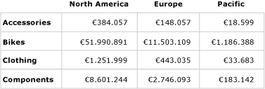
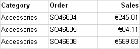
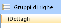
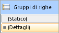
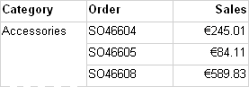
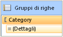
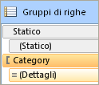
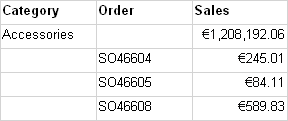
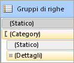

# Controllo delle intestazioni di riga e di colonna (Generatore report e SSRS)
  Una tabella, una matrice o un'area dati elenco possono estendersi orizzontalmente o verticalmente in più pagine. È possibile specificare se ripetere le intestazioni di riga o di colonna in ogni pagina. In un renderer interattivo, quale Gestione report o un'anteprima del report, è inoltre possibile specificare se bloccare le intestazioni di riga o di colonna per mantenerle visualizzate quando si scorre in senso orizzontale o verso il basso un report. Nella prima riga di una tabella o di una matrice in genere sono contenute intestazioni di colonna che identificano i dati di ogni colonna, mentre nella prima colonna sono contenute intestazioni di riga che identificano i dati di ogni riga. Per i gruppi nidificati, è possibile ripetere il set iniziale di intestazioni di riga e di colonna contenenti etichette di gruppo. Per impostazione predefinita, in un'area dati elenco non sono incluse intestazioni.  
  
 La scelta di ripetere o bloccare le intestazioni dipende dagli elementi indicati di seguito.  
  
-   Per le intestazioni di colonna che vengono ripetute all'inizio di ogni pagina:  
  
    -   La presenza o meno nella tabella o nella matrice di un'area dei gruppi di colonne che si espande orizzontalmente.  
  
    -   La necessità o meno di controllare tutte le righe associate ai gruppi di colonne come un'unità.  
  
-   Per le intestazioni di riga che vengono ripetute lungo il lato di ogni pagina:  
  
    -   La presenza o meno nella tabella o nella matrice di un'area dei gruppi di righe che si espande verticalmente. Le intestazioni di riga sono supportate solo per i gruppi di righe con un'intestazione associata.  
  
> [!NOTE]  
>  [!INCLUDE[ssRBRDDup](../../includes/ssrbrddup-md.md)]  
  
## Informazioni su righe e colonne in un'area dati Tablix  
 Una tabella o una matrice rappresenta un modello per l'area dati Tablix sottostante. In un'area dati Tablix possono essere incluse quattro aree, ovvero l'area dei gruppi di righe che controlla le righe che si espandono verso il basso in un report, l'area dei gruppi di colonne che controlla le colonne che si espandono orizzontalmente in un report, il corpo in cui vengono visualizzati i dati e l'angolo. Per sapere dove impostare le proprietà che consentono di controllare la ripetizione o il blocco delle intestazioni, è importante capire che un'area dati Tablix può essere rappresentata in due modi diversi:  
  
-   **Nella definizione del report** Ogni riga o colonna in una definizione dell'area dati Tablix è un membro Tablix di uno specifico gruppo di righe o di colonne. Un membro Tablix può essere statico o dinamico. Un membro Tablix statico contiene etichette o subtotali e viene ripetuto una volta per ogni gruppo. Un membro Tablix dinamico contiene valori di gruppo e viene ripetuto una volta per ogni valore univoco di un gruppo, anche noto come istanza di gruppo.  
  
-   **Nell'area di progettazione** Nell'area di progettazione linee punteggiate dividono un'area dati Tablix in quattro aree. Ogni cella in un'area dell'area dati Tablix è organizzata in righe e colonne. Le righe e le colonne sono associate a gruppi, incluso il gruppo dettagli. Per un'area dati Tablix selezionata, handle di riga e di colonna e barre di evidenziazione indicano l'appartenenza al gruppo. Le celle contenute nell'area dei gruppi di righe o di colonne rappresentano intestazioni di gruppo per i membri Tablix. È possibile associare una singola riga o colonna a più gruppi.  
  
     Per altre informazioni, vedere [Area dati Tablix &#40;Generatore report e SSRS&#41;](../../reporting-services/report-design/tablix-data-region-report-builder-and-ssrs.md) e [Celle, righe e colonne dell'area dati Tablix &#40;Generatore report&#41; e SSRS](../../reporting-services/report-design/tablix-data-region-cells-rows-and-columns-report-builder-and-ssrs.md).  
  
 Per le aree dati Tablix contenenti aree dei gruppi di righe o di colonne, è possibile controllare le righe e le colonne associate impostando le proprietà nell'area dati Tablix. In tutti gli altri casi, è possibile controllare le righe e le colonne impostandone le proprietà nel riquadro Proprietà del membro Tablix selezionato. Per istruzioni dettagliate, vedere [Visualizzare le intestazioni di riga e colonna in più pagine &#40;Generatore report e SSRS&#41;](../../reporting-services/report-design/display-row-and-column-headers-on-multiple-pages-report-builder-and-ssrs.md) e [Mantenere visibili le intestazioni durante lo scorrimento di un report &#40;Generatore report e SSRS&#41;](../../reporting-services/report-design/keep-headers-visible-when-scrolling-through-a-report-report-builder-and-ssrs.md).  
  
##   Esempi  
 Gli esempi più comuni di aree dati Tablix si riferiscono a una matrice, a una tabella senza gruppi, a una tabella con un gruppo di righe e un'intestazione del gruppo di righe e a una tabella con un gruppo di righe, ma nessuna intestazione del gruppo di righe. Per stabilire come ripetere o bloccare le intestazioni, è necessario determinare se le righe o le colonne che si desidera controllare sono associate a un'intestazione di gruppo nell'area dei gruppi di righe o dei gruppi di colonne.  
  
 Nelle sezioni seguenti vengono illustrati esempi di layout comuni per un'area dati Tablix:  
  
-   [Matrice](#Matrix)  
  
-   [Tabella senza gruppi](#TableNoGroups)  
  
-   [Tabella con gruppi di righe e un'area dei gruppi di righe](#TableRowGroupsGroupHeader)  
  
-   [Tabella con gruppi di righe, ma senza un'area dei gruppi di righe](#TableRowGroupsNoGroupHeader)  
  
###   Matrice  
 Per impostazione predefinita, in una matrice semplice sono inclusi un gruppo di righe e un gruppo di colonne. Nella figura seguente è illustrata una matrice con un gruppo di righe basato su Categoria e un gruppo di colonne basato su Geografia:  
  
   
  
 Le linee punteggiate mostrano le quattro aree della Tablix. Nell'area dei gruppi di righe è inclusa un'intestazione che controlla le etichette delle categorie nella prima colonna. Analogamente, nell'area dei gruppi di colonne è inclusa un'intestazione che controlla le etichette geografiche nella prima riga. Nell'anteprima, mentre la matrice si espande orizzontalmente nella pagina, nella prima riga vengono visualizzate le intestazioni di colonna, come mostrato nella figura seguente:  
  
   
  
 Per ripetere o bloccare le intestazioni di colonna nella prima riga, impostare le proprietà per le intestazioni di colonna nell'area dati Tablix. Le intestazioni di colonna per i gruppi di colonne nidificati vengono incluse automaticamente.  
  
 Per ripetere o bloccare le intestazioni di riga nella prima colonna, impostare le proprietà per le intestazioni di riga nell'area dati Tablix. Le intestazioni di riga per i gruppi di righe nidificati vengono incluse automaticamente.  
  
 [Torna all'inizio](#Top)  
  
###   Tabella senza gruppi di righe  
 Per impostazione predefinita, in una tabella semplice senza gruppi è incluso il gruppo dettagli. Nella figura seguente è illustrata una tabella con la categoria, il numero di ordine e i dati di vendita visualizzati:  
  
   
  
 Non sono presenti linee punteggiate perché la tabella è costituita solo dall'area del corpo della Tablix. La prima riga, in cui sono visualizzate intestazioni di colonna, rappresenta un membro Tablix statico non associato a un gruppo. La seconda riga, in cui sono visualizzati dati dettaglio, rappresenta un membro Tablix dinamico associato al gruppo dettagli. Nella figura seguente è illustrata un'anteprima della tabella:  
  
   
  
 Per ripetere o bloccare le intestazioni di colonna, impostare le proprietà sul membro Tablix della riga statica che fa parte della definizione dell'area dati Tablix. Per selezionare la riga statica, è necessario utilizzare la modalità Avanzate del riquadro Raggruppamento. Nella figura seguente è illustrato il riquadro Gruppi di righe.  
  
   
  
 Nella figura seguente sono illustrati i membri Tablix statici e dinamici per i gruppi di righe della tabella nella modalità Avanzate:  
  
   
  
 Per ripetere o bloccare le intestazioni di colonna per il membro Tablix, selezionare la riga statica con etichetta (**Statico**). Nel riquadro delle proprietà vengono visualizzate le proprietà relative al membro Tablix selezionato. Impostando le proprietà per questo membro Tablix, è possibile controllare se ripetere la prima riga o lasciarla visualizzata.  
  
 [Torna all'inizio](#Top)  
  
###   Tabella con gruppi di righe e un'area dei gruppi di righe  
 Se si aggiunge un gruppo di righe a una tabella semplice, viene aggiunta un'area dei gruppi di righe alla tabella nell'area di progettazione. Nella figura seguente è illustrata una tabella con un gruppo di righe basato su Categoria:  
  
   
  
 Le linee punteggiate indicano l'area dei gruppi di righe della Tablix e l'area del corpo della Tablix. Nell'area dei gruppi di righe è inclusa un'intestazione per il gruppo di righe ma non per il gruppo di colonne. Nella figura seguente è illustrata un'anteprima di tale tabella:  
  
   
  
 Per ripetere o bloccare le intestazioni di colonna, utilizzare lo stesso approccio dell'esempio precedente. Nella figura seguente è illustrata la vista predefinita del riquadro Gruppi di righe.  
  
   
  
 Usare la modalità **Avanzate** del riquadro Gruppi di righe per visualizzare i membri Tablix, come mostrato nella figura seguente:  
  
   
  
 Vengono elencati i membri Tablix seguenti: **Statico**, (**Statico**), Categoria e (**Dettagli**). Un membro Tablix che include le parentesi () indica l'assenza di un'intestazione di gruppo corrispondente. Per ripetere o bloccare le intestazioni di colonna, selezionare il membro Tablix statico superiore e impostare le proprietà nel riquadro Proprietà.  
  
 [Torna all'inizio](#Top)  
  
###   Tabella con gruppi di righe e senza un'area dei gruppi di righe  
 Esistono diverse modalità per includere gruppi di righe in una tabella senza un'area dei gruppi di righe. Di seguito sono descritte due delle modalità possibili:  
  
-   Iniziare con una tabella contenente gruppi di righe e un'area dei gruppi di righe ed eliminare le colonne dell'area dei gruppi di righe. Eliminare solo le colonne e non i gruppi. È ad esempio possibile controllare il formato della tabella impostandolo come griglia semplice.  
  
-   Aggiornare un report creato per una versione RDL precedente, prima dell'introduzione delle aree dati Tablix.  
  
 Nella figura seguente è illustrata una tabella con un gruppo di righe ma senza un'area dei gruppi di righe nell'area di progettazione:  
  
   
  
 Nella tabella sono presenti tre righe. Nella prima riga sono contenute le intestazioni di colonna, nella seconda sono contenuti il valore del gruppo e i subtotali e nella terza sono contenuti i dati dettaglio. Non sono presenti linee punteggiate perché è disponibile una sola area del corpo della Tablix. Nella figura seguente è illustrata un'anteprima di tale tabella:  
  
   
  
 Per stabilire se ripetere o lasciare visualizzate le righe, è necessario impostare le proprietà sul membro Tablix di ogni riga. Nella modalità predefinita non esiste alcuna differenza tra questo esempio e quello precedente basato su una tabella con un gruppo di righe e un'intestazione di gruppo. Nella figura seguente viene illustrato il riquadro di raggruppamento per questa tabella nella modalità predefinita:  
  
   
  
 Nella modalità avanzata, tuttavia, in questa struttura di layout è riportato un set di membri Tablix differente. Nella figura seguente viene illustrato il riquadro di raggruppamento per questa tabella nella modalità avanzata:  
  
   
  
 Nel riquadro Gruppi di righe vengono elencati i membri Tablix seguenti: (**Statico**), (Categoria), (**Statico**) e (**Dettagli**). Per ripetere o bloccare le intestazioni di colonna, selezionare il membro Tablix (**Statico**) superiore e impostare le proprietà nel riquadro Proprietà.  
  
 [Torna all'inizio](#Top)  
  
## Supporto dei renderer per la ripetizione o il blocco delle intestazioni  
 Il supporto dei renderer varia a seconda che le intestazioni vengano ripetute o bloccate.  
  
 I renderer che utilizzano pagine fisiche (PDF, immagine, stampa) supportano le caratteristiche seguenti:  
  
-   Ripetizione delle intestazioni di riga quando un'area dati Tablix si espande orizzontalmente in più pagine.  
  
-   Ripetizione delle intestazioni di colonna quando un'area dati Tablix si espande verticalmente verso il basso in più pagine.  
  
 I renderer che utilizzano interruzioni di pagina automatiche (Gestione report, anteprima report o il controllo visualizzatore di report) supportano inoltre le caratteristiche seguenti:  
  
-   Visualizzazione delle intestazioni di riga durante lo scorrimento orizzontale di un report.  
  
-   Visualizzazione delle intestazioni di colonna durante lo scorrimento verticale verso il basso di un report.  
  
 Per altre informazioni, vedere [Tipi di rendering  &#40;Generatore report e SSRS &#41;](../../reporting-services/report-design/rendering-behaviors-report-builder-and-ssrs.md).  
  
## Vedere anche  
 [Filtro, raggruppamento e ordinamento di dati &#40;Generatore report e SSRS&#41;](../../reporting-services/report-design/filter-group-and-sort-data-report-builder-and-ssrs.md)   
 [Tabelle, matrici ed elenchi &#40;Generatore report e SSRS&#41;](../../reporting-services/report-design/tables-matrices-and-lists-report-builder-and-ssrs.md)   
 [Paginazione in Reporting Services &#40;Generatore report e SSRS&#41;](../../reporting-services/report-design/pagination-in-reporting-services-report-builder-and-ssrs.md)   
 [Esportare report &#40;Generatore Report e SSRS&#41;](../../reporting-services/report-builder/export-reports-report-builder-and-ssrs.md)  
  
  
