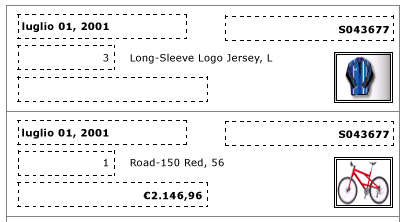
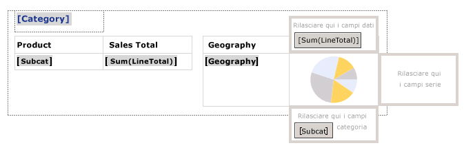
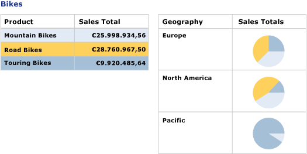

# Creazione di fatture e form con elenchi (Generatore Report e SSRS)
  Un'area dati elenco viene ripetuta con ogni gruppo o riga nel set di dati del report impaginato di [!INCLUDE[ssRSnoversion](../../includes/ssrsnoversion-md.md)] . È possibile utilizzare un elenco per creare form o report in formato libero, ad esempio fatture, o in combinazione ad altre aree dati, nonché definire elenchi contenenti il numero desiderato di elementi del report. Un elenco può essere annidato con  
  
 Per una rapida introduzione agli elenchi, vedere [Esercitazione: Creazione di un report in formato libero &#40;Generatore report&#41;](../../reporting-services/tutorial-creating-a-free-form-report-report-builder.md).  
  
> [!NOTE]  
>  È possibile pubblicare elenchi separatamente da un report come parti del report. Altre informazioni su [Parti del report (Generatore report SSRS)](../../reporting-services/report-design/report-parts-report-builder-and-ssrs.md).  
  
##   Aggiunta di un elenco al report  
 Aggiungere un elenco all'area di progettazione dalla scheda Inserisci sulla barra multifunzione. Per impostazione predefinita, l'elenco contiene inizialmente una sola cella in una riga associata al gruppo di dettagli.  
  
   
  
 Quando si seleziona un elenco nell'area di progettazione, vengono visualizzati handle di riga e di colonna, come mostrato nella figura seguente.  
  
   
  
 L'elenco iniziale è un modello basato sull'area dati Tablix. Dopo avere aggiunto un elenco, è possibile continuare a migliorare la progettazione modificando il contenuto o l'aspetto dell'elenco attraverso l'indicazione di espressioni di filtro, di ordinamento o di raggruppamento o modificando la modalità di visualizzazione dell'elenco nelle pagine del report. Per altre informazioni, vedere [Controllo della visualizzazione dell'area dati Tablix in una pagina del report &#40;Generatore report e SSRS&#41;](../../reporting-services/report-design/controlling-the-tablix-data-region-display-on-a-report-page.md). Anche se l'elenco inizia con una sola colonna e una sola riga, è possibile svilupparlo ulteriormente aggiungendo gruppi di righe o di colonne nidificati o adiacenti oppure righe di dettaglio supplementari. Per altre informazioni, vedere [Esplorazione della flessibilità di un'area dati Tablix &#40;Generatore report e SSRS&#41;](../../reporting-services/report-design/exploring-the-flexibility-of-a-tablix-data-region-report-builder-and-ssrs.md).  
  
  
##   Visualizzazione dei dati in un layout in formato libero  
 Per organizzare i dati del report in un layout in formato libero anziché in una griglia, è possibile aggiungere un elenco all'area di progettazione. Trascinare i campi dal riquadro dei dati del report alla cella. Per impostazione predefinita, la cella contiene un rettangolo utilizzato come contenitore. Spostare ogni campo nel contenitore fino a ottenere la progettazione desiderata. Utilizzare le guide di allineamento che appaiono quando le caselle di testo vengono trascinate nel contenitore del rettangolo per consentire l'allineamento verticale e orizzontale dei bordi. Rimuovere lo spazio vuoto indesiderato modificando la dimensione della cella. Per altre informazioni, vedere [Modificare l'altezza di riga o la larghezza di colonna &#40;Generatore report e SSRS&#41;](../../reporting-services/report-design/change-row-height-or-column-width-report-builder-and-ssrs.md).  
  
 Nella figura seguente viene riportato un elenco che include informazioni su un ordine, oltre ai campi Date, Order, Qty, Product, LineTotal e a un'immagine.  
  
   
  
 In Anteprima l'elenco si ripete per visualizzare i dati del campo in formato libero, come mostrato nella figura seguente:  
  
   
  
> [!NOTE]  
>  Per mostrare il layout in formato libero per ogni valore del campo, nelle figure vengono incluse delle linee tratteggiate, in genere non utilizzate in un report di produzione.  
  
  
##   Visualizzazione dei dati con un livello di raggruppamento  
 Poiché fornisce automaticamente un contenitore, è possibile utilizzare un elenco per visualizzare dati raggruppati con più viste. Per modificare l'elenco predefinito per specificare un gruppo, modificare il gruppo di dettagli, quindi specificare un nuovo nome e un'espressione di raggruppamento.  
  
 È possibile, ad esempio, incorporare una tabella e un grafico che mostrano viste diverse dello stesso set di dati. Se si aggiunge un gruppo all'elenco, gli elementi del report nidificati si ripetono una volta per ogni valore del gruppo. Nella figura seguente viene mostrato un elenco raggruppato per categoria di prodotto. Non è presente alcuna riga di dettaglio. Due tabelle vengono nidificate l'una accanto all'altra nell'elenco. Nella prima sono visualizzate le sottocategorie con le vendite totali, nella seconda la categoria raggruppata per area geografica, con un grafico che mostra la distribuzione delle sottocategorie.  
  
   
  
 In Anteprima la tabella riporta le vendite totali per tutte le sottocategorie di biciclette e la tabella accanto visualizza la suddivisione di vendite per area geografica. Attraverso un'espressione che consente di specificare il colore di sfondo per la tabella e una tavolozza personalizzata per il grafico, la prima tabella include anche la legenda dei colori del grafico.  
  
   
  
  
## Vedere anche  
 [Riferimento a funzioni di aggregazione &#40;Generatore report e SSRS&#41;](../../reporting-services/report-design/report-builder-functions-aggregate-functions-reference.md)   
 [Esempi di espressioni &#40;Generatore report e SSRS&#41;](../../reporting-services/report-design/expression-examples-report-builder-and-ssrs.md)  
  
  
