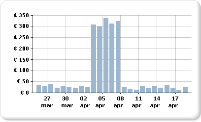
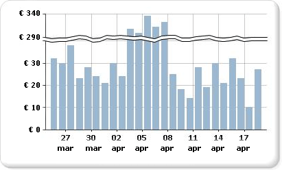

# Visualizzazione di una serie con più intervalli di dati in un grafico

  Nel grafico verranno usati i valori minimo e massimo di una serie per calcolare la scala dell'asse. Se una serie nel grafico contiene più intervalli di dati, è possibile che i punti dati vengano nascosti e che solo alcuni di essi risultino facilmente visibili nel grafico. Si supponga ad esempio che in un report vengano visualizzati i totali delle vendite giornaliere per un periodo di 30 giorni.  
  
   
  
 Per la maggior parte del mese, le vendite sono comprese tra 10 e 40. Una campagna di marketing per le vendite di una settimana ha tuttavia causato un improvviso aumento delle vendite all'inizio di aprile. Questa modifica nei dati di vendita produce una distribuzione non uniforme di punti dati che riduce la leggibilità complessiva del grafico.  
  
 È possibile aumentare la leggibilità in diversi modi:  
  
-   **Abilitare i cambi di scala**. Se i dati formano due o più set di intervalli di dati, usare un cambio di scala per rimuovere il gap tra gli intervalli. Un cambio di scala è una striscia disegnata attraverso l'area del tracciato per indicare un cambio tra i valori minimo e massimo di una serie.  
  
-   **Filtrare i valori non necessari**. Se si dispone di punti dati che nascondono l'intervallo di dati importante da visualizzare nel grafico, rimuovere i punti non desiderati usando un filtro del report. Per informazioni su come aggiungere un filtro al grafico in [!INCLUDE[ssRSnoversion](../../includes/ssrsnoversion-md.md)], vedere [Aggiungere filtri per set di dati, aree dati e gruppi &#40;Generatore report e SSRS&#41;](../../reporting-services/report-design/add-dataset-filters-data-region-filters-and-group-filters.md).  
  
-   **Tracciare ogni intervallo di dati come una serie separata per il confronto tra più serie**. Se si dispone di più di due intervalli di dati, dividere gli intervalli in serie separate. Per altre informazioni, vedere [Più serie in un grafico &#40;Generatore report e SSRS&#41;](../../reporting-services/report-design/multiple-series-on-a-chart-report-builder-and-ssrs.md).  
  
> [!NOTE]  
>  [!INCLUDE[ssRBRDDup](../../includes/ssrbrddup-md.md)]  
  
## Visualizzazione di più intervalli di dati usando i cambi di scala  
 Quando si abilita un cambio di scala, viene calcolato il punto in cui disegnare una riga nel grafico. Per disegnare un cambio di scala, è necessario disporre di una separazione sufficiente tra gli intervalli. Per impostazione predefinita, un cambio di scala può essere aggiunto solo se è presente una separazione tra gli intervalli di dati pari ad almeno il 25% del grafico.  
  
   
  
> [!NOTE]  
>  Non è possibile specificare il punto in cui posizionare un cambio di scala su un grafico. È tuttavia possibile modificare la modalità di calcolo del cambio di scala, come descritto più avanti in questo argomento.  
  
 Se un cambio di scala abilitato non viene visualizzato sebbene sia disponibile una distanza sufficiente tra gli intervalli di dati, è possibile impostare la proprietà CollapsibleSpaceThreshold su un valore minore di 25. La proprietà CollapsibleSpaceThreshold specifica la percentuale di spazio comprimibile richiesto tra gli intervalli di dati. Per altre informazioni, vedere [Aggiungere cambi di scala a un grafico &#40;Generatore report e SSRS&#41;](../../reporting-services/report-design/add-scale-breaks-to-a-chart-report-builder-and-ssrs.md).  
  
 È supportato un numero massimo di cinque cambi di scala per grafico. La visualizzazione di più di un cambio di scala può tuttavia rendere illeggibile il grafico. Se si dispone di più di due intervalli di dati, usare un metodo diverso per la visualizzazione di tali dati. Per altre informazioni, vedere [Più serie in un grafico &#40;Generatore report e SSRS&#41;](../../reporting-services/report-design/multiple-series-on-a-chart-report-builder-and-ssrs.md).  
  
## Scenari in cui i cambi di scala non sono supportati  
 I cambi di scala non sono supportati negli scenari relativi ai grafici seguenti:  
  
-   Per il grafico è abilitata la funzionalità 3D.  
  
-   È stato specificato un asse dei valori logaritmico.  
  
-   I valori minimo e massimo dell'asse dei valori sono stati specificati in modo esplicito.  
  
-   Il grafico è di tipo polare, radar, a torta, ad anello, a imbuto, a piramide o un tipo qualsiasi di grafico in pila.  
  
 Un esempio di grafico con cambi di scala è disponibile come report di esempio. Per ulteriori informazioni sul download di questo report di esempio e ad altri utenti, vedere [report di Generatore Report e progettazione Report di esempio](http://go.microsoft.com/fwlink/?LinkId=198283).  

## Passaggi successivi

[Più serie in un grafico](../../reporting-services/report-design/multiple-series-on-a-chart-report-builder-and-ssrs.md)   
[Formattazione di un grafico](../../reporting-services/report-design/formatting-a-chart-report-builder-and-ssrs.md)   
[Effetti 3D, smussature e altri effetti in un grafico](../../reporting-services/report-design/chart-effects-3d-bevel-and-other-report-builder.md)   
[Grafici](../../reporting-services/report-design/charts-report-builder-and-ssrs.md)   
[Finestra di dialogo Proprietà asse, opzioni asse](http://msdn.microsoft.com/library/b276e210-7a12-48ae-971b-7dabae51df11)   
[Raccogliere piccole sezioni in un grafico a torta](../../reporting-services/report-design/collect-small-slices-on-a-pie-chart-report-builder-and-ssrs.md)  

Ulteriori domande? [Provare a porre il forum di Reporting Services](http://go.microsoft.com/fwlink/?LinkId=620231)
