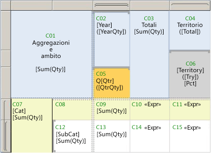

# <a name="expression-scope-for-totals-aggregates-and-built-in-collections"></a>Ambito di espressioni per totali, aggregazioni e raccolte predefinite
  Quando si scrivono espressioni, si noterà che il termine *ambito* viene utilizzato in molti contesti. Può infatti specificare i dati da utilizzare per la valutazione di un'espressione, il set di caselle di testo in una pagina di cui è stato eseguito il rendering, il set di elementi del report che possono essere mostrati o nascosti in base a un elemento Toggle. Il termine *ambito* verrà utilizzato in argomenti correlati alla valutazione di un'espressione, alla sintassi della funzione di aggregazione, alla visibilità condizionale nonché nei messaggi di errore relativi a queste aree. Per comprendere il significato di *ambito* in un contesto specifico, utilizzare le descrizioni seguenti:  
  
-   **Ambito dei dati** L'ambito dei dati è una gerarchia di ambiti utilizzata dall'elaboratore di report mentre vengono combinati i dati report con il layout del report e compilate le aree dati esterne, ad esempio tabelle e grafici, in cui visualizzare i dati. Le informazioni sull'ambito dei dati consentono di ottenere i risultati desiderati quando si effettuano le seguenti operazioni:  
  
    -   **Scrivere espressioni che utilizzano funzioni di aggregazione** Specificare quali dati aggregare. La posizione dell'espressione nel report influisce sui dati che sono nell'ambito per i calcoli di aggregazione.  
  
    -   **Aggiungere grafici sparkline a una tabella o a una matrice** Specificare un intervallo minimo e massimo degli assi del grafico per allineare istanze nidificate in una tabella o in una matrice.  
  
    -   **Aggiungere indicatori a una tabella o a una matrice** Specificare una scala minima e massima del misuratore per allineare istanze nidificate in una tabella o in una matrice.  
  
    -   **Scrivere espressioni di ordinamento** Specificare un ambito contenitore che può essere utilizzato per sincronizzare l'ordinamento fra più elementi del report correlati.  
  
-   **Ambito cella** L'ambito cella è il set di gruppi di righe e di colonne di un'area dati Tablix a cui appartiene una cella. Per impostazione predefinita, in ogni cella della Tablix è contenuta una casella di testo. il cui valore è l'espressione. La posizione della cella consente di determinare indirettamente gli ambiti dei dati che si possono specificare per i calcoli di aggregazione nell'espressione.  
  
-   **Ambito dell'elemento del report** L'ambito dell'elemento del report fa riferimento alla raccolta di elementi in una pagina del report di cui è stato eseguito il rendering. L'elaboratore di report consente di combinare i dati con gli elementi del layout del report per produrre una definizione del report compilato. Durante questo processo, le aree dati, ad esempio tabelle e matrici, possono essere espanse in base alle necessità per visualizzare tutti i dati del report. Il report compilato viene quindi elaborato da un renderer del report che consente di determinare quali elementi del report visualizzare in ogni pagina. In un server di report, ogni pagina viene sottoposta a rendering quando visualizzata. Dopo l'esportazione di un report, tutte le pagine sono sottoposte a rendering. Le informazioni sull'ambito dell'elemento del report consentono di ottenere i risultati desiderati quando si effettuano le seguenti operazioni:  
  
    -   **Aggiungere elementi Toggle** Specificare una casella di testo per aggiungere l'elemento Toggle che consente di controllare la visibilità di un elemento del report. È possibile aggiungere solo un elemento Toggle alle caselle di testo che sono nell'ambito dell'elemento del report che si desidera attivare o disattivare.  
  
    -   **Scrivere espressioni in intestazioni e piè di pagina** Specificare i valori di espressioni nelle caselle di testo o in altri elementi del report visualizzati nella pagina di cui è stato eseguito il rendering.  
  
 Le informazioni sugli ambiti consentono di completare la scrittura di espressioni che forniscono i risultati desiderati.  
  
> [!NOTE]  
>  [!INCLUDE[ssRBRDDup](../../includes/ssrbrddup-md.md)]  
  
##  <a name="DataScope"></a> Informazioni sull'ambito dei dati e sulla gerarchia di dati  
 L'ambito dei dati consente di specificare un set di dati del report e presenta una gerarchia naturale con una relazione di contenuto inerente. Nella gerarchia, gli ambiti di ordine superiore contengono gli ambiti di ordine inferiore. Nel seguente elenco di ambiti dei dati la gerarchia viene descritta a partire dal numero maggiore di dati:  
  
-   **Set di dati, dopo l'applicazione dei filtri dei set di dati** Specificano il set di dati del report collegato all'area dati o a un elemento del report nel corpo del report. I dati utilizzati per l'aggregazione provengono dal set di dati del report dopo l'applicazione delle espressioni di filtro del set di dati. Per i set di dati condivisi, ciò significa sia i filtri nella definizione del set di dati condiviso che i filtri nell'istanza del set di dati condiviso nel report.  
  
-   **Aree dati** Specificano i dati provenienti dall'area dati dopo l'applicazione delle espressioni di filtro e di ordinamento dell'area dati. I filtri di gruppo non vengono utilizzati per il calcolo delle aggregazioni per le aree dati.  
  
-   **Gruppi di aree dati, dopo l'applicazione dei filtri di gruppo** Specificano i dati dopo l'applicazione delle espressioni di raggruppamento e dei filtri di gruppo per il gruppo padre e i gruppi figlio. Per una tabella, ciò significa i gruppi di righe e di colonne. Per un grafico, i gruppi di serie e di categorie. Ai fini dell'identificazione degli ambiti contenitore, ogni gruppo padre contiene i relativi gruppi figlio.  
  
-   **Aree dati nidificate** Specificano i dati per l'area dati nidificata nel contesto della cella in cui sono stati aggiunti e dopo l'applicazione delle espressioni di filtro e di ordinamento dell'area dati nidificata.  
  
-   **Gruppi di righe e colonne per le aree dati nidificate** Specificano i dati dopo l'applicazione delle espressioni di raggruppamento e dei filtri di gruppo dell'area dati nidificata.  
  
 Le informazioni sugli ambiti contenitori e gli ambiti contenuti sono importanti quando si scrivono espressioni che includono funzioni di aggregazione.  
  
##  <a name="Aggregates"></a> Ambito cella ed espressioni  
 Quando si specifica un ambito, si indica all'elaboratore di report quali dati utilizzare per un calcolo di aggregazione. A seconda dell'espressione e della relativa posizione, gli ambiti validi possono essere *ambiti contenitore*, noti anche come ambiti padre o *ambiti contenuti*, noti anche noto come ambiti figlio o nidificati. In generale, non è possibile specificare un'istanza di gruppo singola in un calcolo di aggregazione. È possibile specificare un'aggregazione in tutte le istanze di gruppo.  
  
 Quando l'elaboratore di report consente di combinare i dati di un set di dati del report con l'area dati Tablix, consente di valutare le espressioni di raggruppamento e di creare le righe e le colonne necessarie per rappresentare le istanze di gruppo. Il valore di espressioni in una casella di testo di ogni cella della Tablix viene valutato nel contesto dell'ambito della cella. A seconda della struttura della Tablix, una cella può appartenere a più gruppi di righe e gruppi di colonne. Per le funzioni di aggregazione, è possibile specificare quale ambito utilizzare tramite uno degli ambiti seguenti:  
  
-   **Ambito predefinito** I dati che sono nell'ambito per i calcoli quando l'elaboratore di report valuta un'espressione. L'ambito predefinito è il set di gruppi più interno a cui appartiene la cella o il punto dati. Per un'area dati Tablix, nel set possono essere inclusi gruppi di righe e di colonne. Per un'area dati del grafico, nel set possono essere inclusi gruppi di categorie e di serie.  
  
-   **Ambito denominato** Il nome di un set di dati, un'area dati o un gruppo dell'area dati che è incluso nell'ambito per l'espressione. Per i calcoli di aggregazioni è possibile specificare un ambito contenitore. Non è possibile specificare un ambito denominato per un gruppo di righe e un gruppo di colonne in un'unica espressione, né è possibile specificare un ambito contenuto a meno che l'espressione non sia per un'aggregazione di un'aggregazione.  
  
     L'espressione seguente genera gli anni di intervallo tra SellStartDate e LastReceiptDate. Questi campi si trovano in due set di dati diversi, DataSet1 e DataSet2. Il [prima funzione &#40; Generatore report e SSRS &#41; ](../../reporting-services/report-design/report-builder-functions-first-function.md), che è una funzione di aggregazione, restituisce il primo valore di SellStartDate in DataSet1 e il primo valore di LastReceiptDate in DataSet2.  
  
    ```  
    =DATEDIFF(“yyyy”, First(Fields!SellStartDate.Value, "DataSet1"), First(Fields!LastReceiptDate.Value, "DataSet2"))  
    ```  
  
-   **Ambito di dominio** Chiamato anche ambito di sincronizzazione. Un tipo di ambito dei dati che si applica alla valutazione dell'espressione per le aree dati nidificate. L'ambito di dominio viene utilizzato per specificare aggregazioni in tutte le istanze di un gruppo in modo da allineare e facilmente confrontare le istanze nidificate. Ad esempio, per allineare i valori, è possibile allineare l'intervallo e l'altezza dei grafici sparkline incorporati in una tabella.  
  
 In alcuni percorsi di un report, è necessario specificare un ambito. Ad esempio per una casella di testo nell'area di progettazione, è necessario specificare il nome del set di dati da utilizzare: `=Max(Fields!Sales.Value,"Dataset1")`. Negli altri percorsi, esiste un ambito predefinito implicito. Ad esempio, se non si specifica un'aggregazione per una casella di testo in un ambito del gruppo, viene utilizzata l'aggregazione predefinita First.  
  
 In ogni argomento della funzione di aggregazione vengono elencati gli ambiti che si possono utilizzare. Per altre informazioni, vedere [Riferimento a funzioni di aggregazione &#40;Generatore report e SSRS&#41;](../../reporting-services/report-design/report-builder-functions-aggregate-functions-reference.md).  
  
##  <a name="Examples"></a> Espressioni di aggregazione di esempio per un'area dati della tabella  
 Per scrivere espressioni che specificano ambiti non predefiniti è necessario conoscere bene la procedura. Per comprendere ambiti diversi, utilizzare la figura e la tabella seguenti. Nella figura viene contrassegnata ogni cella della tabella di informazioni sulle vendite in cui è visualizzata la quantità di articoli venduti su base annuale e trimestrale nonché in base al territorio di vendita. Si notino gli indicatori visivi negli handle di riga e in quelli di colonna che consentono di visualizzare la struttura del gruppo di righe e di colonne, indicando i gruppi nidificati. La tabella presenta la struttura seguente:  
  
-   Un'intestazione di tabella contenente la cella d'angolo e tre righe che includono le intestazioni del gruppo di colonne.  
  
-   Due gruppi di righe nidificati in base alla categoria denominata Cat e alla sottocategoria denominata SubCat.  
  
-   Due gruppi di colonne nidificati in base all'anno denominato Year e al trimestre denominato Qtr.  
  
-   Una colonna dei totali statici denominata Totals.  
  
-   Un gruppo di colonne adiacente basato sul territorio di vendita denominato Territory.  
  
 Ai fini della visualizzazione, l'intestazione di colonna per il gruppo di territori è stata suddivisa in due celle. La prima cella consente di visualizzare il nome del territorio e i totali mentre la seconda cella dispone del testo segnaposto con il calcolo del contributo percentuale per ogni territorio a tutte le vendite.  
  
   
  
 Presupporre che il set di dati sia denominato DataSet1 e la tabella Tablix1. Nella tabella seguente vengono elencate l'etichetta della cella, l'ambito predefinito ed esempi. I valori per il testo segnaposto vengono mostrati nella sintassi dell'espressione.  
  
|Cella|Ambito predefinito|Etichette segnaposto|Testo o valori segnaposto|  
|----------|-------------------|------------------------|--------------------------------|  
|C01|Tablix1|[Sum(Qty)]|Aggregazioni e ambito<br /><br /> `=Sum(Fields!Qty.Value)`|  
|C02|Gruppo di colonne esterno "Year"|[Year]<br /><br /> ([YearQty])|`=Fields!Year.Value`<br /><br /> `=Sum(Fields!Qty.Value)`|  
|C03|Tablix1|[Sum(Qty)]|Totali<br /><br /> `=Sum(Fields!Qty.Value)`|  
|C04|Gruppo di colonne peer "Territory"|([Total])|Territory<br /><br /> `=Sum(Fields!Qty.Value)`|  
|C05|Gruppo interno "Qtr"|[Qtr]<br /><br /> ([QtrQty])|Q<br /><br /> `=Fields!Qtr.Value`<br /><br /> `=Sum(Fields!Qty.Value)`|  
|C06|Gruppo di colonne peer "Territory"|[Territory]<br /><br /> ([Tty])<br /><br /> [Pct]|`=Fields!Territory.Value`<br /><br /> `=Sum(Fields!Qty.Value)`<br /><br /> `=FormatPercent(Sum(Fields!Qty.Value,"Territory")/Sum(Fields!Qty.Value,"Tablix1"),0) & " of " & Sum(Fields!Qty.Value,"Tablix1")`|  
|C07|Gruppo di righe esterno "Cat"|[Cat]<br /><br /> [Sum(Qty)]|`=Fields!Cat.Value`<br /><br /> `=Sum(Fields!Qty.Value)`|  
|C08|Come C07|||  
|C09|Gruppo di righe esterno "Cat" e gruppo di colonne interno "Qtr"|[Sum(Qty)]|`=Sum(Fields!Qty.Value)`|  
|C10|Come C07|<\<Expr >>|`=Sum(Fields!Qty.Value) & ": " & FormatPercent(Sum(Fields!Qty.Value)/Sum(Fields!Qty.Value,"Tablix1"),0) & " of " & Sum(Fields!Qty.Value,"Tablix1")`|  
|C11|Gruppo di righe esterno "Cat" e gruppo di colonne "Territory"|<\<Expr >>|`=Sum(Fields!Qty.Value) & ": " & FormatPercent(Sum(Fields!Qty.Value)/Sum(Fields!Qty.Value,"Territory"),0) & " of " & Sum(Fields!Qty.Value,"Territory")`|  
|C12|Gruppo di righe interno "Subcat"|[Subcat]<br /><br /> [Sum(Qty)]|`=Fields!SubCat.Value`<br /><br /> `=Sum(Fields!Qty.Value)`|  
|C13|Gruppo di righe interno "Subcat" e gruppo di colonne interno "Qtr"|[Sum(Qty)]|`=Sum(Fields!Qty.Value)`|  
|C14|Gruppo di righe interno "Subcat"|<\<Expr >>|`=Sum(Fields!Qty.Value) & ": " & FormatPercent(Sum(Fields!Qty.Value)/Sum(Fields!Qty.Value,"Cat"),0) & " of " & Sum(Fields!Qty.Value,"Cat")`|  
|C15|Gruppo di righe interno "Subcat" e gruppo di colonne "Territory"|<\<Expr >>|`=Sum(Fields!Qty.Value) & ": " & FormatPercent(Code.CalcPercentage(Sum(Fields!Qty.Value),Sum(Fields!Qty.Value,"Cat")),0) & " of " & Sum(Fields!Qty.Value,"Cat")`|  
  
 Per altre informazioni sull'interpretazione dei segnali visivi nelle aree dati Tablix, vedere [Celle, righe e colonne dell'area dati Tablix &#40;Generatore report e SSRS&#41;](../../reporting-services/report-design/tablix-data-region-cells-rows-and-columns-report-builder-and-ssrs.md). Per ulteriori informazioni sull'area dati tablix, vedere [celle dell'area dati Tablix, righe e colonne &#40; Generatore report &#41; SSRS e](../../reporting-services/report-design/tablix-data-region-cells-rows-and-columns-report-builder-and-ssrs.md). Per altre informazioni sulle espressioni e le aggregazioni, vedere [Uso delle espressioni nei report &#40;Generatore report e SSRS&#41;](../../reporting-services/report-design/expression-uses-in-reports-report-builder-and-ssrs.md) e [Riferimento a funzioni di aggregazione &#40;Generatore report e SSRS&#41;](../../reporting-services/report-design/report-builder-functions-aggregate-functions-reference.md).  
  
  
##  <a name="Sparklines"></a> Sincronizzazione di scale per i grafici sparkline  
 Per confrontare i valori nel tempo sull'asse orizzontale di un grafico sparkline nidificato in una tabella o matrice, è possibile sincronizzare i valori del gruppo categorie. Questa operazione viene chiamata allineamento degli assi. Se si seleziona l'opzione per allineare gli assi, nel report vengono impostati automaticamente i valori minimo e massimo di un asse e vengono forniti i segnaposto per i valori di aggregazione che non esistono in ogni categoria. In questo modo i valori nel grafico sparkline si allineano a ogni categoria e consentono di eseguire confronti con i valori di riga di dati aggregati. Se si seleziona questa opzione, si imposta l'ambito della valutazione dell'espressione sull' *ambito di dominio*. L'impostazione dell'ambito di dominio per un grafico nidificato consente anche di controllare indirettamente l'assegnazione del colore per ogni categoria nella legenda.  
  
 Ad esempio, in un grafico sparkline in cui sono mostrate le tendenze settimanali, supporre che di una città si dispone dei dati di vendita relativi a 3 mesi e di un'altra dei dati di vendita relativi a 12 mesi. Senza scale sincronizzate, nel grafico sparkline per la prima città si disporrebbe solo di 3 barre che risulterebbero molto più ampie e occuperebbero lo stesso spazio del set di barre di 12 mesi per la seconda città.  
  
 Per altre informazioni, vedere [Allineare i dati in un grafico di una tabella o matrice &#40;Generatore report e SSRS&#41;](../../reporting-services/report-design/align-the-data-in-a-chart-in-a-table-or-matrix-report-builder-and-ssrs.md).  
  
  
##  <a name="Indicators"></a> Sincronizzazione di intervalli per gli indicatori  
 Per specificare i valori dei dati da utilizzare per un set di indicatori, è necessario specificare un ambito. A seconda del layout dell'area dati che contiene l'indicatore, viene specificato un ambito o un ambito contenitore. Ad esempio, in una riga di intestazione di gruppo associata alle vendite della categoria, un set di frecce (in su, in giù, laterali) può indicare i valori delle vendite relativi a una soglia. L'ambito contenitore è il nome della tabella o matrice contenente gli indicatori.  
  
 Per altre informazioni, vedere [Impostare l'ambito di sincronizzazione &#40;Generatore report e SSRS&#41;](../../reporting-services/report-design/set-synchronization-scope-report-builder-and-ssrs.md).  
  
  
##  <a name="Page"></a> Specifica degli ambiti dall'intestazione o dal piè di pagina  
 Per visualizzare dati differenti in ogni pagina di un report, si aggiungono espressioni a un elemento del report che deve essere nella pagina di cui è stato eseguito il rendering. Poiché un report viene suddiviso in più pagine mentre ne viene eseguito il rendering, è possibile determinare gli elementi presenti in una pagina solo durante questa fase. Ad esempio, una cella in una riga di dettaglio dispone di una casella di testo contenente molte istanze in una pagina.  
  
 A tale scopo, esiste una raccolta globale chiamata ReportItems. Si tratta del set di caselle di testo nella pagina corrente.  
  
 Per altre informazioni, vedere [Intestazioni di pagina e piè di pagina &#40;Generatore report e SSRS&#41;](../../reporting-services/report-design/page-headers-and-footers-report-builder-and-ssrs.md) e [Riferimenti alla raccolta ReportItems &#40;Generatore report e SSRS&#41;](../../reporting-services/report-design/built-in-collections-reportitems-collection-references-report-builder.md).  
  
  
##  <a name="Toggles"></a> Specifica di un elemento Toggle per il drill-down e la visibilità condizionale  
 Gli elementi Toggle sono le immagini dei segni più e meno che vengono aggiunte a una casella di testo sulle quali un utente può fare clic per mostrare o nascondere altri elementi del report. Nella pagina **Visibilità** , per la maggior parte delle proprietà dell'elemento di report, è possibile specificare a quale elemento del report aggiungere l'elemento Toggle, che deve essere in un ambito di contenuto superiore rispetto all'elemento da mostrare o nascondere.  
  
 In un'area dati Tablix, per creare un effetto del drill-down in cui si fa clic su una casella di testo per espandere la tabella in modo da visualizzare più dati, è necessario impostare la proprietà **Visibilità** nel gruppo e selezionare come elemento Toggle una casella di testo in un'intestazione di gruppo associata a un gruppo contenitore.  
  
 Per altre informazioni, vedere [Aggiungere un'azione Espandi o Comprimi a un elemento &#40;Generatore report e SSRS&#41;](../../reporting-services/report-design/add-an-expand-or-collapse-action-to-an-item-report-builder-and-ssrs.md).  
  
  
##  <a name="Sort"></a> Specifica di un'espressione di ordinamento per la sincronizzazione dell'ordinamento  
 Quando si aggiunge un pulsante di ordinamento interattivo a una colonna della tabella, è possibile sincronizzare l'ordinamento per più elementi che dispongono di un ambito contenitore comune. Ad esempio, è possibile aggiungere un pulsante di ordinamento a un'intestazione di colonna in una matrice e specificare l'ambito contenitore come nome del set di dati associato alla matrice. Quando un utente fa clic sul pulsante di ordinamento, insieme alle righe della matrice vengono ordinati anche i gruppi di serie di grafici dei grafici associati allo stesso set di dati. In questo modo, tutte le aree dati che dipendono da quel set di dati possono essere sincronizzate per mostrare lo stesso ordinamento.  
  
 Per altre informazioni, vedere [Filtro, raggruppamento e ordinamento di dati &#40;Generatore report e SSRS&#41;](../../reporting-services/report-design/filter-group-and-sort-data-report-builder-and-ssrs.md).  
  
  
##  <a name="Nulls"></a> Eliminazione di valori Null o zero in una cella  
 Per diversi report i calcoli che presentano i gruppi come ambito possono generare più celle con valori zero (0) o Null. Per evitare disordine nel report, aggiungere un'espressione che consenta di restituire spazi laddove il valore di aggregazione è uguale a 0. Per altre informazioni, vedere "Eliminazione di valori Null o zero in fase di esecuzione" in [Esempi di espressioni &#40;Generatore report e SSRS&#41;](../../reporting-services/report-design/expression-examples-report-builder-and-ssrs.md).  
  
  
## <a name="see-also"></a>Vedere anche  
 [Esempi di espressioni &#40;Generatore report e SSRS&#41;](../../reporting-services/report-design/expression-examples-report-builder-and-ssrs.md)   
 [Esempi di espressione di raggruppamento &#40; Generatore report e SSRS &#41;](../../reporting-services/report-design/group-expression-examples-report-builder-and-ssrs.md)   
 [Creazione di gruppi di gerarchie ricorsive &#40; Generatore report e SSRS &#41;](../../reporting-services/report-design/creating-recursive-hierarchy-groups-report-builder-and-ssrs.md)   
 [Tabelle, matrici e gli elenchi di &#40; Generatore report e SSRS &#41;](../../reporting-services/report-design/tables-matrices-and-lists-report-builder-and-ssrs.md)   
 [Formattazione di testo e segnaposto &#40; Generatore report e SSRS &#41;](../../reporting-services/report-design/formatting-text-and-placeholders-report-builder-and-ssrs.md)  
  
  
