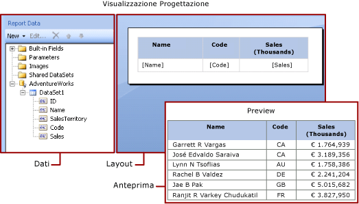
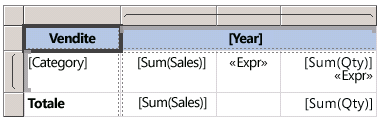
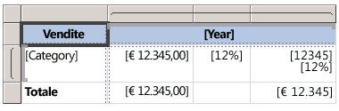

# Espressioni (Generatore report e SSRS)
  Le espressioni vengono ampiamente usate nei report impaginati di [!INCLUDE[ssRSnoversion_md](../../includes/ssrsnoversion-md.md)] per recuperare, calcolare, visualizzare, raggruppare, ordinare, filtrare, parametrizzare e formattare i dati. 
  
  Molte proprietà dell'elemento del report possono essere impostate su un'espressione tramite la quale è possibile controllare il contenuto, la progettazione e l'interattività del report. Le espressioni sono scritte in [!INCLUDE[msCoName](../../includes/msconame-md.md)] [!INCLUDE[vbprvb](../../includes/vbprvb-md.md)], salvate nella definizione del report e valutate dall'elaboratore di report durante l'esecuzione del report.  
  
 A differenza di applicazioni come [!INCLUDE[msCoName](../../includes/msconame-md.md)] Office Excel, in cui è possibile usare i dati direttamente in un foglio di lavoro, in un report è possibile gestire espressioni che sono segnaposto per i dati. Per visualizzare i dati effettivi dalle espressioni valutate, è necessario visualizzare in anteprima il report. Durante l'esecuzione del report, tramite l'elaboratore di report è possibile valutare ogni espressione poiché vengono combinati i dati del report con gli elementi di layout del report quali tabelle e grafici.  
  
 Quando si progetta un report, molte espressioni degli elementi del report vengono impostate automaticamente. Ad esempio, quando si trascina un campo dal riquadro dei dati in una cella della tabella nell'area di progettazione del report, il valore della casella di testo viene impostato su un'espressione semplice per il campo. Nel riquadro dei dati riportato nella figura seguente vengono visualizzate le opzioni ID Name, SalesTerritory, Code e Sales dei campi del set di dati. Alla tabella sono stati aggiunti tre campi: [Name], [Code] e [Sales]. La notazione [Name] nell'area di progettazione rappresenta l'espressione `=Fields!Name.Value`sottostante.  
  
   
  
 Quando si visualizza in anteprima il report, tramite l'elaboratore di report l'area dati della tabella viene combinata con i dati effettivi della connessione dati e viene visualizzata una riga nella tabella per ogni riga nel set di risultati.  
  
 Per immettere espressioni manualmente, selezionare un elemento nell'area di progettazione e utilizzare menu di scelta rapida e finestre di dialogo per impostare le proprietà dell'elemento. Quando viene visualizzato il pulsante ***(fx)*** o il valore `<Expression>` in un elenco a discesa, è possibile impostare la proprietà su un'espressione. Per altre informazioni, vedere [Aggiungere un'espressione &#40;Generatore report e SSRS&#41;](../../reporting-services/report-design/add-an-expression-report-builder-and-ssrs.md)sottostante.  
  
 Per sviluppare espressioni complesse o espressioni che consentono l'utilizzo di codice o assembly personalizzati, si consiglia di usare Progettazione report di [!INCLUDE[ssBIDevStudioFull](../../includes/ssbidevstudiofull-md.md)]. Per altre informazioni, vedere [Riferimenti a codice personalizzato e ad assembly in espressioni in Progettazione report &#40;SSRS&#41;](../../reporting-services/report-design/custom-code-and-assembly-references-in-expressions-in-report-designer-ssrs.md)sottostante.  
  
> [!NOTE]  
>  [!INCLUDE[ssRBRDDup](../../includes/ssrbrddup-md.md)]  
  
##   Informazioni sulle espressioni semplici e complesse  
 Le espressioni iniziano con il segno di uguale (=) e sono scritte in [!INCLUDE[msCoName](../../includes/msconame-md.md)] [!INCLUDE[vbprvb](../../includes/vbprvb-md.md)]. Nelle espressioni può essere inclusa una combinazione di costanti, operatori e riferimenti a valori predefiniti, ad esempio campi, raccolte e funzioni, e a codice esterno o personalizzato.  
  
 Le espressioni possono essere utilizzate per specificare il valore di numerose proprietà dell'elemento del report. Le proprietà più comuni sono valori per caselle di testo e testo segnaposto. In genere, se in una casella di testo è contenuta un'unica espressione, tale espressione è il valore della proprietà della casella di testo. Se in una casella di testo sono contenute più espressioni, ognuna di queste rappresenta il valore di testo segnaposto nella casella di testo.  
  
 Per impostazione predefinita, le espressioni vengono visualizzate nell'area di progettazione del report come espressioni *semplici* o *complesse*.  
  
-   **Semplice** Espressione contenente un riferimento a un singolo elemento in una raccolta predefinita, ad esempio un campo del set di dati, un parametro oppure un campo predefinito. Un'espressione semplice viene visualizzata tra parentesi nell'area di progettazione. `[FieldName]` , ad esempio, corrisponde all'espressione sottostante `=Fields!FieldName.Value`. Le espressioni semplici vengono create automaticamente quando si crea il layout del report e si trascinano gli elementi dal riquadro dei dati del report nell'area di progettazione. Per altre informazioni sui simboli che rappresentano raccolte predefinite diverse, vedere [Informazioni sui simboli di prefissi in espressioni semplici](#DisplayText).  
  
-   **Complessa** Espressione contenente riferimenti a più riferimenti, operatori e chiamate di funzioni predefiniti. Un'espressione complessa viene visualizzata come <\<Expr >> quando il valore dell'espressione include più di un semplice riferimento. Per visualizzare l'espressione, posizionare il puntatore del mouse su tale espressione e utilizzare la descrizione comando. Per modificare l'espressione, aprirla nella finestra di dialogo **Espressione** .  
  
 Nella figura seguente vengono mostrate espressioni semplici e complesse tipiche sia per le caselle di testo sia per il testo segnaposto.  
  
   
  
 Per visualizzare valori di esempio anziché il testo per le espressioni, applicare la formattazione alla casella di testo o al testo segnaposto. Nella figura seguente viene mostrata l'area di progettazione del report attivata o disattivata per la visualizzazione dei valori di esempio:  
  
   
  
 Per altre informazioni, vedere [Formattazione di testo e segnaposto &#40;Generatore report e SSRS&#41;](../../reporting-services/report-design/formatting-text-and-placeholders-report-builder-and-ssrs.md).  
  
### Formule di modelli di report  
 Durante la progettazione di una query per un set di dati in cui viene usato un modello di report come origine dati, è possibile creare *formule*. Le formule sono calcoli eseguiti su valori in un report basati su dati di un modello di report.  
  
 Per altre informazioni, vedere [Formule nelle query del modello di report &#40;Generatore report e SSRS&#41;](../../reporting-services/report-design/formulas-in-report-model-queries-report-builder-and-ssrs.md).  
   
##   Informazioni sui simboli di prefissi in espressioni semplici  
 Nelle espressioni semplici vengono utilizzati simboli per indicare se il riferimento è a un campo, un parametro, una raccolta predefinita o la raccolta ReportItems. Nella tabella seguente vengono riportati esempi di testo visualizzato e di quello relativo alle espressioni:  
  
|Elemento|Esempio di testo visualizzato|Esempio di testo dell'espressione|  
|----------|--------------------------|-----------------------------|  
|Campi del set di dati|`[Sales]`   `[SUM(Sales)]`   `[FIRST(Store)]`|`=Fields!Sales.Value`   `=Sum(Fields!Sales.Value)`   `=First(Fields!Store.Value)`|  
|Parametri di report|`[@Param]`   `[@Param.Label]`|`=Parameters!Param.Value`   `=Parameters!Param.Label`|  
|Campi predefiniti|`[&ReportName]`|`=Globals!ReportName.Value`|  
|Caratteri letterali utilizzati per il testo visualizzato|`\[Sales\]`|`[Sales]`|  
  
##   Scrittura di espressioni complesse  
 Nelle espressioni possono essere inclusi riferimenti a funzioni, operatori, costanti, campi, parametri, elementi di raccolte predefinite nonché a codice personalizzato o assembly personalizzati incorporati.  
  
> [!NOTE]  
>  Per sviluppare espressioni complesse o espressioni che consentono l'utilizzo di codice o assembly personalizzati, si consiglia di usare Progettazione report di [!INCLUDE[ssNoVersion](../../includes/ssnoversion-md.md)][!INCLUDE[ssBIDevStudioFull](../../includes/ssbidevstudiofull-md.md)]. Per altre informazioni, vedere [Riferimenti a codice personalizzato e ad assembly in espressioni in Progettazione report &#40;SSRS&#41;](../../reporting-services/report-design/custom-code-and-assembly-references-in-expressions-in-report-designer-ssrs.md)sottostante.  
  
 Nella tabella seguente vengono elencati i tipi di riferimenti che è possibile includere in un'espressione:  
  
|Riferimenti|Description|Esempio|  
|----------------|-----------------|-------------|  
|[Costanti](../../reporting-services/report-design/constants-in-expressions-report-builder-and-ssrs.md)|Vengono descritte le costanti a cui è possibile accedere in modo interattivo per le proprietà che richiedono valori costanti, ad esempio i colori dei caratteri.|`="Blue"`|  
|[Operatori](../../reporting-services/report-design/operators-in-expressions-report-builder-and-ssrs.md)|Vengono descritti gli operatori che possono essere utilizzati per la combinazione di riferimenti in un'espressione. L'operatore **&** , ad esempio, viene usato per la concatenazione di stringhe.|`="The report ran at: " & Globals!ExecutionTime & "."`|  
|[Raccolte predefinite](../../reporting-services/report-design/built-in-collections-in-expressions-report-builder.md)|Vengono descritte le raccolte predefinite che è possibile includere in un'espressione, ad esempio, `Fields`, `Parameters`e `Variables`.|`=Fields!Sales.Value`   `=Parameters!Store.Value`   `=Variables!MyCalculation.Value`|  
|[Funzioni predefinite di report e di aggregazione](../../reporting-services/report-design/report-builder-functions-aggregate-functions-reference.md)|Vengono descritte le funzioni predefinite, ad esempio `Sum` o `Previous`, cui è possibile accedere da un'espressione.|`=Previous(Sum(Fields!Sales.Value))`|  
|[Riferimenti a codice personalizzato e ad assembly in espressioni in Progettazione report &#40;SSRS&#41;](../../reporting-services/report-design/custom-code-and-assembly-references-in-expressions-in-report-designer-ssrs.md)|Viene descritto come accedere alle classi CLR predefinite <xref:System.Math> e <xref:System.Convert>, ad altre classi CLR, a funzioni della libreria di runtime di [!INCLUDE[vbprvb](../../includes/vbprvb-md.md)] o a metodi da un assembly esterno.   Viene descritto come accedere a codice personalizzato incorporato nel report o compilato e installato come assembly personalizzato sia nel client che nel server di report.|`=Sum(Fields!Sales.Value)`   `=CDate(Fields!SalesDate.Value)`   `=DateAdd("d",3,Fields!BirthDate.Value)`   `=Code.ToUSD(Fields!StandardCost.Value)`|  
   
##   Convalida delle espressioni  
 Quando si crea un'espressione per una proprietà specifica dell'elemento del report, i riferimenti che è possibile includere in un'espressione dipendono dai valori accettati dalla proprietà dell'elemento del report e dall'ambito nel quale viene valutata la proprietà. Esempio:  
  
-   Per impostazione predefinita, l'espressione [Sum] consente di calcolare la somma di dati presenti nell'ambito al momento della valutazione dell'espressione. Per una cella della tabella, l'ambito dipende dalle appartenenze ai gruppi di righe e di colonne. Per altre informazioni, vedere [Ambito di espressioni per totali, aggregazioni e raccolte predefinite &#40;Generatore report e SSRS&#41;](../../reporting-services/report-design/expression-scope-for-totals-aggregates-and-built-in-collections.md)sottostante.  
  
-   Per il valore di una proprietà Font, tramite il valore deve essere restituito il nome di un tipo di carattere.  
  
-   La sintassi dell'espressione viene convalidata in fase di progettazione mentre la convalida dell'ambito dell'espressione viene eseguita durante la pubblicazione del report. Per convalide che dipendono dai dati effettivi, gli errori possono essere rilevati solo in fase di esecuzione. Alcune di queste espressioni generano un messaggio di errore di tipo #Errore nel report sottoposto a rendering. Per determinare i problemi relativi a questo tipo di errore, è necessario utilizzare Progettazione report in [!INCLUDE[ssBIDevStudioFull](../../includes/ssbidevstudiofull-md.md)]. In Progettazione report è disponibile una finestra Output nella quale vengono fornite ulteriori informazioni su questi errori.  
  
 Per altre informazioni, vedere [Riferimento dell'espressione &#40;Generatore report e SSRS&#41;](../../reporting-services/report-design/expression-reference-report-builder-and-ssrs.md)sottostante.  
  
##   Argomenti della sezione  
 [Aggiungere un'espressione &#40;Generatore report e SSRS&#41;](../../reporting-services/report-design/add-an-expression-report-builder-and-ssrs.md)  
  
 [Utilizzo delle espressioni nei report &#40;Generatore report e SSRS&#41;](../../reporting-services/report-design/expression-uses-in-reports-report-builder-and-ssrs.md)  
  
 [Ambito di espressioni per totali, aggregazioni e raccolte predefinite &#40;Generatore report e SSRS&#41;](../../reporting-services/report-design/expression-scope-for-totals-aggregates-and-built-in-collections.md)  
  
 [Riferimento dell'espressione &#40;Generatore report e SSRS&#41;](../../reporting-services/report-design/expression-reference-report-builder-and-ssrs.md)  

## Vedere anche
 Per ulteriori informazioni ed esempi, vedere gli argomenti seguenti:  
  
-   [Utilizzo delle espressioni nei report &#40;Generatore report e SSRS&#41;](../../reporting-services/report-design/expression-uses-in-reports-report-builder-and-ssrs.md)  
-   [Esempi di espressioni &#40;Generatore report e SSRS&#41;](../../reporting-services/report-design/expression-examples-report-builder-and-ssrs.md)  
-   [Esempi di equazioni di filtro &#40;Generatore report e SSRS&#41;](../../reporting-services/report-design/filter-equation-examples-report-builder-and-ssrs.md)  
-   [Esempi di espressioni di raggruppamento &#40;Generatore report e SSRS&#41;](../../reporting-services/report-design/group-expression-examples-report-builder-and-ssrs.md)  
-   [Esercitazione: Introduzione alle espressioni](Tutorial:%20Introducing%20Expressions.md)
-   [Esempi di report (Generatore report e SSRS)](http://go.microsoft.com/fwlink/?LinkId=198283)  
  

