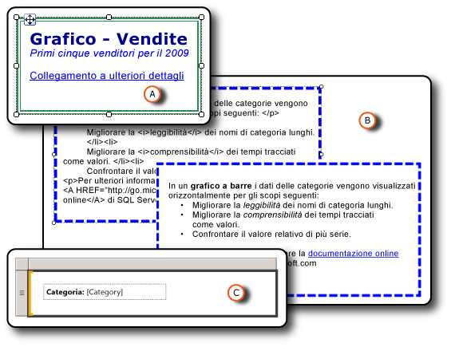

# Formattazione degli elementi del report (Generatore report e SSRS)
  La formattazione degli elementi del report consente di migliorare l'aspetto e la leggibilità del report. È possibile formattare le caselle di testo e i singoli elementi contenuti nelle caselle, le immagini, le espressioni e i dati in modalità progettazione report.  
  
   
  
 A. Casella di testo con un bordo a doppia linea e una varietà di stili di formattazione, incluso un collegamento.  
  
 B. Casella di testo con un bordo tratteggiato e dati HTML non elaborati e dati HTML di cui è stato eseguito il rendering.  
  
 C. Casella di testo con un'etichetta di testo e un segnaposto.  
  
 È possibile modificare le opzioni di formattazione selezionando l'elemento che si desidera formattare e quindi aprire la finestra di dialogo Proprietà dell'elemento. Ad esempio, se si desidera formattare il contenuto di un'intera casella di testo oppure una parola selezionata al suo interno, fare clic con il pulsante destro del mouse sull'elemento e scegliere **Proprietà casella di testo**. Sarà quindi possibile applicare gli stili di formattazione desiderati.  
  
 Per iniziare rapidamente, vedere [Esercitazione: formattazione di testo &#40;Generatore report&#41;](../../reporting-services/tutorial-format-text-report-builder.md).  
  
> [!NOTE]  
>  [!INCLUDE[ssRBRDDup](../../includes/ssrbrddup-md.md)]  
  
## Argomenti della sezione  
 [Formattazione di testo e segnaposto &#40;Generatore report e SSRS&#41;](../../reporting-services/report-design/formatting-text-and-placeholders-report-builder-and-ssrs.md)  
 Viene descritto come formattare il testo e come personalizzare le opzioni di formattazione per diversi blocchi di testo all'interno di una casella di testo.  
  
 [Importazione di codice HTML a un report &#40;Generatore report e SSRS &#41;](../../reporting-services/report-design/importing-html-into-a-report-report-builder-and-ssrs.md)  
 Viene descritto come inserire e utilizzare dati HTML in un report.  
  
 [Formattazione di numeri e date &#40;Generatore report e SSRS&#41;](../../reporting-services/report-design/formatting-numbers-and-dates-report-builder-and-ssrs.md)  
 Viene descritto come usare le stringhe di formattazione standard e personalizzate supportate da [!INCLUDE[ssRSnoversion](../../includes/ssrsnoversion-md.md)].  
  
 [Formattazione di linee, colori e immagini &#40;Generatore report e SSRS&#41;](../../reporting-services/report-design/formatting-lines-colors-and-images-report-builder-and-ssrs.md)  
 Viene descritto come formattare linee, griglie, colori e immagini all'interno di elementi del report e aree dati.  
  
 [Definizione delle impostazioni locali per un report o una casella di testo &#40;Reporting Services&#41;](../../reporting-services/report-design/set-the-locale-for-a-report-or-text-box-reporting-services.md)  
 Viene descritto come modificare l'impostazione dei formati di visualizzazione dati che differiscono in base alla lingua e al paese, ad esempio i valori relativi alla data, alla valuta e quelli numerici.  
  
## Vedere anche  
 [Formattazione di un grafico &#40;Generatore report e SSRS&#41;](../../reporting-services/report-design/formatting-a-chart-report-builder-and-ssrs.md)  
  
  
