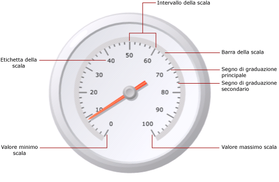

# Formattazione di scale su un misuratore (Generatore report e SSRS)
  In un report impaginato di [!INCLUDE[ssRSnoversion_md](../../includes/ssrsnoversion-md.md)] , la scala misuratore è l'intervallo di numeri, limitati da un valore minimo e da un valore massimo, mostrato su un misuratore. Una scala di misuratore contiene generalmente segni di graduazione ed etichette che consentono una lettura accurata di quello che viene mostrato dall'indicatore di misura del misuratore ed è generalmente associata a una o più indicatori di misura del misuratore. Sullo stesso misuratore può essere presente più di una scala.  
  
   
  
 A differenza del grafico in cui sono definiti più gruppi, il misuratore mostra un solo valore. È necessario definire i valori minimo e massimo della scala. I numeri dell'intervallo vengono calcolati automaticamente in base ai valori specificati per l'impostazione minima e massima.  
  
 Quando si aggiunge una seconda scala a un misuratore che già contiene una scala, per l'aspetto della seconda scala vengono clonate le proprietà della prima scala.  
  
 È possibile impostare proprietà sulla scala facendo clic con il pulsante destro del mouse sui segni di graduazione o sulle etichette della scala e scegliendo **Proprietà scala radiale** o **Proprietà scala lineare**. Ogni tipo di misuratore contiene almeno una scala con lo stesso set di proprietà. Esistono inoltre proprietà univoche per ogni tipo di misuratore:  
  
-   Su un misuratore radiale è possibile specificare il raggio, l'angolo iniziale e l'angolo di apertura della scala radiale.  
  
-   Su un misuratore lineare è possibile specificare la larghezza dei margini iniziali e finali rispetto agli endpoint su un misuratore lineare.  
  
 Per iniziare rapidamente con la formattazione delle scale, vedere [Impostare un valore minimo o massimo su un misuratore &#40;Generatore report e SSRS&#41;](../../reporting-services/report-design/set-a-minimum-or-maximum-on-a-gauge-report-builder-and-ssrs.md).  
  
##   Definizione dei valori minimo e massimo e degli intervalli su una scala  
 Un misuratore viene spesso utilizzato per visualizzare indicatori di prestazione chiave (KPI) misurati in percentuali comprese tra 0 e 100, pertanto questi sono i valori predefiniti assegnati alle proprietà Minimum e Maximum sul misuratore. È tuttavia possibile che questi valori non rappresentino la scala di valori che si intende mostrare. Poiché non c'è nessuna logica incorporata che consenta di determinare quello che viene rappresentato dal campo dati KPI, il misuratore non calcola automaticamente i valori minimo e massimo. Se il campo dati KPI non è un valore compreso tra 0 e 100, è necessario impostare in modo esplicito i valori per le proprietà Minimum e Maximum per fornire contesto all'unico valore visualizzato sul misuratore.  
  
 Sulla scala sono presenti segni di graduazione principali e secondari. Sono inoltre presenti etichette che vengono generalmente associate ai segni di graduazione principali. I segni di graduazione principali su una scala potrebbero, ad esempio, trovarsi su 0, 20, 40, 60, 80 e 100. Le etichette devono corrispondere a questi segni di graduazione. La differenza tra i valori di etichetta viene definita intervallo di scala. In questo esempio l'intervallo di scala è impostato su 20. È possibile impostare la proprietà Interval nella finestra di dialogo **Proprietà scala radiale** o **Proprietà scala lineare** .  
  
 Gli intervalli di scala vengono calcolati in base ai passaggi seguenti:  
  
1.  Specificare i valori minimo e massimo. Questi valori non vengono calcolati automaticamente in base al set di dati, pertanto è necessario fornire i valori nella finestra di dialogo **Proprietà** del misuratore.  
  
2.  Se non si specifica un valore per la proprietà Interval, il valore predefinito è Automatico. Ciò significa che l'applicazione calcolerà un numero equidistante di intervalli in base ai valori minimo e massimo specificati nel primo passaggio. Se si specifica un valore per la proprietà Interval, il misuratore calcolerà la differenza tra il valore minimo e massimo e dividerà il numero ottenuto per il valore specificato per la proprietà Interval.  
  
 Sono inoltre disponibili proprietà che consentono di definire intervalli di segni di graduazione ed etichette. Se si specifica un valore per tali proprietà, tale valore sarà prioritario rispetto al valore specificato per la proprietà dell'intervallo di scala. Se ad esempio l'intervallo di scala è Automatico, ma si specifica 4 per l'intervallo etichette, le etichette verranno visualizzate come 0, 4 8 e così via, ma i segni di graduazione principali verranno comunque calcolati dal misuratore in base al proprio metodo di calcolo. Questo può comportare situazioni in cui le etichette non sono sincronizzate con i segni di graduazione. Se si imposta un intervallo etichette, è consigliabile nascondere i segni di graduazione.  
  
 L'offset intervallo determina il numero di unità che verranno ignorate prima che venga mostrata la prima etichetta. Tutte le etichette e tutti i segni di graduazione principali successivi che verranno visualizzati sulla scala utilizzeranno l'intervallo specificato. Assegnare il valore 0 agli intervalli di etichette o dei segni di graduazione equivale a reimpostare l'intervallo su Automatico.  
  
##   Riduzione dei conflitti delle etichette con i moltiplicatori  
 Se i valori contengono molte cifre, il misuratore potrebbe diventare poco leggibile. È possibile utilizzare un moltiplicatore di scala per aumentare o ridurre la scala dei valori. Quando viene specificato un moltiplicatore di scala, ogni valore originale sulla scala viene moltiplicato dal moltiplicatore prima di essere visualizzato sulla scala. Per ridurre la scala dei valori, è necessario specificare un numero decimale. Se ad esempio la scala va da 0 a 10000 ma si desidera mostrare i numeri da 0 a 10 sul misuratore, è possibile utilizzare un valore del moltiplicatore di 0,001.  
  
> [!NOTE]  
>  L'utilizzo di un moltiplicatore non determina la moltiplicazione del valore effettivo del campo aggregato utilizzato dal misuratore. Vengono moltiplicati solo i valori delle etichette visualizzati sul misuratore dopo che sono stati definiti i valori minimo, massimo e gli intervalli. Quando si utilizza un moltiplicatore, è consigliabile impostare come automatici i calcoli degli intervalli.  
  
##   Specifica della larghezza della barra della scala, del raggio e degli angoli su una scala radiale  
 Utilizzare la pagina **Layout** della finestra di dialogo **Proprietà scala radiale** per impostare la larghezza della barra della scala, il raggio l'angolo iniziale e l'angolo di apertura della scala. È possibile utilizzare queste proprietà per personalizzare le dimensioni e il formato della scala. Se ad esempio si posizionano etichette della scala esternamente alla scala, sarà necessario modificare le dimensioni del raggio della scala in modo che le etichette si adattino al misuratore.  
  
> [!NOTE]  
>  Quando si fa clic sulla scala di un misuratore, attorno alla scala viene visualizzato un contorno punteggiato. Questo contorno non è la barra della scala e non viene utilizzato per il calcolo delle misure sul misuratore. È disponibile solo in fase di progettazione in modo che sia possibile evidenziare la scala per accedere alle relative proprietà.  
  
 Tutte le misure si basano sulla barra della scala. Quando si seleziona un misuratore, la larghezza della barra della scala non viene mostrata. Se si specifica un valore per la barra della scala, questo risulterà utile per tutte le altre misure relative alla scala. Per visualizzare la barra della scala, impostare la proprietà **Larghezza barra scala** nella pagina **Layout** della finestra di dialogo **Proprietà scala radiale** su un valore maggiore di 0. Su un misuratore radiale la barra della scala viene misurata come percentuale del diametro del misuratore. Su un misuratore lineare la barra della scala viene misurata come percentuale della larghezza o dell'altezza del misuratore, a seconda del valore minore.  
  
 Il raggio della scala è rappresentato dalla distanza dal centro del misuratore al centro della barra della scala. Il valore del raggio della scala viene misurato come percentuale del diametro del misuratore. È consigliabile impostare il raggio della scala su un valore non più alto di 35. Se si specifica un valore maggiore di 35, la scala verrà probabilmente disegnata esternamente ai contorni del misuratore. L'illustrazione seguente mostra come viene misurato il raggio della scala rispetto al diametro del misuratore nella barra della scala.  
  
   
  
 L'angolo iniziale è l'angolo di rotazione, compreso tra 0 e 360, in corrispondenza del quale inizierà la scala. La posizione zero (0) si trova nella parte inferiore del misuratore e l'angolo iniziale ruota in senso orario. Con un angolo iniziale di 90 gradi, ad esempio, la scala inizierà in corrispondenza della posizione delle ore 9.00.  
  
 L'angolo di apertura è il numero di gradi, compreso tra 0 e 360, di apertura della scala in un cerchio. Un angolo di apertura di 360 gradi produce una scala che è un cerchio completo. Ciò si rivela utile se si desidera progettare un misuratore che abbia l'aspetto di un orologio.  
  
##   Posizionamento di etichette su una scala lineare o radiale  
 Sono disponibili due proprietà che determinano la posizione delle etichette. La proprietà della posizione delle etichette specifica se le etichette vengono visualizzate all'interno, all'esterno della barra della scala o al di sopra di essa. La proprietà della distanza imposta la distanza delle etichette dalla scala, a partire dalla barra della scala. Se si desidera posizionare le etichette all'interno della barra della scala, specificare un numero negativo. Se ad esempio le etichette si trovano all'esterno della scala ed è stata impostata una distanza dalla scala di 10, le etichette verranno mostrate più all'esterno di 10 unità rispetto a dove sarebbero state normalmente posizionate, dove 1 unità corrisponde a:  
  
-   1% del diametro del misuratore su un misuratore radiale oppure  
  
-   1% del valore più basso dell'altezza o della larghezza del misuratore su un misuratore lineare.  
  
## Vedere anche  
 [Formatting Ranges on a Gauge &#40;Report Builder and SSRS&#41; (Formattazione di intervalli su un misuratore &#40;Generatore report e SSRS&#41;)](../../reporting-services/report-design/formatting-ranges-on-a-gauge-report-builder-and-ssrs.md)   
 [Formattazione degli indicatori di misura su un misuratore &#40;Generatore report e SSRS&#41;](../../reporting-services/report-design/formatting-pointers-on-a-gauge-report-builder-and-ssrs.md)   
 [Formattazione delle etichette degli assi come date o valute &#40;Generatore report e SSRSSSRS&#41;](../../reporting-services/report-design/format-axis-labels-as-dates-or-currencies-report-builder-and-ssrs.md)   
 [Formattazione delle etichette degli assi in un grafico &#40;Generatore report e SSRS&#41;](../../reporting-services/report-design/formatting-axis-labels-on-a-chart-report-builder-and-ssrs.md)   
 [Misuratori &#40;Generatore report e SSRS&#41;](../../reporting-services/report-design/gauges-report-builder-and-ssrs.md)  
  
  
