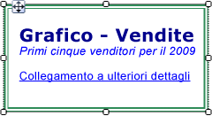
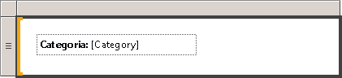

# Formattazione di testo e segnaposto (Generatore report e SSRS)
  Una casella di testo può essere un elemento del report o una cella singola all'interno di un'area dati contenente testo, un campo calcolato, un indicatore di misura a un campo in un database o una combinazione di questi tre elementi. È possibile combinare tipi di carattere e colori, aggiungere grassetto e corsivo e utilizzare stili di paragrafo, quali allineamento e rientri sporgenti. È possibile formattare un'intera casella di testo oppure testo, numeri, espressioni o campi specifici all'interno della casella.  
  
 La leggibilità di un report è data dalla combinazione di tipo di carattere, dimensione, colore ed effetti. Al testo contenuto in una casella di testo o in un'area dati è possibile applicare tipo di carattere, stile e dimensioni del carattere ed effetto sottolineato. Per impostazione predefinita, il tipo di carattere del report utilizzato è Arial, 10 punti, nero. Nelle finestre di dialogo **Casella di testo** e **Proprietà testo** è possibile specificare l'aspetto del testo quando viene visualizzato il report.  
  
   
  
 In questa illustrazione la casella di testo dispone di un bordo e tutto il testo è presente nella stessa casella, sebbene con formattazioni diverse.  
  
 Per iniziare rapidamente, vedere [Esercitazione: formattazione di testo &#40;Generatore report&#41;](../../reporting-services/tutorial-format-text-report-builder.md).  
  
> [!NOTE]  
>  [!INCLUDE[ssRBRDDup](../../includes/ssrbrddup-md.md)]  
  
## Creazione di testo segnaposto in una casella di testo  
 Quando in una casella di testo viene definita un'espressione semplice o complessa, la rappresentazione risultante nell'interfaccia utente viene definita *segnaposto*. È possibile definire colore, tipo di carattere, azioni e altri comportamenti per un numero qualsiasi di segnaposto o sezioni di testo all'interno di una singola casella di testo.  
  
 Il valore di un segnaposto è sempre un'espressione semplice o complessa. È possibile aggiungere un segnaposto a una casella di testo creando un'espressione mediante uno dei metodi seguenti:  
  
-   Trascinare un campo dal riquadro **Dati report** e rilasciarlo nella casella di testo. Se si trascina l'espressione in un punto diverso del corpo del report, verrà creata una nuova casella di testo contenente il segnaposto. Il valore di questo segnaposto sarà l'espressione del campo che corrisponde al campo rilasciato.  
  
-   Fare clic con il pulsante destro del mouse in un punto qualsiasi all'interno della casella di testo e scegliere **Inserisci segnaposto**. Nella finestra di dialogo **Proprietà segnaposto** è possibile specificare un'espressione come valore del segnaposto. Per altre informazioni, vedere [Finestra di dialogo Proprietà segnaposto, Generale &#40;Generatore report e SSRS&#41;](../Topic/Placeholder%20Properties%20Dialog%20Box,%20General%20\(Report%20Builder%20and%20SSRS\).md).  
  
-   Digitare un'espressione semplice o complessa nella casella di testo. Se, ad esempio, nella casella di testo si digita **Name: [Nome]**, il testo **[Nome]** verrà visualizzato come segnaposto tramite cui viene rappresentata l'espressione `=Fields!Name.Value`.  
  
-   Digitare un'espressione in una casella di testo vuota inserendo come primo carattere un segno di uguale (=). Quando si rende inattiva la casella di testo, l'espressione risultante viene convertita in un segnaposto modificabile. Se la casella di testo non è vuota, o il segno di uguale non è stato inserito come primo carattere, questo viene considerato come valore letterale stringa e il segnaposto non viene creato. Per altre informazioni sulla definizione di espressioni semplici e complesse, vedere [Utilizzo delle espressioni nei report &#40;Generatore report e SSRS&#41;](../../reporting-services/report-design/expression-uses-in-reports-report-builder-and-ssrs.md).  
  
## Formattazione di segnaposto e testo statico in una casella di testo  
 È possibile formattare i segnaposto usando la finestra di dialogo **Proprietà segnaposto**. Si può formattare solo l'intero segnaposto, non sezioni dello stesso. È possibile vedere l'espressione sottostante tenendo fermo il puntatore sul segnaposto per alcuni secondi. L'espressione sottostante può essere modificata facendo doppio clic sul segnaposto oppure facendo clic con il pulsante destro del mouse sul segnaposto e scegliendo **Proprietà segnaposto**. È inoltre possibile specificare un'etichetta dell'interfaccia utente usando la proprietà **Label** nell'opzione **Generale** della finestra di dialogo **Proprietà segnaposto**. L'etichetta specificata costituirà il testo che viene mostrato in fase di progettazione per il segnaposto.  
  
   
  
 In questa illustrazione, in una casella di testo di un elenco sono contenuti sia un'etichetta con formattazione in grassetto sia un segnaposto senza formattazione.  
  
 A differenza del testo del segnaposto, è possibile allineare separatamente il testo singolo in una casella di testo, utilizzare più paragrafi all'interno di un'unica casella di testo e definire altri comportamenti per qualsiasi subset di testo.  
  
 È possibile definire colore, tipo di carattere, azioni e altri comportamenti per qualsiasi subset di testo all'interno di una singola casella di testo per creare una stampa unione o un modello per il testo del report. È inoltre possibile utilizzare più paragrafi in un'unica casella di testo. Se ad esempio sono presenti due paragrafi di testo separati, è possibile separare i paragrafi premendo INVIO nella casella di testo. È inoltre possibile impostare un valore di allineamento per qualsiasi stringa singola di testo. Si può anche definire un'azione per il testo singolo di una casella di testo. Questa opportunità può risultare utile se si desidera aggiungere un collegamento ipertestuale per una stringa di testo contenuta in una casella di testo.  
  
> [!NOTE]  
>  Le azioni definite per la casella di testo hanno la priorità rispetto alle azioni definite per il singolo testo di una relativa casella.  
  
 Per altre informazioni, vedere [Formattare il testo in una casella di testo &#40;Generatore report e SSRS&#41;](../../reporting-services/report-design/format-text-in-a-text-box-report-builder-and-ssrs.md).  
  
## Allineamento orizzontale del testo mediante l'opzione Generale  
 Nell'opzione **Allineamento** della finestra di dialogo **Proprietà casella di testo** è possibile specificare la modalità di allineamento orizzontale del testo. Se non si specifica un valore per l'allineamento, il valore predefinito sarà **Predefinito**, ovvero il testo verrà allineato in base al tipo di campo del valore del segnaposto. Se si specifica un'espressione che restituisce un valore non stringa, ovvero non un numero, il testo verrà allineato a destra. Se l'espressione restituisce un valore stringa, ad esempio un numero, il testo verrà allineato a sinistra.  
  
## Vedere anche  
 [Espressioni &#40;Generatore report e SSRS&#41;](../../reporting-services/report-design/expressions-report-builder-and-ssrs.md)   
 [Formattazione delle etichette degli assi in un grafico &#40;Generatore report e SSRS&#41;](../../reporting-services/report-design/formatting-axis-labels-on-a-chart-report-builder-and-ssrs.md)   
 [Formattazione di scale su un misuratore &#40;Generatore report e SSRS&#41;](../../reporting-services/report-design/formatting-scales-on-a-gauge-report-builder-and-ssrs.md)   
 [Tabelle, matrici ed elenchi &#40;Generatore report e SSRS&#41;](../../reporting-services/report-design/tables-matrices-and-lists-report-builder-and-ssrs.md)   
 [Finestra di dialogo Proprietà segnaposto, Generale &#40;Generatore report e SSRS&#41;](../Topic/Placeholder%20Properties%20Dialog%20Box,%20General%20\(Report%20Builder%20and%20SSRS\).md)   
 [Esportazione in Microsoft Excel &#40;Generatore report e SSRS&#41;](../../reporting-services/report-builder/exporting-to-microsoft-excel-report-builder-and-ssrs.md)   
 [Caselle di testo &#40;Generatore report e SSRS&#41;](../../reporting-services/report-design/text-boxes-report-builder-and-ssrs.md)  
  
  