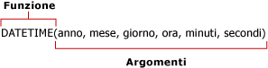

# Formule nelle query del modello di report (Generatore report e SSRS)
  Le formule sono calcoli eseguiti su valori in un report che utilizzano un modello di report come origine dati. Le formule vengono definite nella finestra di dialogo **Definisci formula** in Progettazione query modelli di report quando si definisce una query per un'origine dati dei modelli di report. Una formula può includere funzioni, operatori, costanti e riferimenti a campi oppure entità. Le formule consentono di combinare, aggregare, filtrare e restituire dati sia numerici sia di testo. È possibile creare formule e salvarle come nuovi campi oppure modificare quelle esistenti.  
  
 Le formule non sono espressioni RDL e non iniziano con un segno di uguale (=). Per altre informazioni sulle espressioni RDL, vedere [Espressioni &#40;Generatore report e SSRS&#41;](../../reporting-services/report-design/expressions-report-builder-and-ssrs.md).  
  
 L'aspetto delle formule può essere simile a quanto segue:  
  
-   **Sum Line Total**  
  
-   6+12  
  
-   **SUM**(**IF**(**Finished Goods Flag**, "Finished", "Unfinished"))  
  
> [!NOTE]  
>  [!INCLUDE[ssRBRDDup](../../includes/ssrbrddup-md.md)]  
  
## Riferimenti  
 Si tratta del nome di un campo. Il riferimento può corrispondere al nome di un campo esistente all'interno dell'entità oppure al nome di un campo calcolato creato e aggiunto all'elenco Campi. In Generatore report il riferimento indica la posizione in cui cercare i valori o i dati che si desidera utilizzare nella formula. In una formula è possibile fare riferimento a campi nell'entità di contesto e a campi di altre entità oppure è possibile utilizzare il valore corrispondente a un determinato campo in più formule.  
  
 Quando si utilizzano i riferimenti, l'elaboratore di report esegue la formula su ogni valore incluso nel campo. Ad esempio, si supponga che un campo contenga il totale delle vendite su base annua relativamente agli ultimi cinque anni. Nel campo sono quindi presenti cinque valori, ognuno corrispondente al totale delle vendite di un anno specifico. Se la formula contiene un riferimento a tale campo, ai fini del calcolo del nuovo valore viene utilizzato ogni singolo valore.  
  
## Operatori  
 Gli operatori consentono di specificare il tipo di calcolo che si desidera eseguire sui valori di una formula. Vi sono tre tipi diversi di operatori di calcolo, ovvero aritmetici, di confronto e di testo. Gli operatori vengono indicati tramite simboli, ad esempio il segno di addizione (+).  
  
 **Operatori aritmetici.** Gli operatori aritmetici consentono di eseguire operazioni matematiche semplici, ad esempio l'addizione, la sottrazione o la moltiplicazione, nonché di combinare e restituire valori numerici.  
  
 **Operatori di confronto.** Questo tipo di operatori consente di confrontare due valori. Quando vengono messi a confronto due valori tramite questi operatori, il risultato corrisponde a un valore logico, ovvero TRUE o FALSE.  
  
 **Operatore di concatenazione del testo.** Utilizzare la e commerciale (&) per unire, o concatenare, una o più stringhe di testo al fine di restituire un'unica stringa.  
  
##   Costanti  
 Si tratta di valori che non vengono calcolati e che pertanto non cambiano. In Generatore report vengono usate le costanti seguenti: **True**, **False** ed **Empty**. Tali costanti vengono utilizzate per valutare i campi booleani. Ad esempio, si supponga di disporre di un campo denominato IsDiscontinued. Gli unici valori validi per questo campo sono True, False o Empty (" ").  
  
##   Funzioni  
 Si tratta di formule predefinite che consentono di eseguire calcoli usando valori specifici, denominati *argomenti*, in un ordine stabilito. Gli argomenti possono essere valori letterali o campi oppure combinazioni dei due. Quando si utilizzano i campi nelle formule, il nome rappresenta ogni istanza del campo. Se l'argomento è un valore letterale, potrebbe essere necessario indicare i caratteri che vengono utilizzati.  
  
 Le funzioni possono essere utilizzate per eseguire calcoli semplici o complessi. La struttura di una funzione inizia con il nome della funzione, seguito da una parentesi di apertura, dagli argomenti per la funzione separati da virgole e da una parentesi di chiusura.  
  
   
  
 Gli argomenti possono essere riferimenti a campi, numeri, testo e valori logici come **TRUE** o **FALSE**. Gli argomenti possono inoltre essere costanti, formule oppure altre funzioni. Gli argomenti immessi devono generare un valore valido per l'argomento. Ad esempio, se la formula consiste nella moltiplicazione di due numeri interi, il risultato non può essere una stringa di testo.  
  
 In Generatore report sono disponibili le seguenti nove categorie di funzioni di utilizzo comune:  
  
|||  
|-|-|  
|Funzioni di aggregazione|**AVG**, **COUNT**, **COUNTDISTINCT**, **MAX**, **MIN**, **STDEV**, **STDEVP**, **SUM**, **VAR**, **VARP**|  
|Funzioni condizionali|**IF**, **IN**, **SWITCH**|  
|Funzioni di conversione|**INT**, **DECIMAL**, **FLOAT**, **TEXT**|  
|Funzioni di data e ora|**DATE**, **DATEADD**, **DATEDIFF**, **DATETIME**, **DATEONLY**, **DAY**, **DAYOFWEEK**, **DAYOFYEAR**, **HOUR**, **MINUTE**, **MONTH**, **NOW**, **QUARTER**, **SECOND**, **TIMEONLY**, **TODAY**, **WEEK**, **YEAR**|  
|Funzioni informative|**GETUSERCULTURE**, **GETUSERID**|  
|Funzioni logiche|**AND**, **NOT**, **OR**|  
|Funzioni matematiche|**MOD**, **ROUND**, **TRUNC**|  
|Operatori|Addizione (+), divisione (/), uguale a (=), elevamento a potenza (^), maggiore di (>), maggiore o uguale a (>=), minore di (<), minore o uguale a (<=), moltiplicazione (*), negazione (-), diverso da (<>), sottrazione (-)|  
|Funzioni di testo|**CONCAT**, **FIND**, **LEFT**, **LENGTH**, **LOWER**, **LTRIM**, **REPLACE**, **RIGHT**, **RTRIM**, **SUBSTRING**, **UPPER**|  
  
  