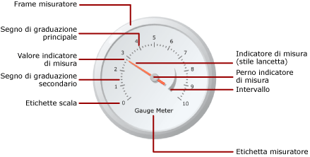

# Misuratori (Generatore report e SSRS)
  Nei report impaginati di [!INCLUDE[ssRSnoversion_md](../../includes/ssrsnoversion-md.md)] , in un'area dati del misuratore viene visualizzato un unico valore del set di dati. Un misuratore viene sempre posizionato in un pannello del misuratore, dove è possibile aggiungere misuratori figlio o adiacenti. In un singolo pannello del misuratore è possibile creare più misuratori che condividono funzioni comuni quali il filtraggio, il raggruppamento o l'ordinamento.  
  
 È possibile usare i misuratori per eseguire diverse attività in un report:  
  
-   Visualizzare gli indicatori di prestazioni chiave (KPI) in un solo misuratore radiale o lineare.  
  
-   Posizionare un misuratore in una tabella o una matrice per mostrare i valori di ogni cella.  
  
-   Usare più misuratori in un solo pannello del misuratore per confrontare i dati dei diversi campi.  
  
 Sono disponibili due tipi di misuratore: radiale e lineare. Nell'illustrazione seguente vengono mostrati gli elementi di base di un singolo misuratore radiale nel pannello del misuratore.  
  
   
  
 Per altre informazioni sull'uso dei misuratori come KPI, vedere [Esercitazione: Aggiunta di un indicatore di prestazioni chiave al report &#40;Generatore report&#41;](../../reporting-services/tutorial-adding-a-kpi-to-your-report-report-builder.md).  
  
> [!NOTE]  
>  È possibile pubblicare misuratori separatamente da un report come parti del report. Altre informazioni su [Parti del report](../../reporting-services/report-design/report-parts-report-builder-and-ssrs.md).  
  
##   Tipi di misuratore  
 [!INCLUDE[ssRSnoversion](../../includes/ssrsnoversion-md.md)] sono disponibili due tipi di misuratore, ovvero radiale e lineare. Il misuratore radiale viene usato in genere quando si desidera esprimere i dati come velocità. Il misuratore lineare viene invece usato per esprimere i dati come temperatura o valore della scala.  
  
 Le differenze principali tra i due tipi sono la forma complessiva del misuratore e i relativi indicatori di misura disponibili. I misuratori radiali sono circolari, o gradi di cerchio, e sono simili ai tachimetri. Gli indicatori di misura del misuratore spesso sono lancette, ma possono essere marcatori o barre.  
  
 I misuratori lineari sono rettangolari, orientati orizzontalmente o verticalmente, e sono simili a righelli. Gli indicatori di misura del misuratore spesso sono di tipo termometro, ma possono essere marcatori o barre. Per la forma, questo tipo di misuratore risulta utile per l'integrazione nelle aree dati tabella o matrice per la visualizzazione di dati sullo stato di avanzamento.  
  
 Eccetto che per queste differenze, i due tipi di misuratore sono intercambiabili. Tuttavia, se è necessario usare un misuratore semplice nel report, provare a usare un indicatore anziché un misuratore. Per altre informazioni, vedere [Indicatori &#40;Generatore report e SSRS&#41;](../../reporting-services/report-design/indicators-report-builder-and-ssrs.md).  
  
 Nelle illustrazioni seguenti vengono mostrati i misuratori radiali e lineari. Il misuratore radiale è rotondo e dispone dell'indicatore di misura a lancetta. Il misuratore lineare è orizzontale e dispone dell'indicatore di misura di tipo termometro.  
  
 **Misuratore radiale**  
  
   
  
 Opzioni del misuratore radiale: Radiale, Radiale con minimisuratore, Due scale, 90 gradi nord-est, 90 gradi nord-ovest, 90 gradi sud-ovest, 90 gradi sud-est, 180 gradi a nord, 180 gradi a sud, 180 gradi a ovest, 180 gradi a est e Misuratore.  
  
 **Misuratore lineare**  
  
   
  
 Opzioni del misuratore lineare: Orizzontale, Verticale, Più indicatori di misura a barre, Due scale, Intervallo a tre colori, Logaritmico, Termometro, Termometro Fahrenheit/Celcius e Grafico bullet.  
  
##   Aggiunta di dati a un misuratore  
 Dopo avere aggiunto un misuratore all'area di progettazione, trascinare un campo del set di dati nel riquadro dei dati del misuratore. I valori del campo vengono tutti aggregati per impostazione predefinita a un unico valore visualizzato sul misuratore. Tale valore è collegato all'indicatore di misura tramite la proprietà Value. A seconda del tipo di dati del campo, nel misuratore viene usata l'aggregazione SUM o COUNT. Quando si usano dati numerici, appropriati per l'aggiunta, nel misuratore viene usata la funzione SUM. In caso contrario, viene usata l'aggregazione COUNT. Il valore dell'indicatore di misura può usare un'aggregazione diversa o nessuna aggregazione.  
  
 Per visualizzare gruppi singoli o righe singole sul misuratore, è possibile aggiungere raggruppamenti. Quando vengono applicati il raggruppamento e il filtro, viene usato il valore dell'indicatore di misura per visualizzare l'ultimo gruppo o l'ultima riga nel set di dati restituito.  
  
 È possibile aggiungere più valori a un misuratore singolo aggiungendo un altro indicatore di misura che può appartenere alla stessa scala. In alternativa, è possibile aggiungere un'altra scala alla quale associarla.  
  
 A differenza dei tipi di grafico disponibili nella finestra di dialogo **Seleziona tipo di grafico** , i tipi di misuratore presenti nella finestra di dialogo **Seleziona tipo di misuratore** vengono creati tramite una combinazione delle proprietà del misuratore. Pertanto, non è possibile modificare il tipo di misuratore usando la stessa procedura impiegata per un tipo di grafico. Per modificare il tipo di misuratore, è necessario rimuovere il misuratore e aggiungerlo nuovamente all'area di progettazione. Un misuratore presenta almeno una scala e un indicatore di misura. Per ottenere più scale, fare clic con il pulsante destro del mouse sul misuratore e scegliere **Aggiungi scala**. Per impostazione predefinita, viene creata una scala di dimensioni inferiori all'interno della prima. La scala consente di visualizzare etichette e segni di graduazione. Esistono due set di segni di graduazione, ovvero principali e secondari.  
  
 Per ottenere più indicatori di misura, fare clic con il pulsante destro del mouse sul misuratore e scegliere **Aggiungi indicatore di misura**. Verrà creato un altro indicatore di misura sulla stessa scala, ma se sono disponibili più scale, sarà possibile associare un indicatore di misura a qualsiasi scala sul misuratore.  
  
### Considerazioni in caso di aggiunta di dati al misuratore  
 Come tutte le altre aree dati, l'area dati del misuratore può essere associata a un solo set di dati. Se sono presenti più set di dati, usare un'operazione JOIN o UNION per creare un solo set di dati oppure usare misuratori separati per ogni set di dati.  
  
 I tipi di dati numerici vengono aggregati con la funzione SUM. I tipi di dati non numerici vengono aggregati con la funzione COUNT che consente di calcolare il numero di istanze per un valore o un campo specifico all'interno del set di dati o del gruppo.  
  
 Dopo che sono stati aggiunti i dati, facendo clic con il pulsante destro del mouse sull'indicatore di misura, vengono visualizzate le opzioni Cancella valore indicatore di misura ed Elimina indicatore di misura. L'opzione Cancella valore indicatore di misura consente di rimuovere il campo associato al misuratore lasciando comunque visualizzato l'indicatore di misura. L'opzione Elimina indicatore di misura consente di rimuovere il campo dal misuratore eliminando anche l'indicatore di misura. Se si riaggiunge un campo al misuratore, verrà nuovamente visualizzato l'indicatore di misura predefinito. Dopo avere aggiunto il campo al misuratore, è necessario impostare i valori minimo e massimo sulla scala corrispondente per fornire contesto al valore sul misuratore. È inoltre possibile impostare i valori minimo e massimo su un intervallo per mostrare un'area critica sulla scala. I valori minimo e massimo sulla scala o su un intervallo non possono essere impostati automaticamente dal misuratore, in quanto è l'utente che deve determinare come questi devono essere interpretati.  
  
### Metodi di aggiunta di dati a un misuratore  
 Dopo aver definito un set di dati per il report, è possibile aggiungere un campo dati al misuratore in uno dei modi seguenti:  
  
-   Trascinare un campo dal set di dati nel riquadro dei dati. Fare clic sul misuratore e trascinarvi un campo. È possibile aprire il riquadro dei dati facendo clic sul misuratore o trascinando un campo nel misuratore. Se non è già presente, l'indicatore di misura viene aggiunto al misuratore e associato al campo aggiunto.  
  
-   Visualizzare il riquadro dei dati e selezionare il segnaposto del campo. Fare clic sulla freccia in giù accanto al segnaposto del campo e selezionare il campo che si desidera usare. Se è già selezionato un campo, fare clic sulla freccia in giù e selezionare un campo diverso.  
  
    > [!NOTE]  
    >  Questo metodo non è applicabile quando sul misuratore non è presente un indicatore di misura o quando il report contiene più di un set di dati e il pannello del misuratore non è associato a un set di dati.  
  
-   Fare clic con il pulsante destro del mouse sull'indicatore di misura del misuratore e scegliere **Proprietà indicatore di misura**. In **Valore**selezionare un campo nell'elenco a discesa o definire un'espressione campo facendo clic sul pulsante **Espressione** (*fx*).  
  
### Aggregazione di campi in un solo valore  
 Quando viene aggiunto un campo a un misuratore, in [!INCLUDE[ssRSnoversion](../../includes/ssrsnoversion-md.md)] per impostazione predefinita viene calcolata un'aggregazione per il campo. I tipi di dati numerici vengono aggregati con la funzione SUM. I tipi di dati non numerici vengono aggregati con la funzione COUNT che consente di calcolare il numero di istanze per un valore o un campo specifico all'interno del set di dati o del gruppo. Se il tipo di dati del campo valori è String, non sarà possibile visualizzare un valore numerico, neanche se nei campi sono presenti numeri. I campi stringa vengono invece aggregati usando la funzione COUNT. Per evitare questo comportamento, assicurarsi che i campi usati includano tipi di dati numerici anziché stringhe con numeri formattati. È possibile specificare un'espressione di Visual Basic per convertire i valori String in un tipo di dati numerici usando la costante CDbl o la costante CInt. L'espressione seguente, ad esempio, converte un campo stringa chiamato MyField in valori numerici.  
  
 `=Sum(CDbl(Fields!MyField.Value))`  
  
 Per altre informazioni sulle espressioni di aggregazione, vedere [Riferimento a funzioni di aggregazione &#40;Generatore report e SSRS&#41;](../../reporting-services/report-design/report-builder-functions-aggregate-functions-reference.md).  
  
### Definizione di un gruppo su un misuratore  
 Dopo avere aggiunto un campo al misuratore, è possibile aggiungere un gruppo di dati. Il misuratore differisce da tutte le altre aree dati di [!INCLUDE[ssRSnoversion](../../includes/ssrsnoversion-md.md)], in quanto consente di visualizzare più gruppi in un'unica area dati. Aggiungere un gruppo mediante la definizione di un'espressione di raggruppamento sul misuratore equivale ad aggiungere un gruppo di righe nell'area dati Tablix. Quando tuttavia viene aggiunto il gruppo, viene visualizzato solo il valore dell'ultimo gruppo come valore dell'indicatore di misura sul misuratore. Se ad esempio si aggiunge un'espressione di raggruppamento relativa all'anno, l'indicatore di misura punterà al valore aggregato relativo alle vendite dell'ultimo anno nel set di dati. Per altre informazioni sui gruppi, vedere [Informazioni sui gruppi &#40;Generatore report e SSRS&#41;](../../reporting-services/report-design/understanding-groups-report-builder-and-ssrs.md).  
  
 Potrebbe essere necessario aggiungere un gruppo al misuratore se, ad esempio, si visualizzano più misuratori in una tabella o in un elenco e si desidera visualizzare i dati aggregati per gruppo. Per altre informazioni, vedere [Aggiunta o eliminazione di un gruppo in un'area dati &#40;Generatore report e SSRS&#41;](../../reporting-services/report-design/add-or-delete-a-group-in-a-data-region-report-builder-and-ssrs.md).  
  
##   Posizionamento di elementi in un misuratore  
 Il pannello del misuratore è il contenitore di livello superiore in cui sono presenti uno o più misuratori. È possibile visualizzare la finestra di dialogo **Proprietà pannello del misuratore** facendo clic all'esterno del misuratore. Ogni misuratore, a sua volta, contiene diversi elementi, ovvero una scala del misuratore, un intervallo del misuratore e un indicatore di misura del misuratore. Per usare il misuratore, è necessario comprendere le modalità di misurazione degli elementi contenuti nel pannello del misuratore per poterne modificare le dimensioni e la posizione.  
  
### Informazioni sulle misure di dimensioni e posizione  
 Tutte le misure relative a dimensioni e posizione sul misuratore vengono calcolate come percentuale del relativo elemento padre. Quando gli elementi padre presentano valori di larghezza e altezza differenti, le dimensioni dell'elemento del misuratore vengono calcolate come percentuale del più piccolo dei due valori. Su un misuratore lineare, ad esempio, tutte le misure relative agli indicatori di misura vengono calcolate come percentuale della larghezza o dell'altezza del misuratore lineare, a seconda del valore più piccolo.  
  
 Anche le misure relative alla posizione vengono calcolate come percentuale del relativo elemento padre usando un sistema di coordinate. L'origine di questo sistema di coordinate è nell'angolo superiore sinistro con l'asse X che punta verso destra e l'asse Y che punta verso il basso. I valori della coordinate devono essere compresi tra 0 e 100 e tutte le misure vengono rappresentate come percentuale. Quando, ad esempio, le posizioni X e Y del misuratore lineare vengono impostate su 50 e 50, il misuratore lineare viene posizionato al centro del pannello del misuratore.  
  
### Posizionamento di più misuratori all'interno del pannello del misuratore  
 Sono disponibili due diverse procedure per l'aggiunta di un nuovo misuratore a un pannello del misuratore che ne contiene già uno. È possibile aggiungere un misuratore come elemento figlio del primo o aggiungere un altro misuratore adiacente al primo.  
  
 Quando un nuovo misuratore viene aggiunto a un pannello del misuratore, viene ridimensionato e posizionato in maniera esattamente proporzionale a tutti gli altri misuratori del pannello. Se, ad esempio, si aggiunge un misuratore radiale a un pannello del misuratore che già ne contiene uno, i due misuratori verranno ridimensionati automaticamente in modo da occupare ciascuno esattamente metà del pannello.  
  
 È possibile aggiungere un nuovo misuratore a un pannello del misuratore che ne contiene già uno. A tale scopo, fare clic con il pulsante destro del mouse in un punto qualsiasi nel pannello del misuratore, passare con il puntatore del mouse su **Aggiungi nuovo misuratore** e scegliere **Figlio**. Verrà visualizzata la finestra di dialogo **Seleziona tipo di misuratore** . Per aggiungere il nuovo misuratore come elemento figlio è possibile procedere in due modi differenti. In un misuratore radiale il misuratore figlio viene posizionato nell'angolo superiore sinistro del primo misuratore. In un misuratore lineare il misuratore figlio viene posizionato al centro del primo misuratore. È possibile posizionare il misuratore figlio rispetto al misuratore padre, usando le proprietà Posizione. Come per tutti gli altri elementi, le misure relative alla posizione vengono calcolate come percentuale del relativo elemento padre.  
  
### Posizionamento delle etichette della scala del misuratore e degli intervalli del misuratore  
 Sono disponibili due proprietà che determinano la posizione delle etichette su una scala del misuratore. È possibile impostare la proprietà **Posizione** per specificare se le etichette devono essere visualizzate all'interno, all'esterno o lungo la barra della scala. È anche possibile specificare un valore numerico per la proprietà **Distanza dalla scala** per indicare il numero di unità aggiunte o sottratte dalla posizione per determinare la posizione dell'etichetta. Se, ad esempio, si imposta la proprietà **Posizione** su **Esterno** e la proprietà **Distanza dalla scala** è stata impostata su 10, le etichette verranno posizionate a 10 unità dal bordo esterno della scala del misuratore, dove 1 unità corrisponde a:  
  
-   1% del diametro del misuratore su un misuratore radiale oppure  
  
-   1% del valore più basso dell'altezza o della larghezza del misuratore su un misuratore lineare.  
  
 Le proprietà **Posizione** e **Distanza dalla scala** si applicano anche agli intervalli del misuratore.  
  
### Conservazione delle proporzioni su un misuratore lineare  
 Il misuratore radiale presuppone l'uso di un form circolare e pertanto gestisce di solito valori di larghezza e di altezza identici. Tuttavia, su un misuratore lineare che presuppone un form rettangolare, la proporzione tra larghezza e altezza generalmente non è uniforme. La proporzione di un misuratore determina la proporzione della larghezza rispetto all'altezza che è necessario mantenere quando si ridimensiona il misuratore. Se, ad esempio, questo valore viene impostato su 2, la larghezza del misuratore sarà sempre pari a due volte l'altezza del misuratore, indipendentemente dal ridimensionamento applicato al misuratore. Per impostare la proporzione, è possibile impostare la proprietà AspectRatio dalla finestra di dialogo **Proprietà misuratore lineare** .  
  
##   Procedure  
 In questa sezione vengono elencate le procedure che illustrano in modo dettagliato come usare i misuratori nei report, come ottenere i dati da visualizzare in modo efficiente nei misuratori e come aggiungere e configurare i misuratori e i relativi elementi.  
  
-   [Aggiungere un misuratore a un report &#40;Generatore report e SSRS&#41;](../../reporting-services/report-design/add-a-gauge-to-a-report-report-builder-and-ssrs.md)  
  
-   [Impostare un valore minimo o massimo su un misuratore &#40;Generatore report e SSRS&#41;](../../reporting-services/report-design/set-a-minimum-or-maximum-on-a-gauge-report-builder-and-ssrs.md)  
  
-   [Impostazione di un intervallo di blocco su un misuratore (Generatore report e SSRS)](http://msdn.microsoft.com/en-us/0ece7297-6e2f-47fb-835d-b9e9cce53fe2)  
  
-   [Specificare un'immagine come indicatore di misura su un misuratore (Generatore report e SSRS)](http://msdn.microsoft.com/en-us/9d73b3c3-a068-4868-a2be-0cd261b6e92b)  
  
##   Contenuto della sezione  
 Negli argomenti seguenti sono disponibili ulteriori informazioni sull'utilizzo dei misuratori.  
  
|||  
|-|-|  
|Nome|Definizione|  
|[Formattazione di scale su un misuratore &#40;Generatore report e SSRSSSRS&#41;](../../reporting-services/report-design/formatting-scales-on-a-gauge-report-builder-and-ssrs.md)|Vengono fornite informazioni generali sulla formattazione delle scale dei misuratori e informazioni dettagliate sulle opzioni di formattazione per le scale dei misuratori radiali e lineari.|  
|[Formattazione degli indicatori di misura su un misuratore &#40;Generatore report e SSRS&#41;](../../reporting-services/report-design/formatting-pointers-on-a-gauge-report-builder-and-ssrs.md)|Vengono fornite informazioni generali sulla formattazione degli indicatori di misura dei misuratori e informazioni dettagliate sulle opzioni di formattazione per gli stili degli indicatori di misura dei misuratori radiali e lineari.|  
|[Formatting Ranges on a Gauge &#40;Report Builder and SSRS&#41; (Formattazione di intervalli su un misuratore &#40;Generatore report e SSRS&#41;)](../../reporting-services/report-design/formatting-ranges-on-a-gauge-report-builder-and-ssrs.md)|Vengono fornite informazioni sulla formattazione degli intervalli dei misuratori per indicare un'importante sottosezione di valori del misuratore o per indicare visivamente quando il valore dell'indicatore di misura rientra in un determinato intervallo di valori.|  
  
## Vedere anche  
 [Espressioni &#40;Generatore report e SSRS&#41;](../../reporting-services/report-design/expressions-report-builder-and-ssrs.md)   
 [Filtro, raggruppamento e ordinamento di dati &#40;Generatore report e SSRS&#41;](../../reporting-services/report-design/filter-group-and-sort-data-report-builder-and-ssrs.md)   
 [Parametri report &#40;Generatore report e Progettazione report&#41;](../../reporting-services/report-design/report-parameters-report-builder-and-report-designer.md)   
 [Grafici &#40;Generatore report e SSRS&#41;](../../reporting-services/report-design/charts-report-builder-and-ssrs.md)   
 [Tabelle, matrici ed elenchi &#40;Generatore report e SSRS&#41;](../../reporting-services/report-design/tables-matrices-and-lists-report-builder-and-ssrs.md)  
  
  
