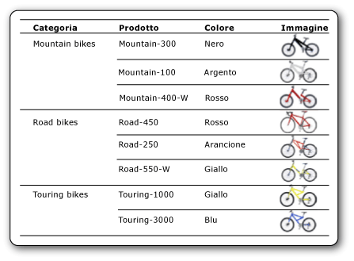

# Immagini (Generatore report e SSRS)
  Un'immagine è un elemento del report in cui è incluso un riferimento a un'immagine incorporata nel report o archiviata in un database, nel server di report o in un'altra posizione nel Web. Un'immagine può essere rappresentata da un'immagine ripetuta con le righe di dati. Inoltre è possibile utilizzare un'immagine come sfondo per determinati elementi del report.  
  
 È opportuno archiviare i loghi in un server dal momento che è possibile utilizzare lo stesso logo in più report.  
  
> [!NOTE]  
>  [!INCLUDE[ssRBRDDup](../../includes/ssrbrddup-md.md)]  
  
##   Confronto fra immagini esterne, incorporate e associate a dati  
 Quando in un report si utilizza un'immagine basata su server o un'altra immagine esterna, l'elemento immagine include un percorso che punta a un'immagine nel server di report o nel Web. Quando si utilizza un'immagine incorporata, tuttavia, i dati dell'immagine vengono archiviati all'interno della definizione del report e non esistono come file separato.  
  
 Le immagini basate su server sono particolarmente adatte per immagini statiche e logo condivisi tra più report o pagine Web. Le immagini incorporate assicurano che le immagini siano sempre disponibili per il report, ma non è possibile condividerle. Le dimensioni delle definizioni di report con immagini esterne sono inferiori a quelle delle definizioni con immagini incorporate.  
  
 È inoltre possibile visualizzare le immagini associate a dati da dati binari archiviati in un database. Le immagini visualizzate insieme ai nomi di prodotti in un catalogo, ad esempio, sono immagini di database. Nell'immagine seguente, le immagini di biciclette vengono archiviate in un database e recuperate nel report per illustrare ogni prodotto.  
  
   
  
  
##   Immagini come parti del report  
 È possibile salvare immagini separatamente da un report come parti del report. [!INCLUDE[ssRBrptparts](../../includes/ssrbrptparts-md.md)]  
  
  
##   Incorporamento di immagini  
 È possibile incorporare immagini in un report in modo che tutti i dati delle immagini vengano archiviati all'interno della definizione del report. Quando si incorpora un'immagine, all'immagine viene applicata la codifica MIME e viene archiviata come testo nella definizione del report. L'utilizzo di un'immagine incorporata assicura che l'immagine sia sempre disponibile per il report, ma comporta anche un aumento delle dimensioni della definizione del report.  
  
 Per altre informazioni sull'incorporamento di un'immagine, vedere [Incorporare un'immagine in un report &#40;Generatore report e SSRS&#41;](../../reporting-services/report-design/embed-an-image-in-a-report-report-builder-and-ssrs.md).  
  
  
##   Immagini esterne  
 È possibile includere in un report immagini archiviate specificando l'URL dell'immagine. Quando si usa un'immagine esterna, l'origine di tale immagine viene impostata su **External** e il valore corrisponde all'indirizzo URL o al percorso all'immagine stessa.  
  
 Per altre informazioni, vedere [Specifica di percorsi di elementi esterni &#40;Generatore report e SSRS&#41;](../../reporting-services/report-design/specifying-paths-to-external-items-report-builder-and-ssrs.md).  
  
 Quando il report viene eseguito in Generatore report o Progettazione report, vengono utilizzate le credenziali dell'utente per visualizzare l'immagine. Quando il report viene eseguito sul server di report, è possibile che l'immagine nel report non venga visualizzata se le credenziali del server non sono sufficienti per accedere all'immagine. In tal caso, rivolgersi all'amministratore di sistema.  
  
 Per altre informazioni sull'aggiunta di un'immagine esterna a un report, vedere [Aggiungere un'immagine esterna &#40;Generatore report e SSRS&#41;](../../reporting-services/report-design/add-an-external-image-report-builder-and-ssrs.md).  
  
  
##   Immagini di sfondo  
 È possibile utilizzare un'immagine come sfondo nel corpo del report o in un rettangolo, casella di testo, elenco, matrice o tabella. Le proprietà per un'immagine di sfondo sono simili a quelle di un'immagine. È inoltre possibile specificare come deve essere ripetuta l'immagine per riempire lo sfondo dell'elemento.  
  
> [!NOTE]  
>  Alcune estensioni per il rendering, ad esempio l'estensione per il rendering HTML, visualizzano l'immagine di sfondo del corpo del report nel corpo, nell'intestazione di pagina e nel piè di pagina. È possibile definire un'immagine di sfondo diversa per l'intestazione e il piè di pagina, ma se non si definisce alcuna immagine viene utilizzata l'immagine di sfondo del corpo. Altre estensioni per il rendering, ad esempio l'estensione per il rendering delle immagini, non visualizzano l'immagine di sfondo del corpo nell'intestazione e nel piè di pagina.  
  
 Per altre informazioni sull'aggiunta di un'immagine di sfondo, vedere [Aggiungere un'immagine di sfondo &#40;Generatore report e SSRS&#41;](../../reporting-services/report-design/add-a-background-image-report-builder-and-ssrs.md).  
  
  
##   Immagini associate a dati  
 È possibile aggiungere a un report immagini archiviate in un database. L'elemento immagine del report utilizzato è identico a quello utilizzato per le immagini statiche, ma dispone di un set di proprietà che indica che l'immagine è archiviata in un database. Per visualizzare istruzioni sull'utilizzo di immagini con associazione a dati, vedere [Aggiungere un'immagine di sfondo &#40;Generatore report e SSRS&#41;](../../reporting-services/report-design/add-a-data-bound-image-report-builder-and-ssrs.md).  
  
  
##   Procedure  
 [Aggiungere un'immagine esterna &#40;Generatore report e SSRS&#41;](../../reporting-services/report-design/add-an-external-image-report-builder-and-ssrs.md)  
  
 [Incorporare un'immagine in un report &#40;Generatore report e SSRS&#41;](../../reporting-services/report-design/embed-an-image-in-a-report-report-builder-and-ssrs.md)  
  
 [Aggiungere un'immagine di sfondo &#40;Generatore report e SSRS&#41;](../../reporting-services/report-design/add-a-background-image-report-builder-and-ssrs.md)  
  
 [Aggiungere un'immagine di sfondo &#40;Generatore report e SSRS&#41;](../../reporting-services/report-design/add-a-data-bound-image-report-builder-and-ssrs.md)  
  
  
## Vedere anche  
 [Esportazione in un file di immagine &#40;Generatore report e SSRS&#41;](../../reporting-services/report-builder/exporting-to-an-image-file-report-builder-and-ssrs.md)   
 [Tipi di rendering &#40;Generatore report e SSRS&#41;](../../reporting-services/report-design/rendering-behaviors-report-builder-and-ssrs.md)  
  
  
