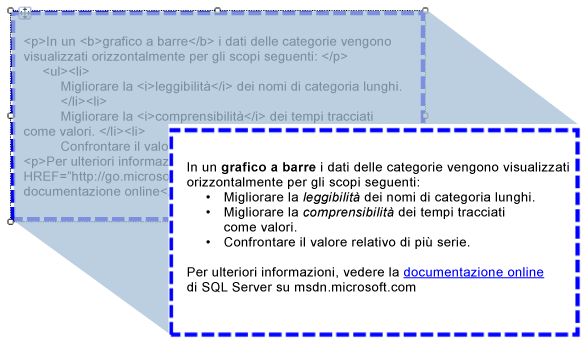

# Importazione di codice HTML a un report (Generatore report e SSRS)
  È possibile utilizzare una casella di testo per inserire in un report del testo in formato HTML recuperato da un campo nel set di dati. Il testo può provenire da qualsiasi espressione semplice o complessa che restituisce testo HTML correttamente formattato. Il testo formattato può essere visualizzato in tutti i formati di output supportati, incluso il formato PDF.  
  
   
  
 In questa illustrazione viene mostrato il testo con formattazione HTML nella visualizzazione Progettazione report e lo stesso testo come viene visualizzato all'esecuzione del report.  
  
> [!NOTE]  
>  Quando si importa testo che contiene markup HTML, i dati devono sempre essere analizzati prima dalla casella di testo. Poiché è supportato solo un subset di tag HTML, il testo HTML mostrato nel report visualizzabile potrebbe differire dal testo HTML originale.  
  
 Per iniziare rapidamente, vedere [Esercitazione: Formattazione di testo &#40;Generatore report&#41;](../../reporting-services/tutorial-format-text-report-builder.md).  
  
> [!NOTE]  
>  [!INCLUDE[ssRBRDDup](../../includes/ssrbrddup-md.md)]  
  
## Tag HTML supportati  
 Di seguito viene mostrato un elenco completo dei tag che vengono visualizzati come testo HTML se definiti come testo segnaposto:  
  
-   Collegamenti ipertestuali: \<A HREF>  
  
-   Tipi di carattere: \  
  
-   Elementi di intestazione, stile e blocco: \<H{n}>, \
, \,\
, \
, \<LI>, \<HN>  
  
-   Formato del testo: \<B>, \<I>, \<U>, \<S>  
  
-   Gestione degli elenchi: \<OL>, \<UL>, \<LI>  
  
 Qualsiasi altro tag del markup HTML verrà ignorato durante l'elaborazione del report. Se il codice HTML rappresentato dall'espressione nel testo segnaposto non è formattato in maniera corretta, il segnaposto viene visualizzato come testo normale. Per tutti i tag HTML non viene rilevata la distinzione tra maiuscole e minuscole.  
  
 Se il testo nella casella di testo contiene un solo blocco di testo, qualsiasi codice HTML presente nel segnaposto che definisce elementi del blocco verrà visualizzato correttamente. Se invece nella casella di testo sono presenti più blocchi di testo, i tag HTML vengono ignorati e la struttura del testo viene definita dai blocchi del testo.  
  
 Se per il testo è definito più di un tag e [!INCLUDE[ssRSnoversion](../../includes/ssrsnoversion-md.md)] rileva un conflitto tra il testo HTML e vincoli del report esistenti, solo il tag HTML più interno sarà trattato come HTML.  
  
 Per altre informazioni, vedere [Aggiungere codice HTML a un report &#40;Generatore report e SSRS&#41;](../../reporting-services/report-design/add-html-into-a-report-report-builder-and-ssrs.md).  
  
## Limitazioni degli attributi dei fogli di stile CSS  
 Quando si utilizzano gli attributi dei fogli di stile CSS, viene definito un solo set di tag di base. Di seguito viene presentato un elenco degli attributi supportati:  
  
-   text-align, text-indent  
  
-   font-family  
  
-   font-size  
  
    -   Sono supportati solo valori di dimensioni RDL validi, in unità di lunghezza CSS assolute. Le unità supportate sono: in, cm, mm, pt, pc.  
  
    -   Le unità di lunghezza CSS relative vengono ignorate e non sono supportate. Le unità non supportate includono em, ex, px, %, rem.  
  
     Per altre informazioni sulle unità CSS, vedere [CSS Values and Units Reference](http://msdn.microsoft.com/library/ms531211\(VS.85\).aspx) (riferimento sulle unità e i valori CSS) (http://msdn.microsoft.com/library/ms531211(VS.85).aspx).  
  
-   color  
  
-   padding, padding-bottom, padding-top, padding-right, padding-left  
  
-   font-weight  
  
 Di seguito sono indicate alcune considerazioni relative all'utilizzo dei fogli di stile CSS:  
  
-   Come accade per il codice HTML non formattato correttamente, i valori CSS in formato non valido vengono ignorati.  
  
-   Quando nello stesso tag sono presenti sia l'attributo sia gli attributi dello stile CSS, la proprietà CSS ha la precedenza. Se ad esempio il testo è **\
**, verrà applicato solo l'attributo text-align e il testo verrà allineato a destra.  
  
-   Per gli attributi e gli stili CSS, se una proprietà viene specificata più di una volta, viene applicata solo l'ultima istanza della proprietà. Se ad esempio il testo è **\
**, il testo verrà allineato a destra.  
  
## Vedere anche  
 [Rendering in formato HTML &#40;Generatore report e SSRS&#41;](../../reporting-services/report-builder/rendering-to-html-report-builder-and-ssrs.md)  
  
  
