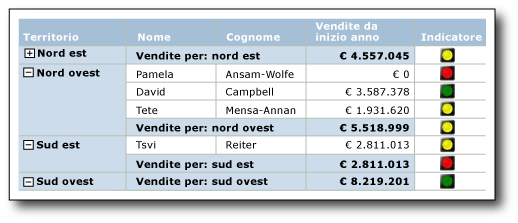
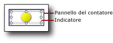
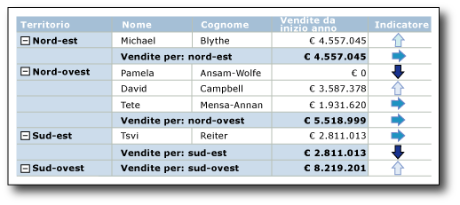

# Indicatori (Generatore report e SSRS)
  Nei report impaginati di [!INCLUDE[ssRSnoversion_md](../../includes/ssrsnoversion-md.md)] gli indicatori sono piccoli misuratori sui quali è possibile leggere immediatamente lo stato di un singolo valore di dati. Le icone che rappresentano gli indicatori e i relativi stati sono semplici e visivamente valide anche quando vengono utilizzate in dimensioni ridotte.  
  
 Gli indicatori di stato possono essere utilizzati nei report per mostrare gli elementi seguenti:  
  
-   **Tendenze** indicate dalle frecce tendenti verso l'alto, in piano (nessun cambiamento) o tendenti verso il basso.  
  
-   **Stato indicato** da simboli comunemente riconosciuti quali segni di spunta e punti esclamativi.  
  
-   **Condizioni** indicate da forme comunemente riconosciute quali semafori e segnaletica.  
  
-   **Classificazioni** indicate da forme e simboli comunemente riconosciuti che consentono di visualizzare lo stato di avanzamento, ad esempio il numero di quadranti in un quadrato e le stelle.  
  
 Gli indicatori possono essere usati da soli nei dashboard o nei report in formato libero, tuttavia vengono usati più frequentemente nelle tabelle o matrici per visualizzare i dati in righe o colonne. Nel diagramma seguente viene mostrata una tabella con un indicatore a semaforo tramite cui vengono fornite le vendite dell'anno in corso in base ai clienti e al territorio di vendita.  
   
   
  
 [!INCLUDE[ssRSnoversion](../../includes/ssrsnoversion-md.md)] include set e icone di indicatori predefiniti che possono essere usati così come sono oppure personalizzati in base alle specifiche esigenze.  
  
 Per altre informazioni sull'uso degli indicatori come KPI, vedere [Esercitazione: Aggiunta di un indicatore di prestazioni chiave al report &#40;Generatore report&#41;](../../reporting-services/tutorial-adding-a-kpi-to-your-report-report-builder.md).  
  
> [!NOTE]  
>  È possibile pubblicare indicatori separatamente da un report come parti del report. Altre informazioni sulle [Parti del report](../../reporting-services/report-design/report-parts-report-builder-and-ssrs.md).  
  
##   Confronto tra indicatori e misuratori  
 Anche se sembrano molto diversi, gli indicatori sono semplici misuratori. Sia negli indicatori sia nei misuratori viene visualizzato un solo valore di dati. La differenza principale consiste nel fatto che i misuratori dispongono di elementi quali frame e indicatori di misura, mentre gli indicatori dispongono solo di stati, icone e (facoltativamente) etichette. Gli stati degli indicatori sono simili agli intervalli dei misuratori.  
  
 Come i misuratori, gli indicatori vengono posizionati in un pannello del misuratore. Se si vuole configurare un indicatore tramite la finestra di dialogo **Proprietà indicatori** o il riquadro delle proprietà, è necessario selezionare l'indicatore invece del pannello. In caso contrario, le opzioni disponibili vengono applicate alle opzioni del pannello del misuratore e non è possibile configurare l'indicatore. Nell'immagine seguente viene mostrato un indicatore selezionato nel relativo pannello del misuratore.  
  
   
  
 A seconda della modalità con la quale si desidera raffigurare il valore di dati, i misuratori potrebbero essere più appropriati degli indicatori. Per altre informazioni, vedere [Misuratori &#40;Generatore report e SSRS&#41;](../../reporting-services/report-design/gauges-report-builder-and-ssrs.md).  
  
##   Scelta del tipo di indicatore da utilizzare  
 L'utilizzo del set di indicatori appropriato è fondamentale per comunicare immediatamente il significato dei dati, se questi ultimi si trovano in una riga di dettagli o in un gruppo di righe o di colonne di una tabella o matrice oppure da soli nel corpo del report o nel dashboard. I set di indicatori incorporati dispongono di almeno tre icone che possono variare in base alla forma, al colore o a entrambi. Tramite ogni icona viene comunicato uno stato dei dati diverso.  
  
 Nella tabella seguente vengono elencati i set di indicatori predefiniti e descritti alcuni utilizzi comuni.  
  
|Set di indicatori|Tipo di indicatore|  
|-------------------|--------------------|  
||Direzionale: vengono indicate le tendenze tramite le frecce in su, in giù, in piano (nessun cambiamento), tendenti verso l'alto o verso il basso.|  
||Simboli: vengono indicati gli stati tramite simboli comunemente riconosciuti quali segni di spunta e punti esclamativi.|  
||Forma: vengono indicate le condizioni tramite forme comunemente riconosciute quali semafori e segni a forma di rombo.|  
||Classificazioni: vengono indicate le classificazioni tramite forme e simboli comunemente riconosciuti che consentono di visualizzare i valori dello stato di avanzamento, ad esempio il numero di quadranti in un quadrato.|  
  
 Dopo aver scelto un set di indicatori, è possibile personalizzare l'aspetto di ogni icona dell'indicatore del set impostando le proprietà nelle finestre di dialogo per gli indicatori o nel riquadro delle proprietà. Per configurare gli indicatori è possibile utilizzare i colori, le icone, nonché le dimensioni o le espressioni predefiniti.  
  
##   Personalizzazione degli indicatori  
 Gli indicatori possono essere personalizzati in base alle proprie esigenze. I set di indicatori e ogni relativa icona possono essere modificati nei modi seguenti:  
  
-   Modificando i colori delle icone degli indicatori. Ad esempio, si può desiderare che la combinazione di colori di un set di indicatori sia monocromatica o che vengano utilizzati colori diversi da quelli predefiniti.  
  
-   Modificando l'icona nel set di indicatori. Ad esempio, si può desiderare di utilizzare le icone a stella, a cerchio e a quadrato in un set di indicatori.  
  
-   Specificando i valori iniziali e finali per un indicatore. Ad esempio, si può desiderare di inclinare la visualizzazione dei dati utilizzando un'icona per il 75% dei valori dell'indicatore.  
  
-   Aggiungendo icone al set di indicatori. Ad esempio, si può desiderare di aggiungere icone ai set di indicatori per differenziare i valori dell'indicatore in modo più dettagliato.  
  
-   Eliminando icone dal set di indicatori per rendere più semplice la visualizzazione dei dati utilizzando solo alcune icone.  
  
 Per altre informazioni, vedere [Modificare le icone degli indicatori e dei set di indicatori &#40;Generatore report e SSRS&#41;](../../reporting-services/report-design/change-indicator-icons-and-indicator-sets-report-builder-and-ssrs.md).  
  
##   Utilizzo degli indicatori in tabelle e matrici  
 La semplicità delle forme degli indicatori li rendono ideali per l'utilizzo in tabelle e matrici. Gli indicatori sono validi anche in dimensioni ridotte. Questo aspetto li rende utili nelle righe di dettaglio o di gruppo dei report.  
  
 Il diagramma seguente illustra un report con una tabella che usa il set di indicatori direzionale, **4 frecce (colorate)**, per indicare le vendite. Le icone dell'indicatore nel report sono configurate per utilizzare sfumature di blu anziché i colori predefiniti rosso, giallo e verde.  
  
   
  
 Per altre informazioni sull'aggiunta, la modifica e l'eliminazione degli indicatori, vedere [Aggiungere o eliminare un indicatore &#40;Generatore report e SSRS&#41;](../../reporting-services/report-design/add-or-delete-an-indicator-report-builder-and-ssrs.md).  
  
 Quando si aggiunge per la prima volta un indicatore a un report, viene configurato in modo da utilizzare i valori predefiniti. Successivamente è possibile modificare i valori in modo che l'indicatore raffiguri i dati in base alle proprie esigenze. È possibile modificare l'aspetto delle icone dell'indicatore, il modo in cui l'indicatore sceglie quale icona utilizzare, nonché le icone utilizzate da un set di indicatori. Per altre informazioni, vedere [Modificare le icone degli indicatori e dei set di indicatori &#40;Generatore report e SSRS&#41;](../../reporting-services/report-design/change-indicator-icons-and-indicator-sets-report-builder-and-ssrs.md).  
  
 Per impostazione predefinita, gli indicatori sono configurati per utilizzare le percentuali come unità di misura e per rilevare automaticamente i valori minimo e massimo nei dati. Ogni icona nel set di indicatori dispone di un intervallo di percentuale. Il numero di intervalli di percentuale dipende dal numero di icone nel set di icone, tuttavia gli intervalli presentano le stesse dimensioni e sono sequenziali. Ad esempio, se il set dispone di cinque icone, sono disponibili cinque intervalli di percentuale, ognuno dei quali è pari a 20 in termini di dimensioni. Il primo inizia da 0 e termina a 20, il secondo inizia da 20 e termina a 40 e così via. Per l'indicatore nel report viene utilizzata l'icona del set di indicatori che dispone di un intervallo di percentuale all'interno del quale si trova il valore di dati dell'indicatore. È possibile modificare l'intervallo di percentuale per ogni icona nel set. I valori minimo e massimo possono essere impostati in modo esplicito fornendo un valore o un'espressione. Inoltre, è possibile cambiare l'unità di misura in valore numerico. In questo caso, non si specifica il valore minimo o massimo per i dati. Al contrario, vengono forniti solo i valori iniziale e finale per ogni icona utilizzata dall'indicatore. Per altre informazioni, vedere [Impostare e configurare le unità di misura &#40;Generatore report e SSRS&#41;](../../reporting-services/report-design/set-and-configure-measurement-units-report-builder-and-ssrs.md).  
  
 Gli indicatori consentono di visualizzare i valori di dati eseguendo la sincronizzazione tra i valori di dati dell'indicatore all'interno di un ambito specifico. Per impostazione predefinita, l'ambito è il contenitore padre dell'indicatore, ad esempio la tabella o la matrice in cui è contenuto l'indicatore. È possibile modificare la sincronizzazione dell'indicatore scegliendo un ambito diverso, a seconda del layout del report. Nell'indicatore può essere omessa la sincronizzazione. Per altre informazioni, vedere [Impostare l'ambito di sincronizzazione &#40;Generatore report e SSRS&#41;](../../reporting-services/report-design/set-synchronization-scope-report-builder-and-ssrs.md).  
  
 Per informazioni generali sull'impostazione dell'ambito all'interno dei report, vedere [Ambito di espressioni per totali, aggregazioni e raccolte predefinite &#40;Generatore report e SSRS&#41;](../../reporting-services/report-design/expression-scope-for-totals-aggregates-and-built-in-collections.md).  
  
 Negli indicatori viene utilizzato un solo valore. Se è necessario visualizzare più valori di dati, utilizzare un grafico sparkline o una barra dei dati anziché un indicatore. Pur consentendo di rappresentare più valori di dati, sono semplici, facili da capire in formati di piccole dimensioni e funzionano bene in tabelle e matrici. Per altre informazioni, vedere [Grafici sparkline e barre dei dati &#40;Generatore report e SSRS&#41;](../../reporting-services/report-design/sparklines-and-data-bars-report-builder-and-ssrs.md).  
  
##   Ridimensionamento degli indicatori per migliorare l'impatto visivo  
 Per migliorare l'impatto visivo degli indicatori, oltre al colore, alla direzione e alla forma è possibile utilizzare anche le dimensioni. Immaginare un report in cui vengono utilizzati gli indicatori per mostrare la soddisfazione dei clienti relativamente a tipi diversi di biciclette. L'icona utilizzata dall'indicatore può essere configurata in modo che le dimensioni varino a seconda della soddisfazione dei clienti. Maggiore è la soddisfazione, più grande sarà l'icona visualizzata nel report. Nell'immagine seguente viene mostrato un report di vendite di biciclette e le dimensioni dell'icona riflettono l'importo delle vendite.  
  
 Le espressioni vengono utilizzate per impostare dinamicamente le dimensioni delle stelle in base ai valori di campo utilizzati dall'indicatore. Per altre informazioni, vedere [Specificare le dimensioni di un indicatore tramite un'espressione &#40;Generatore report e SSRS&#41;](../../reporting-services/report-design/specify-the-size-of-an-indicator-using-an-expression-report-builder-and-ssrs.md).  
  
 Per altre informazioni sulla scrittura e l'uso delle espressioni, vedere [Espressioni &#40;Generatore report e SSRS&#41;](../../reporting-services/report-design/expressions-report-builder-and-ssrs.md).  
  
##   Inserimento degli indicatori e dei misuratori nei pannelli del misuratore  
 Gli indicatori vengono sempre posizionati in un pannello del misuratore. Il pannello del misuratore è un contenitore di livello superiore in cui possono essere inclusi uno o più misuratori e indicatori di stato. Nel pannello del misuratore possono essere presenti misuratori o indicatori figlio o adiacenti. Se si utilizza un indicatore come elemento figlio di un misuratore, è possibile visualizzare ulteriormente i dati mostrando lo stato del valore di dati visualizzato nel misuratore. Ad esempio, in un indicatore all'interno di un misuratore può essere visualizzato un cerchio verde per indicare che il valore nel misuratore di destinazione è compreso nel 33% superiore dell'intervallo di valori. Utilizzando, affiancati, un misuratore e un indicatore, i dati possono essere rappresentati in modi diversi. In entrambi i casi, nell'indicatore e nel misuratore possono essere utilizzati campi dei dati uguali o diversi.  
  
 Nel diagramma seguente viene mostrato un indicatore affiancato e all'interno di un misuratore.  
  
   
  
 Per altre informazioni, vedere [Includere indicatori e misuratori in un pannello del misuratore &#40;Generatore report e SSRS&#41;](../../reporting-services/report-design/include-indicators-and-gauges-in-a-gauge-panel-report-builder-and-ssrs.md).  
  
 Per altre informazioni sull'uso dei misuratori, vedere [Misuratori &#40;Generatore report e SSRS&#41;](../../reporting-services/report-design/gauges-report-builder-and-ssrs.md).  
  
##   Sequenza di stati indicatore  
 La sequenza degli stati indicatore nella scheda **Valore e stati** della finestra di dialogo **Proprietà indicatore** determina quale icona dell'indicatore viene visualizzata per un valore di dati quando i valori iniziali e finali degli stati indicatore si sovrappongono.  
  
 Ciò potrebbe verificarsi se si utilizza l'unità di misura di stato percentuale o numerica. È più probabile che si verifichi quando si utilizza l'unità di misura numerica perché si forniscono valori specifici per questa misurazione. È anche più probabile che si verifichi in caso di arrotondamento dei valori dei dati del report, poiché ciò tende a rendere i valori meno discreti.  
  
 Negli scenari seguenti viene descritto in che modo la modifica della sequenza dei tre stati nell'indicatore direzionale **3 frecce (colorate)** ha impatto sulla visualizzazione dei dati. Per impostazione predefinita, la sequenza è:  
  
1.  Freccia GIÙ rossa  
  
2.  Freccia orizzontale gialla  
  
3.  Freccia SU verde  
  
 Negli scenari seguenti vengono illustrate quattro sequenze di stato diverse, con i relativi intervalli di valori, e viene indicato l'impatto delle sequenze sulla visualizzazione dei dati.  
  
 In questi scenari, l'indicatore **3 frecce (colorate)** usa misurazioni di stato numeriche.  
  
|Sequenza stato|Valore iniziale|Valore finale|  
|--------------------|-----------------|---------------|  
|Red|0|3500|  
|Giallo|3500|5000|  
|Green|5000|10000|  
  
 La freccia GIÙ rossa raffigura il valore 3500 e la freccia orizzontale gialla il valore 5000.  
  
|Sequenza stato|Valore iniziale|Valore finale|  
|--------------------|-----------------|---------------|  
|Green|5000|10000|  
|Giallo|3500|5000|  
|Red|0|3500|  
  
 La freccia orizzontale gialla raffigura il valore 3500 e la freccia SU verde il valore 5000.  
  
|Sequenza stato|Valore iniziale|Valore finale|  
|--------------------|-----------------|---------------|  
|Green|5000|10000|  
|Red|0|3500|  
|Giallo|3500|5000|  
  
 La freccia GIÙ rossa raffigura il valore 3500 e la freccia SU verde il valore 5000.  
  
|Sequenza stato|Valore iniziale|Valore finale|  
|--------------------|-----------------|---------------|  
|Giallo|3500|5000|  
|Red|0|3500|  
|Green|5000|10000|  
  
 La freccia GIÙ gialla raffigura ora entrambi i valori 3500 e 5000.  
  
 In breve, la valutazione viene avviata e nella parte superiore dell'elenco dell'indicatore di stato e nel report viene visualizzata l'icona dell'indicatore associata al primo stato dell'indicatore che dispone di un intervallo di valori contenente i dati. Modificando la sequenza degli stati dell'indicatore è possibile pertanto influire sulla visualizzazione dei valori dei dati.  
  
##   Procedure  
 In questa sezione vengono elencate le procedure in cui viene illustrato come aggiungere, modificare ed eliminare gli indicatori, come configurare e personalizzare gli indicatori, nonché come utilizzare gli indicatori nei misuratori.  
  
-   [Aggiungere o eliminare un indicatore &#40;Generatore report e SSRS&#41;](../../reporting-services/report-design/add-or-delete-an-indicator-report-builder-and-ssrs.md)  
  
-   [Modificare le icone degli indicatori e dei set di indicatori &#40;Generatore report e SSRS&#41;](../../reporting-services/report-design/change-indicator-icons-and-indicator-sets-report-builder-and-ssrs.md)  
  
-   [Impostare e configurare le unità di misura &#40; Generatore report e SSRS &#41;](../../reporting-services/report-design/set-and-configure-measurement-units-report-builder-and-ssrs.md)  
  
-   [Impostare l'ambito di sincronizzazione &#40;Generatore report e SSRS&#41;](../../reporting-services/report-design/set-synchronization-scope-report-builder-and-ssrs.md)  
  
-   [Specificare le dimensioni di un indicatore tramite un'espressione &#40;Generatore report e SSRS&#41;](../../reporting-services/report-design/specify-the-size-of-an-indicator-using-an-expression-report-builder-and-ssrs.md)  
  
-   [Includere indicatori e misuratori in un pannello del misuratore &#40;Generatore report e SSRS&#41;](../../reporting-services/report-design/include-indicators-and-gauges-in-a-gauge-panel-report-builder-and-ssrs.md)  
  
## Vedere anche  
 [Misuratori &#40;Generatore report e SSRS&#41;](../../reporting-services/report-design/gauges-report-builder-and-ssrs.md)   
 [Grafici sparkline e barre dei dati &#40; Generatore report e SSRS &#41;](../../reporting-services/report-design/sparklines-and-data-bars-report-builder-and-ssrs.md)   
 [Grafici &#40; Generatore report e SSRS &#41;](../../reporting-services/report-design/charts-report-builder-and-ssrs.md)  
  
  
