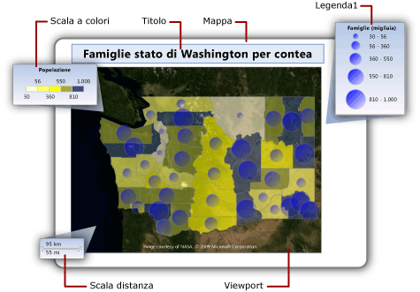
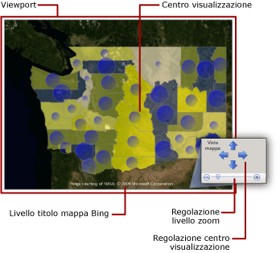
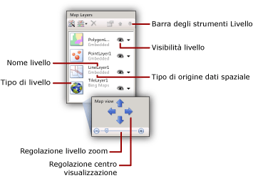

# Mappe (Generatore report e SSRS)
  Per visualizzare i dati aziendali su uno sfondo geografico, è possibile aggiungere una mappa al report impaginato [!INCLUDE[ssRSnoversion_md](../../includes/ssrsnoversion-md.md)] . Il tipo di mappa da selezionare dipende da quali informazioni si desidera comunicare nel report. È possibile aggiungere una mappa che visualizza solo le posizioni, una mappa a bolle in cui le dimensioni di queste ultime variano in base al numero di unità familiari presenti in un'area, una mappa con marcatori in cui lo stile del marcatore cambia a seconda del prodotto più remunerativo per ogni negozio oppure una mappa linea che consente di visualizzare gli itinerari tra i diversi negozi.  
  
 Una mappa contiene un titolo, un viewport che specifica il punto centrale e la scala, uno sfondo a tessere mappa di Bing facoltativo per il viewport, uno o più livelli che visualizzano i dati spaziali e diverse legende che consentono agli utenti di interpretare le visualizzazioni dei dati. Nella figura seguente vengono illustrate le parti fondamentali di una mappa.  
  
   
  
 Per iniziare a usare immediatamente una mappa, vedere [Esercitazione: Report mappa &#40;Generatore report&#41;](../../reporting-services/tutorial-map-report-report-builder.md) o la pagina relativa agli [esempi di report (Generatore report e SSRS)](http://go.microsoft.com/fwlink/?LinkId=198283).  
  
> [!NOTE]  
>  È possibile salvare mappe separatamente da un report come parti del report. Altre informazioni su [Parti del report](../../reporting-services/report-design/report-parts-report-builder-and-ssrs.md).  
  
##   Aggiunta di una mappa al report  
 Per aggiungere una mappa al report, attenersi al seguente elenco di passaggi generali:  
  
-   Determinare i dati analitici che si desidera visualizzare e i tipi di dati spaziali necessari. Ad esempio per visualizzare le vendite annuali relative di un negozio su una mappa a bolle, è necessario disporre del nome e delle vendite del negozio per i dati analitici, nonché del nome e della posizione del negozio, ad esempio latitudine e longitudine, per i dati spaziali.  
  
-   Scegliere lo stile della mappa desiderato. Sulle mappe di base vengono visualizzate solo le posizioni. Le dimensioni delle bolle delle relative mappe variano in base a un singolo valore analitico. Nelle mappe a colori analitiche, gli elementi della mappa variano in base agli intervalli di dati analitici. Lo stile da selezionare dipende sia dai dati che si desidera visualizzare sia dal tipo di dati spaziali usati.  
  
-   Raccogliere le informazioni necessarie per specificare le origini dati spaziali, i dati spaziali, le origini dati analitici e i dati analitici. In questo modo vengono incluse le stringhe di connessione alle origini dati spaziali, specificando il tipo di dati spaziali necessari e verificando che i dati del report includano i campi delle corrispondenze che associano i dati spaziali e i dati analitici.  
  
-   Eseguire la Creazione guidata mappa per aggiungere una mappa al report in uso. In questo modo viene aggiunto il primo livello mappa. Eseguire la Creazione guidata livello mappa per creare livelli aggiuntivi o modificare quelli esistenti. Le procedure guidate sono un modo semplice per iniziare. Per altre informazioni, vedere [Creazione guidata mappa e Creazione guidata livello mappa &#40;Generatore report e SSRS&#41;](../../reporting-services/report-design/map-wizard-and-map-layer-wizard-report-builder-and-ssrs.md).  
  
-   Dopo avere visualizzato in anteprima la mappa nel report, si desidererà probabilmente regolare la vista mappa, modificare il modo in cui i dati variano la visualizzazione di ogni livello, fornire legende per facilitare l'interpretazione dei dati da parte degli utenti e regolare la risoluzione per garantire una buona visualizzazione.  
  
 Per altre informazioni, vedere [Pianificare un report mappa &#40;Generatore report e SSRS&#41;](../../reporting-services/report-design/plan-a-map-report-report-builder-and-ssrs.md).  
  
##   Aggiunta di dati a una mappa  
 Una mappa usa due tipi di dati: spaziali e analitici. I dati spaziali definiscono l'aspetto della mappa mentre i dati analitici forniscono i valori associati alla mappa. Ad esempio i dati spaziali definiscono le posizioni delle città in un'area, mentre i dati analitici forniscono le informazioni sulla popolazione di ogni città.  
  
 Una mappa deve necessariamente disporre di dati spaziali, mentre quelli analitici sono facoltativi. Ad esempio è possibile aggiungere una mappa che visualizza solo le posizioni dei negozi in una città.  
  
 Per visualizzare i dati su una mappa, i dati analitici e spaziali devono essere in relazione. Se i dati spaziali e i dati analitici hanno la stessa origine, la relazione è nota. Diversamente, se provengono da origini differenti, è necessario specificare i campi delle corrispondenze per correlarli.  
  
### Dati spaziali  
 I dati spaziali sono costituiti da set di coordinate. I dati spaziali di un'origine dati possono essere un singolo punto, più punti, una singola linea, più linee o un set di poligoni. Ogni set di coordinate definisce un *elemento della mappa*, ad esempio un poligono che rappresenta i confini di una regione, una linea che indica una strada o un punto che identifica la posizione di una città.  
  
 I dati spaziali sono basati su uno dei seguenti sistemi di coordinate:  
  
-   **Geografico** Specifica le coordinate geodetiche su una superficie sferica tramite la longitudine e la latitudine. Se i dati spaziali sono geografici, è necessario specificare una proiezione, ovvero un set di regole che specifica come disegnare oggetti che dispongono di coordinate sferiche su una superficie planare. È possibile confrontare o combinare solo i dati geografici con la stessa proiezione.  
  
-   **Planare** Specifica le coordinate geometriche su una superficie planare tramite le coordinate X e Y.  
  
 Ogni livello mappa visualizza un tipo di dati spaziali: poligoni, linee o punti. Per visualizzare più tipi di dati spaziali, aggiungere più livelli alla mappa. È possibile aggiungere anche un livello di tessere mappa di Microsoft Bing. Il livello sezione non dipende dai dati spaziali; esso consente di visualizzare le sezioni dell'immagine che corrispondono alle coordinate del viewport mappa.  
  
#### Origini dei dati spaziali  
 Sono supportate le seguenti origini dei dati spaziali:  
  
-   **Report di Raccolta mappe.** I dati spaziali sono incorporati nei report posizionati nella raccolta mappe. Per impostazione predefinita, la raccolta mappe è installata in *\<unità>*:\Programmi\Microsoft SQL Server\Generatore report\RaccoltaMappe.  
  
    > [!NOTE]  
    >  Questa funzionalità di mapping di [!INCLUDE[ssRSnoversion](../../includes/ssrsnoversion-md.md)] usa i dati dei file di forma TIGER/Line forniti gentilmente dall'ufficio statunitense per i censimenti (Census Bureau, [http://www.census.gov/](http://www.census.gov/)). I file di forma TIGER/Line sono un estratto di informazioni geografiche e cartografiche selezionate dal database Census MAF/TIGER e sono messi a disposizione gratuitamente dal Census Bureau degli Stati Uniti. Per altre informazioni sui file di forma TIGER/Line, visitare [http://www.census.gov/geo/www/tiger](http://www.census.gov/geo/www/tiger). Le informazioni sui confini presenti nei file di forma TIGER/Line servono solo per la raccolta dei dati statistici e la tabulazione. La relativa rappresentazione e designazione per scopi statistici non determina un'autorità giurisdizionale oppure diritti di proprietà o titoli, né rappresentano descrizioni geografiche valide a livello legale. Census TIGER e TIGER/Line sono marchi registrati di U.S. Bureau of the Census.  
  
-   **File di forma ESRI.** I file di forma ESRI contengono dati conformi al formato dei dati spaziali dei file di forma Environmental Systems Research Institute, Inc. (ESRI). Essi fanno riferimento a un set di file. I dati nel file con estensione shp specificano le forme geografiche o geometriche. I dati nel file con estensione dbf forniscono gli attributi per le forme. Per visualizzare una mappa in visualizzazione della struttura o eseguirla dal server di report, entrambi i file devono trovarsi nella stessa cartella. Quando si aggiungono dati spaziali da un file con estensione shp sul file system locale, i dati spaziali sono incorporati nel report. Per recuperare i dati spaziali dinamicamente in fase di esecuzione, caricare i file di forma nel server di report e specificarli come origine dei dati spaziali. Per altre informazioni, vedere la pagina relativa alla [ricerca di file di forma ESRI per una mappa](http://go.microsoft.com/fwlink/?linkid=178814).  
  
-   **Dati spaziali di SQL Server archiviati in un database.** È possibile usare una query che specifichi i tipi di dati **SQLGeometry** o **SQLGeography** da un database relazionare di [!INCLUDE[ssNoVersion](../../includes/ssnoversion-md.md)] . Per altre informazioni, vedere [Panoramica dei tipi di dati spaziali](../../relational-databases/spatial/spatial-data-types-overview.md) in [Documentazione in linea di SQL Server 2008](http://go.microsoft.com/fwlink/?linkid=98335).  
  
     Nel set di risultati visualizzato in Progettazione query ogni riga di dati spaziali viene trattata come un'unità e archiviata in un solo elemento della mappa. Ad esempio se ci sono più punti definiti in una riga nel set di risultati, le proprietà di visualizzazione si applicano a tutti i punti di quell'elemento della mappa.  
  
-   **Posizioni personalizzate create.** È possibile aggiungere manualmente posizioni, ad esempio punti incorporati, a un livello punto incorporato. Per altre informazioni, vedere [Aggiungere percorsi personalizzati a una mappa &#40;Generatore report e SSRS&#41;](../../reporting-services/report-design/add-custom-locations-to-a-map-report-builder-and-ssrs.md).  
  
#### Dati spaziali in visualizzazione della struttura  
 In visualizzazione della struttura, l'elaboratore di report visualizza dati spaziali di esempio per consentire la progettazione del livello mappa. I dati visualizzati dipendono dalla disponibilità dei dati spaziali:  
  
-   **Dati incorporati.** I dati di esempio vengono recuperati dagli elementi della mappa incorporati nei livelli mappa del report.  
  
-   **Collegamento al file di forma ESRI.** Se sono disponibili il file di forma ESRI (estensione shp) e il file di supporto (estensione dbf), i dati di esempio vengono caricati dal file di forma. In caso contrario, l'elaboratore di report genera i dati di esempio e visualizza il messaggio **Nessun dato spaziale disponibile**.  
  
-   **Dati spaziali di SQL Server.** Se l'origine dati è disponibile e le credenziali sono valide, i dati di esempio vengono caricati dai dati spaziali del database. In caso contrario, l'elaboratore di report genera i dati di esempio e visualizza il messaggio **Nessun dato spaziale disponibile**.  
  
#### Incorporamento dei dati spaziali nella definizione del report  
 A differenza dei dati analitici, è possibile incorporare i dati spaziali per un livello mappa nella definizione del report. Quando si incorporano i dati spaziali, si incorporano gli elementi della mappa usati nel relativo livello.  
  
 Gli elementi incorporati aumentano le dimensioni della definizione del report, ma assicurano che i dati spaziali siano sempre disponibili, in anteprima o sul server di report, quando il report è in esecuzione. Più dati indicano più archiviazioni e di conseguenza tempi di elaborazione più lunghi. Pertanto, è consigliabile limitare i dati spaziali, oltre agli altri dati del report, alle sole informazioni necessarie per il report.  
  
#### Controllo della risoluzione mappa in fase di esecuzione  
 Quando si modifica la risoluzione per i dati spaziali, si specifica il livello di dettaglio delle linee disegnate su una mappa. Ad esempio per le aree, è necessaria una granularità fino a cento metri di superficie sulla terra oppure sono sufficienti i dettagli di una distanza di 1,5 km?  
  
 Se i dati spaziali sono incorporati nel report, la risoluzione usata influisce sul numero di elementi della mappa nella definizione del report. Una risoluzione superiore aumenta il numero di elementi richiesto per disegnare i bordi con quella risoluzione. Se i dati spaziali non sono incorporati nel report, il server di report calcola le linee richieste per disegnare i bordi con quella risoluzione ogni volta che si visualizza il report. Per progettare un report che bilanci la risoluzione di visualizzazione con un tempo di rendering del report accettabile, semplificare la risoluzione mappa al livello di dettaglio necessario nel report per visualizzare i dati analitici.  
  
### Dati analitici  
 I dati analitici sono i dati che si desidera visualizzare sulla mappa, ad esempio la popolazione di una città o il totale delle vendite di un negozio. I dati analitici possono provenire da una delle seguenti origini:  
  
-   **Campo del set di dati.** Campo del set di dati del riquadro dei dati del report.  
  
-   **Campo dell'origine dati spaziali.** Campo dell'origine dati spaziali incluso nei dati spaziali. Ad esempio un file di forma ESRI include frequentemente sia i dati spaziali sia quelli analitici. I nomi dei campi dell'origine dati spaziali iniziano con # e vengono visualizzati nell'elenco a discesa dei campi quando si specifica il campo di dati per le regole di un livello.  
  
-   **Dati incorporati per un elemento della mappa.** Dopo avere incorporato poligoni, linee o punti in un report, è possibile eseguire l'override dei campi di dati dei singoli elementi della mappa e impostare valori personalizzati.  
  
 Quando si specificano le regole per un livello e si seleziona il campo di dati analitici, se il tipo di dati è numerico, l'elaboratore di report usa automaticamente la funzione predefinita Sum per calcolare i valori di aggregazione per l'elemento della mappa. Se il campo non è numerico, non viene specificata alcuna funzione di aggregazione, ma viene usata la funzione di aggregazione First implicita. Per modificare l'espressione predefinita, cambiare le opzioni per le regole del livello. Per altre informazioni, vedere [Variare la visualizzazione di poligoni, linee e punti in base a regole e dati analitici &#40;Generatore report e SSRS&#41;](../../reporting-services/report-design/vary-polygon-line-and-point-display-by-rules-and-analytical-data.md).  
  
### Campi delle corrispondenze  
 Per correlare i dati analitici agli elementi della mappa su un livello, è necessario specificare i *campi delle corrispondenze*. Questi ultimi sono usati per compilare una relazione tra gli elementi della mappa e i dati analitici. È possibile usare uno o più campi per corrispondenze finché specifichino un valore analitico univoco per ogni posizione spaziale.  
  
 Ad esempio per una mappa in cui le dimensioni delle bolle variano in base alla popolazione della città, sono necessari i dati seguenti:  
  
-   Dall'origine dati spaziali:  
  
    -   **SpatialData.** Campo che dispone di dati spaziali che specificano la latitudine e la longitudine della città.  
  
    -   **Name.** Campo che contiene il nome della città.  
  
    -   **Area.** Campo che contiene il nome della regione.  
  
-   Dall'origine dati analitici:  
  
    -   **Population.** Campo che contiene la popolazione della città.  
  
    -   **City.** Campo che contiene il nome della città.  
  
    -   **Area.** Campo che contiene il nome del territorio, dello stato o della regione.  
  
 In questo esempio, il nome della città da solo non è sufficiente per identificare in modo univoco la popolazione. Ad esempio ci sono molte città di nome Albany negli Stati Uniti. Per assegnare un nome a una città specifica, è necessario specificare l'area oltre al nome della città.  
  
##   Informazioni sul viewport mappa  
 Dopo aver specificato i dati della mappa per un report, è possibile limitare l'area di visualizzazione della mappa specificando un *viewport*mappa. Per impostazione predefinita, il viewport è la stessa area della mappa intera. Per ritagliare la mappa, è possibile specificare il centro, il livello di zoom e le coordinate massime e minime che definiscono l'area che si desidera includere nel report. Per migliorare la visualizzazione della mappa nel report, è possibile spostare le legende, la scala distanza e la scala dei colori all'esterno del viewport. Nella figura seguente viene illustrato un viewport:  
  
   
  
##   Aggiunta di un livello tessere mappe di Bing  
 È possibile aggiungere un livello per le tessere mappa di Bing che fornisce uno sfondo geografico per la vista mappa corrente come definito dal viewport. Per aggiungere un livello sezione, è necessario specificare il sistema di coordinate **geografico** e il tipo di proiezione **Mercator**. Le sezioni che corrispondono al centro del viewport e al livello di zoom selezionato vengono recuperate automaticamente dai servizi Web di Bing Maps.  
  
 È possibile personalizzare il livello specificando le opzioni seguenti:  
  
-   Tipo sezione. Sono supportati gli stili seguenti:  
  
    -   **Strada.** Visualizza uno stile per la mappa stradale caratterizzato da sfondo bianco, strade e testo etichetta.  
  
    -   **Aereo.** Visualizza uno stile di immagine aereo senza testo.  
  
    -   **Ibrido.** Visualizza una combinazione degli stili **Strada** e **Aereo** .  
  
-   La lingua per il testo visualizzato nelle sezioni.  
  
-   Se usare una connessione sicura per recuperare le sezioni dal servizio Web di Bing Maps.  
  
 Per istruzioni dettagliate, vedere [Aggiungere, modificare o eliminare una mappa o un livello mappa &#40;Generatore report e SSRS&#41;](../../reporting-services/report-design/add-change-or-delete-a-map-or-map-layer-report-builder-and-ssrs.md).  
  
 Per altre informazioni sulle tessere mappa, vedere la pagina relativa al [sistema a tessere di Bing Maps](http://go.microsoft.com/fwlink/?linkid=147315). Per altre informazioni sull'utilizzo delle tessere mappa di Bing nel report, vedere [Ulteriori condizioni di utilizzo](http://go.microsoft.com/fwlink/?LinkId=151371).  
  
##   Informazioni sugli elementi e sui livelli mappa  
 Una mappa può disporre di più livelli, tre sono quelli disponibili. Ogni livello visualizza un tipo di dati spaziali:  
  
-   **Livello poligono.** Visualizza le strutture delle aree o i marcatori per il punto centrale del poligono che viene calcolato automaticamente per ogni poligono.  
  
-   **Livello linea.** Visualizza le linee per i percorsi o gli itinerari.  
  
-   **Livello punto.** Visualizza i marcatori per le posizioni dei punti.  
  
 Quando si specifica l'origine dei dati spaziali per un livello, la procedura guidata controlla il campo dei dati spaziali e imposta il tipo di livello in base al tipo corrispondente. Un elemento della mappa viene aggiunto al livello per ogni valore dell'origine dati.  
  
 Ad esempio per visualizzare gli itinerari di recapito da un magazzino centrale ai negozi, è possibile aggiungere due livelli: un livello punto con marcatori a puntina da disegno per visualizzare le posizioni dei negozi e un livello linea per visualizzare gli itinerari di recapito dal magazzino a ogni negozio. Il livello punto necessita di dati spaziali relativi ai punti che specificano le posizioni dei negozi mentre il livello linea necessita di dati spaziali relativi alle linee che specificano gli itinerari di recapito.  
  
 Il quarto tipo di livello è denominato livello sezione. Un livello sezione aggiunge uno sfondo di tessere mappe di Bing che corrisponde al centro del viewport mappa e al livello di zoom.  
  
 Per usare i livelli, selezionare una mappa sull'area di progettazione del report per visualizzare il riquadro Mappa. Quest'ultimo consente di visualizzare l'elenco di livelli definiti per la mappa. Usare questo riquadro per selezionare un livello e modificare le opzioni, per modificare l'ordine di disegno dei livelli, per aggiungere un livello o eseguire la Creazione guidata livello mappa, per nascondere o mostrare un livello e per modificare il centro di visualizzazione e il livello di zoom per il viewport mappa. Nella figura seguente viene illustrato un viewport:  
  
   
  
 Per altre informazioni sui livelli mappa, vedere [Aggiungere, modificare o eliminare una mappa o un livello mappa &#40;Generatore report e SSRS&#41;](../../reporting-services/report-design/add-change-or-delete-a-map-or-map-layer-report-builder-and-ssrs.md).  
  
### Variazione delle proprietà di visualizzazione per punti, linee e poligoni  
 Le opzioni di visualizzazione per gli elementi di una mappa possono essere impostate in base al livello, usando le regole per il livello, oppure su singoli elementi. Ad esempio è possibile impostare le proprietà di visualizzazione per tutti i punti su un livello, impostare le regole che controllano le proprietà di visualizzazione per tutti i punti su un livello indipendentemente dal loro incorporamento oppure eseguire l'override delle impostazioni delle proprietà di visualizzazione per punti incorporati specifici.  
  
 Quando si visualizza un report, i valori di visualizzazione mostrati vengono controllati da questa gerarchia e sono elencati in ordine crescente. I numeri maggiori hanno la precedenza:  
  
1.  **Proprietà livello.** Proprietà che si applicano a tutto il livello. Ad esempio usare le proprietà livello per impostare l'origine dei dati analitici o la visibilità per tutto il livello.  
  
2.  **Proprietà poligono, linea, punto e proprietà poligono, linea, punto incorporati.** Proprietà che si applicano a tutti gli elementi della mappa di un livello, se gli elementi derivano da dati spaziali dinamici o incorporati. Ad esempio usare le proprietà del punto centrale del poligono per impostare il colore di riempimento per le bolle su una sfumatura che riempie le aree delle bolle dal blu scuro al celeste e dalla parte superiore a quella inferiore.  
  
3.  **Regole relative a colore, dimensioni, altezza e al tipo marcatore.** Le regole applicano le proprietà a un livello quando quest'ultimo dispone di elementi della mappa in relazione con i dati analitici. Il tipo di regole varia in base al livello. Ad esempio usare le regole dimensioni dei punti per variare le dimensioni delle bolle in base alla popolazione.  
  
4.  **Override per le proprietà poligono, linea o punto incorporati**. Per gli elementi incorporati della mappa, è possibile selezionare l'opzione di override e modificare qualsiasi proprietà o valore dei dati. Qualsiasi modifica apportata per eseguire l'override delle regole per i singoli elementi è irreversibile. Ad esempio è possibile evidenziare un negozio specifico tramite un marcatore a puntina da disegno.  
  
 Per altre informazioni, vedere [Variare la visualizzazione di poligoni, linee e punti in base a regole e dati analitici &#40;Generatore report e SSRS&#41;](../../reporting-services/report-design/vary-polygon-line-and-point-display-by-rules-and-analytical-data.md).  
  
 Oltre a variare l'aspetto degli elementi della mappa, è possibile aggiungere interattività ai punti, alle linee, ai poligoni o ai livelli, nei modi seguenti:  
  
-   Creare descrizioni comandi per fornire dettagli aggiuntivi per un elemento della mappa quando l'utente posiziona un puntatore sulla mappa.  
  
-   Aggiungere azioni drill-through per eseguire un collegamento ad altre posizioni nel report, ad altri report o alle pagine Web.  
  
-   Aggiungere parametri nelle espressioni che definiscono la visibilità del livello per consentire a un utente di mostrare o nascondere livelli mappa specifici.  
  
 Per altre informazioni, vedere [Ordinamento interattivo, mappe documento e collegamenti &#40;Generatore report e SSRS&#41;](../../reporting-services/report-design/interactive-sort-document-maps-and-links-report-builder-and-ssrs.md).  
  
##   Informazioni sulle legende della mappa, sulla scala dei colori e sulla scala distanza  
 È possibile aggiungere diverse legende al report per facilitare l'interpretazione di una mappa da parte degli utenti. Nelle mappe possono essere inclusi i seguenti elementi:  
  
-   **Legende.** È possibile creare più legende. Gli elementi elencati in una legenda vengono generati automaticamente in base alle regole specificate per gli elementi della mappa in ogni livello. Per ogni regola, si specifica la legenda da usare per visualizzare gli elementi correlati. In questo modo, è possibile assegnare elementi da più livelli alla stessa legenda o a legende diverse.  
  
-   **Scala dei colori.** È possibile creare una scala dei colori. Invece di fornire una legenda per una regola colore, è possibile visualizzare gli elementi per tale regola nella scala dei colori. Alla scala dei colori possono essere applicate più regole colore.  
  
-   **Scala distanza.** È possibile visualizzare una scala distanza che consente di visualizzare una scala per la vista mappa corrente sia in chilometri sia in miglia.  
  
 Le legende, la scala dei colori e la scala distanza possono essere posizionate in punti specifici all'interno o all'esterno del viewport. Per altre informazioni, vedere [Modificare legende della mappa, scala dei colori e regole associate &#40;Generatore report e SSRS&#41;](../../reporting-services/report-design/change-map-legends-color-scale-and-associated-rules-report-builder-and-ssrs.md).  
  
##   Risoluzione dei problemi relativi alle mappe  
 I report con mappe usano dati spaziali e analitici di diverse origini dati. Ogni livello mappa può usare origini dati differenti. Le proprietà di visualizzazione per ogni livello seguono una priorità specifica basata sulle proprietà dei livelli, sulle regole e sulle proprietà degli elementi della mappa.  
  
 Le cause radici del mancato ottenimento del risultato desiderato quando si visualizza un report con mappe possono essere molteplici. Per isolare e analizzare ogni problema, può essere utile usare un livello alla volta. Usare il riquadro Mappa per selezionare un livello e attivare o disattivare facilmente la visibilità.  
  
 Per altre informazioni sui report con mappe, vedere [Risoluzione dei problemi relativi alle parti del report: report mappa &#40;Generatore report e SSRS&#41;](../../reporting-services/report-design/troubleshoot-reports-map-reports-report-builder-and-ssrs.md)  
  
##   Procedure  
 In questa sezione vengono elencate le procedure che illustrano in dettaglio le modalità di utilizzo delle mappe e dei relativi livelli nei report.  
  
-   [Aggiungere, modificare o eliminare una mappa o un livello mappa &#40;Generatore report e SSRS&#41;](../../reporting-services/report-design/add-change-or-delete-a-map-or-map-layer-report-builder-and-ssrs.md)  
  
-   [Modificare legende della mappa, scala dei colori e regole associate &#40;Generatore report e SSRS&#41;](../../reporting-services/report-design/change-map-legends-color-scale-and-associated-rules-report-builder-and-ssrs.md)  
  
-   [Aggiungere percorsi personalizzati a una mappa &#40;Generatore report e SSRS&#41;](../../reporting-services/report-design/add-custom-locations-to-a-map-report-builder-and-ssrs.md)  
  
##   Contenuto della sezione  
 [Pianificare un report mappa &#40;Generatore report e SSRS&#41;](../../reporting-services/report-design/plan-a-map-report-report-builder-and-ssrs.md)  
  
 [Creazione guidata mappa e Creazione guidata livello mappa &#40;Generatore report e SSRS&#41;](../../reporting-services/report-design/map-wizard-and-map-layer-wizard-report-builder-and-ssrs.md)  
  
 [Personalizzare i dati e la visualizzazione di una mappa o di un livello mappa &#40;Generatore report e SSRS&#41;](../../reporting-services/report-design/customize-the-data-and-display-of-a-map-or-map-layer-report-builder-and-ssrs.md)  
  
 [Variare la visualizzazione di poligoni, linee e punti in base a regole e dati analitici &#40;Generatore report e SSRS&#41;](../../reporting-services/report-design/vary-polygon-line-and-point-display-by-rules-and-analytical-data.md)  
  
 [Aggiungere, modificare o eliminare una mappa o un livello mappa &#40;Generatore report e SSRS&#41;](../../reporting-services/report-design/add-change-or-delete-a-map-or-map-layer-report-builder-and-ssrs.md)  
  
 [Modificare legende della mappa, scala dei colori e regole associate &#40;Generatore report e SSRS&#41;](../../reporting-services/report-design/change-map-legends-color-scale-and-associated-rules-report-builder-and-ssrs.md)  
  
 [Aggiungere percorsi personalizzati a una mappa &#40;Generatore report e SSRS&#41;](../../reporting-services/report-design/add-custom-locations-to-a-map-report-builder-and-ssrs.md)  
  
 [Risoluzione dei problemi relativi alle parti del report: report mappa &#40;Generatore report e SSRS&#41;](../../reporting-services/report-design/troubleshoot-reports-map-reports-report-builder-and-ssrs.md)  
  
  
