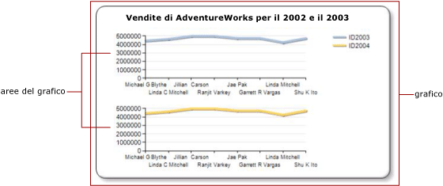

# Più serie in un grafico (Generatore report e SSRS)
  Se in un grafico sono presenti più serie, è necessario identificare il sistema ottimale per confrontarle. È possibile utilizzare un grafico in pila per mostrare le proporzioni relative di ogni serie. Se si confrontano solo due serie che condividono un asse delle categorie (x), utilizzare l'asse secondario. Ciò si rivela utile per mostrare due serie correlate di dati, ad esempio, prezzo e volume o reddito e tasse. Se il grafico diventa illeggibile, utilizzare più aree del grafico per creare una maggiore separazione visiva tra le diverse serie.  
  
 Oltre a decidere le caratteristiche del grafico da utilizzare, è importante stabilire il tipo di grafico adatto ai dati. Se i campi del set di dati sono correlati, utilizzare un grafico con intervalli.  
  
> [!NOTE]  
>  [!INCLUDE[ssRBRDDup](../../includes/ssrbrddup-md.md)]  
  
## Utilizzo di grafici in pila e in pila 100%  
 I grafici in pila vengono generalmente utilizzati per visualizzare più serie in un'area del grafico. Utilizzare questo tipo di grafico quando i dati che si tenta di mostrare sono strettamente correlati. È inoltre consigliabile mostrare fino a quattro serie in un grafico in pila. Se si desidera confrontare la proporzione con cui ogni serie contribuisce al totale, utilizzare un'area in pila del 100%, una barra o un istogramma. Questi grafici calcolano la percentuale relativa con cui ogni serie contribuisce alla categoria. Per altre informazioni, vedere [Grafici ad area &#40;Generatore report e SSRS&#41;](../../reporting-services/report-design/area-charts-report-builder-and-ssrs.md), [Grafici a barre &#40;Generatore report e SSRS&#41;](../../reporting-services/report-design/bar-charts-report-builder-and-ssrs.md) e [Istogrammi &#40;Generatore report e SSRS&#41;](../../reporting-services/report-design/column-charts-report-builder-and-ssrs.md).  
  
## Utilizzo dell'asse secondario  
 Quando una nuova serie viene aggiunta al grafico, essa viene tracciata utilizzando gli assi x e y primari. Quando si desidera confrontare valori espressi in un'unità di misura diversa, usare l' *asse secondario* in modo che sia possibile tracciare due serie su assi separati. L'asse secondario è utile in caso di confronto di valori espressi in un'unità di misura diversa. L'asse secondario viene disegnato sul lato opposto a quello dell'asse primario. Il grafico supporta solo un asse primario e un asse secondario. L'asse secondario presenta le stesse proprietà di quello primario. Per altre informazioni, vedere [Traccia di dati su un asse secondario &#40;Generatore report e SSRS&#41;](../../reporting-services/report-design/plot-data-on-a-secondary-axis-report-builder-and-ssrs.md).  
  
 Se si desidera visualizzare più di due serie con intervalli di dati diversi, inserire le serie in aree del grafico distinte.  
  
## Utilizzo di aree del grafico  
 Il grafico è il contenitore di livello superiore che include il bordo esterno, il titolo del grafico e la legenda. Per impostazione predefinita, il grafico contiene una sola area predefinita. L'area del grafico non è visibile sulla superficie del grafico, ma è possibile considerarla come un contenitore che include solo le etichette e il titolo degli assi, nonché l'area tracciato di una o più serie. Nell'illustrazione seguente viene mostrato il concetto di aree del grafico all'interno di un singolo grafico.  
  
   
  
 L'uso della finestra di dialogo **Proprietà area grafico** consente di specificare l'orientamento 2D e 3D di tutte le serie contenute nell'area del grafico, di allineare più aree del grafico all'interno dello stesso grafico e di formattare i colori dell'area tracciato. Quando viene definita una nuova area del grafico in un grafico che contiene solo un area del grafico predefinita, lo spazio disponibile viene diviso orizzontalmente per due e la nuova area del grafico viene posizionata al di sotto della prima.  
  
 Ogni serie può essere connessa a una sola area del grafico. Per impostazione predefinita, tutte le serie vengono aggiunte all'area del grafico predefinita. Quando si utilizzano grafici ad area, a dispersione, a linee e istogrammi, qualsiasi combinazione di queste serie può essere visualizzata nella stessa area del grafico. È, ad esempio, possibile visualizzare una serie di colonne e una serie di linee nella stessa area del grafico. Il vantaggio derivante dall'utilizzo della stessa area del grafico per più serie è che gli utenti finali possono confrontarle più facilmente.  
  
 I tipi di grafico a barre, radar e con forme non possono essere combinati con altri tipi di grafico nella stessa area del grafico. Se si desidera eseguire confronti con più serie di tipo a barre, radar o con forme, sarà necessario eseguire una delle operazioni seguenti:  
  
-   Modificare tutte le serie nell'area del grafico in modo che siano delle stesso tipo di grafico.  
  
-   Creare una nuova area del grafico e spostare una o più serie dall'area del grafico predefinita in quella appena creata.  
  
 L'area del grafico multipla in una sola caratteristica del grafico è anche utile se si tenta di confrontare dati con scale diverse di valori. Se, ad esempio, la prima serie contiene dati nell'intervallo compreso tra 10 e 20, mentre la seconda serie contiene dati nell'intervallo compreso tra 400 e 800, i valori della prima serie potrebbero essere nascosti. Separare ogni serie in un'area del grafico diversa. Per altre informazioni, vedere [Specificare un'area del grafico per una serie &#40;Generatore report e SSRS&#41;](../../reporting-services/report-design/specify-a-chart-area-for-a-series-report-builder-and-ssrs.md).  
  
## Utilizzo di grafici con intervalli  
 Nei grafici con intervalli sono presenti due valori per ogni punto dati. Se il grafico contiene due serie che condividono lo stesso asse delle categorie (x), è possibile utilizzare un grafico con intervalli per mostrare la differenza tra le due serie. I grafici con intervalli sono più adatti alla visualizzazione delle informazioni relative ai valori massimo e minimo o superiore e inferiore. Se, ad esempio, la prima e la seconda serie contengono rispettivamente la vendita massima e la vendita minima effettuate ogni giorno nel mese di gennaio, è possibile utilizzare un grafico con intervalli per mostrare la differenza tra le due vendite ogni giorno. Per altre informazioni, vedere [Grafici con intervalli &#40;Generatore report e SSRS&#41;](../../reporting-services/report-design/range-charts-report-builder-and-ssrs.md).  
  
## Vedere anche  
 [Grafici &#40;Generatore report e SSRS&#41;](../../reporting-services/report-design/charts-report-builder-and-ssrs.md)   
 [Visualizzazione di una serie con più intervalli di dati in un grafico &#40;Generatore report e SSRS&#41;](../../reporting-services/report-design/displaying-a-series-with-multiple-data-ranges-on-a-chart.md)   
 [Tipi di grafico &#40;Generatore report e SSRS&#41;](../../reporting-services/report-design/chart-types-report-builder-and-ssrs.md)  
  
  
