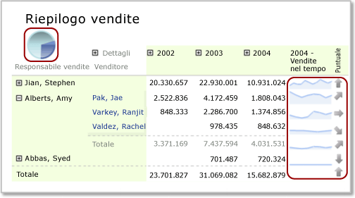

# Aree dati nidificate (Generatore report e SSRS)
  È possibile nidificare un'area dati, ad esempio un grafico, all'interno di un'altra, quale una matrice, in genere per visualizzare in modo conciso riepiloghi dei dati o fornire una rappresentazione visiva, nonché una visualizzazione di tipo tabella o matrice.  
  
 Per una matrice (chiamata anche *tablix*) contenente ordini di vendita raggruppati in base al punto vendita nelle righe e in base al trimestre nelle colonne, è ad esempio possibile aggiungere una tabella o un grafico alla cella d'angolo per riepilogare le vendite relative a tutti i punti vendita oppure aggiungere un grafico a un'intestazione di colonna della matrice per mostrare il contributo alle vendite dei dati presenti nella colonna sotto forma di percentuale di tutte le vendite.  
  
   
  
 In questa illustrazione, il grafico a torta nella cella d'angolo e i grafici sparkline nelle righe sono aree dati nidificate.  
  
 Per definizione, le aree dati nidificate sono basate sullo stesso set di dati del report. Non è possibile nidificare aree dati basate su set di dati diversi. Per visualizzare dati di set di dati diversi, utilizzare report drill-through o sottoreport. Per altre informazioni, vedere [Drill-through, drill-down, sottoreport e aree dati nidificate &#40;Generatore report e SSRS&#41;](../../reporting-services/report-design/drillthrough-drilldown-subreports-and-nested-data-regions.md).  
  
> [!NOTE]  
>  [!INCLUDE[ssRBRDDup](../../includes/ssrbrddup-md.md)]  
  
## Informazioni sull'ambito di un'area dati nidificata  
 L'ambito dei dati di un'area dati nidificata viene definito automaticamente dalla relativa posizione nell'area dati padre. L'ambito dei dati di un grafico nidificato in una cella d'angolo della Tablix corrisponde, ad esempio, ai dati del set di dati associato all'area dati Tablix dopo l'applicazione dei filtri per il set di dati, l'area dati Tablix e l'area dati del grafico. L'ambito di una Tablix nidificata in una cella della Tablix coincide con quello della cella d'angolo, ma include anche le appartenenze ai gruppi di righe e colonne della cella nella quale l'area è nidificata, con i filtri di gruppo corrispondenti applicati. Per altre informazioni sull'ambito, vedere [Ambito di espressioni per totali, aggregazioni e raccolte predefinite &#40;Generatore report e SSRS&#41;](../../reporting-services/report-design/expression-scope-for-totals-aggregates-and-built-in-collections.md).  
  
 Nell'elenco seguente viene descritto l'ambito per le celle delle aree Tablix seguenti:  
  
-   **Angolo della Tablix** L'ambito comprende i dati dell'area dati collegata all'area dati Tablix dopo l'applicazione delle espressioni di filtro e ordinamento del set di dati e della Tablix esterna.  
  
-   **Gruppo di colonne della Tablix** I dati del gruppo di colonne più interno dopo l'applicazione delle espressioni di filtro e ordinamento del set di dati, della Tablix esterna e dei gruppi di colonne.  
  
-   **Gruppo di righe della Tablix** I dati del gruppo di righe più interno dopo l'applicazione delle espressioni di filtro e ordinamento del set di dati, della Tablix esterna e dei gruppi di righe.  
  
-   **Corpo della Tablix** I dati del gruppo di colonne più interno rappresentato dall'intersezione dei gruppi di righe e colonne dopo l'applicazione delle espressioni di filtro e ordinamento del set di dati, della Tablix esterna e dei gruppi di righe e di colonne.  
  
 Per altre informazioni, vedere [Aree dell'area dati Tablix &#40;Generatore report e SSRS&#41;](../../reporting-services/report-design/tablix-data-region-areas-report-builder-and-ssrs.md).  
  
## Nidificazione di un grafico, un grafico sparkline o barra dei dati in una Tablix  
 Quando si aggiunge un grafico (incluso un grafico sparkline o barra dei dati) a un'intestazione del gruppo di colonne della Tablix o una riga del piè di pagina del gruppo oppure a una cella del corpo della Tablix, l'ambito dei dati passati al grafico viene esteso per includere il subset di dati relativo alla cella in questione. Per impostazione predefinita, quando si aggiunge un grafico a una cella della Tablix, le dimensioni del grafico si espandono fino a riempire la cella.  
  
> [!NOTE]  
>  Per ottenere un controllo maggiore sulle dimensioni di un grafico in una cella della Tablix, aggiungere il grafico a un rettangolo, quindi aggiungere il rettangolo alla cella della Tablix.  
  
 Per impostazione predefinita, i colori della legenda del grafico dipendono dal colore dei punti dati nelle serie del grafico. Per controllare i colori in modo che nelle aree dati del grafico nidificate venga utilizzato lo stesso colore per la stessa categoria di dati, è necessario utilizzare colori personalizzati e impostare espressioni di ordinamento sui dati. Per altre informazioni, vedere [Specificare colori coerenti in più grafici con forme &#40;Generatore report e SSRS&#41;](../../reporting-services/report-design/specify-consistent-colors-across-multiple-shape-charts-report-builder-and-ssrs.md) e [Ordinare i dati in un'area dati &#40;Generatore report e SSRS&#41;](../../reporting-services/report-design/sort-data-in-a-data-region-report-builder-and-ssrs.md).  
  
## Nidificazione di un misuratore o indicatore in una Tablix  
 È possibile nidificare un misuratore o un indicatore all'interno di una tabella, una matrice o un elenco per mostrare un indicatore di prestazioni chiave (KPI). Quando viene posizionato in una tabella, un misuratore o indicatore viene sottoposto a rendering per ogni riga della Tablix. Per altre informazioni sull'aggiunta di indicatori a una Tablix, vedere [Indicatori &#40;Generatore report e SSRS&#41;](../../reporting-services/report-design/indicators-report-builder-and-ssrs.md).  
  
### Aggiunta di un misuratore a una Tablix  
 L'aggiunta di un misuratore a un'area dati Tablix può essere eseguita in due modi:  
  
-   Fare clic all'interno della cella della Tablix e inserire un misuratore. Verrà visualizzata la finestra di dialogo **Seleziona tipo di misuratore** . Dopo aver selezionato un tipo di misuratore, l'area dati Misuratore viene posizionata all'interno della cella della Tablix selezionata. Per formattare il misuratore sarà probabilmente necessario ridimensionare l'area Tablix.  
  
-   Fare clic all'esterno della tabella e inserire un misuratore. Verrà visualizzata la finestra di dialogo **Seleziona tipo di misuratore** . Dopo aver selezionato un tipo di misuratore, l'area dati misuratore viene posizionata nell'angolo superiore sinistro del report. Dopo aver aggiunto i dati e formattato il misuratore, trascinarlo e rilasciarlo nella cella della Tablix.  
  
 Analogamente al grafico, al set di dati passato al misuratore viene applicato come ambito il subset di dati relativo alla cella in questione. Un misuratore posizionato all'interno di una cella della Tablix aggrega sempre una sola riga di dati.  
  
 Quando i dati della Tablix contengono un raggruppamento, quest'ultimo non viene ereditato automaticamente dall'area dati Misuratore nidificata nella Tablix. È necessario aggiungere un'espressione di raggruppamento corrispondente al misuratore per mostrare le stesse informazioni visualizzate nella Tablix. Se ad esempio i dati della Tablix vengono raggruppati per prodotto, è necessario aggiungere un'espressione di raggruppamento per prodotto al misuratore per mostrare gli stessi dati. Per altre informazioni, vedere [Misuratori &#40;Generatore report e SSRS&#41;](../../reporting-services/report-design/gauges-report-builder-and-ssrs.md) e [Aggiungere o eliminare un gruppo in un'area dati &#40;Generatore report e SSRS&#41;](../../reporting-services/report-design/add-or-delete-a-group-in-a-data-region-report-builder-and-ssrs.md).  
  
 È necessario impostare i valori minimo e massimo che verranno visualizzati sulla scala del misuratore. Per specificare il valore massimo del misuratore, è possibile utilizzare un'espressione, ad esempio `=Max!MyField.Value`. Poiché tuttavia questa espressione verrà valutata solo nell'ambito dei dati della cella, il valore massimo di ogni misuratore non sarà uguale per tutte le righe della Tablix. Ciò può complicare l'interpretazione dei confronti tra i misuratori della Tablix. In alternativa, è possibile specificare un valore statico per il massimo. Tutte le righe all'interno della Tablix mostreranno un misuratore con questo valore massimo. Per altre informazioni, vedere [Impostare un valore minimo o massimo su un misuratore &#40;Generatore report e SSRS&#41;](../../reporting-services/report-design/set-a-minimum-or-maximum-on-a-gauge-report-builder-and-ssrs.md).  
  
 Se i dati sul misuratore assumono dimensioni eccessive, utilizzare un moltiplicatore di scala per ridurre la quantità di cifre visualizzate. Per specificare un moltiplicatore, fare clic con il pulsante destro del mouse sulla scala e scegliere **Proprietà scala**. Quando viene visualizzata la finestra di dialogo **Proprietà scala** , specificare un valore per **Moltiplicatore**.  
  
## Nidificazione di una tabella o matrice e di un grafico in un elenco  
 Per nidificare più aree dati in un elenco, aggiungere un rettangolo, quindi aggiungere le aree dati al rettangolo.  
  
 È possibile definire un gruppo per un'area dati elenco, quindi aggiungere una Tablix e un grafico per fornire viste diverse degli stessi dati. A tale scopo, è necessario definire espressioni di raggruppamento e di ordinamento identiche per la Tablix e il grafico incorporati. Per la Tablix e i dati vengono per definizione utilizzati i dati del set di dati dell'area dati elenco padre.  
  
> [!NOTE]  
>  Per impostazione predefinita, quando si aggiunge un'area dati elenco all'area di progettazione, l'elenco include una riga di dettaglio. È possibile modificare questa impostazione predefinita aggiungendo una riga di gruppo e rimuovendo la riga di dettaglio. Per altre informazioni, vedere [Esplorazione della flessibilità di un'area dati Tablix &#40;Generatore report e SSRS&#41;](../../reporting-services/report-design/exploring-the-flexibility-of-a-tablix-data-region-report-builder-and-ssrs.md).  
  
 Per altre informazioni, vedere [Informazioni sui gruppi &#40;Generatore report e SSRS&#41;](../../reporting-services/report-design/understanding-groups-report-builder-and-ssrs.md) e [Aggiungere, spostare o eliminare una tabella, una matrice o un elenco &#40;Generatore report e SSRS&#41;](../../reporting-services/report-design/add-move-or-delete-a-table-matrix-or-list-report-builder-and-ssrs.md).  
  
## Vedere anche  
 [Filtro, raggruppamento e ordinamento di dati &#40;Generatore report e SSRS&#41;](../../reporting-services/report-design/filter-group-and-sort-data-report-builder-and-ssrs.md)   
 [Tabelle, matrici ed elenchi &#40;Generatore report e SSRS&#41;](../../reporting-services/report-design/tables-matrices-and-lists-report-builder-and-ssrs.md)   
 [Grafici &#40;Generatore report e SSRS&#41;](../../reporting-services/report-design/charts-report-builder-and-ssrs.md)   
 [Misuratori &#40;Generatore report e SSRS&#41;](../../reporting-services/report-design/gauges-report-builder-and-ssrs.md)   
 [Espressioni &#40;Generatore report e SSRS&#41;](../../reporting-services/report-design/expressions-report-builder-and-ssrs.md)   
 [Formattazione degli elementi del report &#40;Generatore report e SSRS&#41;](../../reporting-services/report-design/formatting-report-items-report-builder-and-ssrs.md)   
 [Esercitazione: Aggiunta di un indicatore di prestazioni chiave al report &#40;Generatore report&#41;](../../reporting-services/tutorial-adding-a-kpi-to-your-report-report-builder.md)   
 [Formattazione di scale su un misuratore &#40;Generatore report e SSRSSSRS&#41;](../../reporting-services/report-design/formatting-scales-on-a-gauge-report-builder-and-ssrs.md)  
  
  
