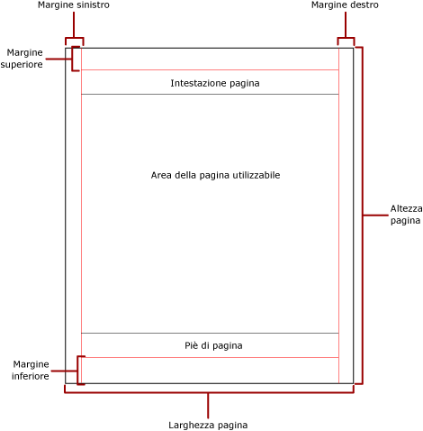
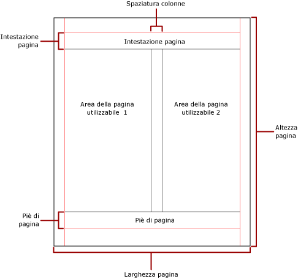

# Paginazione in Reporting Services (Generatore report e SSRS)
  Il termine paginazione si riferisce al numero di pagine all'interno di un report e alla disposizione degli elementi del report in tali pagine. In [!INCLUDE[ssRSnoversion](../../includes/ssrsnoversion-md.md)] la paginazione varia a seconda dell'estensione per il rendering usata per visualizzare e recapitare il report. Quando si esegue un report sul server di report, viene usato il renderer HTML. Tale renderer si attiene a un set specifico di regole di paginazione. Se ad esempio si esporta lo stesso report in formato PDF, viene usato il renderer PDF e viene applicato un set di regole differente, pertanto il report viene impaginato in modo diverso. Per progettare correttamente un report di facile lettura e ottimizzato per il renderer che si intende usare per recapitare il report, è necessario comprendere le regole usate per controllare la paginazione in [!INCLUDE[ssRSnoversion](../../includes/ssrsnoversion-md.md)].  
  
 In questo argomento viene illustrato l'impatto delle dimensioni della pagina fisica e del layout del report sul rendering del report eseguito mediante renderer di interruzioni di pagina manuali. È possibile impostare le proprietà per modificare le dimensioni e i margini delle pagine fisiche e dividere il report in colonne nei riquadri **Proprietà report** e **Proprietà** o nella finestra di dialogo **Imposta pagina** . Per accedere al riquadro **Proprietà report** , fare clic sull'area blu all'esterno del corpo del report. Per accedere alla finestra di dialogo **Imposta pagina** , fare clic su **Esegui** nella scheda Home, quindi fare clic su **Imposta pagina** nella scheda Esegui.  
  
> [!NOTE]  
>  Se un report è stato progettato in modo da occupare la larghezza di una pagina, ma il rendering viene eseguito su più pagine, verificare che la larghezza del corpo del report, inclusi i margini, non sia maggiore di quella delle dimensioni della pagina fisica. Per impedire l'aggiunta di pagine vuote al report, è possibile ridurre le dimensioni del contenitore trascinando l'angolo del contenitore verso sinistra.  
  
> [!NOTE]  
>  [!INCLUDE[ssRBRDDup](../../includes/ssrbrddup-md.md)]  
  
## Corpo del report  
 Il corpo del report è un contenitore rettangolare visualizzato come spazio vuoto nell'area di progettazione, che può essere ingrandito o ridotto a seconda degli elementi del report in esso contenuti. Il corpo del report non rispecchia le dimensioni della pagina fisica: di fatto può estendersi oltre i limiti delle dimensioni della pagina fisica fino a occupare più pagine del report. Alcuni renderer, quali [!INCLUDE[ofprexcel](../../includes/ofprexcel-md.md)], Word, HTML e MHTML, eseguono il rendering di report che vengono ingranditi o ridotti a seconda del contenuto della pagina. I report di cui viene eseguito il rendering in tali formati sono ottimizzati per la visualizzazione su schermo, ad esempio in un Web browser. Tali renderer aggiungono interruzioni di pagina verticali quando necessario.  
  
 È possibile formattare il corpo del report in modo da includere un colore, uno stile e una larghezza per il bordo. È inoltre possibile aggiungere un colore e un'immagine di sfondo.  
  
## Pagina fisica  
 Le dimensioni della pagina fisica corrispondono al formato carta. Il formato carta specificato per il report controlla la modalità di rendering del report stesso. Nei report di cui viene eseguito il rendering in formati con interruzioni di pagina manuali vengono inserite interruzioni di pagina orizzontali e verticali basate sulle dimensioni della pagina fisica per offrire un'esperienza di lettura ottimizzata quando vengono stampati o visualizzati in un formato di file con interruzioni di pagina manuali. Nei report di cui viene eseguito il rendering in formati con interruzioni di pagina automatiche vengono inserite interruzioni di pagina orizzontali basate sulle dimensioni fisiche per offrire un'esperienza di lettura ottimizzata quando vengono visualizzati in un Web browser.  
  
 Per impostazione predefinita, le dimensioni della pagina sono 8,5 x 11 pollici, ma è possibile cambiarle nella finestra di dialogo **Imposta pagina** o nel riquadro **Proprietà report** oppure modificando le proprietà PageHeight e PageWidth nel riquadro **Proprietà** . Le dimensioni della pagina non vengono aumentate o ridotte a seconda del contenuto del corpo del report. Se si desidera che il report sia visualizzato in una sola pagina, tutto il contenuto del corpo del report deve essere inserito nella pagina fisica. Se non è possibile inserirlo e si usa il formato con interruzioni di pagina manuali, per il report saranno necessarie ulteriori pagine. Se il corpo del report si estende oltre il bordo destro della pagina fisica, viene inserita un'interruzione di pagina orizzontale. Se il corpo del report si estende oltre il bordo inferiore della pagina fisica, viene inserita un'interruzione di pagina verticale.  
  
 Se si desidera eseguire l'override delle dimensioni della pagina fisica definite nel report, è possibile specificare tali dimensioni usando le impostazioni relative alle informazioni sui dispositivi per il renderer specifico usato per esportare il report. Per altre informazioni, vedere [Reporting Services Device Information Settings](https://go.microsoft.com/fwlink/?LinkId=102515).  
  
### Margini  
 I margini vengono tracciati dal bordo delle dimensioni della pagina fisica verso l'interno fino all'impostazione specificata. Se un elemento del report si estende nell'area del margine, viene tagliato in modo da non eseguire il rendering dell'area della sovrapposizione. Se per i margini si specificano dimensioni tali che la larghezza orizzontale o verticale della pagina sia uguale a zero, il valore predefinito delle impostazioni dei margini sarà uguale a zero. I margini vengono specificati nella finestra di dialogo **Imposta pagina** o nel riquadro **Proprietà report** oppure modificando le proprietà TopMargin, BottomMargin, LeftMargin e RightMargin nel riquadro **Proprietà** . Se si desidera eseguire l'override delle dimensioni dei margini definite nel report, è possibile specificare tali dimensioni usando le impostazioni relative alle informazioni sui dispositivi per il renderer specifico usato per esportare il report.  
  
 L'area della pagina fisica disponibile in seguito all'allocazione dello spazio per margini, spaziatura delle colonne, intestazione e piè di pagina, è denominata *area utilizzabile della pagina*. I margini vengono applicati solo quando si esegue il rendering e si stampano report nei formati dei renderer di interruzioni di pagina manuali. Nell'immagine seguente sono indicati il margine e l'area utilizzabile della pagina di una pagina fisica.  
  
   
  
### Colonne in formato newsletter  
 Il report può essere diviso in colonne, ad esempio le colonne di un giornale, che vengono considerate come pagine logiche di cui viene eseguito il rendering nella stessa pagina fisica. Le colonne vengono disposte da sinistra verso destra e dall'alto verso il basso e sono separate tra loro da spazi vuoti. Se il report è diviso in più colonne, ogni pagina fisica viene divisa verticalmente in colonne, ciascuna delle quali viene considerata come una pagina logica. Si supponga ad esempio che in una pagina fisica siano presenti due colonne. Il contenuto del report verrà inserito nella prima e quindi nella seconda colonna. Se le prime due colonne sono insufficienti per il contenuto del report, verranno riempite la prima e quindi la seconda colonna nella pagina successiva. Le colonne continuano a essere riempite, da sinistra verso destra e dall'alto verso il basso, finché non viene eseguito il rendering di tutti gli elementi del report. Se per le colonne si specificano dimensioni tali che la larghezza orizzontale o verticale sia uguale a zero, il valore predefinito dell'impostazione relativa alla spaziatura tra le colonne sarà uguale a zero.  
  
 Le colonne vengono specificate nella finestra di dialogo **Imposta pagina** o nel riquadro **Proprietà report** oppure modificando le proprietà TopMargin, BottomMargin, LeftMargin e RightMargin nel riquadro **Proprietà** . Se si desidera usare per i margini dimensioni non definite, è possibile specificare tali dimensioni usando le impostazioni relative alle informazioni sui dispositivi per il renderer specifico usato per esportare il report. Le colonne vengono applicate solo quando si esegue il rendering e si stampano report nei formati PDF o Immagine. Nell'immagine seguente è indicata l'area utilizzabile di una pagina contenente colonne.  
  
   
  
## Interruzioni e nomi di pagina  
 La leggibilità di un report, così come il controllo e l'esportazione dei relativi dati potrebbero risultare migliori quando il report dispone di nomi di pagina. Reporting Services offre proprietà per report e aree dati Tablix (tabella, matrice ed elenco), gruppi e rettangoli nel report per controllare la paginazione, reimpostare i numeri di pagina e fornire nuovi nomi di pagina del report in base alle interruzioni di pagina. Tali caratteristiche consentono di migliorare i report indipendentemente dal formato in cui ne viene eseguito il rendering, tuttavia risultano utili soprattutto in caso di esportazione dei report nelle cartelle di lavoro di Excel.  
  
 La proprietà InitialPageName fornisce il nome di pagina iniziale del report. Se il report non include nomi di pagina per le interruzioni di pagina, il nome di pagina iniziale viene usato per tutte le nuove pagine create con le interruzioni di pagina. Non è necessario usare un nome di pagina iniziale.  
  
 Un report sottoposto a rendering può fornire un nuovo nome per ogni pagina generata in seguito a un'interruzione di pagina. Per creare il nome di pagina, è necessario impostare la proprietà PageName di una tabella, una matrice, elenco, gruppo o rettangolo. Non è obbligatorio specificare nomi di pagina in corrispondenza delle interruzioni. Se non li si specifica, viene usato in alternativa il valore di InitialPageName. Se anche InitialPageName è vuoto, la nuova pagina non ha nome.  
  
 Le aree dati Tablix (tabella, matrice ed elenco), i gruppi e i rettangoli supportano le interruzioni di pagina.  
  
 L'interruzione di pagina include le proprietà seguenti:  
  
-   BreakLocation determina la posizione dell'interruzione per l'elemento del report abilitato dall'interruzione di pagina: all'inizio, alla fine oppure all'inizio e alla fine. Nei gruppi, BreakLocation può essere posizionato tra gruppi.  
  
-   Disabled indica se un'interruzione di pagina è applicata all'elemento di report. Se questa proprietà restituisce True, l'interruzione di pagina viene ignorata. Questa proprietà viene usata per disabilitare dinamicamente le interruzioni di pagina basate su espressioni durante l'esecuzione del report.  
  
-   ResetPageNumber indica se il numero di pagina deve essere reimpostato su 1 quando si verifica un'interruzione di pagina. Se questa proprietà restituisce True, il numero di pagina viene reimpostato.  
  
 È possibile impostare la proprietà BreakLocation nelle finestre di dialogo **Proprietà Tablix**, **Proprietà rettangolo**o **Proprietà gruppo** , ma è necessario impostare le proprietà Disabled, ResetPageNumber e PageName nel riquadro Proprietà di Generatore report. Se le proprietà nel riquadro Proprietà sono organizzate per categoria, sarà possibile trovarle nella categoria **PageBreak** . Per i gruppi, la categoria **PageBreak** si trova all'interno della categoria **Group** .  
  
 È possibile usare costanti ed espressioni semplici o complesse per impostare il valore delle proprietà Disabled e ResetPageNumber. Non è tuttavia possibile usare espressioni con la proprietà BreakLocation. Per altre informazioni sulla creazione e l'uso delle espressioni, vedere [Espressioni &#40;Generatore report e SSRS&#41;](../../reporting-services/report-design/expressions-report-builder-and-ssrs.md).  
  
 Nel report è possibile scrivere espressioni che fanno riferimento ai nomi o ai numeri di pagina correnti tramite la raccolta **Globals** . Per altre informazioni, vedere [Riferimenti alle raccolte predefinite Globals e Users &#40;Generatore report e SSRS&#41;](../../reporting-services/report-design/built-in-collections-built-in-globals-and-users-references-report-builder.md).  
  
### Denominazione delle schede del foglio di lavoro di Excel  
 Queste proprietà risultano utili quando si esportano report nelle cartelle di lavoro di Excel. Usare la proprietà InitialPage per specificare un nome predefinito per la scheda del foglio di lavoro quando si esporta il report e usare le interruzioni di pagina e la proprietà PageName per fornire nomi diversi per ogni foglio di lavoro. Ogni nuova pagina del report, definita da un'interruzione di pagina, viene esportata in un foglio di lavoro diverso denominato in base al valore della proprietà PageName. Se PageName è vuoto, ma il report dispone di un nome di pagina iniziale, quest'ultimo verrà usato per tutti i fogli di lavoro nella cartella di lavoro di Excel.  
  
 Per altre informazioni sul funzionamento di queste proprietà in caso di esportazione dei report in Excel, vedere [Esportazione in Microsoft Excel &#40;Generatore report e SSRS&#41;](../../reporting-services/report-builder/exporting-to-microsoft-excel-report-builder-and-ssrs.md).  
  
## Vedere anche  
 [Layout e rendering della pagina &#40;Generatore report e SSRS&#41;](../../reporting-services/report-design/page-layout-and-rendering-report-builder-and-ssrs.md)  
  
  
