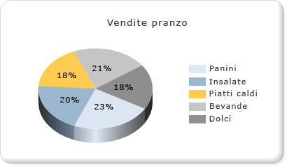

# Grafici a torta (Generatore report e SSRS)
  Nei grafici a torta e in quelli ad anello i dati vengono visualizzati come percentuali rispetto a un valore intero. I grafici a torta vengono utilizzati principalmente per eseguire confronti tra gruppi. I grafici a torta e ad anello, insieme ai grafici a piramide e a imbuto, costituiscono un gruppo di grafici noti come grafici con forme. I grafici con forme non includono assi. Quando un campo numerico viene inserito in un grafico con forme, viene calcolata la percentuale di ogni valore rispetto al totale. Per ulteriori informazioni sui grafici con forme, vedere [grafici con forme &#40; Generatore report e SSRS &#41; ](../../reporting-services/report-design/shape-charts-report-builder-and-ssrs.md).  
  
 Nella figura seguente è illustrato un grafico a torta 3D con etichette dati in formato di percentuale.  La legenda è posizionata nella parte centrale destra.  
  
   
  
> [!NOTE]  
>  [!INCLUDE[ssRBRDDup](../../includes/ssrbrddup-md.md)]  
  
## Variazioni  
  
-   **Torta esplosa**. Grafico a torta in cui tutte le sezioni vengono allontanate dal centro della torta. Oltre al grafico a torta esplosa, in cui tutte le sezioni sono separate, è possibile creare un grafico a sezione esplosa, in cui viene allontanata solo una sezione.  
  
-   **Anello**. Grafico a torta con uno spazio aperto al centro.  
  
-   **Anello esploso**. Grafico ad anello in cui tutte le sezioni vengono allontanate dal centro dell'anello.  
  
-   **Torta 3D**. Grafico a torta con uno stile 3D applicato.  
  
-   **Torta esplosa 3D**. Grafico a torta esplosa con uno stile 3D applicato.  
  
## Considerazioni sui dati per la visualizzazione in un grafico a torta  
  
-   I grafici a torta vengono utilizzati di frequente nei report grazie al loro impatto visivo. Si tratta, tuttavia, di un tipo di grafico estremamente semplificato che potrebbe non rappresentare i dati nel modo più efficace possibile. Utilizzare un grafico a torta solo dopo che i dati sono stati aggregati a un massimo di sette punti dati.  
  
-   Nei grafici a torta ogni gruppo di dati viene visualizzato come una sezione distinta. È necessario aggiungere almeno un campo dati e un campo categoria al grafico a torta. Se viene aggiunto più di un campo dati, entrambi i campi dati verranno visualizzati nello stesso grafico a torta.  
  
-   I valori Null, vuoti, negativi e zero non hanno effetto nel calcolo dei rapporti. Per questo motivo, tali valori non vengono visualizzati in un grafico a torta. Se si desidera indicare visivamente questi tipi di valori nel grafico, scegliere un tipo di grafico diverso dal grafico a torta.  
  
-   Se i colori di un grafico a torta vengono definiti utilizzando una tavolozza personalizzata, assicurarsi che tale tavolozza contenga un numero di colori sufficiente per visualizzare ogni punto dati in un colore univoco. Per altre informazioni, vedere [Formattazione dei colori delle serie in un grafico &#40;Generatore report e SSRS&#41;](../../reporting-services/report-design/formatting-series-colors-on-a-chart-report-builder-and-ssrs.md).  
  
-   A differenza della maggior parte degli altri tipi di grafico, nella legenda di un grafico a torta verranno visualizzati singoli punti dati, anziché singole serie.  
  
-   Un grafico a torta richiede almeno due valori per eseguire un confronto valido tra percentuali. Se il grafico a torta contiene un unico colore, verificare di aver aggiunto un campo categoria in base a cui eseguire il raggruppamento. Se nel grafico a torta non sono contenute categorie, i valori del campo dati vengono aggregati in un unico valore per la visualizzazione.  
  
-   Analogamente a tutti gli altri tipi di grafico, per il grafico a torta i colori vengono generati in base ai valori contenuti nella tavolozza predefinita. Con questo approccio è possibile che, se in un report si utilizzano più grafici a torta, i colori dei punti dati siano diversi da un grafico all'altro. Se il report contiene più grafici a torta, è consigliabile impostare manualmente i colori per ogni gruppo di categorie in modo da mantenere lo stesso colore nei vari grafici. Per altre informazioni su come definire i colori in un grafico, vedere [Formattazione dei colori delle serie in un grafico &#40;Generatore report e SSRS&#41;](../../reporting-services/report-design/formatting-series-colors-on-a-chart-report-builder-and-ssrs.md).  
  
## Applicazione di stili di disegno a un grafico a torta  
 È possibile aggiungere stili di disegno speciali al grafico a torta per aumentarne l'impatto visivo. Gli stili di disegno includono gli effetti smussato e concavo, disponibili solo nei grafici a torta 2D. Nella figura seguente è illustrato un esempio degli stili di disegno smussato e concavo in un grafico a torta.  
  
   
  
 Per altre informazioni, vedere [Aggiungere stili smussato, rilievo e trama a un grafico &#40;Generatore report e SSRS&#41;](../../reporting-services/report-design/chart-effects-add-bevel-emboss-or-texture-report-builder.md).  
  
## Visualizzazione di valori in percentuale in un grafico a torta  
 Analogamente ad altri grafici con forme, i grafici a torta rappresentano le percentuali del totale. Di conseguenza, le etichette dei grafici a torta vengono solitamente formattate come percentuali. Per assicurare coerenza con altri tipi di grafico, le etichette di percentuali non vengono visualizzate per impostazione predefinita. Per altre informazioni su come visualizzare i valori sotto forma di percentuali nel grafico, vedere [Visualizzare i valori in percentuale in un grafico a torta &#40;Generatore report e SSRS&#41;](../../reporting-services/report-design/display-percentage-values-on-a-pie-chart-report-builder-and-ssrs.md). Per altre informazioni sulla formattazione di numeri come percentuali nel report, vedere [Formattazione di numeri e date &#40;Generatore report e SSRS&#41;](../../reporting-services/report-design/formatting-numbers-and-dates-report-builder-and-ssrs.md).  
  
   
  
## Procedure per impedire la sovrapposizione di etichette in un grafico a torta  
 Se un grafico a torta contiene numerosi punti dati, le etichette dati si sovrapporranno. Esistono diversi modi per impedire la sovrapposizione delle etichette:  
  
-   Ridurre le dimensioni del carattere delle etichette dei punti dati.  
  
-   Aumentare la larghezza e l'altezza del grafico in modo da lasciare più spazio per le etichette.  
  
-   Visualizzare le etichette all'esterno dell'area del grafico. Per altre informazioni, vedere [Visualizzazione delle etichette dei punti dati al di fuori di un grafico a torta &#40;Generatore report e SSRS&#41;](../../reporting-services/report-design/display-data-point-labels-outside-a-pie-chart-report-builder-and-ssrs.md).  
  
-   Raccogliere le piccole sezioni della torta in un'unica sezione.  
  
## Consolidamento di sezioni piccole su un grafico a torta  
 Quando il grafico a torta contiene troppi punti, i dati vengono oscurati ed è difficile leggerli. Se i dati contengono molti piccoli punti dati, sono disponibili due modalità di raccolta di più sezioni della torta:  
  
-   Raccolta di sezioni di dati più piccole in una sezione del grafico a torta. Questo metodo si rivela utile nelle situazioni in cui, ad esempio, si desidera che il grafico a torta disponga di un "Altro" punto dati che semplicemente raccolga i dati restanti. Per altre informazioni, vedere [Raccogliere piccole sezioni in un grafico a torta &#40;Generatore report e SSRS&#41;](../../reporting-services/report-design/collect-small-slices-on-a-pie-chart-report-builder-and-ssrs.md).  
  
-   Raccolta di sezioni piccole in un grafico a torta supplementare. Il secondo grafico a torta non viene visualizzato nella finestra di progettazione. Al contrario, durante l'elaborazione del report, l'opportunità di visualizzarlo viene valutata dal grafico, in base ai valori dei punti dati. In caso affermativo, i valori vengono aggiunti in un altro grafico a torta.  
  
## Vedere anche  
 [Visualizzazione delle etichette dei punti dati al di fuori di un grafico a torta &#40;Generatore report e SSRS&#41;](../../reporting-services/report-design/display-data-point-labels-outside-a-pie-chart-report-builder-and-ssrs.md)   
 [Raccogliere piccole sezioni in un grafico a torta &#40; Generatore report e SSRS &#41;](../../reporting-services/report-design/collect-small-slices-on-a-pie-chart-report-builder-and-ssrs.md)   
 [Visualizzare i valori in percentuale in un grafico a torta &#40; Generatore report e SSRS &#41;](../../reporting-services/report-design/display-percentage-values-on-a-pie-chart-report-builder-and-ssrs.md)   
 [Esercitazione: Aggiungere un grafico a torta al report &#40;Generatore report&#41;](../../reporting-services/tutorial-add-a-pie-chart-to-your-report-report-builder.md)   
 [Formattazione della legenda in un grafico &#40; Generatore report e SSRS &#41;](../../reporting-services/report-design/chart-legend-formatting-report-builder.md)   
 [Punti dati in grafici &#40; vuoti e Null Generatore report e SSRS &#41;](../../reporting-services/report-design/empty-and-null-data-points-in-charts-report-builder-and-ssrs.md)   
 [Formattazione dei colori delle serie in un grafico &#40;Generatore report e SSRS&#41;](../../reporting-services/report-design/formatting-series-colors-on-a-chart-report-builder-and-ssrs.md)  
  
  
