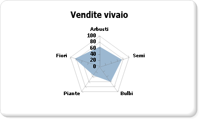

# Grafici polari (Generatore report e SSRS)
  In un grafico polare le serie vengono visualizzate come set di punti raggruppati per categoria in un cerchio di 360 gradi. I valori sono rappresentati dalla lunghezza del punto, in base alla misurazione dal centro del cerchio. A una distanza maggiore del punto dal centro corrisponde un valore maggiore. Le etichette delle categorie vengono visualizzate sul perimetro del grafico. Per altre informazioni sull'aggiunta di dati a un grafico polare, vedere [Grafici &#40;Generatore report e SSRS&#41;](../../reporting-services/report-design/charts-report-builder-and-ssrs.md).  
  
> [!NOTE]  
>  [!INCLUDE[ssRBRDDup](../../includes/ssrbrddup-md.md)]  
  
## Variazioni  
  
-   **Grafico radar**. In un grafico radar le serie vengono visualizzate come linee o aree circolari. A differenza del grafico polare, nel grafico radar i dati non vengono visualizzati in termini di coordinate polari.  
  
## Considerazioni sui dati per i grafici polari  
  
-   Il grafico radar risulta utile per i confronti tra più serie di dati di categoria.  
  
-   I grafici polari vengono utilizzati principalmente per tracciare dati polari, in cui ogni punto dati è determinato da un angolo e da una distanza.  
  
-   I grafici polari non possono essere combinati con altri tipi di grafico nella stessa area del grafico.  
  
## Esempio  
 Nell'esempio seguente è illustrato il possibile utilizzo di un grafico radar. Nella tabella sono forniti i dati di esempio per il grafico.  
  
|Nome|Sales|  
|----------|-----------|  
|Shrubs|61|  
|Seeds|78|  
|Bulbs|60|  
|Trees|38|  
|Flowers|81|  
  
 In questo esempio il campo Name è posizionato nell'area Gruppi di categorie. Il campo Sales è posizionato nell'area Valori. Il campo Sales viene automaticamente aggregato per il grafico quando viene rilasciato. Il grafico radar calcola dove posizionare le etichette in base al numero di valori presenti nel campo Sales, che contiene cinque valori, e posiziona le etichette in un cerchio in corrispondenza di cinque punti equidistanti. Se il campo Sales contenesse tre valori, le etichette verrebbero posizionate in un cerchio in corrispondenza di tre punti equidistanti.  
  
 Nella figura seguente è illustrato un esempio di un grafico radar basato sui dati presentati.  
  
   
  
## Vedere anche  
 [Grafici &#40; Generatore report e SSRS &#41;](../../reporting-services/report-design/charts-report-builder-and-ssrs.md)   
 [Formattazione di un grafico &#40; Generatore report e SSRS &#41;](../../reporting-services/report-design/formatting-a-chart-report-builder-and-ssrs.md)   
 [Tipi di grafico &#40; Generatore report e SSRS &#41;](../../reporting-services/report-design/chart-types-report-builder-and-ssrs.md)   
 [Grafici a linee &#40; Generatore report e SSRS &#41;](../../reporting-services/report-design/line-charts-report-builder-and-ssrs.md)   
 [Punti dati vuoti e Null nei grafici &#40;Generatore report e SSRS&#41;](../../reporting-services/report-design/empty-and-null-data-points-in-charts-report-builder-and-ssrs.md)  
  
  
