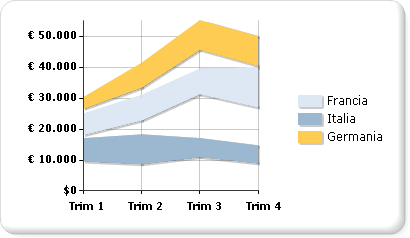

# Grafici a intervalli (Generatore report e SSRS)
  Il tipo di grafico a intervalli consente di visualizzare un set di punti dati, ognuno dei quali è definito da più valori per la stessa categoria. I valori sono rappresentati dall'altezza del marcatore misurata sull'asse del valore. Le etichette delle categorie vengono visualizzate sull'asse delle categorie. Nel grafico con intervalli semplice viene riempita l'area compresa tra il valore iniziale e finale per ogni punto dati.  
  
 Nell'illustrazione seguente viene illustrato un grafico con intervalli semplice con tre serie.  
  
   
  
> [!NOTE]  
>  [!INCLUDE[ssRBRDDup](../../includes/ssrbrddup-md.md)]  
  
## Variazioni  
  
-   **Intervallo smussato**. In un grafico con intervalli smussati le linee vengono visualizzate curve anziché dritte.  
  
-   **Intervallo a colonne**. In un grafico con intervalli a colonne vengono utilizzate colonne anziché aree per visualizzare gli intervalli.  
  
-   **Intervallo a barre**. In un grafico con intervalli a barre vengono utilizzate barre anziché aree per visualizzare gli intervalli.  
  
## Considerazioni sui dati per i grafici con intervalli  
  
-   Con i tipi di grafici con intervalli sono richiesti due valori per ogni punto dati. Questi valori corrispondono ai valori minimi e massimi che definiscono l'intervallo per ogni punto dati.  
  
-   I grafici con intervalli sono utili per l'analisi solo se i valori massimi sono sempre maggiori dei valori minimi. In caso contrario, utilizzare un grafico a linee. Se il valore massimo è minore del valore minimo, nel grafico con intervalli verrà visualizzato il valore assoluto della differenza tra questi valori.  
  
-   Se viene specificato un solo valore, il grafico con intervalli verrà visualizzato come un normale grafico ad area, con un solo valore per punto dati.  
  
-   I grafici con intervalli vengono spesso utilizzati per creare grafici dei dati che contengono i valori minimi e massimi per ogni gruppo di categorie del set di dati.  
  
-   La visualizzazione di marcatori su ogni punto dati non è supportata nel grafico con intervalli.  
  
-   Analogamente al grafico ad aree, in un grafico a intervalli semplice se i valori di più serie sono simili, le serie si sovrapporranno. In questo scenario è opportuno utilizzare un grafico con intervalli a colonne o a barre anziché un grafico semplice.  
  
-   Per creare diagrammi di Gantt, è possibile utilizzare un grafico a barre con intervalli.  
  
## Vedere anche  
 [Grafici &#40; Generatore report e SSRS &#41;](../../reporting-services/report-design/charts-report-builder-and-ssrs.md)   
 [Tipi di grafico &#40; Generatore report e SSRS &#41;](../../reporting-services/report-design/chart-types-report-builder-and-ssrs.md)   
 [Formattazione di un grafico &#40; Generatore report e SSRS &#41;](../../reporting-services/report-design/formatting-a-chart-report-builder-and-ssrs.md)  
  
  

