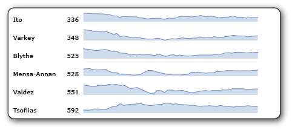
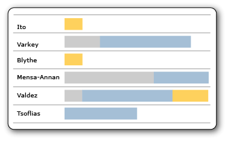
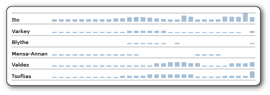

# Grafici sparkline e barre dei dati (Generatore report e SSRS)
  I grafici sparkline e le barre dei dati sono grafici semplici e di piccole dimensioni contenenti numerose informazioni in uno spazio ridotto, spesso in linea con il testo.   
    
  Nei report [!INCLUDE[ssRSnoversion_md](../../includes/ssrsnoversion-md.md)] vengono spesso utilizzati i grafici sparkline e le barre dei dati in tabelle e matrici. La loro efficacia consiste nella possibilità di visualizzarne molti insieme e di confrontarli rapidamente l'uno con l'altro, anziché visualizzarli singolarmente. Facilitano la visualizzazione degli outlier, ovvero le righe che non si eseguono come le altre. Sebbene di dimensioni ridotte, ogni grafico sparkline spesso rappresenta, nel tempo, più punti dati. Le barre dei dati possono rappresentare più punti dati, ma generalmente ne illustrano solo uno. Solitamente in ogni grafico sparkline è presente una sola serie. Non è possibile aggiungere un grafico sparkline a un gruppo di dettagli in una tabella. Poiché nei grafici sparkline vengono visualizzati dati aggregati, devono essere inseriti in una cella associata a un gruppo. Gli elementi di base dei grafici sparkline e delle barre dei dati sono uguali a quelli delle categorie, delle serie e dei valori, tuttavia non dispongono di legende, linee assi, etichette o segni di graduazione.  
  
   
  
 Per una rapida introduzione ai grafici sparkline, vedere [Esercitazione: Aggiungere un grafico sparkline al report &#40;Generatore report&#41;](../../reporting-services/tutorial-add-a-sparkline-to-your-report-report-builder.md) e i video [Procedura: Creazione di un grafico sparkline in una tabella](http://go.microsoft.com/fwlink/?LinkId=197092) e [Grafici di tipo sparkline, grafici a barre e indicatori in Generatore report](http://technet.microsoft.com/bi/video/ff877165) .  
  
> [!NOTE]  
>  È possibile pubblicare grafici sparkline e barre dei dati con tabella, matrice o elenco padri corrispondenti separatamente da un report come parte del report. Altre informazioni su [Parti del report](../../reporting-services/report-design/report-parts-report-builder-and-ssrs.md).  
  
##   Tipi di grafici sparkline  
 Si possono creare quasi tanti tipi di grafici sparkline quanti sono quelli normali. In generale, non è possibile creare grafici sparkline 3D. È possibile creare versioni di grafici sparkline di questi grafici completi:  
  
-   [Istogrammi &#40;Generatore report e SSRS&#41;](../../reporting-services/report-design/column-charts-report-builder-and-ssrs.md): standard, istogramma in pila e istogramma in pila 100%.  
  
-   [Grafici a linee &#40;Generatore report e SSRS&#41;](../../reporting-services/report-design/line-charts-report-builder-and-ssrs.md): tutti i tipi di grafico eccetto quello a linee 3D.  
  
-   [Grafici ad area &#40;Generatore report e SSRS&#41;](../../reporting-services/report-design/area-charts-report-builder-and-ssrs.md): tutti i tipi di grafico eccetto quello ad area 3D  
  
-   [Grafici a torta &#40;Generatore report e SSRS&#41;](../../reporting-services/report-design/pie-charts-report-builder-and-ssrs.md): grafici ad anello, sia lineare che 3D, ma non grafici di altre forme, ad esempio quelli a imbuto e a piramide.  
  
-   [Grafici con intervalli &#40;Generatore report e SSRS&#41;](../../reporting-services/report-design/range-charts-report-builder-and-ssrs.md): azionari, a candela, a barre di errore e box plot.  
  
##   Barre dei dati  
 Le barre dei dati rappresentano in genere un solo punto dati, sebbene possano rappresentarne di più, proprio come i grafici a barre normali. Spesso contengono diverse serie senza categoria o dispongono di raggruppamento di serie.  
  
   
  
 In questo esempio in cui vengono utilizzate barre dei dati in pila, ogni barra dei dati illustra più di un punto dati, anche se è unica. I tre differenti colori della barra potrebbero ad esempio rappresentare attività corrispondenti a tre diversi livelli di priorità in cui la lunghezza della barra rappresenta il numero complessivo di attività assegnate a ogni persona. Se queste barre dei dati venissero invece create in pila 100%, ogni barra riempirebbe la cella e i diversi colori rappresenterebbero la percentuale all'intero per ogni livello di priorità.  
  
 È possibile creare versioni di barre dei dati di questi grafici completi:  
  
-   [Grafici a barre &#40;Generatore report e SSRS&#41;](../../reporting-services/report-design/bar-charts-report-builder-and-ssrs.md): standard, in pila e in pila 100%.  
  
-   [Istogrammi &#40;Generatore report e SSRS&#41;](../../reporting-services/report-design/column-charts-report-builder-and-ssrs.md): standard, in pila e in pila 100%. Gli istogrammi possono essere grafici sparkline o barre dei dati.  
  
##   Allineamento dei dati del grafico sparkline in una tabella o matrice  
 Quando si inserisce un grafico sparkline in una tabella o matrice, è di solito importante allineare i punti dati in ogni grafico sparkline ai punti dati degli altri grafici sparkline in quella colonna. In caso contrario risulta difficile il confronto dei dati nelle differenti righe. Ad esempio, quando si confrontano i dati di vendita in base al mese di diversi venditori nella società, sarebbe opportuno l'allineamento dei mesi. Se un dipendente fosse fuori per il mese di aprile, non ci sarebbero dati forniti da quel dipendente relativamente a quel mese. Per visualizzare il gap per quel mese e vedere i dati relativi ai mesi successivi, allineare i dati degli altri dipendenti. È possibile eseguire questa operazione allineando l'asse orizzontale. Per altre informazioni, vedere la sezione sui grafici sparkline in [Ambito di espressioni per totali, aggregazioni e raccolte predefinite &#40;Generatore report e SSRS&#41;](../../reporting-services/report-design/expression-scope-for-totals-aggregates-and-built-in-collections.md) e vedere [Allineamento dei dati in un grafico di una tabella o matrice &#40;Generatore report e SSRS&#41;](../../reporting-services/report-design/align-the-data-in-a-chart-in-a-table-or-matrix-report-builder-and-ssrs.md).  
  
 Analogamente, per poter eseguire il confronto tra righe, i dati devono essere allineati anche verticalmente, pertanto l'altezza delle barre o delle linee in un grafico sparkline o in una barra dei dati deve essere correlata all'altezza delle barre e delle linee in tutti gli altri grafici sparkline o barre dei dati. In caso contrario, non è possibile il confronto tra righe.  
  
   
  
 In questa immagine, nell'istogramma vengono mostrate le vendite giornaliere per ogni dipendente. Nei giorni in cui il dipendente non ha effettuato vendite, nel grafico viene lasciato uno spazio vuoto e i giorni successivi vengono allineati. Di seguito viene riportato un esempio di allineamento orizzontale. Si noti inoltre che per alcuni dipendenti, ogni barra è corta e nessuna delle barre raggiunge la parte superiore della cella. Di seguito viene riportato un esempio di allineamento verticale; senza di esso, nelle righe senza barre alte, quelle corte si espanderebbero fino a riempire l'altezza della cella.  
  
##   Informazioni sui dati forniti in un grafico sparkline o in una barra dei dati  
 L'operazione che consente di aggiungere un grafico sparkline o una barra dei dati a una tabella o a una matrice viene definita *nidificazione* di un'area dati all'interno di un'altra. La nidificazione indica che i dati forniti nel grafico sparkline o nella barra dei dati vengono controllati dal set di dati su cui è basata la tabella o la matrice e dal punto in cui vengono collocati nella tabella o nella matrice. Per altre informazioni, vedere [Aree dati annidate &#40;Generatore report e SSRS&#41;](../../reporting-services/report-design/nested-data-regions-report-builder-and-ssrs.md).  
  
##   Conversione di un grafico sparkline o barra dei dati in un grafico completo  
 Poiché i grafici sparkline e le barre dei dati sono semplicemente tipi di grafici, se si desidera disporre della funzionalità del grafico completo, è possibile convertirne uno in un grafico completo facendo clic con il pulsante destro del mouse sul grafico e scegliendo **Converti in grafico completo**. Quando si esegue questa operazione, le linee dell'asse, le etichette, i segni di graduazione e la legenda vengono aggiunti automaticamente.  
  
> [!NOTE]  
>  Non è possibile convertire un grafico completo in un grafico sparkline o barra dei dati con un clic. Tuttavia, è possibile creare un grafico sparkline o una barra dei dati da un grafico completo semplicemente eliminando tutti gli elementi del grafico che non sono nei grafici sparkline e nelle barre dei dati.  
  
##   Procedure  
 [Aggiungere grafici sparkline e barre dei dati &#40;Generatore report e SSRS&#41;](../../reporting-services/report-design/add-sparklines-and-data-bars-report-builder-and-ssrs.md)  
  
 [Allineare i dati in un grafico di una tabella o matrice &#40;Generatore report e SSRS&#41;](../../reporting-services/report-design/align-the-data-in-a-chart-in-a-table-or-matrix-report-builder-and-ssrs.md)  
  
### Altre procedure per i grafici  
 Poiché i grafici sparkline e le barre dei dati sono tipi di grafici, anche le seguenti procedure per i grafici potrebbero risultare utili e pertinenti:  
  
 [Aggiungere un grafico a un report &#40;Generatore report e SSRS&#41;](../../reporting-services/report-design/add-a-chart-to-a-report-report-builder-and-ssrs.md)  
  
 [Aggiunta di punti vuoti a un grafico &#40;Generatore Report e SSRS&#41;](../../reporting-services/report-design/add-empty-points-to-a-chart-report-builder-and-ssrs.md)  
  
 [Aggiungere o rimuovere i margini da un grafico &#40;Generatore report e SSRS&#41;](../../reporting-services/report-design/add-or-remove-margins-from-a-chart-report-builder-and-ssrs.md)  
  
 [Modificare un tipo di grafico &#40;Generatore report e SSRS&#41;](../../reporting-services/report-design/change-a-chart-type-report-builder-and-ssrs.md)  
  
 [Definire i colori in un grafico mediante la tavolozza &#40;Generatore report e SSRS&#41;](../../reporting-services/report-design/define-colors-on-a-chart-using-a-palette-report-builder-and-ssrs.md)  
  
 [Visualizzazione di descrizioni comandi in una serie &#40;Generatore report e SSRS&#41;](../../reporting-services/report-design/show-tooltips-on-a-series-report-builder-and-ssrs.md)  
  
 [Specificare una scala logaritmica &#40;Generatore report e SSRS&#41;](../../reporting-services/report-design/specify-a-logarithmic-scale-report-builder-and-ssrs.md)  
  
 [Specificare un intervallo dell'asse &#40;Generatore report e SSRS&#41;](../../reporting-services/report-design/specify-an-axis-interval-report-builder-and-ssrs.md)  
  
 [Specificare i colori coerenti in più grafici con forme &#40;Generatore report e SSRS&#41;](../../reporting-services/report-design/specify-consistent-colors-across-multiple-shape-charts-report-builder-and-ssrs.md)  
  
## Vedere anche  
 [Grafici &#40;Generatore report e SSRS&#41;](../../reporting-services/report-design/charts-report-builder-and-ssrs.md)   
 [Esercitazione: Aggiungere un grafico sparkline al report &#40;Generatore report&#41;](../../reporting-services/tutorial-add-a-sparkline-to-your-report-report-builder.md)   
  
  
