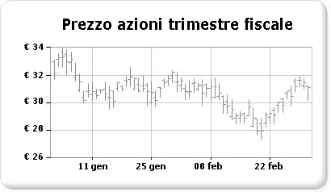

# Grafici azionari (Generatore report e SSRS)

  I grafici azionari sono progettati appositamente per i dati finanziari o scientifici in cui si usano fino a quattro valori per ogni punto dati. Questi valori si allineano ai valori massimo, minimo, di apertura e di chiusura usati per tracciare dati azionari finanziari. In questo tipo di grafico i valori di apertura o di chiusura vengono visualizzati tramite i marcatori, solitamente linee o triangoli. Nell'esempio seguente i valori di apertura sono rappresentati dai marcatori a sinistra, mentre quelli di chiusura dai marcatori a destra.  
  
   
  
 Un esempio di questo grafico azionario è disponibile come report di Generatore Report di esempio. Per ulteriori informazioni sul download di questo report di esempio e ad altri utenti, vedere [report di Generatore Report e progettazione Report di esempio](http://go.microsoft.com/fwlink/?LinkId=198283).  
  
> [!NOTE]  
>  [!INCLUDE[ssRBRDDup](../../includes/ssrbrddup-md.md)]  
  
## Variazioni  
  
-   **Candela**. Il grafico a candela è un tipo speciale di grafico azionario in cui si usano caselle per indicare l'intervallo tra i valori di apertura e di chiusura. Analogamente al grafico azionario, il grafico a candela consente di visualizzare fino a quattro valori per ogni punto dati.  
  
## Considerazioni sui dati per i grafici azionari  
  
-   Quando si presentano molti punti dati azionari, ad esempio la tendenza annua dei prezzi azionari, risulta difficile distinguere ogni valore di apertura, di chiusura, massimo e minimo di ogni punto dati. In questo scenario è consigliabile usare un grafico a linee anziché un grafico azionario.  
  
-   Quando vengono generate le etichette degli assi, la numerazione inizia solitamente da zero.  In generale, i prezzi azionari non presentano lo stesso grado di fluttuazione di altri set di dati. Per questo motivo, è possibile evitare che le etichette dell'asse inizino da zero, in modo da ottenere una visuale migliore dei dati. A tale scopo, impostare **IncludeZero** su **false** nella finestra di dialogo **Proprietà asse** o nella finestra Proprietà. Per altre informazioni sulla generazione delle etichette dell'asse da parte del grafico, vedere [Formattazione delle etichette degli assi in un grafico &#40;Generatore report e SSRS&#41;](../../reporting-services/report-design/formatting-axis-labels-on-a-chart-report-builder-and-ssrs.md).  
  
-   [!INCLUDE[ssRSnoversion](../../includes/ssrsnoversion-md.md)] sono disponibili molte formule calcolate da usare con i grafici azionari, tra cui Indicatori prezzo, Indice di forza relativa, MACD e così via.  

## Passaggi successivi

[Grafici con intervalli](../../reporting-services/report-design/range-charts-report-builder-and-ssrs.md)   
[Grafici](../../reporting-services/report-design/charts-report-builder-and-ssrs.md)   
[Formattazione di un grafico](../../reporting-services/report-design/formatting-a-chart-report-builder-and-ssrs.md)   
[Finestra di dialogo Proprietà asse, opzioni asse](http://msdn.microsoft.com/library/b276e210-7a12-48ae-971b-7dabae51df11)  

Ulteriori domande? [Provare a porre il forum di Reporting Services](http://go.microsoft.com/fwlink/?LinkId=620231)
