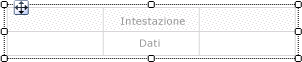
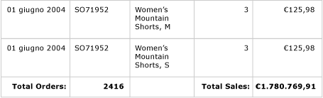
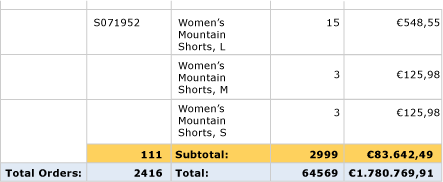
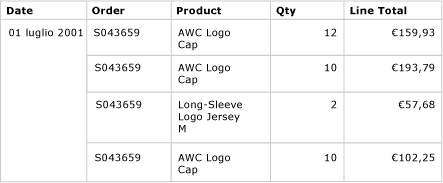
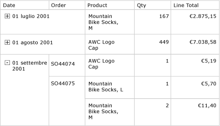

# Tabelle (Generatore report e SSRS)
 In [!INCLUDE[ssRSnoversion_md](../../includes/ssrsnoversion-md.md)]è possibile usare una tabella per visualizzare dati di dettaglio, dati raggruppati o una combinazione di entrambi.   
   
 È possibile raggruppare i dati per un solo campo, per più campi o scrivendo un'espressione personalizzata. È inoltre possibile creare gruppi nidificati, indipendenti o adiacenti. Per visualizzare valori aggregati per dati raggruppati, aggiungere i totali ai gruppi. Formattare le righe e le colonne in modo da evidenziare i dati sui quali concentrarsi. È possibile nascondere inizialmente i dati di dettaglio o raggruppati e includere elementi Toggle di drill-down per consentire agli utenti di scegliere in modo interattivo la quantità di dati da visualizzare.  
  
 Per una rapida introduzione alle tabelle, vedere [Esercitazione: Creazione di un report tabella semplice &#40;Generatore report&#41;](../../reporting-services/tutorial-creating-a-basic-table-report-report-builder.md) o [Creare un report tabella semplice &#40;esercitazione su SSRS&#41;](../../reporting-services/create-a-basic-table-report-ssrs-tutorial.md).  
  
> [!NOTE]  
>  È possibile pubblicare tabelle separatamente da un report come parti del report. Altre informazioni su [Parti del report](../../reporting-services/report-design/report-parts-report-builder-and-ssrs.md).  
  
  
##   Aggiunta di una tabella per la visualizzazione dei dati dettaglio  
 Aggiungere una tabella all'area di progettazione dalla scheda Inserisci sulla barra multifunzione. È possibile aggiungere una tabella tramite la Creazione guidata tabella o matrice in cui è inclusa la creazione di una connessione all'origine dati e un set di dati e la configurazione della tabella o di una tabella basata sul modello di tabella, che si configura manualmente.  
  
> [!NOTE]  
>  La procedura guidata è disponibile unicamente in Generatore report.  
  
 Per descrivere come configurare una tabella dall'inizio alla fine, in questo argomento viene usato il modello di tabella.  
  
 Per impostazione predefinita, una nuova tabella include un numero fisso di colonne con una riga di intestazione per le etichette e una riga di dati per i dati dettaglio. Nella figura seguente è illustrata una nuova tabella aggiunta all'area di progettazione.  
  
   
  
 Quando si seleziona la tabella, al suo esterno vengono visualizzati handle di riga e di colonna, mentre nelle celle vengono visualizzate parentesi quadre. Gli handle di riga indicano lo scopo di ogni riga a livello grafico. Le parentesi quadre indicano l'appartenenza a un gruppo per una cella selezionata. Nella figura seguente è mostrata una cella vuota selezionata in una tabella predefinita.  
  
   
  
 L'handle di riga per la riga Dati visualizza il simbolo dei dettagli (). Per visualizzare i dati in queste righe, trascinare i campi dal riquadro dei dati del report nella riga di intestazione o di dettaglio delle celle della tabella. Entrambe le righe verranno compilate contemporaneamente. Per inserire colonne aggiuntive, trascinare il campo nella tabella finché non verrà visualizzato un punto di inserimento. Dopo avere aggiunto i campi del set di dati alla tabella, è possibile modificare il formato predefinito per date e valuta in modo da controllarne la visualizzazione nel report. Nel diagramma seguente è riportata un'area dati della tabella con i campi Date, Order, Product, Qty e Line Total.  
  
   
  
 Controllare la progettazione visualizzando il report nell'anteprima. La tabella si espande verso la parte inferiore della pagina, in base alle necessità. La riga dell'etichetta e la riga di dettaglio vengono visualizzate una volta per ogni riga nel set di risultati della query del set di dati. Ogni prodotto venduto e incluso nell'ordine viene elencato in una riga separata, insieme alla quantità e al totale di riga per l'elemento, come mostrato nella figura seguente:  
  
   
  
 La tabella iniziale è un modello basato sull'area dati Tablix. È possibile migliorare la progettazione della tabella aggiungendo caratteristiche supportate dall'area dati Tablix sottostante. Per altre informazioni, vedere [Controllo della visualizzazione dell'area dati Tablix in una pagina del report &#40;Generatore report e SSRS&#41;](../../reporting-services/report-design/controlling-the-tablix-data-region-display-on-a-report-page.md). È anche possibile continuare a sviluppare la tabella aggiungendo gruppi di righe e gruppi di colonne e aggiungendo o rimuovendo gruppi di dettagli. Per altre informazioni, vedere [Esplorazione della flessibilità di un'area dati Tablix &#40;Generatore report e SSRS&#41;](../../reporting-services/report-design/exploring-the-flexibility-of-a-tablix-data-region-report-builder-and-ssrs.md).  
  
### Aggiunta di totali per i dati dettaglio  
 Per aggiungere i totali, selezionare celle contenenti dati numerici, quindi usare il menu di scelta rapida per aggiungere automaticamente etichette e totali per i dati dettaglio dei campi numerici. È anche possibile specificare altre etichette e altri totali manualmente. Nella figura seguente è mostrata una tipica riga dei totali che include sia totali specificati automaticamente che manualmente:  
  
   
  
 Nell'anteprima il report visualizza la riga di intestazione e la riga di dettaglio una volta per ogni riga inclusa nel set di risultati della query del set di dati, oltre alla riga dei totali. Nell'immagine seguente sono illustrate le ultime righe della tabella con la riga dei totali inclusa.  
  
   
  
 Per altre informazioni, vedere [Aggiungere un totale a un gruppo o a un'area dati Tablix &#40;Generatore report e SSRS&#41;](../../reporting-services/report-design/add-a-total-to-a-group-or-tablix-data-region-report-builder-and-ssrs.md).  
  
##   Aggiunta di gruppi di righe a una tabella  
 Così come è possibile trascinare un campo dal riquadro dei dati del report in una cella per visualizzare i dati dettaglio, è possibile trascinare un campo nel riquadro Raggruppamento allo scopo di aggiungere un gruppo. Per una tabella, trascinare il campo nel riquadro Gruppi di righe. Dopo avere aggiunto un gruppo, la tabella aggiunge automaticamente celle nelle nuove colonne dell'area del gruppo di righe nelle quali visualizzare i valori di gruppo. Per altre informazioni sulle aree, vedere [Aree dell'area dati Tablix &#40;Generatore report e SSRS&#41;](../../reporting-services/report-design/tablix-data-region-areas-report-builder-and-ssrs.md).  
  
 Nella figura seguente è illustrata una tabella con due gruppi di righe nidificati nella visualizzazione Progettazione. I gruppi di righe sono stati creati trascinando il campo Ordine e quindi il campo Data nel riquadro Gruppi di righe e inserendo ogni gruppo come elemento padre dei gruppi esistenti. Nella figura sono illustrati un gruppo padre basato sulla data e un gruppo figlio basato sul numero di ordine, nonché il gruppo dettagli specificato per impostazione predefinita.  
  
   
  
 Nell'anteprima il report visualizza i dati dell'ordine raggruppati prima per data e poi per ordine, come mostrato nella figura che segue.  
  
   
  
 Una modalità alternativa per la visualizzazione dei dati raggruppati consiste nell'impostare un rientro per la gerarchia dei gruppi in modo da visualizzare la relazione nidificata dei gruppi anziché presentare ogni valore nella rispettiva colonna. Questo stile di formattazione è definito report con rientri. Per altre informazioni sulla formattazione delle informazioni sui gruppi come report con rientri, vedere [Creare un report con rientri &#40;Generatore report e SSRS&#41;](../../reporting-services/report-design/create-a-stepped-report-report-builder-and-ssrs.md).  
  
### Aggiunta dei totali ai gruppi di righe  
 Per visualizzare i totali per un gruppo, è possibile usare il comando sensibile al contesto **Aggiungi totale** . Per un gruppo di righe, il comando Aggiungi totale inserisce una riga all'esterno del gruppo in modo che venga ripetuta una sola volta in relazione al gruppo. Per i gruppi nidificati, la riga del totale relativa al gruppo figlio è esterna a quest'ultimo ma interna al gruppo padre. Per questo motivo può essere utile impostare il colore di sfondo della riga del totale per il gruppo figlio in modo da distinguerla dalle righe di dettaglio. È anche possibile usare un colore di sfondo differente per distinguere le righe di intestazione dalle righe dei piè di pagina della tabella. Nella figura seguente è illustrata la tabella con una riga del totale aggiunta per il gruppo in base ai numeri di ordine.  
  
   
  
 Quando si visualizza il report, la riga in cui sono riportati i subtotali degli ordini viene ripetuta una volta per ogni numero di ordine. Nel piè di pagina della tabella sono riportati i totali per tutte le date. Nelle ultime righe della figura seguente sono illustrate le ultime tre righe di dettaglio, il subtotale per l'ultimo ordine numero SO71952 e i totali per tutte le date riportate nella tabella.  
  
   
  
 Per altre informazioni, vedere [Aggiungere un totale a un gruppo o a un'area dati Tablix &#40;Generatore report e SSRS&#41;](../../reporting-services/report-design/add-a-total-to-a-group-or-tablix-data-region-report-builder-and-ssrs.md).  
  
##   Rimuovere o nascondere le righe di dettaglio  
 Dopo avere visualizzato l'anteprima di una tabella in un report, è possibile decidere di rimuovere le righe di dettaglio esistenti. In alternativa, è possibile nasconderle per impostazione predefinita e consentire all'utente di passare da una visualizzazione dettagliata a una meno dettagliata e viceversa, come in un report drill-down.  
  
 Per rimuovere le righe di dettaglio da una tabella, usare il riquadro Raggruppamento. Selezionare il gruppo di dettaglio e usare il menu di scelta rapida per eliminare il gruppo e le righe contenenti i dati dettaglio. Nella figura seguente è illustrata la visualizzazione Progettazione per una tabella raggruppata per data e numero di ordine, ma senza righe di dettaglio. Alla tabella non sono state aggiunte righe dei totali.  
  
   
  
 In seguito all'eliminazione della riga di dettaglio, i valori hanno come ambito i gruppi di righe. I dati dettaglio non vengono più visualizzati.  
  
> [!NOTE]  
>  Verificare che dopo avere rimosso una riga di dettaglio l'espressione in ogni cella specifichi un'espressione di aggregazione laddove appropriato. Se necessario, modificare l'espressione in modo da specificare funzioni di aggregazione in base alle necessità.  
  
 Nella figura seguente è illustrata un'anteprima di questo report.  
  
   
  
 Per aggiungere o rimuovere righe dalla tabella, vedere [Inserire o eliminare una riga &#40;Generatore report e SSRS&#41;](../../reporting-services/report-design/insert-or-delete-a-row-report-builder-and-ssrs.md).  
  
 È anche possibile nascondere le righe di dettaglio durante la visualizzazione iniziale del report. A tale scopo, è possibile creare un report drill-down nel quale sono visualizzati solo i dati del gruppo padre. Per ogni gruppo interno, incluso il gruppo dettagli, aggiungere un elemento Toggle di visibilità alla cella di raggruppamento del gruppo contenitore. Per il gruppo dettagli, aggiungere ad esempio un elemento Toggle alla casella di testo in cui è riportato il valore del gruppo dei numeri di ordine. Per il gruppo dei numeri di ordine, aggiungere un elemento Toggle alla casella di testo in cui è riportato il valore del gruppo di date. Nella figura seguente è mostrata la riga per la data 1 settembre 2001, espansa in modo da visualizzare i primi ordini.  
  
   
  
 Per altre informazioni, vedere [Aggiungere un'azione Espandi o Comprimi a un elemento &#40;Generatore report e SSRS&#41;](../../reporting-services/report-design/add-an-expand-or-collapse-action-to-an-item-report-builder-and-ssrs.md).  
  
## Vedere anche  
 [Filtro, raggruppamento e ordinamento di dati &#40;Generatore report e SSRS&#41;](../../reporting-services/report-design/filter-group-and-sort-data-report-builder-and-ssrs.md)   
 [Espressioni &#40;Generatore report e SSRS&#41;](../../reporting-services/report-design/expressions-report-builder-and-ssrs.md)   
 [Esempi di espressioni &#40;Generatore report e SSRS&#41;](../../reporting-services/report-design/expression-examples-report-builder-and-ssrs.md)   
 [Tabelle, matrici ed elenchi &#40;Generatore report e SSRS&#41;](../../reporting-services/report-design/tables-matrices-and-lists-report-builder-and-ssrs.md)  
  
  
