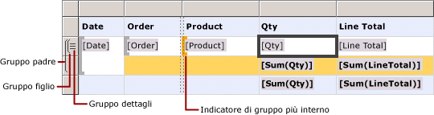
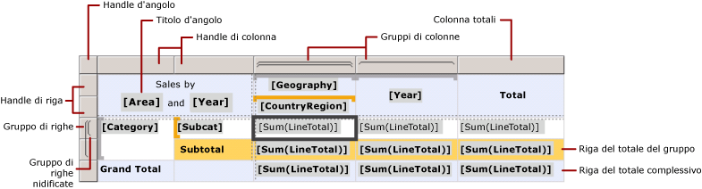
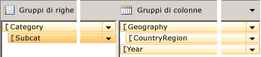

# Celle, righe e colonne dell'area dati Tablix (Generatore report e SSRS)
  Per controllare la modalità di visualizzazione in un report impaginato [!INCLUDE[ssRSnoversion_md](../../includes/ssrsnoversion-md.md)] dei dati di righe e colonne di un'area dati Tablix, è necessario comprendere in che modo specificare righe e colonne relative a dati dettaglio, dati di gruppo, etichette e totali. Per visualizzare i dati, in molti casi è possibile utilizzare le strutture predefinite per una tabella, una matrice o un elenco. Per altre informazioni, vedere [Tabelle &#40;Generatore report e SSRS &#41;](../../reporting-services/report-design/tables-report-builder-and-ssrs.md),  [Creare una matrice (Generatore report e SSRS)](../../reporting-services/report-design/create-a-matrix-report-builder-and-ssrs.md) o [Creare le fatture e forme con elenchi (Generatore report e SSRS)](../../reporting-services/report-design/create-invoices-and-forms-with-lists-report-builder-and-ssrs.md) .  
  
 In un'area dati Tablix i dati di dettaglio sono visualizzati in righe e colonne di dettaglio e i dati raggruppati in righe e colonne di gruppo. Quando si aggiungono gruppi di righe e colonne a un'area dati Tablix, le righe e le colonne in cui visualizzare i dati vengono aggiunte automaticamente. È possibile aggiungerle e rimuoverle manualmente per personalizzare un'area dati Tablix e controllare la modalità di visualizzazione dei dati nel report.  
  
 Per personalizzare un'area dati Tablix, è necessario innanzitutto comprendere come interpretare gli indicatori visivi che appaiono quando si seleziona un'area dati Tablix nell'area di progettazione.  
  
> [!NOTE]  
>  [!INCLUDE[ssRBRDDup](../../includes/ssrbrddup-md.md)]  
  
## Informazioni sugli indicatori visivi della Tablix  
 Gli indicatori visivi presenti in un'area dati Tablix facilitano la visualizzazione dei dati desiderati all'interno dell'area stessa.  
  
### Handle di riga e colonna  
 Quando si seleziona un'area dati Tablix, le icone degli handle di riga e colonna indicano lo scopo di ogni riga e colonna. Gli handle indicano le righe e le colonne che si trovano all'interno o all'esterno di un gruppo. Nella tabella seguente sono indicate alcune visualizzazioni degli handle.  
  
|Icona|Description|  
|----------|-----------------|  
||Solo il gruppo di dettagli nella gerarchia dei gruppi di righe|  
||Un gruppo esterno e il gruppo di dettagli figlio|  
||Un gruppo esterno, un gruppo interno. Nessun gruppo di dettagli|  
||Un gruppo esterno, un gruppo interno e il gruppo di dettagli figlio|  
||Un gruppo esterno con una riga di piè di pagina per i totali e un gruppo interno|  
||Un gruppo esterno con una riga di piè di pagina per i totali, un gruppo interno con una riga piè di pagina per i totali e una riga dettagli|  
||Un gruppo esterno con un'intestazione per le etichette e un piè di pagina per i totali e un gruppo interno. Nessun gruppo di dettagli|  
  
### Righe di gruppo  
 Le righe all'interno di un gruppo si ripetono una volta per ogni valore di gruppo univoco e vengono utilizzate in genere per i riepiloghi di aggregazione. Le righe all'esterno di un gruppo si ripetono una volta rispetto al gruppo e vengono utilizzate per etichette o subtotali. Quando si seleziona una cella della Tablix, gli handle di riga e colonna e le parentesi all'interno dell'area dati Tablix mostrano i gruppi a cui appartiene una cella. In questa figura sono riportati gli indicatori visivi seguenti:  
  
-   Handle di riga e colonna che indicano associazioni di gruppo.  
  
-   Indicatori di gruppo evidenziati che mostrano l'appartenenza al gruppo più interno per una cella selezionata.  
  
-   Indicatori di gruppo che mostrano tutte le appartenenze a gruppi per una cella selezionata.  
  
   
  
### Righe del totale  
 Dopo avere aggiunto gruppi di righe e colonne, è possibile aggiungere una riga per visualizzare i totali per le colonne e una colonna per visualizzare i totali per le righe. Nella figura seguente viene illustrata una matrice con entrambi i gruppi di righe e colonne, oltre a una riga del totale e una colonna del totale.  
  
   
  
### Riquadro di raggruppamento  
 Nel riquadro di raggruppamento sono visualizzati i gruppi di righe e colonne per l'area dati Tablix attualmente selezionata nell'area di progettazione. Nella figura seguente viene illustrato il riquadro di raggruppamento per questa area dati Tablix.  
  
   
  
 Il riquadro Gruppi di righe mostra il gruppo padre Category e il gruppo figlio Subcat. Il riquadro Gruppi di colonne mostra il gruppo padre Geography e il gruppo figlio CountryRegion, nonché il gruppo Year, ovvero un gruppo adiacente a Geography. Quando si seleziona il gruppo Subcat nel riquadro Gruppi di righe, il colore della barra del gruppo assume una sfumatura di arancione più scuro e la cella del membro del gruppo di righe corrispondente viene selezionata nell'area di progettazione.  
  
## Visualizzazione di dati su righe e colonne  
 Le relazioni tra le righe e i gruppi di righe e le colonne e i gruppi di colonne sono identiche. Nella sezione seguente viene descritto come aggiungere righe per visualizzare dati di dettaglio e di gruppo nelle righe di un'area dati Tablix, ma gli stessi principi sono validi anche per l'aggiunta di colonne per la visualizzazione di dati di dettaglio e dati raggruppati.  
  
 Ogni riga in un'area dati Tablix può essere interna o esterna rispetto a ciascun gruppo di righe. Se la riga si trova all'interno di un gruppo di righe, si ripete una volta per ogni valore univoco del gruppo, noto come *istanza di gruppo*. Se la riga si trova all'esterno di un gruppo di righe, si ripete solo una volta in relazione a quel gruppo. Le righe all'esterno di tutti i gruppi di righe sono statiche e si ripetono solo una volta per l'area dati. Un'intestazione di tabella o una riga di piè di pagina, ad esempio, è una riga statica. Le righe che si ripetono con almeno un gruppo sono dinamiche.  
  
 In presenza di gruppi nidificati, una riga può essere all'interno di un gruppo padre, ma all'esterno di un gruppo figlio. La riga si ripete per ogni valore di gruppo nel gruppo padre, ma viene visualizzata solo una volta in relazione al gruppo figlio. Per visualizzare etichette o totali per un gruppo, aggiungere una riga all'esterno del gruppo. Per visualizzare dati che si modificano per ogni istanza di gruppo, aggiungere una riga all'interno del gruppo.  
  
 In presenza di gruppi di dettagli, ogni riga di dettaglio è all'interno del gruppo di dettagli. La riga si ripete per ogni valore nel set di risultati della query del set di dati.  
  
 Per altre informazioni sulle gerarchie dei gruppi, vedere [Informazioni sui gruppi &#40;Generatore report e SSRS&#41;](../../reporting-services/report-design/understanding-groups-report-builder-and-ssrs.md).  
  
 Nella figura seguente viene illustrata un'area dati Tablix con gruppi di dettagli e gruppi di righe nidificati.  
  
   
  
 Per un'area dati Tablix in cui sono visualizzati i dati di dettaglio, il gruppo di dettagli rappresenta il gruppo figlio più interno. Le righe aggiunte a un gruppo di dettagli si ripetono una volta per riga nel set di risultati della query relativa al set di dati collegato a questa area dati Tablix. Nella figura seguente viene illustrata l'ultima pagina del report visualizzabile in cui è possibile vedere le ultime righe di dettaglio e la riga del subtotale per l'ultimo ordine.  
  
   
  
 Per ogni colonna in un'area dati Tablix, sono validi gli stessi principi. Ad esempio, una colonna può essere interna o esterna a ogni gruppo di colonne. Per visualizzare i totali, aggiungere una colonna all'esterno del gruppo.  
  
 Per rimuovere righe e colonne associate a un gruppo, è possibile eliminare il gruppo. Quando si elimina un gruppo, è possibile scegliere se eliminare solo la definizione di gruppo o il gruppo e tutte le righe e le colonne associate. Eliminando solo il gruppo, il layout di righe e colonne nell'area dati viene mantenuto. Quando si elimina il gruppo e le relative righe e colonne, si eliminano tutte le righe e le colonne statiche (incluse le intestazioni e i piè di pagina di gruppo) e le relative righe e le colonne dinamiche (incluse le istanze di gruppo) associate al gruppo.  
  
 Per istruzioni dettagliate sull'aggiunta o l'eliminazione di righe e colonne, vedere [Inserire o eliminare una riga &#40;Generatore report e SSRS&#41;](../../reporting-services/report-design/insert-or-delete-a-row-report-builder-and-ssrs.md) e [Inserire o eliminare una colonna &#40;Generatore report e SSRS&#41;](../../reporting-services/report-design/insert-or-delete-a-column-report-builder-and-ssrs.md).  
  
## Informazioni sulle celle Tablix  
 Le celle Tablix appartengono a una delle quattro aree Tablix: il corpo della Tablix, le aree del gruppo di righe o di colonne della Tablix o l'angolo della Tablix. Anche se in ogni cella è possibile visualizzare potenzialmente qualsiasi valore nel set di dati, la funzione predefinita per ogni cella viene determinata dalla posizione che essa occupa. Per informazioni dettagliate sulle aree Tablix, vedere [Aree dell'area dati Tablix &#40;Generatore report e SSRS&#41;](../../reporting-services/report-design/tablix-data-region-areas-report-builder-and-ssrs.md).  
  
 Per impostazione predefinita, le celle nelle aree di gruppo di righe e colonne Tablix rappresentano membri del gruppo. I membri del gruppo sono organizzati in più strutture ad albero nella definizione del report. La gerarchia dei gruppi di righe si espande orizzontalmente, quella dei gruppi di colonne si espande verticalmente. Queste celle vengono aggiunte automaticamente quando si crea un gruppo e visualizzano in fase di esecuzione i valori univoci per un gruppo.  
  
 Le celle nell'angolo Tablix vengono create in presenza di aree di gruppi di righe e colonne. È possibile unire le celle incluse in questa area per creare un'etichetta o incorporare un altro elemento del report.  
  
 Se le celle dell'area del corpo Tablix si trovano in una riga o una colonna di dettaglio, possono visualizzare dati di dettaglio. Se si trovano in una riga o in una colonna di gruppo, possono visualizzare dati di gruppo aggregati. L'ambito dei dati in una cella è rappresentato dall'intersezione del gruppo di righe e di colonne più interno a cui appartiene la cella.  
  
> [!NOTE]  
>  I dati effettivi visualizzati per ogni cella sono l'espressione valutata per l'elemento del report contenuto nella cella, in genere una casella di testo. In una cella che appartiene a una riga o a una colonna di dettaglio, l'espressione usa come valore predefinito i dati dettaglio, ad esempio **[LineTotal]**. In una cella che non appartiene a una riga o a una colonna di dettaglio, l'espressione usa come valore predefinito una funzione di aggregazione, ad esempio **Sum[LineTotal]**. Se un'espressione non specifica una funzione di aggregazione anche se la cella appartiene a una riga o una colonna di gruppo, viene visualizzato il primo valore del gruppo. Per altre informazioni sulle aggregazioni, vedere [Ambito di espressioni per totali, aggregazioni e raccolte predefinite &#40;Generatore report e SSRS&#41;](../../reporting-services/report-design/expression-scope-for-totals-aggregates-and-built-in-collections.md).  
  
### Unione e divisione delle celle  
 In un'area Tablix, è possibile unire tra loro più celle adiacenti. È possibile, ad esempio, creare celle per etichette che si estendono su più colonne o righe.  
  
 Nell'area dell'angolo Tablix le celle possono essere combinate in una sola direzione alla volta: orizzontalmente tra colonne o verticalmente lungo le righe. Per unire un blocco di celle, unire prima le celle orizzontalmente. Dopo aver unito tutte le celle in una sola cella in ogni riga, selezionare le celle adiacenti (è possibile selezionare tutte le celle adiacenti in una colonna) e unirle.  
  
 Nell'area del corpo Tablix, le celle possono essere unite solo orizzontalmente. L'unione verticale delle celle non è supportata.  
  
 Per altre informazioni, vedere [Unire le celle in un'area dati &#40;Generatore report e SSRS&#41;](../../reporting-services/report-design/merge-cells-in-a-data-region-report-builder-and-ssrs.md).  
  
 È possibile dividere una cella precedentemente unita. Le celle possono essere divise orizzontalmente nelle colonne o verticalmente tra le righe. Per dividere una cella in un blocco di celle, dividere prima la cella in orizzontale, quindi in verticale, ripetendo l'operazione più volte fino al raggiungimento del risultato desiderato.  
  
## Vedere anche  
 [Area dati Tablix &#40;Generatore report e SSRS&#41;](../../reporting-services/report-design/tablix-data-region-report-builder-and-ssrs.md)  
  
  
