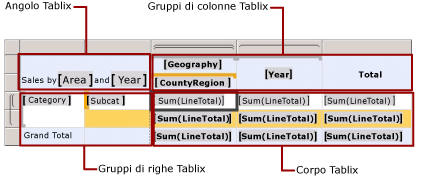

# Informazioni sui gruppi (Generatore report e SSRS)
  In un report impaginato di [!INCLUDE[ssRSnoversion_md](../../includes/ssrsnoversion-md.md)] un gruppo è un set di dati denominato che deriva dal set di dati del report associato a un’area dati. In sostanza, organizza una vista di un set di dati del report. Tutti i gruppi in un'area dati specificano viste diverse dello stesso set di dati del report.  
  
 Per facilitare una comprensione visiva di un gruppo, fare riferimento alla figura seguente che mostra l'area dati Tablix in Anteprima. Nella figura i gruppi di righe classificano il set di dati in base al tipo di prodotto e i gruppi di colonne classificano il set di dati in base all'area geografica e all'anno.  
  
   
  
 Nelle sezioni seguenti verranno illustrati i vari aspetti dei gruppi.  
  
> [!NOTE]  
>  [!INCLUDE[ssRBRDDup](../../includes/ssrbrddup-md.md)]  
  
## Composizione di un gruppo  
 Un gruppo è composto da un nome e da un set di espressioni di raggruppamento specificate dall'utente. Il set di espressioni di raggruppamento può essere un riferimento di campo del set di dati singolo o una combinazione di più espressioni. In fase di esecuzione, le espressioni di raggruppamento vengono combinate, se il gruppo ha più espressioni, e vengono applicate ai dati in un gruppo. Si supponga ad esempio di avere un gruppo che utilizza un campo data per organizzare i dati nell'area dati. In fase di esecuzione, i dati vengono organizzati in base alla data; quindi i valori degli altri set di dati vengono visualizzati e sommati per ogni data.  
  
## Creazione dei gruppi  
 Nella maggior parte dei casi Generatore report e Progettazione report consentono di creare automaticamente un gruppo durante la progettazione di un'area dati. Per una tabella, una matrice o un elenco, i gruppi vengono creati al momento del rilascio dei campi nel riquadro di raggruppamento. Per un grafico, i gruppi vengono creati al momento del rilascio dei campi nelle aree di rilascio del grafico. Per un misuratore, è necessario utilizzare la finestra di dialogo Proprietà misuratore. Per una tabella, una matrice o un elenco, è possibile anche creare manualmente un gruppo. Per altre informazioni, vedere [Aggiunta o eliminazione di un gruppo in un'area dati &#40;Generatore report e SSRS&#41;](../../reporting-services/report-design/add-or-delete-a-group-in-a-data-region-report-builder-and-ssrs.md). Per un esempio di aggiunta di gruppi durante la creazione di un report, vedere [Esercitazione: Creazione di un report tabella semplice &#40;Generatore report&#41;](../../reporting-services/tutorial-creating-a-basic-table-report-report-builder.md) o [Creare un report tabella semplice &#40;esercitazione su SSRS&#41;](../../reporting-services/create-a-basic-table-report-ssrs-tutorial.md).  
  
## Modalità di modifica di un gruppo  
 Dopo aver creato un gruppo, è possibile impostare proprietà specifiche dell'area dati, ad esempio le espressioni di filtro e di ordinamento, le interruzioni di pagina e le variabili di gruppo per conservare i dati specifici dell'ambito. Per altre informazioni, vedere [Filtro, raggruppamento e ordinamento di dati &#40;Generatore report e SSRS&#41;](../../reporting-services/report-design/filter-group-and-sort-data-report-builder-and-ssrs.md).  
  
 Per modificare un gruppo esistente, aprire la finestra di dialogo delle proprietà di gruppo appropriata. È possibile modificare il nome del gruppo, nonché specificare espressioni di raggruppamento basate su uno o più campi o su un parametro del report che specifica un valore in fase di esecuzione. È inoltre possibile basare un gruppo su un set di espressioni, ad esempio il set delle espressioni che specificano intervalli di età per i dati demografici. Per altre informazioni, vedere [Esempi di espressioni di raggruppamento &#40;Generatore report e SSRS&#41;](../../reporting-services/report-design/group-expression-examples-report-builder-and-ssrs.md).  
  
> [!NOTE]  
>  Se si modifica il nome di un gruppo, è necessario aggiornare manualmente qualsiasi espressione di raggruppamento che faccia riferimento al nome precedente.  
  
## Organizzazione dei gruppi  
 La comprensione dell'organizzazione dei gruppi consente di progettare aree dati che includono viste diverse degli stessi dati attraverso l'indicazione di espressioni di raggruppamento identiche.  
  
 I gruppi vengono organizzati internamente come membri di una o più gerarchie per ogni area dati. Una gerarchia di gruppi include gruppi padre/figlio nidificati e può contenere gruppi adiacenti.  
  
 Se i gruppi padre/figlio vengono considerati come una struttura ad albero, ogni gerarchia di gruppi rappresenta una foresta di strutture ad albero. Un'area dati Tablix include una gerarchia di gruppi di righe e una gerarchia di gruppi di colonne. I dati associati ai membri del gruppo di righe si espandono orizzontalmente e i dati associati ai membri del gruppo di colonne si espande verticalmente nella pagina. Nel riquadro di raggruppamento sono visualizzati i membri dei gruppi di righe e colonne per l'area dati Tablix attualmente selezionata nell'area di progettazione. Per altre informazioni, vedere [Riquadro di raggruppamento &#40;Generatore report&#41;](../../reporting-services/report-design/grouping-pane-report-builder.md).  
  
 Un'area dati del grafico include una gerarchia di gruppi di categorie e una gerarchia di gruppi di serie. I membri del gruppo di categorie sono visualizzati sull'asse della categoria e i membri del gruppo di serie sono visualizzati sull'asse della serie.  
  
 Anche se in genere non è necessario per le aree dati del misuratore, i gruppi consentono di specificare la modalità di raggruppamento dei dati da aggregare nel misuratore.  
  
## Tipi di gruppi disponibili per area dati  
 Le aree dati che si espandono come una griglia supportano gruppi diversi rispetto alle aree dati in cui sono visualizzati i dati di riepilogo. Pertanto, un'area dati Tablix e le tabelle, gli elenchi e le matrici basate su di essa supportano gruppi diversi rispetto a un grafico o un misuratore. Nelle sezioni seguenti verrà illustrato il tipo e lo scopo del raggruppamento in ogni tipo di area dati.  
  
> [!NOTE]  
>  Sebbene i gruppi abbiano nomi diversi in aree dati diverse, i principi alla base della creazione e dell'utilizzo dei gruppi sono gli stessi. Quando si crea un gruppo per un'area dati, si specifica una modalità di organizzazione dei dati di dettaglio dal set di dati collegato all'area dati. Ogni area dati supporta una struttura di gruppo su cui visualizzare i dati raggruppati.  
  
### Gruppi in un'area dati Tablix: gruppi di dettagli, di righe e di colonne  
 Come illustrato in precedenza in questo argomento, un'area dati Tablix consente di organizzare i dati in gruppi per righe o colonne. I gruppi di righe e di colonne non sono tuttavia gli unici gruppi disponibili in un'area dati Tablix. Quest'area dati può includere i tipi di gruppi seguenti:  
  
-   **Gruppo di dettagli** Il gruppo di dettagli è composto da tutti i dati derivanti da un set di dati del report dopo l'applicazione da parte di Generatore report o Progettazione report di filtri del set di dati e dell'area dati. Si tratta pertanto dell'unico gruppo in cui non è inclusa alcuna espressione di raggruppamento.  
  
     In pratica il gruppo di dettagli specifica i dati che vengono visualizzati quando si esegue una query del set di dati in una finestra Progettazione query. Si supponga ad esempio di disporre di una query che recupera tutte le colonne da una tabella degli ordini di vendita. I dati presenti in questo gruppo di dettagli includeranno quindi tutti i valori di ogni riga per tutte le colonne nella tabella, nonché i valori relativi a qualsiasi campo del set di dati calcolato appena creato.  
  
    > [!NOTE]  
    >  I dati in un gruppo di dettagli possono includere anche aggregazioni server, ovvero aggregazioni calcolate nell'origine dati e recuperate nella query. Per impostazione predefinita, in Generatore report e Progettazione report le aggregazioni server vengono considerate come dati dettaglio, a meno che nel report non sia inclusa un'espressione in cui viene utilizzata la funzione Aggregate. Per altre informazioni, vedere [Funzione di aggregazione](../../reporting-services/report-design/report-builder-functions-aggregate-function.md).  
  
     Per impostazione predefinita, quando si aggiunge una tabella o un elenco al report, tramite Generatore report e Progettazione report viene creato automaticamente il gruppo di dettagli e viene aggiunta una riga per visualizzare i dati dettaglio. Per impostazione predefinita, quando si aggiungono campi del set di dati alle celle della riga, vengono visualizzate espressioni semplici per i campi, ad esempio [Sales]. Quando si visualizza l'area dati, la riga di dettaglio si ripete una volta per ogni valore del set di risultati.  
  
-   **Gruppi di righe e gruppi di colonne** È possibile organizzare i dati in gruppi per righe o colonne. I gruppi di righe si espandono verticalmente in una pagina, mentre i gruppi di colonne si espandono orizzontalmente. È possibile nidificarli, raggruppandoli ad esempio prima per [Year], quindi per [Quarter], infine per [Month]. Possono inoltre essere adiacenti, raggruppati ad esempio su [Territory] e indipendentemente su [ProductCategory].  
  
     Quando si crea un gruppo per un'area dati, tramite Generatore report e Progettazione report vengono aggiunte automaticamente al suo interno righe o colonne e vengono utilizzate queste ultime per visualizzare i dati di gruppo.  
  
-   **Gruppi di gerarchie ricorsive** Un gruppo di gerarchie ricorsive consente di organizzare dati da un singolo set di dati del report in cui sono inclusi più livelli. Ad esempio in un gruppo di gerarchie ricorsive si potrebbe visualizzare la gerarchia di un'organizzazione, quale [Employee] che fa riferimento a [Employee]. [!INCLUDE[ssRSnoversion](../../includes/ssrsnoversion-md.md)] fornisce proprietà di gruppo e funzioni predefinite per la creazione di gruppi per questo tipo di dati del report. Per altre informazioni, vedere [Creazione di gruppi di gerarchie ricorsive &#40;Generatore report e SSRS&#41;](../../reporting-services/report-design/creating-recursive-hierarchy-groups-report-builder-and-ssrs.md).  
  
 Nell'elenco seguente vengono riepilogati i diversi utilizzi dei dati per ogni area dati:  
  
-   **Tabella** Consente di definire gruppi di righe annidati, gruppi di righe adiacenti e i gruppi di righe della gerarchia ricorsiva (ad esempio per un organigramma). Per impostazione predefinita, una tabella include un gruppo di dettagli. Per aggiungere i gruppi, trascinare i campi del set di dati nel riquadro di raggruppamento per una tabella selezionata.  
  
-   **Matrice** Consente di definire gruppi di righe e di colonne annidati e i gruppi di righe e di colonne adiacenti. Per aggiungere i gruppi, trascinare i campi del set di dati nel riquadro di raggruppamento per una matrice selezionata.  
  
-   **Elenco** Per impostazione predefinita, supporta il gruppo di dettagli. In genere viene utilizzato per supportare un livello del raggruppamento. Per aggiungere i gruppi, trascinare i campi del set di dati nel riquadro di raggruppamento per un elenco selezionato.  
  
 Dopo avere aggiunto un gruppo, gli handle di riga e colonna dell'area dati cambiano per riflettere l'appartenenza a un gruppo. Quando si elimina un gruppo, è possibile scegliere se eliminare solo la definizione di gruppo o il gruppo e tutte le righe e le colonne associate. Per altre informazioni, vedere [Celle, righe e colonne dell'area dati Tablix &#40;Generatore report e SSRS&#41;](../../reporting-services/report-design/tablix-data-region-cells-rows-and-columns-report-builder-and-ssrs.md).  
  
 Per limitare i dati da visualizzare o utilizzare in calcoli relativi ai dati di dettaglio o di gruppo, impostare dei filtri sul gruppo. Per altre informazioni, vedere [Aggiungere filtri per set di dati, aree dati e gruppi &#40;Generatore report e SSRS&#41;](../../reporting-services/report-design/add-dataset-filters-data-region-filters-and-group-filters.md).  
  
 Per impostazione predefinita, quando si crea un gruppo, l'espressione di ordinamento per il gruppo equivale all'espressione di raggruppamento. Per modificare l'ordinamento, modificare l'espressione di ordinamento. Per altre informazioni, vedere [Filtro, raggruppamento e ordinamento di dati &#40;Generatore report e SSRS&#41;](../../reporting-services/report-design/filter-group-and-sort-data-report-builder-and-ssrs.md).  
  
#### Informazioni sull'appartenenza a un gruppo per celle della Tablix  
 Le celle in una riga o colonna di un'area dati Tablix possono appartenere a più gruppi di righe e di colonne. Quando si definisce un'espressione nella casella di testo di una cella che utilizza una funzione di aggregazione (ad esempio `=Sum(Fields!FieldName.Value`), l'ambito del gruppo predefinito per una cella è il gruppo figlio più interno a cui appartiene. Quando una cella appartiene sia a gruppi di righe che di colonne, l'ambito è rappresentato dai gruppi più interni di entrambe le categorie. È possibile anche scrivere espressioni che calcolino i subtotali di aggregazione di cui viene calcolato l'ambito per un gruppo rispetto a un altro set di dati. È possibile ad esempio calcolare la percentuale di un gruppo rispetto al gruppo di colonne e a tutti i dati dell'area dati (ad esempio `=Sum(Fields!FieldName.Value)/Sum(Fields!FieldName.Value,"ColumnGroup")`). Per altre informazioni, vedere [Area dati Tablix &#40;Generatore report e SSRS&#41;](../../reporting-services/report-design/tablix-data-region-report-builder-and-ssrs.md) e [Ambito di espressioni per totali, aggregazioni e raccolte predefinite &#40;Generatore report e SSRS&#41;](../../reporting-services/report-design/expression-scope-for-totals-aggregates-and-built-in-collections.md).  
  
## Vedere anche  
 [Aggiunta o eliminazione di un gruppo in un'area dati &#40;Generatore report e SSRS&#41;](../../reporting-services/report-design/add-or-delete-a-group-in-a-data-region-report-builder-and-ssrs.md)   
 [Aggiungere un totale a un gruppo o a un'area dati Tablix &#40;Generatore report e SSRS&#41;](../../reporting-services/report-design/add-a-total-to-a-group-or-tablix-data-region-report-builder-and-ssrs.md)   
 [Ordinamento dei dati in un'area dati &#40;Generatore report e SSRS&#41;](../../reporting-services/report-design/sort-data-in-a-data-region-report-builder-and-ssrs.md)   
 [Azione di drill-down &#40;Generatore report e SSRS &#41;](../../reporting-services/report-design/drilldown-action-report-builder-and-ssrs.md)   
 [Tabelle, matrici ed elenchi &#40;Generatore report e SSRS&#41;](../../reporting-services/report-design/tables-matrices-and-lists-report-builder-and-ssrs.md)  
  
  
