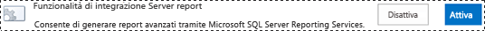
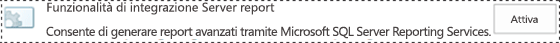
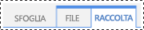
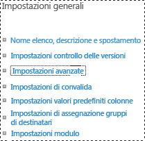
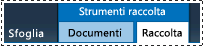

# Aggiungere i tipi di contenuto di Reporting Services a una raccolta di SharePoint

[!INCLUDE[ssrs-appliesto](../../includes/ssrs-appliesto.md)] [!INCLUDE[ssrs-appliesto-2016](../../includes/ssrs-appliesto-2016.md)] [!INCLUDE[ssrs-appliesto-sharepoint-2013-2016i](../../includes/ssrs-appliesto-sharepoint-2013-2016.md)] [!INCLUDE[ssrs-appliesto-not-pbirsi](../../includes/ssrs-appliesto-not-pbirs.md)]

[!INCLUDE [ssrs-previous-versions](../../includes/ssrs-previous-versions.md)]

[!INCLUDE[ssRSnoversion](../../includes/ssrsnoversion-md.md)] dispone di tipi di contenuto di SharePoint predefiniti usati per gestire file di origini dati condivise (con estensione rsds), modelli di report (con estensione smdl) e file di definizione dei report di Generatore report (con estensione rdl). Se si aggiungono i tipi di contenuto **Report di Generatore report**, **Modello di report**e **Origine dati report** a una raccolta, sarà possibile utilizzare il comando **Nuovo** per creare nuovi documenti del tipo desiderato.

> [!NOTE]
> L'integrazione di Reporting Services con SharePoint non è più disponibile nelle versioni successive a SQL Server 2016.

 Per aggiungere tipi di contenuto a una raccolta, è necessario essere un amministratore del sito o disporre del livello di autorizzazione Controllo completo.  
  
 I tipi di contenuto di [!INCLUDE[ssRSnoversion](../../includes/ssrsnoversion-md.md)] e la relativa gestione saranno abilitati automaticamente in tutte le raccolte documenti per le raccolte siti esistenti create dai tipi di modelli di siti seguenti:  
  
-   **Centro business intelligence**  
  
 Per i siti creati dopo l'integrazione di [!INCLUDE[ssRSnoversion](../../includes/ssrsnoversion-md.md)] non saranno abilitati i tipi di contenuto di [!INCLUDE[ssRSnoversion](../../includes/ssrsnoversion-md.md)] .  
  
> [!TIP]  
>  Se i tipi di contenuto di una raccolta **non** sono stati già configurati, abilitare innanzitutto la relativa gestione, quindi abilitare i tipi di contenuto di [!INCLUDE[ssRSnoversion](../../includes/ssrsnoversion-md.md)] . Vedere le procedure per abilitare la gestione dei tipi di contenuto in una singola raccolta documenti.  
  
 **Breve video:** [(SSRS) Enabling Content Types in SharePoint2010.wmv](http://www.youtube.com/watch?v=yqhm3DrtT1w) (Abilitazione dei tipi di contenuto di SSRS in SharePoint2010.wm) (http://www.youtube.com/watch?v=yqhm3DrtT1w).  
  
 **Contenuto dell'argomento:**  
  
-   [Abilitare i tipi di contenuto in tutte le raccolte documenti in un Centro business intelligence esistente](#bkmk_enable_all)  
  
-   [Per abilitare la gestione dei tipi di contenuto per una singola raccolta documenti (SharePoint 2013)](#bkmk_enable_content_management)  
  
-   [Per aggiungere i tipi di contenuto di Reporting Services (SharePoint 2013)](#bkmk_add_single)  
  
-   [Per abilitare la gestione dei tipi di contenuto per una singola raccolta documenti (SharePoint 2010)](#bkmk_enable_content_management_2010)  
  
-   [Per aggiungere tipi di contenuto del server di report (SharePoint 2010)](#bkmk_add_single_2010)  
  
-   [Per abilitare i tipi di contenuto e la gestione del contenuto per più siti di Business Intelligence](#bkmk_enable_multiple_sites)  
  
##   Abilitare i tipi di contenuto in tutte le raccolte documenti in un Centro business intelligence esistente  
  
1.  Per abilitare i tipi di contenuto e la gestione del contenuto in tutte le raccolte documenti in un sito di **Centro business intelligence** esistente, è possibile attivare o disattivare la funzionalità di integrazione di [!INCLUDE[ssRSnoversion](../../includes/ssrsnoversion-md.md)] .  
  
2.  Passare a **Impostazioni sito**.  
  
    -   In SharePoint 2013 fare clic sull'icona **Impostazioni** .   
  
    -   In SharePoint 2010 fare clic su **Azioni sito**, quindi su **Impostazioni sito**.  
  
3.  Fare clic su **Caratteristiche raccolta siti**.  
  
4.  Individuare **Funzionalità di integrazione Server report** e fare clic su **Disattiva**.  
  
       
  
5.  Aggiornare il browser, quindi fare clic su **Attiva** per **Funzionalità di integrazione Server report**.  
  
       
  
##   Per abilitare la gestione dei tipi di contenuto per una singola raccolta documenti (SharePoint 2013)  
  
1.  Aprire la raccolta per cui si desidera abilitare più tipi di contenuto.  
  
2.  Nella barra multifunzione fare clic su **Raccolta** .  
  
       
  
3.  Sulla barra multifunzione **Raccolta** fare clic su **Impostazioni raccolta**. Se non viene visualizzato **Impostazioni raccolta** o il pulsante è disabilitato, non si dispone delle autorizzazioni necessarie per configurare le impostazioni della raccolta, inclusi i tipi di contenuto.  
  
       
  
4.  Nella sezione **Impostazioni generali** fare clic su **Impostazioni avanzate**.  
  
       
  
5.  Nella sezione **Tipi di contenuto** selezionare **Sì** per consentire la gestione dei tipi di contenuto.  
  
6.  Fare clic su **OK**.  
  
##   Per aggiungere i tipi di contenuto di Reporting Services (SharePoint 2013)  
  
1.  Aprire la raccolta per cui si desidera aggiungere tipi di contenuto di Reporting Services.  
  
2.  Sulla barra multifunzione fare clic su **Raccolta**.  
  
3.  Fare clic su **Impostazioni raccolta**.  
  
4.  In **Tipi di contenuto**fare clic su **Aggiungi da tipi di contenuto del sito esistenti**.  
  
5.  In **Seleziona tipi di contenuto del sito da**selezionare **Tipi di contenuto SQL Server Reporting Services**.  
  
6.  Nell'elenco **Tipi di contenuto del sito disponibili** selezionare **Generatore report**, quindi fare clic su **Aggiungi** per spostare il tipo di contenuto selezionato nell'elenco **Tipi di contenuto da aggiungere** .  
  
7.  Per aggiungere i tipi di contenuto **Modello di report** e **Origine dati report** , ripetere il passaggio precedente.  
  
8.  Dopo l'aggiunta dei tipi di contenuto, scegliere **OK**.  
  
    > [!NOTE]  
    >  Se il gruppo dei tipi di contenuto di [!INCLUDE[ssRSnoversion](../../includes/ssrsnoversion-md.md)] **Tipi di contenuto SQL Server Reporting Services** non è visibile nella pagina **Aggiungi tipi di contenuto** , viene soddisfatta una delle condizioni seguenti:  
  
    -   Il componente aggiuntivo [!INCLUDE[ssRSnoversion](../../includes/ssrsnoversion-md.md)] per prodotti SharePoint non è stato installato. Per altre informazioni, vedere [Installare o disinstallare il componente aggiuntivo Reporting Services per SharePoint](../../reporting-services/install-windows/install-or-uninstall-the-reporting-services-add-in-for-sharepoint.md). Questo argomento include informazioni sull'installazione del componente aggiuntivo e sull'esecuzione passaggio per passaggio di un'installazione di tipo "solo file" del componente aggiuntivo per risolvere i problemi.  
  
    -   Il componente aggiuntivo viene installato ma la funzionalità della raccolta siti **Funzionalità di integrazione Server report** non sarà attiva. Verificare la funzionalità della raccolta siti in **Impostazioni sito**.  
  
    -   Tutti i tipi di contenuto di [!INCLUDE[ssRSnoversion](../../includes/ssrsnoversion-md.md)] sono già stati aggiunti alla raccolta. Se tutti i tipi di contenuto fanno parte di una raccolta, il gruppo viene rimosso dalla pagina **Aggiungi tipi di contenuto** . Se si elimina uno o più tipi di contenuto di [!INCLUDE[ssRSnoversion](../../includes/ssrsnoversion-md.md)] , il gruppo **Tipi di contenuto SQL Server Reporting Services** sarà visibile nella pagina **Aggiunti tipi di contenuto** .  
  
##   Per abilitare la gestione dei tipi di contenuto per una singola raccolta documenti (SharePoint 2010)  
  
1.  Aprire la raccolta per cui si desidera abilitare più tipi di contenuto. Sulla barra dei menu della raccolta vengono visualizzati i menu seguenti: **Nuovo**, **Carica**, **Azioni**e **Impostazioni**. Se il menu **Impostazioni**non viene visualizzato, non si dispone delle autorizzazioni necessarie per l'aggiunta di un tipo di contenuto.  
  
2.  Sulla barra multifunzione **Strumenti raccolta** fare clic su **Raccolta**.  
  
       
  
3.  Nel gruppo della barra multifunzione **Impostazioni** , fare clic su **Impostazioni raccolta**.  
  
4.  Fare clic su **Impostazioni avanzate**in **Impostazioni generali**.  
  
5.  Nella sezione **Tipi di contenuto** selezionare **Sì** per consentire la gestione dei tipi di contenuto.  
  
6.  Fare clic su **OK**.  
  
##   Per aggiungere tipi di contenuto del server di report (SharePoint 2010)  
  
1.  Aprire la raccolta per cui si desidera aggiungere tipi di contenuto di Reporting Services.  
  
2.  Nelle schede della barra multifunzione **Strumenti raccolta** , fare clic sulla **scheda Raccolta**.  
  
3.  Nel gruppo della barra multifunzione **Impostazioni** , fare clic su **Impostazioni raccolta**.  
  
4.  In **Tipi di contenuto**fare clic su **Aggiungi da tipi di contenuto del sito esistenti**.  
  
5.  In **Seleziona tipi di contenuto del sito da** nella sezione **Selezione tipi di contenuto**fare clic sulla freccia per selezionare **Tipi di contenuto SQL Server Reporting Services**.  
  
6.  Nell'elenco **Tipi di contenuto del sito disponibili** selezionare **Generatore report**, quindi fare clic su **Aggiungi** per spostare il tipo di contenuto selezionato nell'elenco **Tipi di contenuto da aggiungere** .  
  
7.  Per aggiungere i tipi di contenuto **Modello di report** e **Origine dati report** , ripetere il passaggio precedente.  
  
8.  Dopo l'aggiunta dei tipi di contenuto, scegliere **OK**.  
  
##   Per abilitare i tipi di contenuto e la gestione del contenuto per più siti di Business Intelligence  
  
1.  Per i server di report SQL Server Reporting Services 2008 e 2008 R2, è possibile abilitare i tipi di contenuto e la gestione del contenuto per più siti di Centro business intelligence:  
  
2.  In Amministrazione centrale SharePoint fare clic su **Impostazioni generali applicazione**. Nella sezione **SQL Server Reporting Services (2008 e 2008 R2)** fare clic su **Integrazione Reporting Services**.  
  
       
  
3.  Fare clic su **Attiva funzionalità in tutte le raccolte siti esistenti**.  
  
       
  
4.  Scegliere **OK**.  
  
## Vedere anche  
 [Informazioni di riferimento sulle autorizzazioni relative a elenchi e siti di SharePoint per gli elementi del server di report](../../reporting-services/security/sharepoint-site-and-list-permission-reference-for-report-server-items.md)   
 [Avviare Generatore report](../../reporting-services/report-builder/start-report-builder.md)  
  
  
