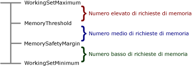

# <a name="configure-available-memory-for-report-server-applications"></a>Configurare la memoria disponibile per applicazioni del server di report
  Sebbene [!INCLUDE[ssRSnoversion](../../includes/ssrsnoversion-md.md)] sia in grado di usare tutta la memoria disponibile, è possibile ignorare il comportamento predefinito configurando un limite superiore per la quantità totale di risorse di memoria allocate per applicazioni server di [!INCLUDE[ssRSnoversion](../../includes/ssrsnoversion-md.md)] . È inoltre possibile impostare soglie in modo che il server di report modifichi il modo in cui assegna la priorità ed elabora le richieste in base all'utilizzo basso, medio o alto della memoria. Se i livelli di utilizzo della memoria non sono elevati, il server di report risponde assegnando una priorità leggermente superiore all'elaborazione dei report interattiva o su richiesta. Se invece i livelli di utilizzo della memoria sono elevati, il server di report utilizza più tecniche per rimanere operativo utilizzando le limitate risorse disponibili.  
  
 In questo argomento vengono descritte le impostazioni di configurazione che è possibile specificare e le modalità di risposta del server quando l'utilizzo della memoria diventa un fattore da considerare nell'elaborazione delle richieste.  
  
## <a name="memory-management-policies"></a>Criteri di gestione della memoria  
 [!INCLUDE[ssRSnoversion](../../includes/ssrsnoversion-md.md)] rispetta i vincoli relativi alle risorse di sistema regolando la quantità di memoria allocata per applicazioni e tipi di elaborazione di richieste specifici. Di seguito vengono riportate le applicazioni eseguite nel servizio del server di report soggette alla gestione della memoria:  
  
-   Gestione report, un'applicazione Web front-end per il server di report.  
  
-   Servizio Web ReportServer, utilizzato per l'elaborazione interattiva di report e per richieste su richiesta.  
  
-   Applicazione di elaborazione in background utilizzata per l'elaborazione pianificata di report, il recapito di sottoscrizioni e la manutenzione di database.  
  
 I criteri di gestione della memoria si applicano al servizio del server di report nel complesso e non alle applicazioni singole eseguite all'interno del processo.  
  
 Se l'utilizzo di memoria nel sistema non è elevato, prima di ricevere le richieste ogni applicazione server richiede una parte di memoria all'avvio per garantire prestazioni ottimali in caso di ricezione delle richieste stesse. Man mano che l'utilizzo di memoria aumenta, il server di report regola il modello di processo come descritto nella tabella seguente.  
  
|Utilizzo della memoria|Risposta del server|  
|---------------------|---------------------|  
|Bassa|L'elaborazione delle richieste correnti continua e le nuove richieste vengono accettate quasi sempre. Alle richieste dirette all'applicazione di elaborazione in background viene assegnata una priorità più bassa rispetto a quella assegnata alle richieste dirette al servizio Web ReportServer.|  
|Media|L'elaborazione delle richieste correnti continua e le nuove richieste potrebbero essere accettate. Alle richieste dirette all'applicazione di elaborazione in background viene assegnata una priorità più bassa rispetto a quella assegnata alle richieste dirette al servizio Web ReportServer. Le allocazioni di memoria per le tre applicazioni server sono ridotte, con riduzioni relativamente maggiori per l'elaborazione in background in modo da aumentare la memoria disponibile per le richieste del servizio Web.|  
|Alto|L'allocazione della memoria è ridotta ulteriormente. Le applicazioni server che richiedono una quantità maggiore di memoria vengono negate, le richieste correnti vengono rallentate e completate in un tempo più lungo, mentre le nuove richieste non sono accettate. Il server di report esegue lo swapping dei file di dati in memoria sul disco.<br /><br /> Se i vincoli relativi alla memoria aumentano e non è più disponibile memoria per gestire le nuove richieste, il server di report restituirà l'errore HTTP 503 relativo alla non disponibilità del server, mentre le richieste correnti verranno completate. In alcuni casi i domini applicazione potrebbero essere riciclati per ridurre immediatamente l'utilizzo della memoria.|  
  
 Sebbene non sia possibile personalizzare le risposte del server di report per i diversi scenari di utilizzo della memoria, è possibile specificare impostazioni di configurazione che definiscono i limiti che separano le risposte relative a un utilizzo basso, medio o alto della memoria stessa.  
  
## <a name="when-to-customize-memory-management-settings"></a>Personalizzazione delle impostazioni di gestione della memoria  
 Le impostazioni predefinite specificano intervalli disuguali per l'utilizzo basso, medio e alto della memoria. Per impostazione predefinita, l'area riservata all'utilizzo della memoria basso è maggiore di quelle riservate per l'utilizzo della memoria medio e alto. Questo tipo di configurazione è ottimale per l'elaborazione di carichi distribuiti uniformemente o che aumentano o diminuiscono in modo incrementale. In questo scenario la transizione tra aree è graduale e il server di report dispone di tempo sufficiente per regolare la propria risposta.  
  
 La modifica delle impostazioni predefinite è utile se nel modello di carico sono presenti picchi. Quando nel carico di elaborazione si verificano picchi improvvisi, il server di report potrebbe rapidamente passare da una situazione in cui la memoria non viene utilizzata a una in cui si verificano errori di allocazione di memoria. Questo problema potrebbe verificarsi se sono presenti più istanze simultanee di un report che utilizza una quantità di memoria elevata che iniziano nello stesso momento. Per gestire questo tipo di carico di elaborazione, è possibile fare in modo che il server di report risponda in base all'utilizzo medio o alto della memoria il prima possibile in modo da rallentare l'elaborazione. In questo modo è possibile completare più richieste. A questo scopo, è necessario diminuire il valore di **MemorySafetyMargin** in modo che l'area relativa all'uso basso della memoria sia minore rispetto alle altre. In questo modo verrà data la precedenza alle risposte relative a un utilizzo medio e alto della memoria.  
  
## <a name="configuration-settings-for-memory-management"></a>Impostazioni di configurazione per la gestione della memoria  
 Le impostazioni di configurazione che controllano l'allocazione di memoria del server di report includono **WorkingSetMaximum**, **WorkingSetMinimum**, **MemorySafetyMargin**e **MemoryThreshold**.  
  
-   **WorkingSetMaximum** e **WorkingSetMinimum** definiscono l'intervallo di memoria disponibile. È possibile configurare queste impostazioni per specificare un intervallo di memoria disponibile per le applicazioni del server di report. Questa operazione può essere utile se si ospitano più applicazioni nello stesso computer e si determina che il server di report utilizza una quantità non proporzionata di risorse di sistema rispetto alle altre applicazioni.  
  
-   **MemorySafetyMargin** e **MemoryThreshold** consentono di impostare i limiti per i livelli basso, medio e alto di uso della memoria. Per ogni stato, in [!INCLUDE[ssRSnoversion](../../includes/ssrsnoversion-md.md)] vengono eseguite azioni correttive per garantire che l'elaborazione del report e le altre richieste siano gestire in modo appropriato rispetto alla quantità di memoria disponibile nel computer. È possibile specificare impostazioni di configurazione per stabilire il limite tra i livelli basso, medio e alto di utilizzo della memoria.  
  
     Sebbene sia possibile modificare le impostazioni di configurazione, questa operazione non migliorerà le prestazioni di elaborazione del report. La modifica delle impostazioni di configurazione è utile solo se le richieste vengono rilasciate prima che siano completate. Il modo migliore per ottimizzare le prestazioni del server consiste nel distribuire il server di report o le relative applicazioni singole in computer dedicati.  
  
 Nella figura seguente viene illustrato il modo in cui le impostazioni vengono utilizzate insieme per distinguere tra i livelli basso, medio e alto di utilizzo della memoria:  
  
   
  
 La tabella seguente descrive le impostazioni **WorkingSetMaximum**, **WorkingSetMinimum**, **MemorySafetyMargin**e **MemoryThreshold** . Le impostazioni di configurazione sono specificate nel file [RSReportServer.config](../../reporting-services/report-server/rsreportserver-config-configuration-file.md).  
  
|Elemento|Description|  
|-------------|-----------------|  
|**WorkingSetMaximum**|Consente di specificare una soglia di memoria oltre la quale non viene concessa alcuna allocazione di memoria alle applicazione del server di report che la richiedano.<br /><br /> Per impostazione predefinita, il server di report imposta **WorkingSetMaximum** sulla quantità di memoria disponibile nel computer. Questo valore viene rilevato al momento dell'avvio del servizio.<br /><br /> Questa impostazione non è presente nel file RSReportServer.config a meno che non venga aggiunta manualmente. Se si desidera che il server di report utilizzi una quantità minore di memoria, è possibile modificare il file RSReportServer.config e aggiungere l'elemento e il valore. I valori validi sono compresi nell'intervallo da 0 al numero intero massimo. Questo valore è espresso in KB.<br /><br /> Quando viene raggiunto il valore **WorkingSetMaximum** , il server di report non accetta altre richieste. Le richieste attualmente in corso vengono completate, mentre le nuove richieste vengono accettate solo quando l'uso di memoria scende al di sotto del valore specificato mediante **WorkingSetMaximum**.<br /><br /> Se le richieste esistenti continuano a usare ulteriore memoria dopo che il valore **WorkingSetMaximum** è stato raggiunto, tutti i domini applicazione del server di report verranno riciclati. Per ulteriori informazioni, vedere [Application Domains for Report Server Applications](../../reporting-services/report-server/application-domains-for-report-server-applications.md).|  
|**WorkingSetMinimum**|Consente di specificare un limite inferiore per l'utilizzo della risorsa. Se la quantità di memoria complessiva utilizzata è inferiore a questo limite, il server di report non rilascerà memoria.<br /><br /> Per impostazione predefinita, il valore viene calcolato all'avvio del servizio. Il calcolo viene eseguito in base a una richiesta di allocazione di memoria iniziale pari al 60 percento di **WorkingSetMaximum**.<br /><br /> Questa impostazione non è presente nel file RSReportServer.config a meno che non venga aggiunta manualmente. Se si desidera personalizzare questo valore, è necessario aggiungere l'elemento **WorkingSetMinimum** al file RSReportServer.config. I valori validi sono compresi nell'intervallo da 0 al numero intero massimo. Questo valore è espresso in KB.|  
|**MemoryThreshold**|Consente di specificare una percentuale di **WorkingSetMaximum** che definisce il limite tra scenari relativi a un utilizzo medio e alto della memoria. Se l'utilizzo della memoria del server di report raggiunge questo valore, l'elaborazione delle richieste rallenta e la quantità di memoria allocata per applicazioni server diverse viene modificata. Il valore predefinito è 90. Questo valore deve essere maggiore del valore impostato per **MemorySafetyMargin**.|  
|**MemorySafetyMargin**|Consente di specificare una percentuale di **WorkingSetMaximum** che definisce il limite tra scenari relativi a un utilizzo basso e medio della memoria. Tale valore rappresenta la percentuale di memoria disponibile riservata per il sistema e non può essere utilizzato per le operazioni del server di report. Il valore predefinito è 80.|  
  
> [!NOTE]  
>  Le impostazioni **MemoryLimit** e **MaximumMemoryLimit** sono obsolete in [!INCLUDE[ssKatmai](../../includes/sskatmai-md.md)] e versioni successive. Se è stata aggiornata un'installazione esistente o se si utilizza un file RSReportServer.config in cui sono contenute tali impostazioni, il server di report non consentirà di leggere più questi valori.  
  
#### <a name="example-of-memory-configuration-settings"></a>Esempio di impostazioni di configurazione della memoria  
 Nell'esempio seguente vengono mostrate le impostazioni di configurazione per un computer server di report che utilizza valori di configurazione della memoria personalizzati. Se si desidera aggiungere **WorkingSetMaximum** o **WorkingSetMinimum**è necessario digitare gli elementi e i valori nel file RSReportServer.config. Entrambi i valori sono numeri interi espressi in KB di RAM allocati per le applicazioni server. Nell'esempio seguente si specifica che l'allocazione totale di memoria per le applicazioni del server di report non può superare i 4 GB. Se il valore predefinito per **WorkingSetMinimum** (60% di **WorkingSetMaximum**) è accettabile, è possibile ometterlo e specificare solo **WorkingSetMaximum** nel file RSReportServer. config. In questo esempio è stato incluso il valore **WorkingSetMinimum** per illustrarne la visualizzazione qualora si desiderasse aggiungerlo:  
  
```  
      <MemorySafetyMargin>80</MemorySafetyMargin>  
      <MemoryThreshold>90</MemoryThreshold>  
      <WorkingSetMaximum>4000000</WorkingSetMaximum>  
      <WorkingSetMinimum>2400000</WorkingSetMinimum>  
```  
  
#### <a name="about-aspnet-memory-configuration-settings"></a>Informazioni sulle impostazioni di configurazione della memoria ASP.NET  
 Sebbene i servizi Web ReportServer e Gestione report siano applicazioni [!INCLUDE[vstecasp](../../includes/vstecasp-md.md)] , nessuna applicazione risponde alle impostazioni di configurazione della memoria specificate nella sezione **processModel** di machine.config per le applicazioni [!INCLUDE[vstecasp](../../includes/vstecasp-md.md)] eseguite in modalità compatibilità IIS 5.0. [!INCLUDE[ssRSnoversion](../../includes/ssrsnoversion-md.md)] legge le impostazioni di configurazione della memoria solo dal file RSReportServer.config.  
  
## <a name="see-also"></a>Vedere anche  
 [File di configurazione RsReportServer.config](../../reporting-services/report-server/rsreportserver-config-configuration-file.md)   
 [File di configurazione RsReportServer.config](../../reporting-services/report-server/rsreportserver-config-configuration-file.md)   
 [Modificare un file di configurazione di Reporting Services &#40;RSreportserver.config&#41;](../../reporting-services/report-server/modify-a-reporting-services-configuration-file-rsreportserver-config.md)   
 [Domini applicazione per applicazioni del server di report](../../reporting-services/report-server/application-domains-for-report-server-applications.md)  
  
  
