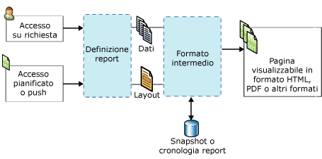

# Reporting Services Concepts (SSRS)
  In questo argomento viene fornito un breve riepilogo dei concetti di [!INCLUDE[ssNoVersion](../includes/ssnoversion-md.md)] [!INCLUDE[ssRSnoversion](../includes/ssrsnoversion-md.md)] .  
  
 **[!INCLUDE[applies](../includes/applies-md.md)]**  [!INCLUDE[ssRSnoversion](../includes/ssrsnoversion-md.md)] | Modalità SharePoint di [!INCLUDE[ssRSnoversion](../includes/ssrsnoversion-md.md)]    
  
##   Concetti relativi ai server di report  
 Un server di report è un computer con un'istanza [!INCLUDE[ssRSnoversion](../includes/ssrsnoversion-md.md)] installata. Un server di report archivia internamente elementi quali report impaginati e per dispositivi mobili, elementi e risorse correlati al report, pianificazioni e sottoscrizioni. È possibile configurare un server di report come un server singolo autonomo o come una farm con scalabilità orizzontale o può essere integrato con SharePoint Server. Si interagisce con gli elementi del server di report tramite il servizio Web [!INCLUDE[ssRSnoversion](../includes/ssrsnoversion-md.md)] , il provider WMI, l'accesso con URL o a livello di codice tramite script. La modalità di interazione con un server di report dipende dalla topologia di distribuzione e dalla configurazione.  
  
### Server di report in modalità nativa
 Un server di report configurato in modalità nativa è un computer su cui è installato [!INCLUDE[ssNoVersion](../includes/ssnoversion-md.md)] [!INCLUDE[ssRSnoversion](../includes/ssrsnoversion-md.md)] ed è configurato come un server autonomo. Si interagisce con il server di report, report e elementi correlati ai report tramite un browser con [!INCLUDE[ssRSWebPortal](../includes/ssrswebportal.md)] o comandi dell'accesso con URL, SQL Server Management Studio o a livello di programmazione tramite script. Per altre informazioni, vedere [Server di report di Reporting Services &#40;modalità nativa&#41;](../reporting-services/report-server/reporting-services-report-server-native-mode.md).  
  
### Server di report in modalità SharePoint  
 Esistono due diverse configurazioni per un server di report integrato con SharePoint. In [!INCLUDE[ssRSCurrent](../includes/ssrscurrent-md.md)], [!INCLUDE[ssRSnoversion](../includes/ssrsnoversion-md.md)] viene installato con un SharePoint Server come un servizio SharePoint Shared. Nelle versioni precedenti, il server di report si integra con SharePoint Server mediante l'installazione del componente aggiuntivo [!INCLUDE[ssRSnoversion](../includes/ssrsnoversion-md.md)] per SharePoint. In entrambi casi, si interagisce con il server di report, i report e gli elementi correlati al report tramite pagine di applicazione sul sito di SharePoint. Si usano la raccolta documenti di SharePoint e le altre librerie create per archiviare i tipi di contenuto correlati ai report. Per altre informazioni, vedere [Server di report di Reporting Services &#40;modalità SharePoint&#41;](../reporting-services/report-server-sharepoint/reporting-services-report-server-sharepoint-mode.md).  
  
### Elementi del server di report 
 Gli elementi del server di report includono report impaginati e per dispositivi mobili, indicatori KPI, origini dati condivise, set di dati condivisi e altri elementi che è possibile pubblicare, caricare o salvare in un server di report. Organizzare elementi nella struttura di cartelle gerarchica su un server di report nativo o in librerie di contenuto di SharePoint su un sito di SharePoint. Per altre informazioni, vedere [Gestione contenuto del server di report &#40;modalità nativa SSRS&#41;](../reporting-services/report-server/report-server-content-management-ssrs-native-mode.md).  
  
### Cartelle
 Su un server di report nativo, le cartelle forniscono la struttura di navigazione gerarchica e il percorso di tutti gli elementi indirizzabili archiviati in un server di report. Usare la gerarchia di cartelle e le autorizzazioni per il sito e le cartelle per consentire il controllo dell'accesso agli elementi del server di report, noto come *sicurezza a livello di elemento*. Per impostazione predefinita, le assegnazioni di ruolo che si definiscono per le cartelle specifiche sono ereditate dalle cartelle figlio nella gerarchia di cartelle. Se si assegnano ruoli specifici a una cartella, le regole di ereditarietà non vengono più applicate. La struttura di cartelle è costituita da un nodo radice denominato **Home**e da cartelle riservate che supportano la caratteristica facoltativa **Report personali** . In un browser il nodo radice è il nome della directory virtuale del server di report, ad esempio `http://myreportserver/reports`. Per altre informazioni, vedere [Folders](../reporting-services/report-server/report-server-content-management-ssrs-native-mode.md#bkmk_Folders).  
  
 Su un sito di SharePoint, usare le cartelle di SharePoint in raccolte documenti e raccolte contenuto per organizzare elementi.  
  
### Ruoli e autorizzazioni
 Su un server di report nativo l'amministratore di sistema del server di report gestisce le autorizzazioni di accesso, configura il server di report per elaborare le richieste del report, gestisce le cronologie degli snapshot e gestisce le autorizzazioni per report, origini dati, set di dati e sottoscrizioni. Ad esempio, un report pubblicato viene protetto mediante le assegnazioni di ruolo usando il modello di sicurezza basato sui ruoli di [!INCLUDE[ssRSnoversion](../includes/ssrsnoversion-md.md)] . Per altre informazioni, vedere [Ruoli e autorizzazioni &#40;Reporting Services&#41;](../reporting-services/security/roles-and-permissions-reporting-services.md).  
  
 Su un sito di SharePoint, usare la pagina degli amministratori di sito di SharePoint per gestire le autorizzazioni di accesso su report e contenuto del sito correlato al report.  
  
### Pianificazioni
 Su un server di report nativo è possibile pianificare i report impaginati, i set di dati condivisi e le sottoscrizioni in modo da recuperare dati e recapitare report e query del set di dati a orari prestabiliti o durante i periodi di minore attività. Una pianificazione può essere eseguita una sola volta oppure in modo ricorrente a intervalli specificati in ore, giorni, settimane o mesi. Per altre informazioni, vedere [Schedules](../reporting-services/subscriptions/schedules.md).  
  
### Sottoscrizioni e recapito  
 Una sottoscrizione è una richiesta di recapito di un report in un momento specifico o in risposta a un evento in un formato di file di applicazione specificato nella sottoscrizione stessa. Le sottoscrizioni rappresentano un'alternativa all'esecuzione di un report su richiesta. Se si usano report su richiesta, sarà necessario selezionare manualmente il report ogni volta che si desidera visualizzarlo. In alternativa, le sottoscrizioni possono essere usate per la pianificazione e l'automazione del recapito di un report. È possibile recapitare report a una cartella Posta in arrivo o a una condivisione file. Per altre informazioni, vedere [Sottoscrizioni e recapito &#40;Reporting Services&#41;](../reporting-services/subscriptions/subscriptions-and-delivery-reporting-services.md).  
  
### Estensioni
 [!INCLUDE[ssNoVersion](../includes/ssnoversion-md.md)] [!INCLUDE[ssRSnoversion](../includes/ssrsnoversion-md.md)] fornisce un'architettura estensibile che è possibile usare per personalizzare soluzioni del report. Il server di report supporta estensioni di autenticazione personalizzate, estensioni per l'elaborazione dati, estensioni dell'elaborazione di report, estensioni per il rendering ed estensioni per il recapito e estensioni disponibili per gli utenti sono configurabili nel file di configurazione RSReportServer.config. Ad esempio, è possibile limitare i formati di esportazione che il visualizzatore di report può usare. Le estensioni personalizzate di elaborazione dei report e di recapito sono facoltative. Sono tuttavia necessarie se si desidera supportare la distribuzione dei report o i controlli personalizzati. Per altre informazioni, vedere [Estensioni di Reporting Services &#40;SSRS&#41;](../reporting-services/extensions-ssrs.md).  
  
### Accesso ai report 
 L'accesso su richiesta consente agli utenti di selezionare i report da uno strumento per la visualizzazione dei report. A seconda della configurazione del server di report è possibile usare il [!INCLUDE[ssRSWebPortal](../includes/ssrswebportal.md)], una Web part di [!INCLUDE[msCoName](../includes/msconame-md.md)] SharePoint 2.0, una raccolta di SharePoint quando [!INCLUDE[ssRSnoversion](../includes/ssrsnoversion-md.md)] è installato in modalità integrata SharePoint, un controllo ReportViewer incorporato o un browser tramite URL. Per altre informazioni sull'accesso ai report su richiesta, vedere [Ricerca, visualizzazione e gestione dei report &#40;Generatore report e SSRS&#41;](../reporting-services/report-builder/finding-viewing-and-managing-reports-report-builder-and-ssrs.md).  
  
 Le sottoscrizioni rappresentano un'alternativa all'esecuzione di un report su richiesta. Per altre informazioni, vedere [Sottoscrizioni e recapito &#40;Reporting Services&#41;](../reporting-services/subscriptions/subscriptions-and-delivery-reporting-services.md).  
  
 Per l'elenco di strumenti da usare per interagire con il server di report, vedere [Strumenti di Reporting Services](../reporting-services/tools/reporting-services-tools.md).  
  
  
##   Concetti relativi a report ed elementi correlati  
### Report e definizioni dei report

 **RDL** 
 
 Una definizione di report viene scritta in un file XML in conformità a una grammatica XML denominata linguaggio RDL (Report Definition Language). In [!INCLUDE[ssRSnoversion](../includes/ssrsnoversion-md.md)]creare una definizione di report in uno strumento come Generatore report o Progettazione report. Vengono forniti gli elementi che definiscono le connessioni alle origini dati, le query usate per il recupero dei dati, le espressioni, i parametri, le immagini, le caselle di testo, le tabelle e qualsiasi altro layout relativo alla fase di progettazione. Per altre informazioni, vedere [Report Definition Language &#40;SSRS&#41;](../reporting-services/reports/report-definition-language-ssrs.md).  
  
 **RSMOBILE**

È possibile creare report per dispositivi mobili di Reporting Services (file con estensione rsmobile) in SQL Server Mobile Report Publisher. Questi report sono ottimizzati per i dispositivi mobili e connessi ai dati locali, con un'ampia gamma di visualizzazioni dei dati. Altre informazioni sui [report per dispositivi mobili di Reporting Services](../reporting-services/mobile-reports/create-mobile-reports-with-sql-server-mobile-report-publisher.md). 
  
 **RDLC** 
 
 In Progettazione report di Visual Studio vengono creati file di definizione dei report del client (con estensione rdlc) in formato XML da usare con il controllo ReportViewer.  
  
### Connessioni dati definite nel report e origini dati 
 Nei report vengono usate le connessioni dati per il recupero di dati per un report quando viene eseguita una query o viene elaborato il report. In una definizione di report, una connessione dati è uguale ad una origine dati. È possibile scegliere da un elenco di tipi di connessione dati incorporati per la connessione a un database relazionale, un database multidimensionale, un servizio Web o ad altre origini di dati. Per la descrizione delle connessioni dati vengono usati i termini riportati di seguito.  
  
-   **Connessione dati.** Nota anche come *origine dati*. In una connessione dati sono inclusi un nome e le proprietà di connessione che dipendono dal tipo di connessione. In base alle caratteristiche di progettazione, in una connessione dati non sono incluse le credenziali. Una connessione dati non consente di specificare i dati da recuperare dall'origine dati esterna. A tale scopo, è necessario specificare una query durante la creazione di un set di dati.  
  
-   **Definizione dell'origine dati.** File che contiene la rappresentazione XML di un'origine dati del report. Quando viene pubblicato un report, le relative origini dati vengono salvate nel server di report o in un sito di SharePoint come definizioni dell'origine dati, indipendentemente dalla definizione del report. Ad esempio, un amministratore del server di report potrebbe aggiornare la stringa di connessione o le credenziali. In un server di report nativo, il tipo di file è con estensione rds. In un sito di SharePoint, il tipo di file è con estensione rsds.  
  
-   **Stringa di connessione.** Una stringa di connessione è una versione della stringa delle proprietà di connessione che sono necessarie per la connessione a un'origine dati. Le proprietà di connessione variano in base al tipo di connessione dati.  
  
-   **Origine dati condivisa.** Un'origine dati condivisa è disponibile in un server di report o in un sito di SharePoint per essere utilizzata da più report.  
  
     Le origini dati condivise sono utili quando si usano spesso le stesse origini dati. Si consiglia di usare le origini dati condivise il più possibile. Rendono i report e l'accesso ai report più facile da gestire, offrono una maggiore protezione dei report e delle origini dati usate. Se è necessaria un'origine dati condivisa, chiedere all'amministratore di sistema di creare una.  
  
     In Generatore report non è possibile creare un'origine dati condivisa. È possibile individuare e selezionare un'origine dati condivisa dal server di report.  
  
     In Progettazione report non è possibile individuare un'origine dati condivisa nel server di report. È possibile creare origini dati condivisi come parte di un progetto in Esplora soluzioni e scegliere se distribuirle in un server di report. È possibile scegliere di usarle solo in locale a causa delle differenze nelle credenziali richieste dal computer in uso o dal server di report.  
  
-   **Origine dati incorporata.** Anche nota come *origine dati specifica del report*, un'origine dati incorporata è definita in un report e viene usata solo da quel report.  
  
     Una connessione a un'origine dati incorporata è una connessione dati salvata nella definizione del report. Le informazioni di connessione a un'origine dati incorporata possono essere usate solo dal report che la contiene.  
  
-   **Credenziali.** Si tratta delle informazioni di autenticazione necessarie per consentire l'accesso ai dati esterni.  
  
     Le credenziali vengono usate per creare un'origine dati incorporata, per eseguire una query o per recuperare dati durante l'elaborazione di report. Il proprietario dell'origine dati determina il tipo di credenziali che è necessario usare per accedere ai dati. Le credenziali sono gestite indipendentemente dalla connessione dati in un server di report, un sito di SharePoint o in un computer locale in un ambiente di creazione di report. A seconda del tipo di origine dati, è possibile salvare le credenziali per evitare la richiesta o di impostare di chiedere conferma a ciascun utente. Le credenziali necessarie potrebbero variare a seconda se la connessione all'origine dati viene eseguita dal computer in uso o dal server di report. Per altre informazioni, vedere [Specificare credenziali in Generatore report](http://msdn.microsoft.com/library/7412ce68-aece-41c0-8c37-76a0e54b6b53).  
  
### Set di dati del report 
 In un report un set di dati rappresenta i dati del report restituiti dall'esecuzione di una query in un'origine dati esterna. Il set di dati dipende dalla connessione dati contenente le informazioni sull'origine dati esterna. I dati stessi non sono inclusi nella definizione del report. Nel set di dati sono contenuti un comando di query, una raccolta campi, parametri, filtri e opzioni dei dati in cui sono incluse la distinzione tra maiuscole e minuscole e le regole di confronto. Esistono due tipi di set di dati:  
  
-   **Set di dati condivisi.** Un set di dati condiviso viene pubblicato in un server di report e può essere utilizzato da più report. Un set di dati condiviso deve essere basato su un'origine dati condivisa. Può essere memorizzato nella cache ed essere pianificato creando un piano di aggiornamento della cache.  
  
-   **Set di dati incorporati.** I set di dati incorporati vengono definiti e utilizzati in un singolo report.  
  
 Per altre informazioni, vedere [Set di dati condivisi e incorporati del report &#40;Generatore report e SSRS&#41;](../reporting-services/report-data/report-embedded-datasets-and-shared-datasets-report-builder-and-ssrs.md).  
  
### Parametri di report 
 I parametri di report sono una parte di una definizione del report. È possibile aggiungere parametri ai report impaginati e per dispositivi mobili di Reporting Services per collegare report correlati, controllare l'aspetto del report, filtrare i dati del report o per limitare l'ambito di un report a percorsi o utenti specifici. Quando un report impaginato viene pubblicato in un server di report nativo o in un sito di SharePoint, i parametri di report vengono salvati come un elemento separato del server di report. I parametri possono essere gestiti in modo indipendente rispetto alla definizione del report. Per creare più set di parametri per lo stesso report, creare *report collegati*.  
  
### Elementi di report 
 Un elemento di report è un concetto interno, ma fondamentale, in una definizione di report impaginato di Reporting Services. Le proprietà di un elemento di report vengono applicate alle aree dati, alle mappe, alle caselle di testo, alle immagini e ad altri elementi di progettazione da poter aggiungere ad un report. La comprensione delle proprietà di un elemento di report semplifica la progettazione del contenuto e dell'aspetto personalizzati del report. Ad esempio, tutti gli elementi di report dispongono di una proprietà Hidden per controllare la visibilità.  
  
### Aree dati e mappe 
 Un'area dati è un elemento di layout che consente di visualizzare i dati di un singolo set di dati in un report impaginato di Reporting Services. I tipi dell'area dati includono Tablix, grafico, misuratore e indicatore. La mappa è un tipo speciale di area dati perché può visualizzare dati di due set di dati: uno che contiene dati spaziali e uno che contiene dati analitici.  
  
 Utilizzare le aree dati per abilitare le visualizzazioni di dati comuni: numeri e testo in una tabella, matrice o elenco; visualizzazioni grafiche in un grafico o misuratore e visualizzazioni geografiche rispetto a una mappa. Le tabelle, le matrici e gli elenchi sono tutti basati sull'area dati Tablix, che si espande in base alle necessità per visualizzare tutti i dati dal set di dati. Un'area dati Tablix supporta più gruppi di righe e colonne, nonché righe e colonne statiche e dinamiche. Un grafico consente di visualizzare più serie e gruppi di categorie in un'ampia gamma di formati di grafico. Un misuratore consente di visualizzare un singolo valore o un valore aggregato per un set di dati. Una mappa consente di visualizzare dati spaziali come elementi della mappa che possono variare nell'aspetto in base ai dati aggregati di un set di dati.  
  
-   **Tabella.** Una tabella è un'area dati in cui i dati vengono presentati riga per riga. Le colonne della tabella sono statiche, ovvero il numero di colonne viene definito dall'utente durante la progettazione del report. Le righe della tabella sono dinamiche e si espandono verso il basso per includere tutti i dati. È possibile aggiungere gruppi alle tabelle, in modo da organizzare i dati in base ai campi selezionati o tramite espressioni. Per altre informazioni, vedere [Tabelle, matrici ed elenchi (Generatore report e SSRS)](http://msdn.microsoft.com/en-us/9dcf3fc8-bf9c-4a14-a03d-e78254aa4098).  
  
-   **Matrice.** Una matrice è nota anche come area dati a campi incrociati. Un'area dati della matrice contiene sia colonne che righe dinamiche che si espandono in modo da includere tutti i dati. Una matrice può includere colonne e righe dinamiche, nonché colonne e righe statiche. Le colonne e le righe possono contenere altre colonne o righe e possono essere usate per raggruppare i dati. Per altre informazioni, vedere [Tabelle, matrici ed elenchi (Generatore report e SSRS)](http://msdn.microsoft.com/en-us/9dcf3fc8-bf9c-4a14-a03d-e78254aa4098).  
  
-   **Elenco.** Un elenco è un'area dati in cui i dati possono essere disposti liberamente. È possibile disporre gli elementi dei report in modo da creare un form, con caselle di testo, immagini e altre aree dati inserite in qualsiasi punto all'interno dell'elenco. Per altre informazioni, vedere [Tabelle, matrici ed elenchi (Generatore report e SSRS)](http://msdn.microsoft.com/en-us/9dcf3fc8-bf9c-4a14-a03d-e78254aa4098).  
  
-   **Grafico.** Un grafico consente di rappresentare graficamente i dati. I grafici possono essere, ad esempio, a barre, a torta e a linee, ma sono supportati numerosi altri stili. Per altre informazioni, vedere [Grafici &#40;Generatore report e SSRS&#41;](../reporting-services/report-design/charts-report-builder-and-ssrs.md).  
  
-   **Misuratore.** Un misuratore presenta i dati sotto forma di intervallo con un indicatore che punta a un valore specifico all'interno dell'intervallo. I misuratori sono usati per visualizzare indicatori di prestazioni chiave (KPI) e altre metriche. Esempi di misuratori sono quelli lineari e circolari. Per altre informazioni, vedere [Misuratori &#40;Generatore report e SSRS&#41;](../reporting-services/report-design/gauges-report-builder-and-ssrs.md).  
  
-   **Mappa.** Una mappa consente di presentare dati su uno sfondo geografico. Tali dati possono essere dati spaziali ottenuti da una query di [!INCLUDE[ssNoVersion](../includes/ssnoversion-md.md)] , un file di forma ESRI o tessere mappa di [!INCLUDE[msCoName](../includes/msconame-md.md)] Bing. I dati spaziali sono costituiti da set di coordinate che definiscono poligoni che rappresentano forme o aree, linee che rappresentano itinerari o percorsi e punti rappresentati da marcatori. È possibile associare dati aggregati a elementi della mappa per variarne automaticamente colore e dimensione. È possibile, ad esempio, variare il tipo di marcatore per un archivio basato sugli importi delle vendite o il colore per una strada basata sul limite di velocità. Per altre informazioni, vedere [Mappe &#40;Generatore report e SSRS&#41;](../reporting-services/report-design/maps-report-builder-and-ssrs.md).  
  
 È inoltre possibile includere valori da set di dati non collegati all'area dati nei modi seguenti:  
  
-   Espressioni che includono chiamate a funzioni di aggregazione che specificano un set di dati diverso come parametro di ambito, ad esempio, `=Max(Fields!Sales.Value, "AnnualSales")`.  
  
-   Usare la funzione **Lookup** per cercare i valori delle coppie nome/valore in un set di dati diverso.  
  
### Parti del report
 Una definizione di parte del report è un elemento del server di report (con estensione rsc), cioè un frammento XML di un file di definizione del report. Le parti del report vengono create da una definizione del report e dalla successiva selezione degli elementi nel report da pubblicare separatamente come parti del report. Nelle parti del report sono incluse aree dati, rettangoli e relativi elementi contenuti nonché immagini. È possibile salvare una parte del report con i relativi set di dati dipendenti e i riferimenti alle origini dati condivise in modo da poterla riutilizzare negli altri report. Per altre informazioni, vedere [Parti del report in Progettazione report &#40;SSRS&#41;](../reporting-services/report-design/report-parts-in-report-designer-ssrs.md).  
  
### Avvisi dati 
 Un avviso dati è un elemento archiviato internamente in un database di avviso. Una definizione di avviso dei dati include quali dati usare dai feed di dati del report esistenti, le condizioni da soddisfare e i destinatari dell'avviso. Gli avvisi dati sono disponibili solo nei report pubblicati su un server di report integrato con SharePoint Server. Gli avvisi dati non sono disponibili su un'installazione del server di report nativo. Per altre informazioni, vedere [Avvisi dati di Reporting Services](../reporting-services/reporting-services-data-alerts.md).  
  
  
##   Tipi di report impaginati di Reporting Services  
 In [!INCLUDE[ssRSnoversion](../includes/ssrsnoversion-md.md)], il termine *report* si può applicare a un tipo specifico di elemento del server di report, una progettazione del layout o una progettazione della soluzione. Un singolo report impaginato di Reporting Services può avere più tipi di caratteristiche; ad esempio, un report può essere, contemporaneamente, un report autonomo, un sottoreport a cui fa riferimento un report principale, la destinazione di un report drill-through in un report principale diverso e un report collegato.  
  
### Report drill-down 
 Un report drill-down è una progettazione di layout la cui complessità è inizialmente nascosta e consente all'utente di attivare e disattivare condizionatamente gli elementi di report nascosti per controllare il dettaglio dei dati da visualizzare. I report drill-down devono recuperare tutti i dati che potrebbero essere inclusi nel report. Per i report che usano grandi quantità di dati, considerare invece i report drill-through. Per altre informazioni, vedere [Azione di drill-down &#40;Generatore report e SSRS&#41;](../reporting-services/report-design/drilldown-action-report-builder-and-ssrs.md).  
  
### Sottoreport
 Un sottoreport è un elemento del report che si aggiunge a un report come un elemento di layout. Un sottoreport punta a un report diverso e viene visualizzato all'interno di un report principale come un'istanza del sottoreport. Il sottoreport può usare origini dati diverse da quelle del report principale. Anche se un sottoreport può essere ripetuto nelle aree dati usando un parametro per filtrare i dati in ogni istanza del sottoreport, i sottoreport sono usati in genere con un report principale come un catalogo di prodotti o un contenitore per una raccolta di report correlati. In ogni istanza di un sottoreport il contesto passa dal report principale al sottoreport per l'elaborazione del report. Per i report che usano molte istanze di sottoreport, è consigliabile usare invece i report drill-through. Per altre informazioni, vedere [Sottoreport &#40;Generatore report e SSRS&#41;](../reporting-services/report-design/subreports-report-builder-and-ssrs.md).  
  
 ### Report principali/dettagli e report drill-through
 Una soluzione di report principale/dettagli include un report principale che visualizza le informazioni di riepilogo con i collegamenti ipertestuali ad uno o più report con informazioni dettagliate visualizzate.  Il report dettagli viene eseguito solo se un lettore del report ne seleziona il collegamento. Il report drill-through si apre separatamente dal report principale. Un collegamento ipertestuale può essere definito in qualsiasi elemento del report che dispone di una proprietà Action, ad esempio, casella di testo, testo segnaposto o serie del grafico. Per altre informazioni, vedere [Report drill-through &#40;Generatore report e SSRS&#41;](../reporting-services/report-design/drillthrough-reports-report-builder-and-ssrs.md).  
  
### report collegati 
 Un report collegato è un elemento del server di report che contiene un puntatore alla definizione del report, ma che possiede il proprio set di proprietà e impostazioni del report. Questi includono sicurezza, parametri, percorso, sottoscrizioni e pianificazioni. Poiché i parametri vengono gestiti in modo indipendente nel server, la ripubblicazione di un report principale che usano le nuove impostazioni dei parametri non implica la sovrascrittura delle impostazioni dei parametri esistenti per il report principale o per quello collegato.  
  
 Per altre informazioni, vedere [Creare un report collegato](../reporting-services/reports/create-a-linked-report.md).  
  
### Report Cronologia
 La cronologia dei report è una raccolta di snapshot dei report. È pertanto possibile usare la cronologia di un report per mantenere una registrazione dei diversi risultati dell'esecuzione del report ottenuti durante un determinato periodo di tempo. Non è consigliabile usare la cronologia del report per i report contenenti informazioni riservate e personali. Per questo motivo, la cronologia del report può includere solo quei report che eseguono una query su un'origine dati usando un solo set di credenziali. In alternativa, è possibile creare una cronologia di un report definendo una pianificazione e una sottoscrizione per recapitare il report in un formato di file esportato a una condivisione file. Per altre informazioni, vedere [Prestazioni, snapshot, memorizzazione nella cache &#40;Reporting Services&#41;](../reporting-services/report-server/performance-snapshots-caching-reporting-services.md).  
  
### Report memorizzati nella cache 
 Un report memorizzato nella cache è una copia salvata di un report compilato e dei dati del report. I report memorizzati nella cache vengono usati per migliorare le prestazioni poiché riducono il numero di richieste di elaborazione all'elaboratore di report e il tempo necessario per recuperare set di dati di report di grandi dimensioni. A tali report è associato un periodo di scadenza obbligatorio, espresso in genere in minuti. Per altre informazioni su come usare i report memorizzati nella cache, vedere [Memorizzazione dei report nella cache &#40;SSRS&#41;](../reporting-services/report-server/caching-reports-ssrs.md).  
  
 È inoltre possibile memorizzare nella cache i risultati della query di un set di dati condiviso. Per altre informazioni, vedere [Memorizzare nella cache set di dati condivisi &#40;SSRS&#41;](../reporting-services/report-server/cache-shared-datasets-ssrs.md).  
  
### Snapshot
 Uno snapshot del report indica un report che include informazioni sul layout e i risultati di query recuperati in un momento specifico. Diversamente dai report su richiesta, per i quali vengono recuperati risultati di query aggiornati quando si visualizza il report, il server di report recupera il report compilato e i dati di report aggiornati al momento della creazione dello snapshot. Gli snapshot dei report non vengono salvati in un formato di rendering specifico, ma ne viene eseguito il rendering nel formato di visualizzazione finale, ad esempio HTML, solo quando vengono richiesti da un utente o un'applicazione. Per altre informazioni, vedere [Prestazioni, snapshot, memorizzazione nella cache &#40;Reporting Services&#41;](../reporting-services/report-server/performance-snapshots-caching-reporting-services.md).  
   
### Report salvati  
 Un report impaginato salvato è un file di definizione del report (con estensione rdl). Una definizione del report può essere salvata in locale o può essere caricata in un server di report. Se si carica una definizione del report anziché pubblicarla, non viene eseguita alcuna convalida della versione o convalida dell'espressione. Non verranno visualizzati errori fino a che il report è in esecuzione. Per altre informazioni, vedere [Save and Deploy Reporting Services Reports](../reporting-services/tools/design-reporting-services-paginated-reports-with-report-designer-ssrs.md#bkmk_SaveandDeploy)(Salvare e distribuire report di Reporting Services).  
  
### Report pubblicati
 Un report pubblicato è un elemento del server di report che viene pubblicato in un server di report da uno strumento [!INCLUDE[ssRSnoversion](../includes/ssrsnoversion-md.md)] . Su un server di report nativo il report viene pubblicato in una cartella per la quale si dispone delle autorizzazioni. Su un server di report SharePoint, è possibile pubblicare il report in una raccolta documenti abilitata con il tipo di contenuto del report. Per condividere il report in modo che possa essere usato da altri utenti, essi devono disporre dell'autorizzazione per la visualizzazione del report. Per altre informazioni, vedere [Save and Deploy Reporting Services Reports](../reporting-services/tools/design-reporting-services-paginated-reports-with-report-designer-ssrs.md#bkmk_SaveandDeploy)(Salvare e distribuire report di Reporting Services).  
  
### Report aggiornati
 Un report aggiornato è una definizione del report pubblicata che viene convertita in uno schema più recente quando un server di report viene aggiornato da una versione di [!INCLUDE[ssRSnoversion](../includes/ssrsnoversion-md.md)] a una versione successiva. La definizione di report originale viene salvata. Il report viene aggiornato in memoria, compilato e la versione compilata viene salvata internamente. Per altre informazioni, vedere [Upgrade Reporting Services Reports](../reporting-services/install-windows/upgrade-reports.md)(Aggiornare i report di Reporting Services).  
  
  
##   Passaggi dei report impaginati di Reporting Services  
 Una definizione di report può essere creata, pubblicata o salvata, compilata, elaborata, memorizzata nella cache, se ne può eseguire il rendering, può essere visualizzata, esportata e salvata come cronologia. Durante l'esecuzione di un report, il server di report elabora il report in tre passaggi, ovvero elaborazione del report, elaborazione dei dati e rendering. L'elaborazione dei dati e del report viene eseguita in base a una definizione del report; il risultato è un formato interno temporaneo. Per i report in formato temporaneo viene eseguito il rendering in un formato di visualizzazione specifico. Nel diagramma seguente vengono mostrati le fasi e gli elementi dell'elaborazione di report.  
  
   
Diagramma relativo all'elaborazione dei report  
  
### Definizione di report  
 Il file di definizione del report (con estensione rdl) archiviato su un server di report. Per altre informazioni, vedere [Report Definition Language &#40;SSRS&#41;](../reporting-services/reports/report-definition-language-ssrs.md).  
  
### Report compilato e formato del report intermedio 
 Il report che usano espressioni valutate, parametri e proprietà dei parametri valutati.  

### Snapshot o cronologia del report
 Uno snapshot è costituito dal set di dati del report in un momento specifico e dal formato intermedio che contiene informazioni sul layout del report. Per altre informazioni, vedere [Prestazioni, snapshot, memorizzazione nella cache &#40;Reporting Services&#41;](../reporting-services/report-server/performance-snapshots-caching-reporting-services.md).  
  
### Report elaborato  
 Un report completamente elaborato che contiene dati e informazioni sul layout.  
  
### Report sottoposto a rendering
 Un report elaborato completamente viene inviato a un renderer di report per combinare i dati e il layout in ogni pagina del formato di rendering di destinazione. Le estensioni per il rendering sono personalizzabili ed estendibili. Il formato di rendering predefinito per un report è HTML 4.0. Per altre informazioni, vedere [Layout e rendering della pagina &#40;Generatore report e SSRS&#41;](../reporting-services/report-design/page-layout-and-rendering-report-builder-and-ssrs.md) ed [Estensioni &#40;SSRS&#41;](../reporting-services/extensions-ssrs.md).  
  
### Report esportato
 Un report esportato è un report di cui è stato eseguito il paging completo, salvato in un formato di file specifico. I formati di esportazione dipendono dalle estensioni per il rendering installate e possono essere personalizzati. Per impostazione predefinita, i formati di esportazione includono Excel, Word, XML, PDF, TIFF e CSV. Per altre informazioni, vedere [Export Reports &#40;Report Builder and SSRS&#41;](../reporting-services/report-builder/export-reports-report-builder-and-ssrs.md).  
  
  
## Vedere anche  
 [Caratteristiche e attività di Reporting Services &#40;SSRS&#41;](../reporting-services/reporting-services-features-and-tasks-ssrs.md)   
 [Riferimento tecnico &#40;SSRS&#41;](../reporting-services/technical-reference-ssrs.md)   
 [Reporting Services &#40;SSRS&#41;](../reporting-services/create-deploy-and-manage-mobile-and-paginated-reports.md)  
  
  
