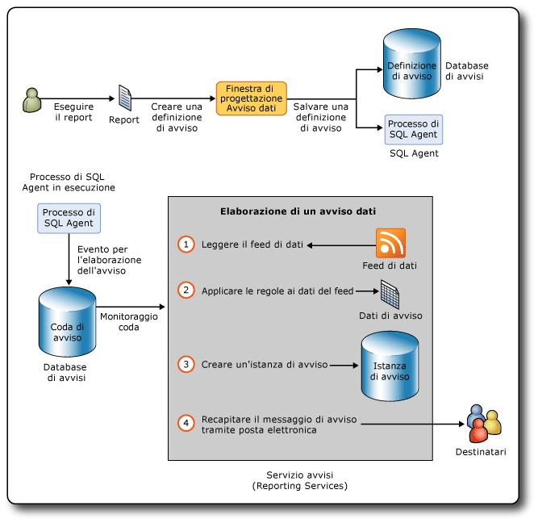

# Reporting Services Data Alerts

[!INCLUDE [ssrs-appliesto](../includes/ssrs-appliesto.md)] [!INCLUDE [ssrs-appliesto-2016](../includes/ssrs-appliesto-2016.md)] [!INCLUDE [ssrs-appliesto-not-2017](../includes/ssrs-appliesto-not-2017.md)] [!INCLUDE[ssrs-appliesto-sharepoint-2013-2016i](../includes/ssrs-appliesto-sharepoint-2013-2016.md)] [!INCLUDE [ssrs-appliesto-not-pbirs](../includes/ssrs-appliesto-not-pbirs.md)]

[!INCLUDE [ssrs-previous-versions](../includes/ssrs-previous-versions.md)]

Gli avvisi dati di SQL Server Reporting Services rappresentano una soluzione guidata dai dati che consente di essere informati sui dati dei report di proprio interesse o importanti al momento appropriato. Utilizzando gli avvisi dati non è più necessario andare in cerca di informazioni, che possono essere ottenute automaticamente.

I messaggi di avviso dati vengono inviati tramite posta elettronica. A seconda dell'importanza delle informazioni, è possibile scegliere di inviare i messaggi in modo più o meno frequente e solo quando i risultati cambiano. È possibile specificare più destinatari di posta elettronica e tenere così informate altre persone per migliorare l'efficienza e la collaborazione.

> [!NOTE]
> L'integrazione di Reporting Services con SharePoint non è più disponibile nelle versioni successive a SQL Server 2016.

##   Architettura e flusso di lavoro degli avvisi dati

Di seguito sono riepilogate le aree principali relative agli avvisi dati di [!INCLUDE[ssRSnoversion](../includes/ssrsnoversion-md.md)] :

-   **Definizione e salvataggio di definizioni di avviso dati**: viene eseguito un report, vengono create regole che identificano i valori dei dati interessanti, viene definito un criterio di ricorrenza per l'invio del messaggio di avviso dati e vengono specificati i destinatari del messaggio di avviso.  
  
-   **Esecuzione di definizioni di avviso dati**: tramite il servizio avvisi, le definizioni di avviso vengono elaborate a un'ora pianificata, i dati del report vengono recuperati e vengono create istanze di avviso dati in base alle regole nella definizione di avviso.  
  
-   **Recapito di messaggi di avviso dati ai destinatari**: tramite il servizio avvisi viene creata un'istanza di avviso e viene inviato un messaggio di avviso ai destinatari tramite posta elettronica.  
  
 Il proprietario di un avviso dati può inoltre visualizzare informazioni sugli avvisi dati, nonché eliminare e modificare le definizioni di avviso dati. Un avviso ha un solo proprietario, cioè la persona che lo ha creato.  
  
 Gli amministratori di avvisi, cioè utenti con l'autorizzazione Gestione avvisi di SharePoint, possono gestire gli avvisi dati a livello di sito. Possono inoltre visualizzare elenchi di avvisi generati da ogni utente del sito nonché eliminare avvisi.  
  
 [!INCLUDE[ssRSnoversion](../includes/ssrsnoversion-md.md)] sono diversi dagli avvisi di SharePoint. È possibile definire avvisi di SharePoint in qualsiasi tipo di documento, inclusi i report. Gli avvisi di SharePoint vengono inviati quando il documento viene modificato, ad esempio in caso di aggiunta di una colonna a una tabella in un report. Gli avvisi dati invece vengono inviati quando i dati presenti in un report soddisfano le regole incluse nelle definizioni di avviso. Le regole fanno in genere riferimento ai dati visualizzati in un report.  
  
 Creando avvisi dati nei report, è possibile monitorare le modifiche ai dati del report e inviare messaggi di avviso dati tramite posta elettronica quando i dati di un report soddisfano regole che definiscono dati di interesse per l'utente o altre persone, a intervalli definiti in base alle esigenze aziendali. È anche possibile eseguire avvisi dati su richiesta. Se si dispone dell'autorizzazione Creazione avvisi di SharePoint, è possibile creare avvisi per qualsiasi report per cui si dispone di autorizzazioni per la visualizzazione. È possibile creare più avvisi per un report; inoltre, più utenti possono creare gli stessi avvisi, o avvisi differenti, per un report. Per collaborare con altri utenti, è possibile specificarli come destinatari dei messaggi di avviso nelle definizioni di avviso dati create.  
  
 Nel diagramma seguente viene illustrato il flusso di lavoro per la creazione e il salvataggio di una definizione di avviso dati, tramite la creazione di un processo di SQL Agent per avviare l'elaborazione di un'istanza di avviso dati e l'invio tramite posta elettronica di messaggi di avviso dati contenenti i dati del report da cui è stato attivato l'avviso per uno o più destinatari.  
  
   
  
### Report supportati dagli avvisi dati  
 È possibile creare avvisi dati per tutti i tipi di report professionali scritti in linguaggio RDL (Report Definition Language) e creati in Progettazione report o Generatore report. Si tratta di report in cui sono incluse aree dati, quali tabelle e grafici, report con sottoreport e report complessi con più gruppi di colonne paralleli e aree dati annidate. Gli unici requisiti sono che il report includa almeno un'area dati di qualsiasi tipo e che l'origine dati del report sia configurata per utilizzare le credenziali archiviate o nessuna credenziale. Se nel report non è disponibile alcuna area dati, non è possibile creare un avviso per questo report.  
  
 Non è possibile creare avvisi dati nei report creato con [!INCLUDE[ssCrescent](../includes/sscrescent-md.md)].  
  
 Quando si installa [!INCLUDE[ssRSnoversion](../includes/ssrsnoversion-md.md)] in modalità nativa o SharePoint o si utilizza la versione autonoma di Generatore report, è possibile salvare i report in un server di report, nel computer in uso o in una raccolta di SharePoint. Per creare avvisi dati per i report, questi ultimi devono essere salvati o caricati in una raccolta di SharePoint. Ciò significa che non è possibile creare avvisi per report salvati in un server di report in modalità nativa o nel computer in uso. Inoltre, non è possibile creare avvisi incorporati in applicazioni personalizzate.  
  
 [!INCLUDE[ssRSnoversion](../includes/ssrsnoversion-md.md)] supporta diversi tipi di credenziali nei report. È possibile creare avvisi dati per report con origine dati configurata per l'utilizzo di credenziali archiviate o di nessuna credenziale. Non è possibile creare avvisi per report configurati per l'utilizzo di credenziali di sicurezza integrate o per la richiesta di credenziali. Il report viene eseguito come parte dell'elaborazione della definizione di avviso e l'elaborazione non viene completata senza credenziali. Per ulteriori informazioni, vedere quanto segue:  
  
-   [Specificare le credenziali e le informazioni sulla connessione per le origini dati del report](../reporting-services/report-data/specify-credential-and-connection-information-for-report-data-sources.md)  
  
-   [Ruoli e autorizzazioni &#40;Reporting Services&#41;](../reporting-services/security/roles-and-permissions-reporting-services.md)  
  
-   [Autenticazione con il server di report](../reporting-services/security/authentication-with-the-report-server.md)  
  
### Eseguire report  
 Il primo passaggio per la creazione di una definizione di avviso dati consiste nell'individuare il report desiderato nella raccolta di SharePoint, quindi eseguire il report. Se in un report non sono contenuti dati al momento dell'esecuzione, non è possibile creare un avviso per questo report.  
  
 Nel caso di un report con parametri, è necessario specificare i valori dei parametri da utilizzare quando si esegue il report. I valori dei parametri saranno salvati nelle definizioni di avviso dati create in un report. I valori vengono utilizzati quando il report viene eseguito di nuovo come passaggio nell'elaborazione della definizione di avviso dati. Se si desidera modificare i valori dei parametri, è necessario eseguire di nuovo il report con questi valori e creare una definizione di avviso in questa versione del report.  
  
### Creare definizioni di avviso dati  
 Tra le funzionalità relative agli avvisi di [!INCLUDE[ssRSnoversion](../includes/ssrsnoversion-md.md)] è inclusa la finestra di progettazione Avviso dati, che viene utilizzata per la creazione di definizioni di avviso dati.  
  
 Per creare una definizione di avviso dati, eseguire il report, quindi aprire la finestra di progettazione Avviso dati dal menu **Azioni** del visualizzatore di report di SharePoint. Verranno generati i feed di dati del report per il report e le prime 100 righe del feed di dati verranno visualizzate in una tabella di anteprima dei dati nella finestra di progettazione Avviso dati. Tutti i feed di dati di un report vengono memorizzati nella cache finché si utilizza la definizione di avviso nella finestra di progettazione Avviso dati. La memorizzazione nella cache consente di passare rapidamente tra feed di dati. Quando si apre di nuovo una definizione di avviso nella finestra di progettazione Avviso dati, i feed di dati vengono aggiornati.  
  
 Le definizioni di avviso dati sono costituite da regole e clausole che i dati del report devono soddisfare per attivare un messaggio di avviso dati, una pianificazione che definisce la frequenza per l'invio del messaggio di avviso e, facoltativamente, le date per l'inizio e la fine dell'invio del messaggio di avviso, informazioni come la riga dell'oggetto e una descrizione da includere nel messaggio di avviso, nonché i destinatari del messaggio. Dopo aver creato una definizione di avviso, è possibile salvarla nel database di avvisi di SQL Server.  
  
### Salvare definizioni di avviso dati e metadati di avviso  
 Quando si installa [!INCLUDE[ssRSnoversion](../includes/ssrsnoversion-md.md)] in modalità SharePoint, il database di avvisi di SQL Server viene creato automaticamente.  
  
 Le definizioni di avviso dati e i metadati di avviso vengono salvati nel database di avvisi. Per impostazione predefinita, questo database è denominato ReportingServices\<GUID>_Alerting.  
  
 Quando si salva la definizione di avviso dati, tramite l'avviso viene creato un processo di SQL Server Agent per la definizione di avviso. Il processo include una pianificazione. La pianificazione è basata sul criterio di ricorrenza specificato nella definizione di avviso. L'esecuzione del processo consente di avviare l'elaborazione della definizione di avviso dati.  
  
### Elaborare definizioni di avviso dati  
 Quando tramite la pianificazione del processo di SQL Server Agent viene avviata l'elaborazione della definizione di avviso, il report viene eseguito per aggiornare i feed di dati del report. Tramite il servizio avvisi i feed di dati vengono letti e le regole specificate dalle definizioni di avviso dati vengono applicate ai valori dei dati. Se uno o più valori dei dati soddisfanno le regole, viene creata un'istanza di avviso dati e viene inviato a tutti i destinatari tramite posta elettronica un messaggio di avviso dati con i risultati dell'avviso. I risultati sono righe di dati del report che soddisfacevano tutte le regole al momento della creazione dell'istanza di avviso. Per impedire la creazione di più messaggi di avviso con gli stessi risultati, è possibile specificare che i messaggi devono essere inviati solamente quando i risultati cambiano. In questo caso, viene creata un'istanza di avviso che viene salvata nel database di avvisi, ma non viene generato alcun messaggio di avviso. Anche se si verifica un errore l'istanza di avviso viene salvata nel database di avvisi e ai destinatari viene inviato un messaggio di avviso con informazioni dettagliate sull'errore. Nella sezione Diagnostica e registrazione più avanti in questo argomento vengono fornite ulteriori informazioni sulla registrazione e sulla risoluzione dei problemi.  
  
### Inviare messaggi di avviso dati  
 I messaggi di avviso dati vengono inviati tramite posta elettronica.  
  
 Nella riga **Da** è contenuto un valore fornito dalla configurazione di recapito di posta elettronica di [!INCLUDE[ssRSnoversion](../includes/ssrsnoversion-md.md)] . Nella riga **A** sono elencati i destinatari specificati al momento della creazione dell'avviso nella finestra di progettazione Avviso dati.  
  
 Oltre alla riga Oggetto del messaggio di posta elettronica, specificata nella finestra di progettazione Avviso dati, nel messaggio di avviso dati sono incluse le informazioni seguenti:  
  
-   Nome dell'utente che ha creato la definizione di avviso dati.  
  
-   Descrizione inclusa nella definizione di avviso, se specificata, che viene visualizzata all'inizio del testo del messaggio di posta elettronica.  
  
-   Risultati dell'avviso, costituiti dalle righe nel feed di dati del report che soddisfano le regole specificate nella definizione di avviso.  
  
-   Collegamento al report in base al quale viene compilata la definizione di avviso.  
  
-   Regole incluse nella definizione di avviso.  
  
-   Parametri e valori utilizzati per eseguire il report.  
  
-   Valori contestuali degli elementi del report esterni alle aree dati del report.  
  
 Se non è possibile creare un'istanza o un messaggio di avviso dati, viene inviato un messaggio di errore a tutti i destinatari. Al posto dei risultati degli avvisi, nel messaggio è inclusa una descrizione dell'errore.  
  
 Per altre informazioni, vedere [Data Alert Messages](../reporting-services/data-alert-messages.md).  
  
##   Installare avvisi dati  
 La funzionalità relativa agli avvisi dati è disponibile solo se [!INCLUDE[ssRSnoversion](../includes/ssrsnoversion-md.md)] è installato in modalità SharePoint. Quando si installa [!INCLUDE[ssRSnoversion](../includes/ssrsnoversion-md.md)] in modalità SharePoint, tramite l'installazione vengono creati automaticamente il database di avvisi in cui vengono archiviati i metadati di avviso e le definizioni di avviso dati, nonché due pagine di SharePoint per la gestione degli avvisi e la finestra di progettazione Avviso dati viene aggiunta al sito di SharePoint. Non vi sono passaggi specifici da eseguire o opzioni da impostare per gli avvisi durante l'installazione.  
  
 Per altre informazioni sull'installazione di [!INCLUDE[ssRSnoversion](../includes/ssrsnoversion-md.md)] in modalità SharePoint, inclusi il servizio condiviso [!INCLUDE[ssRSnoversion](../includes/ssrsnoversion-md.md)] che rappresenta una novità in [!INCLUDE[ssSQL11](../includes/sssql11-md.md)] e l'applicazione del servizio [!INCLUDE[ssRSnoversion](../includes/ssrsnoversion-md.md)] che è necessario creare e configurare per poter usare le funzionalità di [!INCLUDE[ssRSnoversion](../includes/ssrsnoversion-md.md)] , vedere [Installare la modalità SharePoint di Reporting Services per SharePoint 2010](https://msdn.microsoft.com/47efa72e-1735-4387-8485-f8994fb08c8c) in MSDN Library.  
  
 Come illustrato nel diagramma riportato in precedenza in questo argomento, per gli avvisi dati vengono utilizzati processi di SQL Server Agent. Per creare i processi, è necessario che SQL Server Agent sia in esecuzione. SQL Server Agent potrebbe essere stato configurato per l'avvio automatico al momento dell'installazione di [!INCLUDE[ssRSnoversion](../includes/ssrsnoversion-md.md)]. In caso contrario, è possibile avviare SQL Server Agent manualmente. Per altre informazioni, vedere [Configurare SQL Server Agent](../ssms/agent/configure-sql-server-agent.md) e [Avviare, arrestare, sospendere, riprendere, riavviare il motore di database, SQL Server Agent o SQL Server Browser](../database-engine/configure-windows/start-stop-pause-resume-restart-sql-server-services.md).  
  
 È possibile utilizzare la pagina **Avvisi e sottoscrizioni provisioning** in Amministrazione centrale SharePoint per verificare se SQL Server Agent è in esecuzione e per creare e scaricare script [!INCLUDE[tsql](../includes/tsql-md.md)] personalizzati da eseguire per concedere autorizzazioni a SQL Server Agent. È anche possibile generare gli script [!INCLUDE[tsql](../includes/tsql-md.md)] tramite PowerShell. Per altre informazioni, vedere [Eseguire il provisioning di sottoscrizioni e avvisi per le applicazioni di servizio SSRS](../reporting-services/install-windows/provision-subscriptions-and-alerts-for-ssrs-service-applications.md).  
  
##   Configurare avvisi dati  
 A partire da [!INCLUDE[ssSQL11](../includes/sssql11-md.md)] , le impostazioni per le funzionalità di [!INCLUDE[ssRSnoversion](../includes/ssrsnoversion-md.md)] , inclusi gli avvisi dati, vengono distribuite tra il file di configurazione del server di report (rsreportserver.config) e un database di configurazione di SharePoint quando si installa [!INCLUDE[ssRSnoversion](../includes/ssrsnoversion-md.md)] in modalità SharePoint. Quando si crea l'applicazione di servizio come passaggio nell'installazione e nella configurazione di [!INCLUDE[ssRSnoversion](../includes/ssrsnoversion-md.md)], viene creato automaticamente il database di configurazione di SharePoint. Per altre informazioni, vedere [File di configurazione RsReportServer.config](../reporting-services/report-server/rsreportserver-config-configuration-file.md) e [File di configurazione di Reporting Services](../reporting-services/report-server/reporting-services-configuration-files.md).  
  
 Le impostazioni per gli avvisi dati di [!INCLUDE[ssRSnoversion](../includes/ssrsnoversion-md.md)] includono gli intervalli per la pulizia dei metadati e dei dati di avviso e il numero di tentativi di invio dei messaggi di avviso dati tramite posta elettronica. È possibile aggiornare il file di configurazione e il database di configurazione per utilizzare valori diversi per le impostazioni di avviso dati.  
  
 Il file di configurazione del server di report può essere aggiornato direttamente. Il database di configurazione di SharePoint deve essere aggiornato tramite i cmdlet di Windows PowerShell.  
  
 Nella tabella seguente sono elencati gli elementi di configurazione per gli avvisi dati, i relativi valori predefiniti, le descrizioni e le posizioni.  
  
|Impostazione|Valore predefinito|Descrizione|Percorso|  
|-------------|-------------------|-----------------|--------------|  
|AlertingCleanupCycleMinutes|20|Numero di minuti tra l'inizio di un ciclo di pulizia e l'altro.|File di configurazione del server di report|  
|AlertingExecutionLogCleanupMinutes|10080|Numero di minuti di durata delle voci del log di esecuzione.|File di configurazione del server di report|  
|AlertingDataCleanupMinutes|360|Numero di minuti di durata dei dati temporanei.|File di configurazione del server di report|  
|AlertingMaxDataRetentionDays|180|Numero di giorni fino all'eliminazione dei metadati di esecuzione dell'avviso, delle istanze di avviso e dei risultati dell'esecuzione.|File di configurazione del server di report|  
|MaxRetries|3|Numeri di tentativi di elaborazione degli avvisi dei dati.|Database di configurazione del servizio|  
|SecondsBeforeRetry|900|Numero di secondi di attesa prima di ogni tentativo.|Database di configurazione del servizio|  
  
 Per impostazione predefinita, le impostazioni MaxRetries e SecondsBeforeRetry si applicano a tutti gli eventi generati dagli avvisi dati. Se si desidera un controllo più granulare dei tentativi e dei tempi di attesa tra tentativi, è possibile aggiungere elementi per uno o più gestori di eventi che specificano valori per MaxRetries e SecondsBeforeRetry diversi.  
  
### Gestori eventi e nuovo tentativo  
 I gestori di eventi sono i seguenti:  
  
|Gestore evento|Descrizione|  
|-------------------|-----------------|  
|FireAlert|Fare clic su **Esegui**  in Gestione avvisi dati per avviare l'elaborazione immediata di una definizione di avviso.|  
|FireSchedule|Tramite SQL Server Agent viene avviata la pianificazione del processo per una definizione di avviso.|  
|CreateSchedule|L'utente crea una definizione di avviso dati e viene creata una pianificazione di processo di SQL Server Agent in base all'intervallo di frequenza specificato nella definizione di avviso.|  
|UpdateSchedule|L'utente aggiorna l'intervallo di frequenza della definizione di avviso dati e la pianificazione di processo di SQL Server Agent viene aggiornata.|  
|DeleteSchedule|L'utente elimina la definizione di avviso dati e il processo di SQL Server Agent relativo viene eliminato.|  
|GenerateAlert|Tramite il runtime di avvisi viene elaborato il feed di dati, vengono applicate le regole specificate nella definizione di avviso dati, viene determinato se creare un'istanza dell'avviso dati e, se necessario, questa istanza viene creata.|  
|DeliverAlert|Tramite il runtime viene creato il messaggio di avviso dati, che viene inviato a tutti i destinatari tramite posta elettronica.|  
  
 Nella tabella seguente sono riepilogati i gestori eventi e il momento in cui viene effettuato il nuovo tentativo:  
  
|Categoria di errore|<|\<|Tipo di evento||>|>|>|  
|--------------------|--------|--------|----------------|-|--------|--------|--------|  
||**FireAlert**|**FireSchedule**|**CreateSchedule**|**UpdateSchedule**|**DeleteSchedule**|**GenerateAlert**|**DeliverAlert**|  
|Memoria insufficiente|X|X|X|X|X|X|X|  
|Interruzione del thread|X|X|X|X|X|X|X|  
|SQL Agent non è in esecuzione|X||X|X|X|||  
|Temporaneo. Causato principalmente da problemi di connessione, timeout e blocchi.|X|X|X|X|X|X|X|  
|IOException|||||||X|  
|WebException|||||||X|  
|SocketException|||||||X|  
|SMTPException **(\*)**|||||||X|  
  
 **(\*)** Errori SMTP che attivano un nuovo tentativo:  
  
-   SmtpStatusCode.ServiceNotAvailable  
  
-   SmtpStatusCode.MailboxBusy  
  
-   SmtpStatusCode.MailboxUnavailable  
  
###   Disabilitare avvisi dati  
 Se si desidera disabilitare la funzionalità relativa agli avvisi dati, aggiornare la sezione Service del file di configurazione. Il codice della sezione Service del file di configurazione è indicato di seguito.  
  
 `<Service>`  
  
 `<IsSchedulingService>True</IsSchedulingService>`  
  
 `<IsNotificationService>True</IsNotificationService>`  
  
 `<IsEventService>True</IsEventService>`  
  
 `<IsAlertingService>True</IsAlertingService>`  
  
 `…`  
  
 `</Service>`  
  
 Per disabilitare gli avvisi, modificare True in False in `<IsAlertingService>True</IsAlertingService>`.  
  
##   Autorizzazioni per gli avvisi dati  
 Prima di poter creare avvisi dati per i report, è necessario disporre dell'autorizzazione per l'esecuzione del report e la creazione di avvisi nel sito di SharePoint. Per ulteriori informazioni sulle autorizzazioni per i report, vedere quanto riportato di seguito.  
  
-   [Generazione di feed di dati dai report &#40;Generatore report e SSRS&#41;](../reporting-services/report-builder/generating-data-feeds-from-reports-report-builder-and-ssrs.md)  
  
-   [Impostare autorizzazioni per gli elementi del server di report in un sito di SharePoint &#40;Reporting Services in modalità integrata SharePoint&#41;](../reporting-services/security/set-permissions-for-report-server-items-on-a-sharepoint-site.md)  
  
 [!INCLUDE[ssRSnoversion](../includes/ssrsnoversion-md.md)] supportano due livelli di autorizzazioni: Information Worker e amministratore di avvisi. Nella tabella seguente sono elencate le autorizzazioni di SharePoint e le attività utente correlate.  
  
|Tipo di utente|Autorizzazione di SharePoint|Descrizione dell'attività|  
|---------------|---------------------------|----------------------|  
|Information Worker|Visualizzazione elementi   Creazione avvisi|Visualizzare elementi come i report e creare avvisi dati per i report. Modificare ed eliminare gli avvisi.|  
|Amministratore di avvisi|Gestione avvisi|Visualizzare un elenco di tutti gli avvisi dati salvati nel sito di SharePoint ed eliminare gli avvisi.|  
  
##   Diagnostica e registrazione  
 Gli avvisi dati consentono agli Information Worker e agli amministratori di tenere traccia degli avvisi in diversi modi e di comprendere il motivo per il quale gli avvisi non hanno esito positivo e consentono agli amministratori di utilizzare i log per acquisire informazioni sui destinatari dei messaggi di avviso, sul numero di istanze di avviso inviate e così via.  
  
### Gestione avvisi dati  
 In Gestione avvisi dati vengono elencate definizioni di avviso e informazioni sugli errori che consentono agli Information Worker e agli amministratori di avvisi di comprendere il motivo per il quale si è verificato l'errore. Tra le cause di errore comuni sono incluse le seguenti:  
  
-   Feed di dati del report modificati e colonne utilizzate nelle regole di definizione di avviso dati non più incluse nel feed di dati.  
  
-   Revoca dell'autorizzazione per la visualizzazione del report.  
  
-   Tipo di dati nell'origine dati sottostante modificato e definizione di avviso non più valida.  
  
### Log  
 [!INCLUDE[ssRSnoversion](../includes/ssrsnoversion-md.md)] fornisce numerosi log che consentono di ottenere ulteriori informazioni sui report eseguiti durante l'elaborazione delle definizioni di avviso dati, sulle istanze di avviso dati create e così via. Vi sono tre log particolarmente utili: il log di esecuzione degli avvisi, il log di esecuzione del server di report e il log di traccia del server di report.  
  
 Per informazioni su altri log di [!INCLUDE[ssRSnoversion](../includes/ssrsnoversion-md.md)] , vedere [File di log e origini di Reporting Services](../reporting-services/report-server/reporting-services-log-files-and-sources.md).  
  
#### Log di esecuzione degli avvisi  
 Il servizio di runtime di avvisi scrive voci nella tabella ExecutionLogView del database di avvisi. È possibile eseguire una query sulla tabella oppure eseguire le stored procedure seguenti per ottenere informazioni di diagnostica più esaustive sugli avvisi dati salvati nel database di avvisi.  
  
-   ReadAlertData  
  
-   ReadAlertHistory  
  
-   ReadAlertInstances  
  
-   ReadEventHistory  
  
-   ReadFeedPollHistory  
  
-   ReadFeedPools  
  
-   ReadPollData  
  
-   ReadSentAlerts  
  
 È possibile utilizzare SQL Server Agent per eseguire la stored procedure in una pianificazione. Per altre informazioni, vedere [SQL Server Agent](../ssms/agent/sql-server-agent.md).  
  
#### Log di esecuzione del server di report  
 I report vengono eseguiti per generare i feed di dati in base ai quali vengono compilate le definizioni di avviso. Il log di esecuzione del server di report nel database del server di report consente di acquisire informazioni ogni volta che un report viene eseguito. È possibile eseguire una query sulla vista ExecutionLog2 nel database per informazioni dettagliate. Per altre informazioni, vedere [Vista ExecutionLog ed ExecutionLog3 del server di report](../reporting-services/report-server/report-server-executionlog-and-the-executionlog3-view.md).  
  
#### Log di traccia del server di report  
 Il log di traccia del server di report contiene informazioni estremamente dettagliate relative alle operazioni del servizio del server di report, ad esempio operazioni eseguite dal servizio Web ReportServer ed elaborazione in background. Le informazioni contenute nel log di traccia sono utili se si esegue il debug di un'applicazione che include un server di report o se è necessario analizzare un problema specifico scritto nel log eventi o nel log di esecuzione. Per altre informazioni, vedere [Report Server Service Trace Log](../reporting-services/report-server/report-server-service-trace-log.md).  
  
##   Contatori delle prestazioni  
 Gli avvisi dati forniscono contatori delle prestazioni specifici. Tutti i contatori delle prestazioni tranne uno sono correlati a un evento che fa parte del servizio di runtime di avvisi. Il contatore delle prestazioni correlato alla coda di eventi indica la lunghezza della coda di tutti gli eventi attivi.  
  
|Evento o coda di eventi|Contatore delle prestazioni|  
|--------------------------|-------------------------|  
|ALERTINGQUEUESIZE|Avviso: lunghezza coda eventi|  
|FireAlert|Avviso: eventi elaborati - FireAlert|  
|FireSchedule|Avviso: eventi elaborati - FireSchedule|  
|CreateSchedule|Avviso: eventi elaborati - CreateSchedule|  
|UpdateSchedule|Avviso: eventi elaborati - UpdateSchedule|  
|DeleteSchedule|Avviso: eventi elaborati - DeleteSchedule|  
|GenerateAlert|Avviso: eventi elaborati - GenerateAlert|  
|DeliverAlert|Avviso: eventi elaborati - DeliverAlert|  
  
 [!INCLUDE[ssRSnoversion](../includes/ssrsnoversion-md.md)] fornisce contatori delle prestazioni per altre funzionalità di [!INCLUDE[ssRSnoversion](../includes/ssrsnoversion-md.md)] . Per altre informazioni, vedere [Contatori delle prestazioni per gli oggetti prestazioni ReportServer:Service e ReportServerSharePoint:Service](../reporting-services/report-server/performance-counters-reportserver-service-performance-objects.md), [Contatori delle prestazioni per gli oggetti prestazioni MSRS 2011 Web Service e MSRS 2011 Windows Service &#40;modalità nativa&#41;](../reporting-services/report-server/performance-counters-msrs-2011-web-service-performance-objects.md) e [Contatori delle prestazioni per gli oggetti prestazioni MSRS 2011 Web Service SharePoint Mode e MSRS 2011 Windows Service SharePoint Mode &#40;modalità SharePoint&#41;](../reporting-services/report-server/performance-counters-msrs-2011-sharepoint-mode-performance-objects.md).  
  
##   Supporto per SSL  
 [!INCLUDE[ssRSnoversion](../includes/ssrsnoversion-md.md)] consente di usare il servizio SSL (Secure Sockets Layer) HTTP per stabilire connessioni crittografate a un server di report o a un sito di SharePoint.  
  
 Il servizio di runtime di avvisi e l'interfaccia utente degli avvisi dati supportano SSL e funzionano in modo analogo sia con SSL che con HTTP, anche se vi sono alcune piccole differenze. Quando la definizione di avviso dati viene creata utilizzando una connessione SSL, viene utilizzato SSL anche per l'URL di collegamento alla raccolta di SharePoint dal messaggio di avviso dati. È possibile identificare la connessione SSL in quanto nell'URL viene utilizzato HTTPS anziché HTTP. Analogamente, se la definizione di avviso dati è stata creata utilizzando una connessione HTTP, per il collegamento al sito di SharePoint viene utilizzato HTTP. Se la definizione di avviso è stata creata utilizzando SSL o HTTP, l'esperienza per utenti e amministratori di avvisi è identica in caso di utilizzo della finestra di progettazione Avviso dati o di Gestione avvisi dati. In caso di modifica del protocollo (HTTP o SSL) tra il momento della creazione della definizione di avviso e quello dell'aggiornamento o del nuovo salvataggio, il protocollo originale viene mantenuto e utilizzato negli URL di collegamento.  
  
 Se si crea un avviso dati in un sito di SharePoint configurato per utilizzare SSL e quindi si rimuove il requisito SSL l'avviso continua a funzionare sul sito. Se il sito viene eliminato, viene invece utilizzato il sito dell'area predefinita.  
  
##   Interfaccia utente degli avvisi dati  
 Gli avvisi dati forniscono pagine di SharePoint per la gestione degli avvisi e una finestra di progettazione per la creazione e la modifica delle definizioni di avviso dati.  
  
-   **Finestra di progettazione Avviso dati** , per la creazione e la modifica di definizioni di avviso dati. Per altre informazioni, vedere [Finestra di progettazione Avviso dati](../reporting-services/data-alert-designer.md), [Creare un avviso dati nella finestra di progettazione Avviso dati](../reporting-services/create-a-data-alert-in-data-alert-designer.md) e [Modificare un avviso dati nella finestra di progettazione di avvisi](../reporting-services/edit-a-data-alert-in-alert-designer.md).  
  
-   **Gestione avvisi dati** , per la visualizzazione di elenchi di avvisi dati, l'eliminazione di avvisi e l'apertura di avvisi per la modifica. Gestione avvisi dati è disponibile in due versioni: una per gli utenti per la gestione degli avvisi creati e una per gli amministratori per la gestione di avvisi che appartengono agli utenti del sito.  
  
     Per altre informazioni sulla gestione degli avvisi dati creati, vedere [Gestione avvisi dati per utenti di SharePoint](../reporting-services/data-alert-manager-for-sharepoint-users.md) e [Gestire gli avvisi dati in Gestione avvisi dati](../reporting-services/manage-my-data-alerts-in-data-alert-manager.md).  
  
     Per altre informazioni sulla gestione di tutti gli avvisi dati in un sito, vedere [Gestione avvisi dati per gli amministratori di avvisi](../reporting-services/data-alert-manager-for-alerting-administrators.md) e [Gestire tutti gli avvisi dati in un sito di SharePoint](../reporting-services/manage-all-data-alerts-on-a-sharepoint-site-in-data-alert-manager.md).  
  
-   **Avvisi dati e sottoscrizioni provisioning** , per stabilire se tramite Reporting Services è possibile utilizzare SQL Server Agent per gli avvisi dati e per scaricare script che consentono l'accesso a SQL Server Agent. Per altre informazioni, vedere [Eseguire il provisioning di sottoscrizioni e avvisi per le applicazioni di servizio SSRS](../reporting-services/install-windows/provision-subscriptions-and-alerts-for-ssrs-service-applications.md).  
  
##   Globalizzazione degli avvisi dati  
 Determinati script, come l'arabo e l'ebraico, sono scritti da destra a sinistra. Gli avvisi dati supportano script sia da destra a sinistra che da sinistra a destra. Gli avvisi dati sono in grado di rilevare le impostazioni cultura e modificare di conseguenza l'aspetto e il comportamento dell'interfaccia utente e il layout dei messaggi di avviso dati. Le impostazioni cultura sono derivate dalle impostazioni internazionali del sistema operativo nel computer dell'utente. Le impostazioni cultura vengono salvate ogni volta che si aggiorna e quindi si salva di nuovo la definizione di avviso dati.  
  
 Il fatto che i dati soddisfino le regole nella definizione di avviso può dipendere dalle impostazioni cultura nella definizione di avviso. Le regole specifiche delle impostazioni cultura influiscono generalmente sui confronti di stringa.  
  
 Il fatto che i dati del report soddisfino le regole nella definizione di avviso può dipendere dalle impostazioni cultura nella definizione di avviso. Questo si verifica per lo più con le stringhe. In una definizione di avviso con le impostazioni cultura tedesche, ad esempio, una regola per il confronto tra la lettera italiana "o" e la lettera tedesca "ö" non verrebbe soddisfatta. Se nella stessa definizione di avviso venissero utilizzate le impostazioni cultura italiane, la regola verrebbe soddisfatta.  
  
 Anche la formattazione dei dati è basata sulle impostazioni cultura della definizione di avviso. Se, ad esempio, in base alle impostazioni cultura viene utilizzato un punto come simbolo decimale, il valore viene visualizzato come 45.67, mentre con impostazioni cultura in cui viene utilizzata una virgola come simbolo decimale viene visualizzato 45,67.  
  
 A seconda dell'interfaccia utente di avviso dati utilizzata, il supporto per il testo scritto da destra a sinistra varia. La finestra di progettazione Avviso dati supporta la scrittura di script da destra a sinistra nelle caselle di testo, ma il layout della finestra di progettazione non è da destra a sinistra, bensì da sinistra a destra, come per gli altri strumenti. Se una definizione di avviso viene creata con orientamento del testo da destra a sinistra, quindi modificata in un ambiente in cui viene utilizzato l'orientamento da sinistra a destra, l'orientamento del testo da destra a sinistra viene mantenuto quando si salva la definizione di avviso. Gestione avvisi dati si comporta come una pagina di SharePoint. Il suo layout è da destra a sinistra, come le altre pagine di SharePoint. I messaggi di avviso dati basati sulle definizioni di avviso dati da destra a sinistra prevedono la visualizzazione del testo del messaggio da destra a sinistra e il layout del messaggio è da sinistra a destra.  
  
##   Attività correlate  
  
-   [Salvare un report in una raccolta di SharePoint &#40;Generatore report&#41;](../reporting-services/report-builder/save-a-report-to-a-sharepoint-library-report-builder.md)  
  
-   [Creare un avviso dati nella finestra di progettazione Avviso dati](../reporting-services/create-a-data-alert-in-data-alert-designer.md)  
  
-   [Modificare un avviso dati nella finestra di progettazione di avvisi](../reporting-services/edit-a-data-alert-in-alert-designer.md)  
  
-   [Gestire gli avvisi dati in Gestione avvisi dati](../reporting-services/manage-my-data-alerts-in-data-alert-manager.md)  
  
-   [Gestire tutti gli avvisi dati in un sito di SharePoint](../reporting-services/manage-all-data-alerts-on-a-sharepoint-site-in-data-alert-manager.md)  
  
-   [Concedere autorizzazione a utenti e amministratori di avvisi](../reporting-services/grant-permissions-to-users-and-alerting-administrators.md)  
  
## Vedere anche

[Finestra di progettazione Avviso dati](../reporting-services/data-alert-designer.md)   
[Gestione avvisi dati per gli amministratori di avvisi](../reporting-services/data-alert-manager-for-alerting-administrators.md)   
[Gestione avvisi dati per utenti di SharePoint](../reporting-services/data-alert-manager-for-sharepoint-users.md)  

Altre domande? [Visitare il forum su Reporting Services](https://go.microsoft.com/fwlink/?LinkId=620231)
