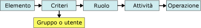

# Attività e autorizzazioni
  In [!INCLUDE[ssRSnoversion](../../includes/ssrsnoversion-md.md)]il termine *attività* indica tutte le azioni che un utente o un amministratore può eseguire. Le attività sono predefinite. Non è possibile creare attività personalizzate né modificare le attività predefinite a livello di programmazione o tramite altri strumenti. Sono disponibili complessivamente venticinque attività che comprendono l'intero set di operazioni disponibili nella sicurezza basata sui ruoli. I seguenti sono alcuni esempi di attività: "Visualizzazione di report", "Gestione di report" e "Gestione delle proprietà del server di report".  
  
 Ogni attività è rappresentata da un set di autorizzazioni, anch'esse predefinite. L'attività "Gestione di cartelle", ad esempio, contiene le autorizzazioni di creazione e di eliminazione di cartelle oltre a quelle di visualizzazione e aggiornamento delle proprietà delle cartelle. Allo scopo di offrire una descrizione più dettagliata di ogni attività, sono documentate anche le relative autorizzazioni. Non è possibile interagire direttamente con le autorizzazioni o specificarle nelle assegnazioni di ruolo. Le autorizzazioni vengono concesse indirettamente agli utenti tramite le attività incluse nelle definizioni di ruolo.  
  
 Le attività possono essere eseguite solo se sono parte di un ruolo e se quest'ultimo è incluso in un'assegnazione di ruolo. Di conseguenza, se l'attività Visualizzazione di modelli non è inclusa in un ruolo o se il ruolo non è incluso in un'assegnazione di ruolo, gli utenti non possono visualizzare i modelli di report. Nella figura seguente viene illustrato come le autorizzazioni siano combinate in attività e come queste ultime siano combinate in ruoli che possono essere utilizzati per assegnazioni di ruolo specifiche.  
  
   
Autorizzazioni e attività  
  
## Attività a livello di sistema e a livello di elemento  
 Le attività si suddividono in due categorie: a livello di sistema e a livello di elemento. Un ruolo può includere attività di una sola delle due categorie. Nella tabella seguente vengono illustrate le singole categorie di attività.  
  
|Category|Description|  
|--------------|-----------------|  
|[Attività a livello di elemento](../../reporting-services/security/tasks-and-permissions-item-level-tasks.md)|Azioni che vengono eseguite su elementi gestiti da un server di report, ad esempio cartelle, report, modelli di report e risorse.   Le attività a livello di elemento sono definite a livello di ambito dello spazio dei nomi della cartella del server di report. Tutti gli elementi a cui si accede tramite le cartelle del server di report o tramite URL, sono protetti da assegnazioni di ruolo che includono attività a livello di elemento.|  
|[Attività a livello di sistema](../../reporting-services/security/tasks-and-permissions-system-level-tasks.md)|Azioni che vengono eseguite a livello di sistema, ad esempio gestione di processi o di pianificazioni condivise utilizzabili con numerosi elementi. Le attività a livello di sistema sono definite a livello di ambito al di fuori dello spazio dei nomi della cartella del server di report.|  
  
## Vedere anche  
 [Definizioni di ruolo](../../reporting-services/security/role-definitions.md)   
 [Predefined Roles](../../reporting-services/security/role-definitions-predefined-roles.md)   
 [Concessione di autorizzazioni in un server di report in modalità nativa](../../reporting-services/security/granting-permissions-on-a-native-mode-report-server.md)  
  
  
