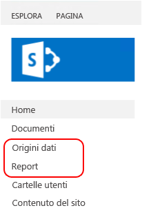

# <a name="sample-reporting-services-rsexe-script-to-copy-content-between-report-servers"></a>Script di esempio rs.exe di Reporting Services per la copia di contenuto tra server di report

[!INCLUDE[ssrs-appliesto](../../includes/ssrs-appliesto.md)] [!INCLUDE [ssrs-appliesto-2008r2-and-later](../../includes/ssrs-appliesto-2008r2-and-later.md)] [!INCLUDE [ssrs-appliesto-sharepoint-2013-2016](../../includes/ssrs-appliesto-sharepoint-2013-2016.md)] [!INCLUDE [ssrs-appliesto-pbirs](../../includes/ssrs-appliesto-pbirs.md)]

Questo articolo include e descrive uno script RSS di [!INCLUDE[ssRSnoversion](../../includes/ssrsnoversion-md.md)] di esempio tramite cui vengono copiati elementi di contenuto e impostazioni da un server di report di [!INCLUDE[ssNoVersion](../../includes/ssnoversion-md.md)] [!INCLUDE[ssRSnoversion](../../includes/ssrsnoversion-md.md)] a un altro server di report tramite l'utilità **RS.exe**. RS.exe viene installato con [!INCLUDE[ssRSnoversion](../../includes/ssrsnoversion-md.md)], sia in modalità nativa che in modalità SharePoint. Lo script copia gli elementi di [!INCLUDE[ssRSnoversion](../../includes/ssrsnoversion-md.md)] , ad esempio report e sottoscrizioni, da un server a un altro. Lo script supporta server di report in modalità nativa e in modalità SharePoint.  

##  <a name="bkmk_download_script"></a> Per scaricare lo script ssrs_migration.rss  
 Scaricare lo script dalla pagina [Reporting Services RS.exe migration script](https://github.com/Microsoft/sql-server-samples/tree/master/samples/features/reporting-services/ssrs-migration-rss) (Script di migrazione RS.exe di Reporting Services) del sito GitHub in una cartella locale. Per altre informazioni, vedere la sezione [Come usare lo script](#bkmk_how_to_use_the_script) in questo articolo.  
  
##  <a name="bkmk_supported_scenarios"></a> Scenari supportati  
 Lo script supporta server di report in modalità nativa e in modalità SharePoint. Lo script supporta le versioni di server di report [!INCLUDE[ssKilimanjaro](../../includes/sskilimanjaro-md.md)] e successive e Server di report di Power BI.  
  
Lo script può essere utilizzato per copiare il contenuto tra server di report nella stessa modalità o in modalità diverse. È possibile, ad esempio, eseguire lo script per copiare il contenuto da un server di report in modalità nativa [!INCLUDE[ssKilimanjaro](../../includes/sskilimanjaro-md.md)] a un server di report in modalità SharePoint [!INCLUDE[ssSQL11SP1](../../includes/sssql11sp1-md.md)] . È possibile eseguire lo script da qualsiasi server in cui è installato RS.exe. Nella distribuzione seguente, ad esempio, è possibile:  
  
-   Eseguire RS.exe e lo script **SUL** Server A.  
  
-   Copiare il contenuto **DAL** Server B  
  
-   **AL** Server C  
  
|Nome server|Modalità server di report|  
|-----------------|------------------------|  
|Server A|Nativo|  
|Server B|SharePoint|  
|Server C|SharePoint|  
  
 Per altre informazioni sull'utilità RS.exe, vedere [Utilità RS.exe &#40;SSRS&#41;](../../reporting-services/tools/rs-exe-utility-ssrs.md).  
  
###  <a name="bkmk_what_is_migrated"></a> Elementi e risorse di cui lo script esegue la migrazione  
 Lo script non sovrascrive elementi di contenuto esistenti con lo stesso nome.  Se lo script rileva nel server di destinazione elementi presenti nel server di origine con lo stesso nome, viene visualizzato un messaggio di errore per i singoli elementi e lo script continua. Nella tabella seguente sono elencati i tipi di contenuto e risorse di cui lo script può eseguire la migrazione nelle modalità del server di report di destinazione.  
  
|Elemento|Migrato|SharePoint|Descrizione|  
|----------|--------------|----------------|-----------------|  
|Password|**No**|**No**|**NON** viene eseguita la migrazione delle password. Dopo la migrazione degli elementi di contenuto, aggiornare le informazioni sulle credenziali nel server di destinazione. Ad esempio, origini dati con credenziali archiviate.|  
|Report personali|**No**|**No**|La funzionalità "Report personali" in modalità nativa è basata su singoli account di accesso utente, pertanto il servizio di scripting non ha accesso al contenuto di "Report personali" per utenti diversi dal parametro **–u** usato per eseguire lo script RSS. "Report personali", poi, non è una funzionalità della modalità SharePoint di [!INCLUDE[ssRSnoversion](../../includes/ssrsnoversion-md.md)] e gli elementi nelle cartelle non possono essere copiati in un ambiente SharePoint. Di conseguenza, lo script non copia gli elementi del report presenti nelle cartelle "Report personali" in un server di report di origine in modalità nativa.<br /><br /> Per eseguire la migrazione del contenuto in cartelle "Report personali" con questo script, completare la procedura seguente:<br /><br /> 1.  Creare nuove cartelle in Gestione report. Se lo si desidera, è possibile creare cartelle o sottocartelle per ogni utente.<br />2.  Effettuare l'accesso con l'account di un utente con contenuto in "Report personali".<br />3.  In Gestione report fare clic sulla cartella **Report personali**.<br />4.  Fare clic sulla visualizzazione **Dettagli** per la cartella.<br />5.  Selezionare ogni report che si desidera copiare.<br />6.  Sulla barra degli strumenti di Gestione report fare clic su **Sposta**.<br />7.  Selezionare la cartella di destinazione desiderata.<br />8.  Ripetere i passaggi da 2 a 7 per ogni utente.<br />9. Eseguire lo script.|  
|Cronologia|**No**|**No**||  
|Impostazioni di cronologia|Sì|Sì|Viene eseguita la migrazione delle impostazioni di cronologia, ma NON dei dettagli della cronologia.|  
|Pianificazioni|sì|sì|Per eseguire la migrazione delle pianificazioni, è necessario che SQL Server Agent sia in esecuzione nel server di destinazione. Se SQL Server Agent non è in esecuzione nel server di destinazione, viene visualizzato un messaggio di errore simile a questo:<br /><br /> `Migrating schedules: 1 items found. Migrating schedule: theMondaySchedule ... FAILURE:  The SQL Agent service isn't running. This operation requires the SQL Agent service. ---> Microsoft.ReportingServices.Diagnostics.Utilities.SchedulerNotResponding Exception: The SQL Agent service isn't running. This operation requires the SQL Agent service.`|  
|Ruoli e criteri di sistema|Sì|Sì|Per impostazione predefinita, lo script non copia lo schema di autorizzazioni personalizzate da un server a un altro. In base al comportamento predefinito, gli elementi vengono copiati nel server di destinazione con il flag "inherit parent permissions" impostato su TRUE. Se si desidera che le autorizzazioni per singoli elementi vengano copiate dallo script, utilizzare l'opzione SECURITY.<br /><br /> Se i server di origine e destinazione **non sono nella stessa modalità del server di report**, ad esempio sono rispettivamente in modalità nativa e in modalità SharePoint, e si usa l'opzione SECURITY, lo script tenterà di eseguire il mapping dei ruoli e dei gruppi predefiniti in base al confronto riportato nell'articolo [Confrontare ruoli e attività di Reporting Services con autorizzazioni e gruppi di SharePoint](../../reporting-services/security/reporting-services-roles-tasks-vs-sharepoint-groups-permissions.md). I ruoli e i gruppi personalizzati non vengono copiati nel server di destinazione.<br /><br /> Quando lo script copia tra server **nella stessa modalità**e si usa l'opzione SECURITY, lo script crea nuovi ruoli (modalità nativa) o gruppi (modalità SharePoint) nel server di destinazione.<br /><br /> Se esiste già un ruolo nel server di destinazione, lo script genera un messaggio di errore simile al seguente e continua la migrazione degli altri elementi. Al completamento dello script, verificare che i ruoli nel server di destinazione siano configurati per soddisfare le esigenze specifiche. Ruoli di cui si esegue la migrazione: 8 elementi trovati.<br /><br /> `Migrating role: Browser ... FAILURE: The role 'Browser' already exists and cannot be created. ---> Microsoft.ReportingServices.Diagnostics.Utilities.RoleAlreadyExistsException: The role 'Browser' already exists and cannot be created.`<br /><br /> Per altre informazioni, vedere [Concedere l'accesso utente a un server di report &#40;Gestione report&#41;](../../reporting-services/security/grant-user-access-to-a-report-server-report-manager.md)<br /><br /> **Nota:** se un utente esistente nel server di origine non esiste nel server di destinazione, lo script non può applicare le assegnazioni dei ruoli nel server di destinazione; lo script non può applicare le assegnazioni dei ruoli anche se si usa l'opzione SECURITY.|  
|Origine dati condivisa|Sì|Sì|Lo script non sovrascrive gli elementi esistenti nel server di destinazione. Se nel server di destinazione esiste già un elemento con lo stesso nome, viene visualizzato un messaggio di errore simile a questo:<br /><br /> `Migrating DataSource: /Data Sources/Aworks2012_oltp ... FAILURE:The item '/Data Sources/Aworks2012_oltp' already exists. ---> Microsoft.ReportingServices.Diagnostics.Utilities.ItemAlreadyExistsException: The item '/Data Source s/Aworks2012_oltp' already exists.`<br /><br /> Le credenziali **NON** sono copiate come parte dell'origine dati. Dopo la migrazione degli elementi di contenuto, aggiornare le informazioni sulle credenziali nel server di destinazione.|  
|Set di dati condiviso|Sì|Sì||  
|Cartella|Sì|Sì|Lo script non sovrascrive gli elementi esistenti nel server di destinazione. Se nel server di destinazione esiste già un elemento con lo stesso nome, viene visualizzato un messaggio di errore simile a questo:<br /><br /> `Migrating Folder: /Reports ... FAILURE: The item '/Reports' already exists. ---> Microsoft.ReportingServices.Diagnostics.Utilities.ItemAlreadyExistsException: The item '/Reports' already exists.`|  
|Report|Sì|Sì|Lo script non sovrascrive gli elementi esistenti nel server di destinazione. Se nel server di destinazione esiste già un elemento con lo stesso nome, viene visualizzato un messaggio di errore simile a questo:<br /><br /> `Migrating Report: /Reports/testThe item '/Reports/test' already exists. ---> Microsoft.ReportingServices.Diagnostics.Utilities.ItemAlreadyExistsException: The item '/Reports/test' already exists.`|  
|Parametri|Sì|Sì||  
|Sottoscrizioni|Sì|Sì||  
|Impostazioni di cronologia|Sì|Sì|Viene eseguita la migrazione delle impostazioni di cronologia, ma NON dei dettagli della cronologia.|  
|opzioni di elaborazione|Sì|Sì||  
|opzioni di aggiornamento della cache|Sì|Sì|Le impostazioni dipendenti vengono migrate come parte di un elemento del catalogo. Di seguito è riportato un esempio dello script relativo alla migrazione di un report (con estensione rdl) e delle impostazioni correlate, ad esempio le opzioni di aggiornamento della cache:<br /><br /> -   Migrazione di parametri per il report TitleOnly.rdl: 0 elementi trovati.<br />-   Migrazione di sottoscrizioni per il report TitleOnly.rdl: 1 elemento trovato.<br />-   Migrazione della sottoscrizione Salva in \\\server\public\savedreports come TitleOnly... SUCCESS<br />-   Migrazione delle impostazioni di cronologia per il report TitleOnly.rdl... SUCCESS<br />-   Migrazione delle opzioni di elaborazione per il report TitleOnly.rdl... 0 elementi trovati.<br />-   Migrazione delle opzioni di aggiornamento della cache per il report TitleOnly.rdl... SUCCESS<br />-   Migrazione dei piani di aggiornamento della cache per il report TitleOnly.rdl: 1 elemento trovato.<br />-   Migrazione del piano di aggiornamento della cache titleonly_refresh735amM2F... SUCCESS|  
|Piani di aggiornamento della cache|Sì|Sì||  
|Immagini|Sì|Sì||  
|Parti del report|Sì|Sì||  
  
##  <a name="bkmk_required_permissions"></a> Autorizzazioni necessarie  
 Le autorizzazioni necessarie per leggere o scrivere elementi e risorse non sono le stesse per tutti i metodi usati nello script. Nella tabella seguente sono riepilogati i metodi usati per ogni elemento o risorsa e vengono forniti collegamenti al contenuto correlato. Passare all'argomento specifico per visualizzare le autorizzazioni necessarie. Ad esempio nell'argomento del metodo ListChildren sono indicate le autorizzazioni necessarie:  
  
-   **Autorizzazioni necessarie per la modalità nativa:** ReadProperties sull'elemento  
  
-   **Autorizzazioni necessarie per la modalità SharePoint:** ViewListItems  
  
|Elemento o risorsa|Origine|Destinazione|  
|----------------------|------------|------------|  
|Elementi del catalogo|<xref:ReportService2010.ReportingService2010.ListChildren%2A><br /><br /> <xref:ReportService2010.ReportingService2010.GetProperties%2A><br /><br /> <xref:ReportService2010.ReportingService2010.GetItemDataSources%2A><br /><br /> <xref:ReportService2010.ReportingService2010.GetItemReferences%2A><br /><br /> <xref:ReportService2010.ReportingService2010.GetDataSourceContents%2A><br /><br /> <xref:ReportService2010.ReportingService2010.GetItemLink%2A>|<xref:ReportService2010.ReportingService2010.CreateCatalogItem%2A><br /><br /> <xref:ReportService2010.ReportingService2010.SetItemDataSources%2A><br /><br /> <xref:ReportService2010.ReportingService2010.GetItemReferences%2A><br /><br /> <xref:ReportService2010.ReportingService2010.CreateDataSource%2A><br /><br /> <xref:ReportService2010.ReportingService2010.CreateLinkedItem%2A><br /><br /> <xref:ReportService2010.ReportingService2010.CreateFolder%2A>|  
|Ruolo|<xref:ReportService2010.ReportingService2010.ListRoles%2A><br /><br /> <xref:ReportService2010.ReportingService2010.GetRoleProperties%2A>|<xref:ReportService2010.ReportingService2010.CreateRole%2A>|  
|Criteri di sistema|<xref:ReportService2010.ReportingService2010.GetSystemPolicies%2A>|<xref:ReportService2010.ReportingService2010.SetSystemPolicies%2A>|  
|Pianificazione|<xref:ReportService2010.ReportingService2010.ListSchedules%2A>|<xref:ReportService2010.ReportingService2010.CreateSchedule%2A>|  
|Sottoscrizione|<xref:ReportService2010.ReportingService2010.ListSubscriptions%2A><br /><br /> <xref:ReportService2010.ReportingService2010.GetSubscriptionProperties%2A><br /><br /> <xref:ReportService2010.ReportingService2010.GetDataDrivenSubscriptionProperties%2A>|<xref:ReportService2010.ReportingService2010.CreateSubscription%2A><br /><br /> <xref:ReportService2010.ReportingService2010.CreateDataDrivenSubscription%2A>|  
|Piano di aggiornamento della cache|<xref:ReportService2010.ReportingService2010.ListCacheRefreshPlans%2A><br /><br /> <xref:ReportService2010.ReportingService2010.GetCacheRefreshPlanProperties%2A>|<xref:ReportService2010.ReportingService2010.CreateCacheRefreshPlan%2A>|  
|Parametri|<xref:ReportService2010.ReportingService2010.GetItemParameters%2A>|<xref:ReportService2010.ReportingService2010.SetItemParameters%2A>|  
|Opzioni di esecuzione|<xref:ReportService2010.ReportingService2010.GetExecutionOptions%2A>|<xref:ReportService2010.ReportingService2010.SetExecutionOptions%2A>|  
|Opzioni cache|<xref:ReportService2010.ReportingService2010.GetCacheOptions%2A>|<xref:ReportService2010.ReportingService2010.SetCacheOptions%2A>|  
|Impostazioni di cronologia|<xref:ReportService2010.ReportingService2010.GetItemHistoryOptions%2A>|<xref:ReportService2010.ReportingService2010.SetItemHistoryOptions%2A>|  
|Criteri degli elementi|<xref:ReportService2010.ReportingService2010.GetPolicies%2A>|<xref:ReportService2010.ReportingService2010.SetPolicies%2A>|  
  
 Per altre informazioni, vedere [Confrontare ruoli e attività di Reporting Services con autorizzazioni e gruppi di SharePoint](../../reporting-services/security/reporting-services-roles-tasks-vs-sharepoint-groups-permissions.md).  
  
##  <a name="bkmk_how_to_use_the_script"></a> Come utilizzare lo script  
  
1.  Scaricare il file script in una cartella locale, ad esempio **c:\rss\ssrs_migration.rss**.  
  
2.  Aprire un prompt dei comandi **con privilegi amministrativi**.  
  
3.  Passare alla cartella che contiene il file ssrs_migration.rss.  
  
4.  Eseguire il comando con i parametri appropriati per lo scenario di interesse.  
  
 **Esempio di base, da server di report in modalità nativa a server di report in modalità nativa:**  
  
 Nell'esempio seguente viene eseguita la migrazione del contenuto da **Sourceserver** in modalità nativa a **Targetserver**in modalità nativa.  
  
 `rs.exe -i ssrs_migration.rss -e Mgmt2010 -s http://SourceServer/ReportServer -u Domain\User -p password -v ts="http://TargetServer/reportserver" -v tu="Domain\Userser" -v tp="password"`  
  
 **Note sull'utilizzo:**  
  
-   Lo script viene eseguito in due passaggi.  
  
     Il primo passaggio è un controllo, per la restituzione di un elenco di elementi di cui verrà eseguita la migrazione, e il secondo passaggio è il processo di migrazione.  
  
     È possibile **annullare lo script dopo il primo passaggio** se si desidera semplicemente visualizzare il possibile elenco di migrazione oppure modificare i parametri. Le impostazioni dipendenti non sono elencate nel primo passaggio. Ad esempio, non sono elencate le opzioni della cache di un report, ma è elencato il report stesso.  
  
    > [!TIP]  
    >  Se si vuole controllare solo un singolo server, usare lo stesso server per l'origine e la destinazione e ignorare i passaggi successivi al passaggio 1.  
  
     Per un utilizzo corretto delle informazioni di controllo del primo passaggio, esaminare i ruoli esistenti in entrambi i server in modalità nativa, quello di origine e quello di destinazione. Di seguito è riportato un esempio dell'elenco di controllo del primo passaggio. Si noti che l'elenco include una sezione dei ruoli, perché è stata usata l'opzione-v security="True":  
  
    -   `Retrieve and report the list of items that will be migrated. You can cancel the script after step 1 if you do not want to start the actual migration.`  
  
         `Retrieving roles:`  
  
         `Role: Browser`  
  
         `Role: Content Manager`  
  
         `Role: Model Item Browser`  
  
         `Retrieve and report the list of items that will be migrated. You can cancel the script after step 1 if you do not want to start the actual migration.`  
  
         `Retrieving roles:`  
  
         `Role: Browser`  
  
         `Role: Content Manager`  
  
         `Role: CustomRole`  
  
         `Role: Model Item Browser`  
  
         `Role: My Reports`  
  
         `Role: Publisher`  
  
         `Role: Report Builder`  
  
         `Role: System Administrator`  
  
         `Role: System User`  
  
         `Retrieving system policies:`  
  
         `Retrieving system policies:`  
  
         `System policy: BUILTIN\Administrators`  
  
         `System policy: domain\user1`  
  
         `System policy: domain\ueser2`  
  
         `Retrieving schedules:`  
  
         `Schedule: theMondaySchedule`  
  
         `Retrieving catalog items. This may take a while.`  
  
         `Folder: /Data Sources`  
  
         `DataSource: /Data Sources/Aworks2012_oltp`  
  
         `Folder: /images`  
  
         `Resource: /images/Boba Fett.png`  
  
         `Resource: /images/R2-D2.png`  
  
         `Folder: /Reports`  
  
         `Report: /Reports/products`  
  
         `Report: /Reports/test`  
  
         `Report: /Reports/TitleOnly`  
  
-   SOURCE_URL e TARGET_URL devono essere URL di server di report validi che fanno riferimento al server di report di [!INCLUDE[ssRSnoversion](../../includes/ssrsnoversion-md.md)] di origine e di destinazione. In modalità nativa, l'URL di un server di report ha l'aspetto di questo URL:  
  
    -   `http://servername/reportserver`  
  
     In modalità SharePoint l'URL ha l'aspetto di questo URL:  
  
    -   `http://servername/_vti_bin/reportserver`  
  
-   La struttura di cartelle virtuale presentata all'utente in SharePoint potrebbe essere diversa da quella sottostante. Aprire `http://servername/_vti_bin/reportserver` o `http://servername/sites/site_name/_vti_bin/reportserver` in un browser per vedere la struttura di cartelle non virtuale. Ciò può essere utile per impostare la cartella di origine e quella di destinazione su un valore diverso da "/", per un server in modalità SharePoint.  
  
-   Per le password non viene eseguita la migrazione ed è necessario reimmetterle, ad esempio per origini dati con credenziali archiviate.  
  
##  <a name="bkmk_parameter_description"></a> Descrizione dei parametri  
  
|Parametro|Descrizione|Obbligatorio|  
|---------------|-----------------|--------------|  
|**-s** Source_URL|URL del server di report di origine|Sì|  
|**-u** dominio\password **–p** password|Credenziali per il server di origine.|FACOLTATIVO, se non viene impostato vengono utilizzate le credenziali predefinite|  
|**-v st**="SITE"||FACOLTATIVO Questo parametro viene utilizzato solo per i server di report in modalità SharePoint.|  
|**- v f**="SOURCEFOLDER"|Impostato su "/" per eseguire la migrazione di tutti gli elementi o su un valore come "/cartella/sottocartella" per una migrazione parziale. Vengono copiati tutti gli elementi in questa cartella|FACOLTATIVO, l'impostazione predefinita è "/".|  
|**-v ts**="TARGET_URL"|URL del server RS di destinazione||  
|**-v tu**="dominio\nomeutente" **-v tp**="password"|Credenziali per il server di destinazione.|FACOLTATIVO, se non viene impostato vengono utilizzate le credenziali predefinite. **Nota:** l'utente viene elencato come "autore" di pianificazioni condivise e come account "modificato da" per gli elementi del report nel server di destinazione.|  
|**-v tst**="SITE"||FACOLTATIVO Questo parametro viene utilizzato solo per i server di report in modalità SharePoint.|  
|**-v tf** ="TARGETFOLDER"|Impostato su "/" per eseguire la migrazione al livello radice. Impostato su "/cartella/sottocartella" per effettuare la copia in una cartella già esistente. Tutto il contenuto di "SOURCEFOLDER" viene copiato in "TARGETFOLDER".|FACOLTATIVO, l'impostazione predefinita è "/".|  
|**-v security**= "True/False"|Se impostato su "False", gli elementi del catalogo di destinazione ereditano le impostazioni di sicurezza in base alle impostazioni del sistema di destinazione. Questa impostazione è consigliata per le migrazioni tra tipi di server di report diversi, ad esempio dalla modalità nativa alla modalità SharePoint. Se impostato su "True", lo script tenta di eseguire la migrazione delle impostazioni di sicurezza.|FACOLTATIVO, l'impostazione predefinita è "False".|  
  
##  <a name="bkmk_more_examples"></a> Altri esempi  
  
###  <a name="bkmk_native_2_native"></a> Da server di report in modalità nativa a server di report in modalità nativa  
 Nell'esempio seguente viene eseguita la migrazione del contenuto da **Sourceserver** in modalità nativa a **Targetserver**in modalità nativa.  
  
```  
rs.exe -i ssrs_migration.rss -e Mgmt2010 -s http://SourceServer/ReportServer -u Domain\User -p password -v ts="http://TargetServer/reportserver" -v tu="Domain\Userser" -v tp="password"  
```  
  
 Nell'esempio seguente viene aggiunta l'opzione di sicurezza:  
  
```  
rs.exe -i ssrs_migration.rss -e Mgmt2010 -s http://SourceServer/ReportServer -u Domain\User -p password -v ts="http://TargetServer/reportserver" -v tu="Domain\Userser" -v tp="password" -v security="True"  
```  
  
###  <a name="bkmk_native_2_sharepoint_root"></a> Da modalità nativa a modalità SharePoint - sito radice  
 Nell'esempio seguente viene eseguita la migrazione da un server **SourceServer** in modalità nativa al "sito radice" di un server **TargetServer**in modalità SharePoint. Viene eseguita la migrazione delle cartelle "Reports" e "Data Sources" del server in modalità nativa come nuove raccolte nella distribuzione di SharePoint.  
  
   
  
```  
rs.exe -i ssrs_migration.rss -e Mgmt2010 -s http://SourceServer/ReportServer -u Domain\User -p Password -v ts="http://TargetServer/_vti_bin/ReportServer" -v tu="Domain\User" -v tp="Password"  
```  
  
###  <a name="bkmk_native_2_sharepoint_with_site"></a> Da modalità nativa a modalità SharePoint - raccolta siti "bi"  
 Nell'esempio seguente viene eseguita la migrazione del contenuto da un server in modalità nativa a un server SharePoint contenente una raccolta siti "sites/bi" e una raccolta di documenti condivisi. Lo script crea cartelle nella raccolta di documenti di destinazione. Ad esempio, lo script crea cartelle "Reports" e "Data Sources" nella raccolta documenti di destinazione.  
  
```  
rs.exe -i ssrs_migration.rss -e Mgmt2010 -s http://SourceServer/ReportServer -u Domain\User -p Password -v ts="http://TargetServer/sites/bi/_vti_bin/reportserver" -v tst="sites/bi" -v tf="Shared Documents" -v tu="Domain\User" -v tp="Password"  
```  
  
###  <a name="bkmk_sharepoint_2_sharepoint"></a> Da modalità SharePoint a modalità SharePoint - raccolta siti "bi"  
 Nell'esempio seguente viene eseguita la migrazione del contenuto:  
  
-   Da un server **SourceServer** SharePoint contenente una raccolta siti "sites/bi" e una raccolta di documenti condivisi.  
  
-   A un server **TargetServer** SharePoint contenente una raccolta siti "sites/bi" e una raccolta di documenti condivisi.  
  
```  
rs.exe -i ssrs_migration.rss -e Mgmt2010 -s http://SourceServer/_vti_bin/reportserver -v st="sites/bi" -v f="Shared Documents" -u Domain\User1 -p Password -v ts="http://TargetServer/sites/bi/_vti_bin/reportserver" -v tst="sites/bi" -v tf="Shared Documents" -v tu="Domain\User" -v tp="Password"  
```  
  
###  <a name="bkmk_native_to_native_Azure_vm"></a> Da modalità nativa a modalità nativa - Macchina virtuale Windows Azure  
 Nell'esempio seguente viene eseguita la migrazione del contenuto:  
  
-   Da un server di report **SourceServer**in modalità nativa.  
  
-   A un server di report **TargetServer** in modalità nativa in cui viene eseguita una macchina virtuale Windows Azure. **TargetServer** non viene unito al dominio di **SourceServer** e **User2** è un amministratore di **TargetServer** nella macchina virtuale Microsoft Azure.  
  
```  
rs.exe -i ssrs_migration.rss -e Mgmt2010 -s http://SourceServer/ReportServer -u Domain\user1 -p Password -v ts="http://ssrsnativeazure.cloudapp.net/ReportServer" -v tu="user2" -v tp="Password2"  
```  
  
> [!TIP]  
>  Per informazioni su come usare Windows PowerShell per creare server di report di [!INCLUDE[ssRSnoversion](../../includes/ssrsnoversion-md.md)] nelle macchine virtuali Windows Azure, vedere [Usare PowerShell per creare una macchina virtuale di Azure con un server di report in modalità nativa](http://msdn.microsoft.com/library/dn449661.aspx).  
  
##  <a name="bkmk_sharepoint_site_to_native_Azure_vm"></a> Modalità SharePoint - raccolta siti "bi" in un server in modalità nativa su una macchina virtuale Windows Azure  
 Nell'esempio seguente viene eseguita la migrazione del contenuto:  
  
-   Da un server di report **SourceServer** in modalità SharePoint contenente una raccolta siti "sites/bi" e una raccolta di documenti condivisi.  
  
-   A un server di report **TargetServer** in modalità nativa in cui viene eseguita una macchina virtuale Windows Azure. **TargetServer** non viene unito al dominio di **SourceServer** e **User2** è un amministratore di **TargetServer** nella macchina virtuale Microsoft Azure.  
  
```  
rs.exe -i ssrs_migration.rss -e Mgmt2010 -s http://uetesta02/_vti_bin/reportserver -u user1 -p Password -v ts="http://ssrsnativeazure.cloudapp.net/ReportServer" -v tu="user2" -v tp="Passowrd2"  
```  
  
##  <a name="bkmk_verification"></a> Verifica  
 Nella sezione sono riepilogati alcuni passaggi da eseguire nel server di destinazione per verificare la corretta migrazione di contenuto e criteri.  
  
### <a name="schedules"></a>Pianificazioni  
 Per verificare le pianificazioni nel server di destinazione:  
  
 **Modalità nativa**  
  
1.  Passare a Gestione report nel server di destinazione.  
  
2.  Fare clic su **Impostazioni sito** nel menu principale.  
  
3.  Nel riquadro sinistro fare clic su **Pianificazioni** .  
  
 **Modalità SharePoint:**  
  
1.  Passare a **Impostazioni sito**.  
  
2.  Nel gruppo **Reporting Services** fare clic su **Gestisci pianificazioni condivise**.  
  
### <a name="roles-and-groups"></a>Ruoli e gruppi  
 **Modalità nativa**  
  
1.  Aprire [!INCLUDE[ssManStudioFull](../../includes/ssmanstudiofull-md.md)] e connettersi a un server di report in modalità nativa.  
  
2.  In **Esplora oggetti** fare clic su **Sicurezza**.  
  
3.  Fare clic su **Ruoli**.  
  
##  <a name="bkmk_troubleshoot"></a> Risoluzione dei problemi  
 Usare il flag di traccia **–t** per ricevere altre informazioni. Ad esempio, se si esegue lo script e viene visualizzato un messaggio simile al seguente  
  
-   Impossibile connettersi al server: http://\<nomeserver>/ReportServer/ReportService2010.asmx  
  
 Eseguire nuovamente lo script con il flag **–t** per visualizzare un messaggio simile a questo:  
  
-   System.Exception: Impossibile connettersi al server: http://\<nomeserver>/ReportServer/ReportService2010.asmx ---> System.Net.WebException: **Richiesta non riuscita con stato HTTP 401: Non autorizzato**.   in System.Web.Services.Protocols.SoapHttpClientProtocol.ReadResponse (SoapClientMessage messaggio risposta WebResponse, Stream responseStream, Boolean asyncCall) in System.Web.Services.Protocols.SoapHttpClientProtocol.Invoke (String methodName, Object [] parameters) in Microsoft.SqlServer.ReportingServices2010.ReportingService2010.IsSSLRequired() in Microsoft.ReportingServices.ScriptHost.Management2010Endpoint.PingService (String url, String userName, String password Il dominio di stringa, Int32 timeout) in Microsoft.ReportingServices.ScriptHost.ScriptHost.DetermineServerUrlSecurity()---fine dell'analisi dello stack dell'eccezione interna--  
  
## <a name="see-also"></a>Vedere anche  
 [Utilità RS.exe &#40;SSRS&#41;](../../reporting-services/tools/rs-exe-utility-ssrs.md)   
 [Confrontare ruoli e attività di Reporting Services con autorizzazioni e gruppi di SharePoint](../../reporting-services/security/reporting-services-roles-tasks-vs-sharepoint-groups-permissions.md)  
  
  
