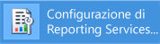
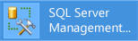
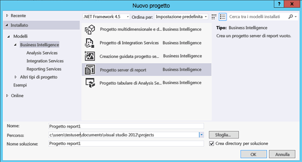

# Esercitazione: Individuazione e avvio degli strumenti di Reporting Services (SSRS)

  Questa esercitazione illustra gli strumenti usati per configurare un server di report, gestire le operazioni e il contenuto del server di report, nonché creare e pubblicare report di [!INCLUDE[ssRSnoversion](../../includes/ssrsnoversion-md.md)] impaginati e per dispositivi mobili. Se si conoscono già gli strumenti, è possibile passare ad altre esercitazioni che consentono di imparare a usare [!INCLUDE[ssRSnoversion](../../includes/ssrsnoversion-md.md)]. Per altre esercitazioni, vedere [Esercitazioni su Reporting Services &#40;SSRS&#41;](../../reporting-services/reporting-services-tutorials-ssrs.md).  
  
  
##   Gestione configurazione Reporting Services (modalità nativa)  
 Usare Gestione configurazione in modalità nativa per completare le operazioni seguenti:  
  
-   Specificare l'account del servizio.  
-   Creare o aggiornare il database del server di report.  
-   Modificare le proprietà di connessione.  
-   Specificare gli URL.  
-   Gestire le chiavi di crittografia.  
-   Configurare l'elaborazione automatica del report e il relativo recapito per posta elettronica.  
  
 **Installazione:** [!INCLUDE[ssRSnoversion](../../includes/ssrsnoversion-md.md)] viene installato quando si installa la modalità nativa di [!INCLUDE[ssRSnoversion](../../includes/ssrsnoversion-md.md)] . Per altre informazioni, vedere [Installare un server di report in modalità nativa di Reporting Services](assetid:///8f25e6dc-b753-400e-9e9a-50f4f35bf6c4).  
  
### Per avviare Gestione configurazione Reporting Services  
  
1.  Nella schermata iniziale di Windows digitare **reporting** e nei risultati di ricerca per **Applicazioni** fare clic su **Gestione configurazione Reporting Services**.  
  
       
  
     **Or**  
  
     Fare clic sul pulsante **Avvia**, selezionare **Programmi**, [!INCLUDE[ssCurrentUI](../../includes/sscurrentui-md.md)], **Strumenti di configurazione**, quindi scegliere **Gestione configurazione Reporting Services**.  
  
     Verrà visualizzata la finestra di dialogo **Selezione istanza Server report** in cui è possibile selezionare l'istanza del server di report che si desidera configurare.  
  
2.  In **Nome server**specificare il nome del computer in cui è installata l'istanza del server di report. Per impostazione predefinita è specificato il nome del computer locale, ma è anche possibile digitare il nome di un'istanza remota di [!INCLUDE[ssNoVersion](../../includes/ssnoversion-md.md)] .  
  
     Se si specifica un computer remoto, fare clic su **Trova** per stabilire una connessione. È necessario configurare in anticipo il server di report per l'amministrazione remota. Per altre informazioni, vedere [Configurare un server di report per l'amministrazione remota](../../reporting-services/report-server/configure-a-report-server-for-remote-administration.md).  
  
3.  In **Nome istanza**selezionare l'istanza di [!INCLUDE[ssNoVersion](../../includes/ssnoversion-md.md)] [!INCLUDE[ssRSnoversion](../../includes/ssrsnoversion-md.md)] che si desidera configurare. Nell'elenco sono incluse solo le istanze del server di report SQL Server 2008 e versioni successive. Non è possibile configurare versioni precedenti di [!INCLUDE[ssRSnoversion](../../includes/ssrsnoversion-md.md)].  
  
4.  Fare clic su **Connetti**.  
  
5.  Per verificare di avere avviato lo strumento, confrontare i risultati ottenuti con la figura seguente:  
  
       
  
 **Passaggi successivi:** [Configurare e amministrare un server di report &#40;modalità nativa SSRS&#41;](../../reporting-services/report-server/configure-and-administer-a-report-server-ssrs-native-mode.md) e [Gestione configurazione Reporting Services &#40;modalità nativa&#41;](../../reporting-services/install-windows/reporting-services-configuration-manager-native-mode.md).  
  
##  Portale Web (modalità nativa)  
 Usare [Web portal (SSRS Native Mode)](../../reporting-services/web-portal-ssrs-native-mode.md) (Portale Web (modalità nativa SSRS)) per impostare autorizzazioni, gestire sottoscrizioni e pianificazioni e usare report. Il portale Web può essere usato anche per visualizzare i report.  
  
 **Installazione:** il portale Web viene installato quando si installa la modalità nativa di [!INCLUDE[ssRSnoversion](../../includes/ssrsnoversion-md.md)] : [Installare un server di report in modalità nativa di Reporting Services](assetid:///8f25e6dc-b753-400e-9e9a-50f4f35bf6c4)  
  
 Per aprire il portale Web è necessario disporre di autorizzazioni sufficienti (inizialmente, solo i membri del gruppo Administrators locale dispongono delle autorizzazioni per l'accesso alle funzionalità del portale Web). Il portale Web offre diverse pagine e opzioni a seconda delle assegnazioni di ruolo dell'utente corrente. Per gli utenti che non dispongono di autorizzazioni verrà visualizzata una pagina vuota. Per gli utenti con autorizzazioni per la visualizzazione di report verranno visualizzati collegamenti per aprire i report. Per sapere di più sulle autorizzazioni, vedere [Ruoli e autorizzazioni &#40;Reporting Services&#41;](../../reporting-services/security/roles-and-permissions-reporting-services.md).  
  
### Per avviare il portale Web  
  
1.  Aprire il browser. Per informazioni sulle versioni e i browser supportati, vedere [Supporto browser per Reporting Services e Power View](../../reporting-services/browser-support-for-reporting-services-and-power-view.md).  
  
2.  Nella barra degli indirizzi del Web browser digitare l'URL del portale Web. L'URL predefinito è `http://<serverName>/reports`. È possibile verificare il nome e l'URL del server tramite lo strumento di configurazione di Reporting Services. Per altre informazioni sugli URL usati in [!INCLUDE[ssRSnoversion](../../includes/ssrsnoversion-md.md)], vedere [Configurare gli URL del server di report &#40;Gestione configurazione SSRS&#41;](../../reporting-services/install-windows/configure-report-server-urls-ssrs-configuration-manager.md).  
  
3.  Il portale Web verrà aperto nella finestra del browser. La pagina iniziale è la cartella Home. A seconda delle autorizzazioni di cui si dispone, verranno visualizzati ulteriori cartelle, collegamenti ipertestuali ai report e file di risorse all'interno della pagina iniziale. Potrebbero inoltre essere disponibili pulsanti e comandi aggiuntivi nella barra degli strumenti.  
  
4.  Se si esegue il portale Web nel server di report locale, vedere [Configurare un server di report in modalità nativa per gli amministratori locali &#40;SSRS&#41;](../../reporting-services/report-server/configure-a-native-mode-report-server-for-local-administration-ssrs.md).  
   
##   Management Studio  
 Gli amministratori del server di report possono utilizzare [!INCLUDE[ssManStudio](../../includes/ssmanstudio-md.md)] per gestire un server di report insieme ad altri componenti server di [!INCLUDE[ssNoVersion](../../includes/ssnoversion-md.md)] . Per altre informazioni, vedere [Use SQL Server Management Studio](http://msdn.microsoft.com/library/f289e978-14ca-46ef-9e61-e1fe5fd593be).  
  
### Per avviare SQL Server Management Studio  
  
1.  Nella schermata iniziale di Windows digitare **sql server** e nei risultati di ricerca per **Applicazioni** fare clic su **SQL Server Management Studio**.  
  
       
  
     **Or**  
  
     Fare clic su **Start**, selezionare **Tutti i programmi**, [!INCLUDE[ssCurrentUI](../../includes/sscurrentui-md.md)], quindi scegliere **SQL Server Management Studio**. Verrà visualizzata la finestra di dialogo **Connetti al server** .  
  
2.  Se la finestra di dialogo **Connetti al server** non viene visualizzata, in **Esplora oggetti**fare clic su **Connetti** e quindi scegliere **Reporting Services**.  
  
3.  Nell'elenco **Tipo server** selezionare **Reporting Services**. Se [!INCLUDE[ssRSnoversion](../../includes/ssrsnoversion-md.md)] non è incluso nell'elenco, significa che non è installato.  
  
4.  Nell'elenco **Nome server** selezionare un'istanza del server di report. Nell'elenco sono visualizzate le istanze locali. È inoltre possibile specificare il nome di un'istanza remota di [!INCLUDE[ssNoVersion](../../includes/ssnoversion-md.md)] .  
  
5.  Fare clic su **Connetti**. È possibile espandere il nodo radice per impostare proprietà server, modificare definizioni di ruolo o disabilitare funzionalità del server di report.  
  
##   SQL Server Data Tools con Progettazione report e Creazione guidata report  
 Sono disponibili due diversi strumenti per creare report impaginati di [!INCLUDE[ssNoVersion](../../includes/ssnoversion-md.md)] , ovvero Progettazione report e [Generatore report](#bkmk_report_builder).  
  
 Progettazione report è disponibile in [!INCLUDE[ssBIDevStudioFull](../../includes/ssbidevstudiofull-md.md)] - Visual Studio. L'area di progettazione di Progettazione report include finestre a schede, procedure guidate e menu per l'accesso alle funzionalità per la creazione di report. Lo strumento di progettazione report diventa disponibile quando si sceglie un modello di progetto per il server di report o di procedura guidata di server di report in [!INCLUDE[ssBIDevStudioFull](../../includes/ssbidevstudiofull-md.md)]. Per sapere di più, vedere [Reporting Services in SQL Server Data Tools &#40;SSDT&#41;](../../reporting-services/tools/reporting-services-in-sql-server-data-tools-ssdt.md). 
 
Scaricare [SQL Server Data Tools](http://go.microsoft.com/fwlink/?LinkID=616714).  
  
### Per avviare Progettazione report  
  
1.  Aprire **SQL Server Data Tools**.  
  
2.  Scegliere **Nuovo** dal menu **File**e quindi fare clic su **Progetto**.  
  
3.  Nell'elenco **Tipi progetto** fare clic su **Progetti Business Intelligence**.  
  
4.  Nell'elenco **Modelli** fare clic su **Progetto Server report**. Nella figura seguente vengono illustrati i modelli di progetto così come sono visualizzati nella finestra di dialogo:  
  
       
  
5.  Digitare un nome e un percorso per il progetto oppure fare clic su **Sfoglia** e selezionare il percorso desiderato.  
  
6.  [!INCLUDE[clickOK](../../includes/clickok-md.md)] [!INCLUDE[ssBIDevStudioFull](../../includes/ssbidevstudiofull-md.md)] si apre con la pagina iniziale di [!INCLUDE[vsprvs](../../includes/vsprvs-md.md)] . In Esplora soluzioni sono disponibili le categorie per la creazione di report e origini dei dati. È possibile utilizzare queste categorie per creare nuovi report e origini dei dati. Le finestre a schede vengono visualizzate quando si crea una definizione di report. Queste finestre sono Dati, Layout e Anteprima.  
  
 Per iniziare il primo report, vedere [Creare un report tabella semplice &#40;Esercitazione su SSRS&#41;](../../reporting-services/create-a-basic-table-report-ssrs-tutorial.md). Per sapere di più sugli strumenti di progettazione query che è possibile usare in Progettazione report, vedere [Strumenti di progettazione query &#40;SSRS&#41;](../../reporting-services/report-data/query-design-tools-ssrs.md).  
  
##   [!INCLUDE[ssRBnoversion](../../includes/ssrbnoversion-md.md)]  
 [Generatore report in SQL Server 2016](../../reporting-services/report-builder/report-builder-in-sql-server-2016.md) è un'applicazione autonoma che è possibile usare per creare report impaginati all'esterno di [!INCLUDE[ssNoVersion](../../includes/ssnoversion-md.md)]. È possibile personalizzare e aggiornare tutti i report esistenti, sia che siano stati creati in Progettazione report o in versioni precedenti di [!INCLUDE[ssRBnoversion](../../includes/ssrbnoversion-md.md)]. È possibile installarlo dal portale Web di [!INCLUDE[ssNoVersion](../../includes/ssnoversion-md.md)] o dall'Area download Microsoft.  
  
 [Scaricare Generatore report](http://go.microsoft.com/fwlink/?LinkID=219138) dall'Area download Microsoft.  
  
### Per iniziare [!INCLUDE[ssRBnoversion](../../includes/ssrbnoversion-md.md)]  
  
1.  Nel portale Web di [!INCLUDE[ssNoVersion](../../includes/ssnoversion-md.md)] scegliere  **Report impaginato** dal menu **Nuovo**.  
  
       
  
2.  Se [!INCLUDE[ssRBnoversion](../../includes/ssrbnoversion-md.md)] non è ancora installato in questo computer, selezionare **Scarica [!INCLUDE[ssRBnoversion](../../includes/ssrbnoversion-md.md)]**.  
  
     Oppure  
  
     [Scaricare Generatore report](http://go.microsoft.com/fwlink/?LinkID=219138) dall'Area download Microsoft.  
  
3.  [!INCLUDE[ssRBnoversion](../../includes/ssrbnoversion-md.md)] verrà aperto e sarà possibile creare o aprire un report impaginato.  
  
##   [!INCLUDE[SS_MobileReptPub_Long](../../includes/ss-mobilereptpub-long-md.md)]  
 Usare [SQL Server Mobile Report Publisher](http://msdn.microsoft.com/library/e23cf095-cb9a-4631-ab46-10413d8e3a7c) per creare report per dispositivi mobili che è possibile visualizzare nel portale Web di [!INCLUDE[ssNoVersion](../../includes/ssnoversion-md.md)] e in dispositivi mobili quali iPad e iPhone.   È possibile installarlo dal portale Web di [!INCLUDE[ssNoVersion](../../includes/ssnoversion-md.md)] o dall'Area download Microsoft.  
  
 [Download SQL Server Mobile Report Publisher](http://go.microsoft.com/fwlink/?LinkID=733527) dall'Area download Microsoft.  
  
### Per iniziare [!INCLUDE[SS_MobileReptPub_Short](../../includes/ss-mobilereptpub-short-md.md)]  
  
1.  Nel portale Web di [!INCLUDE[ssNoVersion](../../includes/ssnoversion-md.md)] scegliere  **Report per dispositivi mobili** dal menu **Nuovo**.  
  
       
  
2.  Se [!INCLUDE[SS_MobileReptPub_Short](../../includes/ss-mobilereptpub-short-md.md)] non è ancora installato in questo computer, selezionare **Scarica [!INCLUDE[SS_MobileReptPub_Short](../../includes/ss-mobilereptpub-short-md.md)]**.  
  
     Oppure  
  
     [Download SQL Server Mobile Report Publisher](http://go.microsoft.com/fwlink/?LinkID=733527) dall'Area download Microsoft.  
  
3.  [!INCLUDE[SS_MobileReptPub_Short](../../includes/ss-mobilereptpub-short-md.md)] verrà aperto e sarà possibile creare o aprire un report per dispositivi mobili.  

## Passaggi successivi

[Download SQL Server Mobile Report Publisher](http://go.microsoft.com/fwlink/?LinkID=733527)   
[Scaricare Generatore report](http://go.microsoft.com/fwlink/?LinkID=219138)  
[Download di SQL Server Data Tools](http://go.microsoft.com/fwlink/?LinkID=616714) 
[Installare la modalità SharePoint di Reporting Services](../../reporting-services/install-windows/install-reporting-services-sharepoint-mode.md)   
[Reporting Services Report Server](../../reporting-services/report-server-sharepoint/reporting-services-report-server.md)   
[Strumenti di progettazione query](../../reporting-services/report-data/query-design-tools-ssrs.md)   
[Esercitazioni su Reporting Services](../../reporting-services/reporting-services-tutorials-ssrs.md)  

Altre domande? [Visitare il forum su Reporting Services](http://go.microsoft.com/fwlink/?LinkId=620231)
