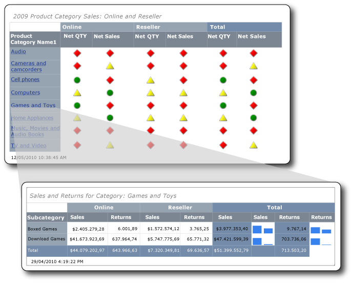

# <a name="tutorial-creating-drillthrough-and-main-reports-report-builder"></a>Esercitazione: Creazione di report drill-through e report principali (Generatore report)
In questa esercitazione verrà illustrato come creare due tipi di report impaginati in [!INCLUDE[ssRSnoversion_md](../includes/ssrsnoversion-md.md)] : un report drill-through e un report principale. I dati di vendita di esempio utilizzati in questi report vengono recuperati da un cubo di Analysis Services. 

L'illustrazione visualizza l'aspetto del report finale e come viene visualizzato il valore del campo Games and Toys dei report principali nel titolo del report drill-through. I dati nel report drill-through riguardano la categoria di prodotto Games and Toys.  
  
  
   
Tempo previsto per il completamento di questa esercitazione: 30 minuti.  
  
## <a name="requirements"></a>Requisiti  
Questa esercitazione richiede accesso al cubo Contoso Sales per i report principali e drill-through. Questo set di dati è costituito dal data warehouse ContosoDW e dal database dell'elaborazione analitica online (OLAP, Online Analytical Processing) di Contoso_Retail. I report che si creeranno in questa esercitazione recuperano i dati di report dal cubo vendite Contoso. Il database OLAP di Contoso_Retail può essere scaricato dall' [Area download Microsoft](http://go.microsoft.com/fwlink/?LinkID=191575). Sarà sufficiente scaricare solo il file ContosoBIdemoABF.exe. Il file contiene il database OLAP.  
  
L'altro file, ContosoBIdemoBAK.exe, è relativo al data warehouse ContosoDW, che non viene utilizzato in questa esercitazione.  
  
Il sito Web include istruzioni relative all'estrazione e al ripristino del file di backup ContosoRetail.abf nel database OLAP di Contoso_Retail.  

È necessario avere accesso a un'istanza di [!INCLUDE[ssASnoversion](../includes/ssasnoversion-md.md)] sulla quale installare il database OLAP.  
    
Per altre informazioni sui requisiti generali, vedere [Prerequisiti per le esercitazioni &#40;Generatore report&#41;](../reporting-services/prerequisites-for-tutorials-report-builder.md).  
  
## <a name="DMatrixAndDataset"></a>1. Creare un report drill-through da Creazione guidata tabella o matrice  
Nella finestra di dialogo Attività iniziali, creare un report matrice tramite **Creazione guidata tabella o matrice**. Nella procedura guidata sono disponibili due modalità: progettazione report e progettazione del set di dati condivisi. In questa esercitazione si utilizzerà modalità progettazione report.  
  
#### <a name="to-create-a-new-report"></a>Per creare un nuovo report  
  
1.  [Avviare Generatore report](../reporting-services/report-builder/start-report-builder.md) dal computer, dal portale Web di [!INCLUDE[ssRSnoversion_md](../includes/ssrsnoversion-md.md)] o in modalità integrata SharePoint.  
  
    Si apre la finestra di dialogo **Nuovo report o set di dati**.  
  
    Se la finestra di dialogo **Nuovo report o set di dati** non viene visualizzata, scegliere **Nuovo** dal menu **File**.  
  
2.  Nel riquadro sinistro verificare che sia selezionata l'opzione **Nuovo report** .  
  
3.  Nel riquadro destro verificare che sia selezionata **Creazione guidata tabella o matrice** .  
  
## <a name="DConnection"></a>1a. Specificare una connessione dati  
Una connessione dati contiene le informazioni necessarie per connettersi a un'origine dati esterna, ad esempio cubo di Analysis Services o un database di [!INCLUDE[ssNoVersion](../includes/ssnoversion-md.md)] . Per specificare una connessione dati, è possibile utilizzare un'origine dati condivisa dal server di report o creare un'origine dati incorporata che sia utilizzata solo in questo report. In questa esercitazione si utilizzerà un'origine dati incorporata. Per altre informazioni sull'uso di un'origine dati condivisa, vedere [Modalità alternative di acquisizione di una connessione dati &#40;Generatore report&#41;](../reporting-services/alternative-ways-to-get-a-data-connection-report-builder.md).  
  
#### <a name="to-create-an-embedded-data-source"></a>Per creare un'origine dati incorporata  
  
1.  Nella pagina **Scegliere un set di dati** selezionare **Crea un set di dati**, quindi fare clic su **Avanti**. Verrà visualizzata la pagina **Scegliere una connessione a un'origine dati** .  
  
2.  Fare clic su **Nuovo**. Verrà visualizzata la finestra di dialogo **Proprietà origine dati** .  
  
3.  In **Nome**digitare **Online and Reseller Sales Detail** come nome per l'origine dati.  
  
4.  In **Seleziona il tipo di connessione**, scegliere **Microsoft SQL Server Analysis Services**, quindi fare clic su **Compila**.  
  
5.  In **Origine dati**verificare che l'origine dati sia **Microsoft SQL Server Analysis Services (AdomdClient)**.  
  
6.  In **Nome server**, digitare il nome di un server nel quale è installata un'istanza di Analysis Services.  
  
7.  In **Selezionare o immettere un nome di database**specificare il cubo Contoso.  
  
8.  [!INCLUDE[clickOK](../includes/clickok-md.md)]  
  
9. Verificare che **Stringa di connessione** contenga la sintassi seguente:  
  
    ```  
    Data Source=<servername>; Initial Catalog = Contoso  
    ```  
  
    `<servername>` è il nome di un'istanza di [!INCLUDE[ssNoVersion](../includes/ssnoversion-md.md)] con installato Analysis Services.  
  
10. Fare clic su **Tipo credenziali**.  
  
    > [!NOTE]  
    > A seconda di come vengono configurate le autorizzazioni sull'origine dati, potrebbe essere necessario modificare le opzioni di autenticazione predefinite. Per altre informazioni, vedere [Sicurezza &#40;Generatore report&#41;](../reporting-services/report-builder/security-report-builder.md).  
  
11. [!INCLUDE[clickOK](../includes/clickok-md.md)]  
  
    Viene visualizzata la pagina **Scegliere una connessione a un'origine dei dati**.  
  
12. Per verificare che la connessione all'origine dati possa essere eseguita, fare clic su **Test connessione**.  
  
    Verrà visualizzato il messaggio **Creazione connessione completata** .  
  
13. [!INCLUDE[clickOK](../includes/clickok-md.md)]  
  
14. Scegliere **Avanti**.  
  
## <a name="DMDXQuery"></a>1b. Creare una query MDX  
In un report, è possibile utilizzare un set di dati condiviso che dispone di una query predefinita oppure è possibile creare un set di dati incorporato da utilizzare solo nel report. In questa esercitazione si creerà un set di dati incorporato.  
  
#### <a name="to-create-query-filters"></a>Per creare filtri query  
  
1.  Nella pagina **Progetta query** fare clic sul pulsante **(…)**nel riquadro dei metadati.  
  
2.  Nella finestra di dialogo **Seleziona cubo** fare clic su Vendite, quindi fare clic su **OK**.  
  
    > [!TIP]  
    > Se non si desidera compilare manualmente la query MDX, fare clic su di  icona, attivare o disattivare la finestra Progettazione query in modalità Query, incollare il MDX completato a Progettazione query e quindi procedere al passaggio 6 in [per creare il dataset](#DSkip).  
  
    ```  
    SELECT NON EMPTY { [Measures].[Sales Amount], [Measures].[Sales Return Amount] } ON COLUMNS, NON EMPTY { ([Channel].[Channel Name].[Channel Name].ALLMEMBERS * [Product].[Product Category Name].[Product Category Name].ALLMEMBERS * [Product].[Product Subcategory Name].[Product Subcategory Name].ALLMEMBERS ) } DIMENSION PROPERTIES MEMBER_CAPTION, MEMBER_UNIQUE_NAME ON ROWS FROM ( SELECT ( { [Date].[Calendar Year].&[2009] } ) ON COLUMNS FROM ( SELECT ( { [Sales Territory].[Sales Territory Group].&[North America] } ) ON COLUMNS FROM ( SELECT ( STRTOSET(@ProductProductCategoryName, CONSTRAINED) ) ON COLUMNS FROM ( SELECT ( { [Channel].[Channel Name].&[2], [Channel].[Channel Name].&[4] } ) ON COLUMNS FROM [Sales])))) WHERE ( [Sales Territory].[Sales Territory Group].&[North America], [Date].[Calendar Year].&[2009] ) CELL PROPERTIES VALUE, BACK_COLOR, FORE_COLOR, FORMATTED_VALUE, FORMAT_STRING, FONT_NAME, FONT_SIZE, FONT_FLAGS  
    ```  
  
3.  Nel riquadro Gruppo di misure, espandere Canale, quindi trascinare Nome canale nella colonna **Gerarchia** del riquadro filtro.  
  
    Il nome della dimensione Canale viene aggiunto automaticamente alla colonna **Dimensione** . Non modificare le colonne **Dimensione** o **Operatore** .  
  
4.  Per aprire l'elenco **Espressione filtro** , fare clic sulla freccia in giù nella colonna **Espressione filtro** .  
  
5.  Nell'elenco dell'espressione filtro, espandere **Tutti i canali**, fare clic su **Online**, fare clic su **Rivenditore**, quindi fare clic su **OK**.  
  
    Ora la query include un filtro per includere solo questi canali: Online e Rivenditore.  
  
6.  Espandere la dimensione Territorio di vendita, quindi trascinare Gruppo territorio di vendita nella colonna **Gerarchia** , sotto **Nome canale**.  
  
7.  Aprire l'elenco **Espressione filtro** , espandere **Tutte le aree di vendita**, fare clic su **America del Nord**, quindi fare clic su **OK**.  
  
    La query dispone ora di un filtro per includere solo le vendite in Nord America.  
  
8.  Nel riquadro Gruppo di misure espandere Data, quindi trascinare Anno di calendario nella colonna **Gerarchia** del riquadro filtro.  
  
    Il nome della dimensione Data viene aggiunto automaticamente alla colonna **Dimensione** . Non modificare le colonne **Dimensione** o **Operatore** .  
  
9. Per aprire l'elenco **Espressione filtro** , fare clic sulla freccia in giù nella colonna **Espressione filtro** .  
  
10. Nell'elenco dell'espressione filtro, espandere **Tutte le date**, fare clic su **Anno 2009**, quindi fare clic su **OK**.  
  
    La query include ora un filtro per includere solo l'anno solare 2009.  
  
#### <a name="to-create-the-parameter"></a>Per creare il parametro.  
  
1.  Espandere la dimensione Prodotto, quindi trascinare il membro Product Category Name nella colonna **Gerarchia** sotto **Anno di calendario**.  
  
2.  Aprire l 'elenco **Espressione filtro** , fare clic su **Tutti i prodotti**, quindi fare clic su **OK**.  
  
3.  Fare clic sulla casella di controllo **Parametro** . La query ora include il parametro ProductProductCategoryName.  
  
    > [!NOTE]  
    > Il parametro contiene i nomi di categorie di prodotto. Per visualizzare il report drill-through che viene aperto quando si fa clic sul collegamento drill-through nel report principale, è necessario essere connessi a un server di report.  
  
### <a name="DSkip"></a>Per creare il set di dati  
  
1.  Trascinare Nome canale dalla dimensione Canale al riquadro dei dati.  
  
2.  Trascinare Product Category Name dalla dimensione Prodotto al riquadro dei dati, quindi posizionarlo a destra di Nome canale.  
  
3.  Trascinare Product Subcategory Name dalla dimensione Prodotto al riquadro dei dati, quindi posizionarlo a destra di Product Category Name.  
  
4.  Nel riquadro dei metadati espandere **Misure**, quindi espandere Vendite.  
  
5.  Trascinare la misura Importo vendite nel riquadro dei dati, quindi posizionarlo a destra di Product Subcategory Name.  
  
6.  Nella barra degli strumenti Progettazione query fare clic su **Esegui (!)**.  
  
7.  Scegliere **Avanti**.  
  
## <a name="DLayout"></a>1c. Organizzare i dati in gruppi  
Quando si selezionano dei campi in cui raggruppare i dati, si progetta una matrice con righe e colonne che visualizzano dati dettagliati e dati aggregati.  
  
#### <a name="to-organize-data-into-groups"></a>Per organizzare i dati in gruppi  
  
1.  Fare clic su **Progettazione**per passare alla visualizzazione della struttura.  
  
2.  Nella pagina **Disponi campi** trascinare Product_Subcategory_Name in **Gruppi di righe**.  
  
    > [!NOTE]  
    > Nei nomi, gli spazi nei nomi vengono sostituiti da caratteri di sottolineatura (_). Ad esempio Product Category Name è Product_Category_Name.  
  
3.  Trascinare Channel_Name in **Gruppi di colonne**.  
  
4.  Trascinare Sales_Amount in **Valori**.  
  
    Sales_Amount viene aggregato automaticamente dalla funzione Sum, ovvero l'aggregazione predefinita per i campi numerici. Il valore è `[Sum(Sales_Amount)]`.  
  
    È possibile aprire l'elenco a discesa (senza modificare la funzione aggregata) per visualizzare le altre funzioni di aggregazione disponibili.  
  
5.  Trascinare Sales_Return_Amount in **Valori**, quindi posizionarlo sotto `[Sum(Sales_Amount)]`.  
  
    I passaggi 4 e 5 consentono di specificare i dati da visualizzare nella matrice.  
  
6.  Scegliere **Avanti**.  
  
## <a name="DTotals"></a>1d. Aggiungere subtotali e totali  
Dopo avere creato i gruppi, è possibile aggiungere e formattare delle righe nelle quali visualizzare i valori di aggregazione per i campi. È anche possibile scegliere se mostrare tutti i dati o lasciare che sia l'utente a espandere e comprimere in modo interattivo i dati raggruppati.  
  
#### <a name="to-add-subtotals-and-totals"></a>Per aggiungere subtotali e totali  
  
1.  Nella pagina **Scegliere il layout** in **Opzioni**, verificare che la casella **Mostra subtotali e totali complessivi** sia selezionata.  
  
    Nel riquadro di anteprima della creazione guidata viene visualizzata una matrice con quattro righe.  
  
2.  Scegliere **Avanti**.  
  
2.  Fare clic su **Fine**.  
  
    La tabella viene aggiunta all'area di progettazione.  
  
3.  Fare clic su **Esegui (!)**per visualizzare un'anteprima del report.  
  
## <a name="DFormat"></a>2. Formattare i dati come valuta  
Applicare la formattazione della valuta ai campi dell'importo vendite nel report drill-through.  
  
#### <a name="to-format-data-as-currency"></a>Per formattare i dati come valuta  
  
1.  Fare clic su **Progettazione**per passare alla visualizzazione della struttura.  
  
2.  Per selezionare e formattare contemporaneamente più celle, premere CTRL, quindi selezionare le celle che contengono i dati di vendita numerici.  
  
3.  Nel gruppo **Numero** della scheda **Home** fare clic su **Valuta**.  
  
## <a name="DSparkline"></a>3. Aggiungere colonne per presentare i valori vendite in grafici sparkline  
Anziché mostrare vendite e margini di profitto come valori in valuta, il report mostra i valori in un grafico sparkline.  
  
#### <a name="to-add-sparklines-to-columns"></a>Per aggiungere grafici sparkline alle colonne  
  
1.  Fare clic su **Progettazione**per passare alla visualizzazione della struttura.  
  
2.  Nel gruppo Totale della matrice fare clic con il pulsante destro del mouse sulla colonna **Importo vendite** , scegliere **Inserisci colonna**e fare clic su **A destra**.  
  
    Una colonna vuota viene aggiunta a destra di **Importo vendite**.  
  
3.  Sulla barra multifunzione fare clic su **Rettangolo**, quindi fare clic sulla cella vuota a destra della cella `[Sum(Sales_Amount)]` , nel gruppo di righe [Product_Subcategory].  
  
4.  Sulla barra multifunzione, fare clic sull'icona **Grafico sparkline** e fare clic sulla cella dove è stato aggiunto il rettangolo.  
  
5.  Nella finestra di dialogo **Seleziona tipo di grafico sparkline** , verificare che sia selezionato il tipo **Colonna** .  
  
6.  [!INCLUDE[clickOK](../includes/clickok-md.md)]  
  
7.  Fare clic con il pulsante destro del mouse sul grafico sparkline.  
  
8.  Nel riquadro Dati grafico fare clic sull'icona **Aggiungi campo** , quindi fare clic su Sales_Amount.  
  
9. Fare clic con il pulsante destro del mouse sulla colonna `Sales_Return_Amount` e quindi aggiungere una colonna alla destra.  
  
10. Ripetere i passaggi da 2 a 6.  
  
11. Fare clic con il pulsante destro del mouse sul grafico sparkline.  
  
12. Nel riquadro Dati grafico fare clic sull'icona **Aggiungi campo** , quindi fare clic su Sales_Return_Amount.  
  
13. Fare clic su **Esegui**per visualizzare un'anteprima del report.  
  
## <a name="DReportTitle"></a>4. Aggiungere un titolo report con nome Product Category  
Nella parte superiore del report viene visualizzato il titolo del report. È possibile posizionare il titolo del report in un'apposita intestazione oppure, se il report ne è privo, in una casella di testo nella parte superiore del corpo del report. In questa esercitazione sarà utilizzata la casella di testo che viene posizionata automaticamente nella parte superiore del corpo del report.  
  
#### <a name="to-add-a-report-title"></a>Per aggiungere il titolo di un report  
  
1.  Fare clic su **Progettazione**per passare alla visualizzazione della struttura.  
  
2.  Nell'area di progettazione scegliere **Fare clic per aggiungere il titolo**.  
  
3.  Digitare **Vendite e margini per categoria:**.  
  
4.  Fare clic con il pulsante destro del mouse, quindi fare clic su **Crea segnaposto**.  
  
5.  Fare clic sul pulsante **(fx)** a destra dell'elenco **Valore** .  
  
6.  Nel riquadro Categoria della finestra di dialogo **Espressione** fare clic su **Set di dati**, quindi nell'elenco **Valori** fare doppio clic su `First(Product_Category_Name)`.  
  
    La casella **Espressione** contiene l'espressione seguente:  
  
    ```  
    =First(Fields!Product_Category_Name.Value, "DataSet1")  
    ```  
  
7.  Fare clic su **Esegui**per visualizzare un'anteprima del report.  
  
Il titolo del report include il nome della prima categoria di prodotto. In un secondo momento, dopo avere eseguito questo report come report drill-through, il nome della categoria di prodotto si modificherà dinamicamente per riflettere il nome della categoria di prodotto selezionata nel report principale.  
  
## <a name="DParameter"></a>5. Aggiornare le proprietà dei parametri  
Per impostazione predefinita i parametri sono visibili; questa impostazione non è adatta per questo report. È possibile aggiornare le proprietà dei parametri per il report drill-through.  
  
#### <a name="to-hide-a-parameter"></a>Per nascondere un parametro:  
  
1.  Nel riquadro Dati report espandere **Parametri**.  
  
2.  Fare clic con il pulsante destro del mouse su @ProductProductCategoryName, quindi fare clic su **Proprietà parametri**.  
  
    > [!NOTE]  
    > Il @ carattere accanto al nome indica che questo è un parametro.  
  
3.  Nella scheda **Generale** fare clic su **Nascondi**.  
  
4.  Nella casella **Messaggio di richiesta** , digitare **Categoria prodotto**.  
  
    > [!NOTE]  
    > Poiché il parametro è nascosto, questo prompt non viene mai utilizzato.  
  
5.  Facoltativamente, fare clic su **Valori disponibili** e **Valori predefiniti** e controllare le opzioni. Non modificare le opzioni in queste schede.  
  
6.  [!INCLUDE[clickOK](../includes/clickok-md.md)]  
  
## <a name="DSave"></a>6. Salvare il report in una raccolta di SharePoint  
È possibile salvare il report in una raccolta di SharePoint, in un server di report o nel computer locale. Se il report viene salvato nel computer locale, non saranno disponibili alcune caratteristiche di [!INCLUDE[ssRSnoversion](../includes/ssrsnoversion-md.md)] , ad esempio le parti del report e i sottoreport. In questa esercitazione verranno illustrate le procedure per il salvataggio del report nella raccolta di SharePoint.  
  
#### <a name="to-save-the-report"></a>Per salvare il report  
  
1.  Dal pulsante Generatore report fare clic su **Salva**. Verrà visualizzata la finestra di dialogo **Salva come report** .  
  
    > [!NOTE]  
    > Se si sta salvando di nuovo un report, questo viene automaticamente risalvato nel relativo percorso precedente. Usare l'opzione **Salva con nome** per modificare il percorso.  
  
2.  Per visualizzare un elenco di server di report e di siti di SharePoint usati di recente, fare clic su **Siti e server recenti**.  
  
3.  Selezionare o digitare il nome del sito di SharePoint per il quale si dispone delle autorizzazioni di salvataggio dei report.  
  
    La sintassi dell'URL della raccolta di SharePoint è la seguente:  
  
    ```  
    Http://<ServerName>/<Sites>/  
    ```  
  
4.  Fare clic su **Salva**.  
  
    **Siti e server recenti** elenca le librerie sul sito di SharePoint.  
  
5.  Passare alla raccolta dove si salverà il report.  
  
6.  Nella casella **Nome** sostituire il nome predefinito con **ResellerVSOnlineDrillthrough**.  
  
    > [!NOTE]  
    > Verrà descritta la procedura per salvare il report principale nella stessa posizione. Se si vuole salvare il report principale e report drill-through in librerie o siti diversi, è necessario aggiornare il percorso dell'azione **Vai al report** nel report principale.  
  
7.  Fare clic su **Salva**.  
  
## <a name="MMatrixAndDataset"></a>1. Creare il report principale con Creazione guidata tabella o matrice  
Dalla finestra di dialogo **Attività iniziali** creare un report matrice tramite **Creazione guidata tabella o matrice**.  
  
#### <a name="to-create-the-main-report"></a>Per creare il report principale  
  
1.  [Avviare Generatore report](../reporting-services/report-builder/start-report-builder.md) dal computer, dal portale Web di [!INCLUDE[ssRSnoversion_md](../includes/ssrsnoversion-md.md)] o in modalità integrata SharePoint.  
  
    Si apre la finestra di dialogo **Nuovo report o set di dati**.  
  
    Se la finestra di dialogo **Nuovo report o set di dati** non è visualizzata, scegliere **Nuovo** dal menu **File**.  
 
2.  Nella finestra di dialogo **Attività iniziali** verificare che l'opzione **Nuovo report** sia selezionata e fare clic su **Creazione guidata tabella o matrice**.  
  
## <a name="MConnection"></a>1a. Specificare una connessione dati  
Verrà aggiunta un'origine dati incorporata al report principale.  
  
#### <a name="to-create-an-embedded-data-source"></a>Per creare un'origine dati incorporata  
  
1.  Nella pagina **Scegliere un set di dati** selezionare **Crea un set di dati**, quindi fare clic su **Avanti**.  
  
2.  Fare clic su **Nuovo**.  
  
3.  In **Nome**digitare **Online and Reseller Sales Main** come nome per l'origine dati.  
  
4.  In **Seleziona il tipo di connessione**, scegliere **Microsoft SQL Server Analysis Services**, quindi fare clic su **Compila**.  
  
5.  In **Origine dati**verificare che l'origine dati sia **Microsoft SQL Server Analysis Services (AdomdClient)**.  
  
6.  In **Nome server**, digitare il nome di un server nel quale è installata un'istanza di [!INCLUDE[msCoName](../includes/msconame-md.md)][!INCLUDE[ssASnoversion](../includes/ssasnoversion-md.md)] .  
  
7.  In **Selezionare o immettere un nome di database**specificare il cubo Contoso.  
  
8.  [!INCLUDE[clickOK](../includes/clickok-md.md)]  
  
9. Verificare che la **Stringa di connessione** contenga la sintassi seguente:  
  
    ```  
    Data Source=<servername>; Initial Catalog = Contoso  
    ```  
  
10. Fare clic su **Tipo credenziali**.  
  
    A seconda di come vengono configurate le autorizzazioni sull'origine dati, potrebbe essere necessario modificare l'autenticazione predefinita.  
  
11. [!INCLUDE[clickOK](../includes/clickok-md.md)]  
  
12. Per verificare che la connessione all'origine dati possa essere eseguita, fare clic su **Test connessione**.  
  
13. [!INCLUDE[clickOK](../includes/clickok-md.md)]  
  
14. Scegliere **Avanti**.  
  
## <a name="MMDXQuery"></a>1b. Creare una query MDX  
Quindi creare un set di dati incorporato. A tale scopo, si utilizzerà Progettazione query per creare filtri, parametri, membri calcolati e il set di dati stesso.  
  
#### <a name="to-create-query-filters"></a>Per creare filtri query  
  
1.  Nella sezione relativa al cubo del riquadro Metadati della pagina **Progetta query** fare clic sul pulsante con i puntini di sospensione **(…)**.  
  
2.  Nella finestra di dialogo **Seleziona cubo** fare clic su Vendite, quindi fare clic su **OK**.  
  
    > [!TIP]  
    > Se non si desidera compilare manualmente la query MDX, fare clic su di  icona, attivare o disattivare la finestra Progettazione query in modalità Query, incollare il MDX completato a Progettazione query e quindi procedere al passaggio 5 in [per creare il dataset](#MSkip).  
  
    ```  
    WITH MEMBER [Measures].[Net QTY] AS [Measures].[Sales Quantity] -[Measures].[Sales Return Quantity] MEMBER [Measures].[Net Sales] AS [Measures].[Sales Amount] - [Measures].[Sales Return Amount] SELECT NON EMPTY { [Measures].[Net QTY], [Measures].[Net Sales] } ON COLUMNS, NON EMPTY { ([Channel].[Channel Name].[Channel Name].ALLMEMBERS * [Product].[Product Category Name].[Product Category Name].ALLMEMBERS ) } DIMENSION PROPERTIES MEMBER_CAPTION, MEMBER_UNIQUE_NAME ON ROWS FROM ( SELECT ( { [Date].[Calendar Year].&[2009] } ) ON COLUMNS FROM ( SELECT ( STRTOSET(@ProductProductCategoryName, CONSTRAINED) ) ON COLUMNS FROM ( SELECT ( { [Sales Territory].[Sales Territory Group].&[North America] } ) ON COLUMNS FROM ( SELECT ( { [Channel].[Channel Name].&[2], [Channel].[Channel Name].&[4] } ) ON COLUMNS FROM [Sales])))) WHERE ( [Sales Territory].[Sales Territory Group].&[North America], [Date].[Calendar Year].&[2009] ) CELL PROPERTIES VALUE, BACK_COLOR, FORE_COLOR, FORMATTED_VALUE, FORMAT_STRING, FONT_NAME, FONT_SIZE, FONT_FLAGSQuery text: Code.  
    ```  
  
3.  Nel riquadro Gruppo di misure, espandere Canale, quindi trascinare Nome canale nella colonna **Gerarchia** del riquadro filtro.  
  
    Il nome della dimensione Canale viene aggiunto automaticamente alla colonna **Dimensione** . Non modificare le colonne **Dimensione** o **Operatore** .  
  
4.  Per aprire l'elenco **Espressione filtro** , fare clic sulla freccia in giù nella colonna **Espressione filtro** .  
  
5.  Nell'elenco dell'espressione filtro, espandere **Tutti i canali**, fare clic su **Online** e **Rivenditore**, quindi fare clic su **OK**.  
  
    Ora la query include un filtro per includere solo questi canali: Online e Rivenditore.  
  
6.  Espandere la dimensione Territorio di vendita, quindi trascinare Gruppo territorio di vendita nella colonna **Gerarchia** , sotto **Nome canale**.  
  
7.  Aprire l'elenco **Espressione filtro** , espandere **Tutte le aree di vendita**, fare clic su **America del Nord**, quindi fare clic su **OK**.  
  
    La query dispone ora di un filtro per includere solo le vendite in Nord America.  
  
8.  Nel riquadro Gruppo di misure espandere Data, quindi trascinare Anno di calendario nella colonna **Gerarchia** del riquadro filtro.  
  
    Il nome della dimensione Data viene aggiunto automaticamente alla colonna **Dimensione** . Non modificare le colonne **Dimensione** o **Operatore** .  
  
9. Per aprire l'elenco **Espressione filtro** , fare clic sulla freccia in giù nella colonna **Espressione filtro** .  
  
10. Nell'elenco dell'espressione filtro, espandere **Tutte le date**, fare clic su **Anno 2009**, quindi fare clic su **OK**.  
  
    La query include ora un filtro per includere solo l'anno solare 2009.  
  
#### <a name="to-create-the-parameter"></a>Per creare il parametro.  
  
1.  Espandere la dimensione Prodotto, quindi trascinare il membro Product Category Name nella colonna **Gerarchia** sotto **Gruppo territorio di vendita**.  
  
2.  Aprire l 'elenco **Espressione filtro** , fare clic su **Tutti i prodotti**, quindi fare clic su **OK**.  
  
3.  Fare clic sulla casella di controllo **Parametro** . La query ora include il parametro ProductProductCategoryName.  
  
#### <a name="to-create-calculated-members"></a>Per creare membri calcolati  
  
1.  Posizionare il cursore nel riquadro Membri calcolati, fare clic con il pulsante destro del mouse su **Nuovo membro calcolato**.  
  
2.  Nel riquadro Metadati espandere **Misure** , quindi espandere Vendite.  
  
3.  Trascinare la misura Quantità vendite nella casella **Espressione** , digitare il carattere di sottrazione (-), quindi trascinare la misura Quantità margine vendite nella casella **Espressione** dopo il carattere di sottrazione.  
  
    Nell'esempio di codice seguente viene illustrata l'espressione:  
  
    ```  
    [Measures].[Sales Quantity] - [Measures].[Sales Return Quantity]  
    ```  
  
4.  Nella casella Nome digitare **Net QTY**, quindi fare clic su **OK**.  
  
    Il riquadro Membri calcolati elenca il membro calcolato **Net QTY** .  
  
5.  Fare clic con il pulsante destro del mouse su **Membri calcolati**, quindi fare clic su **Nuovo membro calcolato**.  
  
6.  Nel riquadro Metadati espandere **Misure**, quindi espandere Vendite.  
  
7.  Trascinare la misura Importo vendite nella casella **Espressione** , digitare il carattere di sottrazione (-), quindi trascinare la misura Importo margine vendite nella casella **Espressione** dopo il carattere di sottrazione.  
  
    Nell'esempio di codice seguente viene illustrata l'espressione:  
  
    ```  
    [Measures].[Sales Amount] - [Measures].[Sales Return Amount]  
    ```  
  
8.  Nella casella **Nome** digitare  **Fatturato netto**, quindi fare clic su **OK**. Nel riquadro Membri calcolati è elencato il membro calcolato di **Fatturato netto** .  
  
### <a name="MSkip"></a>Per creare il set di dati  
  
1.  Trascinare Nome canale dalla dimensione Canale al riquadro dei dati.  
  
2.  Trascinare Product Category Name dalla dimensione Prodotto al riquadro dei dati, quindi posizionarlo a destra di Nome canale.  
  
3.  Trascinare **da**Membri calcolati `Net QTY` al riquadro dati e posizionarlo alla destra di Product Category Name.  
  
4.  Trascinare Fatturato netto da Membri calcolati al riquadro dati e posizionarlo a destra di `Net QTY`.  
  
5.  Nella barra degli strumenti Progettazione query fare clic su **Esegui (!)**.  
  
    Controllare il set di risultati della query  
  
6.  Scegliere **Avanti**.  
  
## <a name="MLayout"></a>1c. Organizzare i dati in gruppi  
Quando si selezionano dei campi in cui raggruppare i dati, si progetta una matrice con righe e colonne che visualizza dati dettagliati e dati aggregati.  
  
#### <a name="to-organize-data-into-groups"></a>Per organizzare i dati in gruppi  
  
1.  Nella pagina **Disponi campi** trascinare Product_Category_Name in **Gruppi di righe**.  
  
2.  Trascinare Channel_Name in **Gruppi di colonne**.  
  
3.  Trascinare `Net_QTY` in **Valori**.  
  
    `Net_QTY` viene aggregata automaticamente dalla funzione Sum, l'aggregazione predefinita per i campi numerici. Il valore è `[Sum(Net_QTY)]`.  
  
    È possibile aprire l'elenco a discesa per visualizzare le altre funzioni di aggregazione disponibili. Non modificare la funzione di aggregazione.  
  
4.  Trascinare `Net_Sales_Return` in **Valori** e posizionarlo sotto `[Sum(Net_QTY)]`.  
  
    I passaggi 3 e 4 consentono di specificare i dati da visualizzare nella matrice.  
  
## <a name="MTotals"></a>1d. Aggiungere subtotali e totali  
Nei report è possibile mostrare subtotali e totali complessivi. I dati nei report principali sono visualizzati come un indicatore; il totale complessivo verrà rimosso dopo avere completato la procedura guidata.  
  
#### <a name="to-add-subtotals-and-grand-totals"></a>Per aggiungere subtotali e totali complessivi  
  
1.  Nella pagina **Scegliere il layout** in **Opzioni**, verificare che la casella **Mostra subtotali e totali complessivi** sia selezionata.  
  
    Nel riquadro di anteprima della creazione guidata viene visualizzata una matrice con quattro righe.  Quando si esegue il report, ogni riga sarà visualizzata nella modalità seguente: La prima riga è il gruppo di colonne, la seconda riga contiene le intestazioni di colonna, la terza riga contiene i dati della categoria di prodotto (`[Sum(Net_ QTY)]` e `[Sum(Net_Sales)]`e la quarta riga contiene i totali.  
  
2.  Scegliere **Avanti**.  
  
3.  Fare clic su **Fine**.  
  
3.  Fare clic su **Esegui**per visualizzare un'anteprima del report.  
  
## <a name="MGrandTotal"></a>2. Rimuovere la riga Totale complessivo  
I valori dei dati vengono mostrati come stati dell'indicatore, includendo i totali del gruppo di colonne. Rimuovere la riga che visualizza il totale complessivo.  
  
#### <a name="to-remove-the-grand-total-row"></a>Per rimuovere la riga Totale complessivo  
  
1.  Fare clic su **Progettazione**per passare alla visualizzazione della struttura.  
  
2.  Fare clic sulla riga Totale (l'ultima riga della matrice), fare clic con il pulsante destro del mouse, quindi fare clic su **Elimina righe**.  
  
3.  Fare clic su **Esegui**per visualizzare un'anteprima del report.  
  
## <a name="MDrillthrough"></a>3. Configurare la Casella di testo Azione per il drill-through  
Per abilitare il drill-through, specificare un'azione nella casella di testo del report principale.  
  
#### <a name="to-enable-an-action"></a>Per abilitare un'azione  
  
1.  Fare clic su **Progettazione**per passare alla visualizzazione della struttura.  
  
2.  Fare clic con il pulsante destro del mouse sulla cella contenente Product_Category_Name, quindi fare clic su **Proprietà casella di testo**.  
  
3.  Fare clic sulla scheda **Azione** .  
  
4.  Selezionare **Vai al report**.  
  
5.  In **Specifica un report**, fare clic su **Sfoglia**, quindi individuare il report drill-through denominato ResellerVSOnlineDrillthrough.  
  
6.  Per aggiungere un nuovo parametro per l'esecuzione del report drill-through, fare clic su **Aggiungi**.  
  
7.  Nell'elenco **Nome** selezionare ProductProductCategoryName.  
  
8.  In **Valore**digitare `[Product_Category_Name.UniqueName]`.  
  
    Product_Category_Name è un campo nel set di dati.  
  
    > [!IMPORTANT]  
    > È necessario includere la proprietà **UniqueName** perché l'azione di drill-through richiede un valore univoco.  
  
9. [!INCLUDE[clickOK](../includes/clickok-md.md)]  
  
#### <a name="to-format-the-drillthrough-field"></a>Per formattare il campo drill-through  
  
1.  Fare clic con il pulsante destro del mouse sulla cella che contiene `Product_Category_Name`e scegliere **Proprietà casella di testo**.  
  
2.  Fare clic sulla scheda **Tipo di carattere** .  
  
3.  Selezionare **Sottolineato** nell'elenco **Effetti**.  
  
4.  Selezionare **Blu** nell'elenco **Colore**.  
  
5.  [!INCLUDE[clickOK](../includes/clickok-md.md)]  
  
6.  Per visualizzare l'anteprima del report, fare clic su **Esegui**.  
  
I nomi della categoria di prodotto sono nel comune formato di collegamento (blu e sottolineato).  
  
## <a name="MIndicators"></a>4. Sostituire i valori numerici con gli indicatori  
Utilizzare indicatori per mostrare lo stato di quantità e vendite per i canali Online e Rivenditore.  
  
#### <a name="to-add-an-indicator-for-net-qty-values"></a>Per aggiungere un indicatore per i valori Net QTY  
  
1.  Fare clic su **Progettazione**per passare alla visualizzazione della struttura.  
  
2.  Sulla barra multifunzione, fare clic sull'icona **Rettangolo** , quindi fare clic sulla cella `[Sum(Net QTY)]` del gruppo di righe `[Product_Category_Name]` nel gruppo di colonne `Channel_Name` .  
  
3.  Sulla barra multifunzione, fare clic sull'icona **Indicatore** , quindi fare clic all'interno del rettangolo. Viene visualizzata la finestra di dialogo **Seleziona tipo indicatore** con l'indicatore **Direzionale** selezionato.  
  
4.  Fare clic sul tipo **3 segnali** , quindi fare clic su **OK**.  
  
5.  Fare clic con il pulsante destro del mouse sull'indicatore e nel riquadro Dati del misuratore, fare clic sulla freccia in giù accanto a **(Non specificato)**. Selezionare `Net_QTY`.  
  
6.  Ripetere i passaggi da 2 a 5 per la cella `[Sum(Net QTY)]` nel gruppo di righe `[Product_Category_Name]` all'interno di **Totale**.  
  
#### <a name="to-add-an-indicator-for-net-sales-values"></a>Per aggiungere un indicatore per i valori Fatturato Netto  
  
1.  Sulla barra multifunzione, fare clic sull'icona **Rettangolo** , quindi fare clic all'interno della cella `[Sum(Net_Sales)]` del gruppo di righe `[Product_Category_Name]` nel gruppo di colonne `Channel_Name` .  
  
2.  Sulla barra multifunzione, fare clic sull'icona **Indicatore** , quindi fare clic all'interno del rettangolo.  
  
3.  Fare clic sul tipo **3 segnali** , quindi fare clic su **OK**.  
  
4.  Fare clic con il pulsante destro del mouse sull'indicatore e nel riquadro Dati del misuratore, fare clic sulla freccia in giù accanto a **(Non specificato)**. Selezionare `Net_Sales`.  
  
5.  Ripetere i passaggi da 1 a 4 per la cella `[Sum(Net_Sales)]` nel gruppo di righe `[Product_Category_Name]` all'interno di **Totale**.  
  
6.  Per visualizzare l'anteprima del report, fare clic su **Esegui**.  
  
## <a name="MParameter"></a>5. Aggiornare le proprietà dei parametri  
Per impostazione predefinita, i parametri sono visibili; questa impostazione non è adatta per questo report. È possibile aggiornare le proprietà dei parametri per rendere il parametro interno.  
  
#### <a name="to-make-the-parameter-internal"></a>Per rendere interno il parametro  
  
1.  Nel riquadro Dati report espandere **Parametri**.  
  
2.  Fare clic con il pulsante destro del mouse su `@ProductProductCategoryName,` , quindi scegliere **Proprietà parametri**.  
  
3.  Nella scheda **Generale** fare clic su **Interno**.  
  
4.  Facoltativamente, fare clic sulle schede **Valori disponibili** e **Valori predefiniti** e controllare le opzioni. Non modificare le opzioni in queste schede.  
  
5.  [!INCLUDE[clickOK](../includes/clickok-md.md)]  
  
## <a name="MTitle"></a>6. Aggiungere un titolo al report  
Aggiungere un titolo a un report principale  
  
#### <a name="to-add-a-report-title"></a>Per aggiungere il titolo di un report  
  
1.  Nell'area di progettazione scegliere **Fare clic per aggiungere il titolo**.  
  
2.  Digitare **2009 Product Category Sales: Categoria Online e Rivenditore**.  
  
3.  Selezionare il testo digitato.  
  
4.  Nel gruppo Carattere della scheda **Home** sulla barra multifunzione, selezionare il tipo di carattere **Times New Roman** , la dimensione **16pt** e gli stili **Grassetto** e **Corsivo** .  
  
5.  Per visualizzare l'anteprima del report, fare clic su **Esegui**.  
  
## <a name="MSave"></a>7. Salvare il report principale in una raccolta di SharePoint  
Salvare il report principale in una raccolta di SharePoint  
  
#### <a name="to-save-the-report"></a>Per salvare il report  
  
1.  Fare clic su **Progettazione**per passare alla visualizzazione della struttura.  
  
2.  Dal pulsante Generatore report fare clic su **Salva**.  
  
3.  Facoltativamente, fare clic su **Siti e server recenti**per visualizzare un elenco di server di report e di siti di SharePoint usati di recente.  
  
4.  Selezionare o digitare il nome del sito di SharePoint per il quale si dispone delle autorizzazioni di salvataggio dei report. La sintassi dell'URL della raccolta di SharePoint è la seguente:  
  
    ```  
    Http://<ServerName>/<Sites>/  
    ```  
  
5.  Passare alla raccolta dove si salverà il report.  
  
6.  In **Nome**sostituire il nome predefinito con **ResellerVSOnlineMain**.  
  
    > [!IMPORTANT]  
    > Salvare il report principale nello stesso percorso dove era stato salvato il report drill-through. Per salvare il report principale e il report drill-through in librerie o siti diversi, accertarsi che l'azione **Vai al report** nel report principale indichi il percorso corretto del report drill-through.  
  
7.  Fare clic su **Salva**.  
  
## <a name="MRunReports"></a>8. Eseguire i report principali e drill-through  
Eseguire il report principale, quindi fare clic su valori nella colonna della categoria di prodotto per eseguire il report drill-through.  
  
#### <a name="to-run-the-reports"></a>Per eseguire i report  
  
1.  Aprire la raccolta di SharePoint dove sono salvati i report.  
  
2.  Fare doppio clic su ResellerVSOnlineMain.  
  
    Il report viene eseguito e visualizza le informazioni sulle vendite della categoria di prodotto.  
  
3.  Fare clic sul collegamento **Games and Toys** nella colonna che contiene i nomi della categoria di prodotto.  
  
    Il report drill-through viene eseguito e visualizza solo i valori per la categoria di prodotto Games and Toys.  
  
4.  Per tornare al report principale, fare clic sul pulsante Indietro di Internet Explorer.  
  
5.  Facoltativamente, esplorare le altre categorie di prodotto facendo clic sui nomi.  
  
## <a name="see-also"></a>Vedere anche  
[Esercitazioni di Generatore report](../reporting-services/report-builder-tutorials.md)  
  

