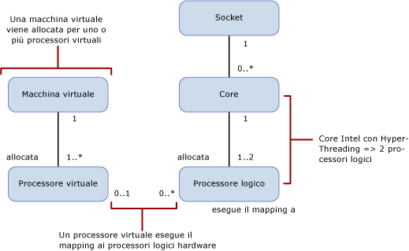

# Limiti della capacità di calcolo per edizione di SQL Server
[!INCLUDE[appliesto-ss-xxxx-xxxx-xxx-md](../includes/appliesto-ss-xxxx-xxxx-xxx-md.md)]
  Questo articolo illustra i limiti della capacità di calcolo per diverse edizioni di [!INCLUDE[ssCurrent](../includes/sscurrent-md.md)] e le differenze in ambienti fisici e virtualizzati con processori dotati di Hyper-Threading.  
  
   
  
 Questa tabella descrive le notazioni nel diagramma precedente:  
  
|valore|Description|  
|-----------|-----------------|  
|0..1|Zero o uno|  
|1|Esattamente uno|  
|1..\*|Uno o più|  
|0..\*|Zero o più|  
|1..2|Uno o due|  
  
> [!IMPORTANT]  
> Per un'ulteriore elaborazione:  
>   
> - Una macchina virtuale dispone di uno o più processori virtuali.  
> - Uno o più processori virtuali sono allocati a esattamente una macchina virtuale.  
> - Viene eseguito il mapping a zero o più processori logici di zero o un processore virtuale. Quando il mapping dei processori virtuali al processore logico è: 
>     -   Uno a zero, rappresenta un processore logico non associato non usato dai sistemi operativi guest.  
>     -   Uno a molti, rappresenta un overcommit.  
>     -   Zero a molti, rappresenta l'assenza di una macchina virtuale sul sistema host. Di conseguenza le macchine virtuali non usano alcun processore logico.  
> - Viene eseguito il mapping di un socket a zero o a più core. Quando il mapping da socket a core è:  
>     -   Uno a zero, rappresenta un socket vuoto. Non è installato nessun chip.  
>     -   Uno a uno, rappresenta un chip single core installato nel socket. Questo mapping è ormai raro.  
>     -   Uno a molti, rappresenta un chip multi-core installato nel socket. I valori tipici sono 2, 4 e 8.  
> - Viene eseguito il mapping di un core a uno o due processori logici. Quando il mapping dei core ai processore logici è:  
>     -   Uno a uno, l'Hyper-Threading è disabilitato.  
>     -   Uno a due, l'Hyper-Threading è abilitato.  
  
 Le definizioni seguenti si riferiscono ai termini usati in questo articolo:  
  
-   Un thread o processore logico è un motore di calcolo logico dalla prospettiva di [!INCLUDE[ssNoVersion](../includes/ssnoversion-md.md)], del sistema operativo, di un'applicazione o un driver.  
  
-   Un core è un'unità del processore. Può essere costituito da uno o più processori logici.  
  
-   Un processore fisico può essere costituito da uno o più core. Un processore fisico corrisponde a un pacchetto del processore o a un socket.  
  
Sistemi con più processori fisici o sistemi con processori fisici che dispongono di più core e/o Hyper-thread consentono al sistema operativo di eseguire più attività simultaneamente. Ogni thread di esecuzione viene visualizzato come un processore logico. Se ad esempio il computer in uso dispone di due processori quad core con l'Hyper-Threading abilitato e due thread per core, sono presenti 16 processori logici: 2 processori x 4 core per processore x 2 thread per core. Si noti che:  
  
-   La capacità di calcolo di un processore logico da un solo thread di un core con l'Hyper-Threading è inferiore alla capacità di calcolo di un processore logico da quello stesso core con l'Hyper-Threading disabilitato.  
  
-   La capacità di calcolo dei 2 processori logici nel core con l'Hyper-Threading è maggiore della capacità di calcolo dello stesso core con l'Hyper-Threading disabilitato.  
  
Ogni edizione di [!INCLUDE[ssNoVersion](../includes/ssnoversion-md.md)] dispone di due limiti di capacità di calcolo:  
  
- Un numero massimo di socket (o processori fisici o pacchetti del processore).  
  
- Un numero massimo di core come riportato dal sistema operativo.  
  
Questi limiti si applicano a una sola istanza di [!INCLUDE[ssNoVersion](../includes/ssnoversion-md.md)]. Rappresentano la capacità di calcolo massima che verrà utilizzata da una sola istanza. Non vincolano il server sul quale potrebbe essere distribuita l'istanza. In realtà la distribuzione di più istanze di [!INCLUDE[ssNoVersion](../includes/ssnoversion-md.md)] sullo stesso server fisico è un modo efficiente per usare la capacità di calcolo di un server fisico con più socket e/o core di quelli consentiti dai limiti di capacità.  
  
Nella tabella seguente vengono specificati i limiti della capacità di calcolo per una sola istanza di ogni edizione di [!INCLUDE[ssCurrent](../includes/sscurrent-md.md)]:  
  
|Edizione di[!INCLUDE[ssNoVersion](../includes/ssnoversion-md.md)] |Capacità di calcolo massima per una singola istanza ([!INCLUDE[ssNoVersion](../includes/ssnoversion-md.md)][!INCLUDE[ssDE](../includes/ssde-md.md)])|Capacità di calcolo massima per una singola istanza (AS, RS)|  
|---------------------------------------|--------------------------------------------------------------------------------------------------------|-------------------------------------------------------------------|  
|Enterprise Edition: licenze basate su core\*|Valore massimo del sistema operativo|Valore massimo del sistema operativo|  
|Developer|Valore massimo del sistema operativo|Valore massimo del sistema operativo|  
|Standard|Limitato a meno di 4 socket o 24 core|Limitato a meno di 4 socket o 24 core|  
|Express|Limitato a meno di 1 socket o 4 core|Limitato a meno di 1 socket o 4 core|  

\*La licenza Enterprise Edition con Server + Licenza CAL (Client Access License) è limitata a un massimo di 20 core per istanza di [!INCLUDE[ssNoVersion](../includes/ssnoversion-md.md)]. Questo tipo di licenza non è disponibile per nuovi contratti. Non sono previsti limiti nel modello di licenza server basato su core.  
  
In un ambiente virtualizzato, il limite di capacità di calcolo è basato sul numero di processori logici e non sul numero di core. Il motivo è che l'architettura del processore non è visibile alle applicazioni guest. 

Ad esempio, un server con quattro socket popolati con processori quad-core e la capacità di abilitare due Hyper-Thread per core contiene 32 processori logici con l'Hyper-Threading abilitato. Tuttavia contiene solo 16 processori logici con l'Hyper-Threading disabilitato. Questi processori logici possono essere mappati su macchine virtuali nel server. Il carico di calcolo delle macchine virtuali sul processore logico viene mappato su un thread di esecuzione nel processore fisico del server host.  
  
Può risultare utile disabilitare l'Hyper-Threading quando le prestazioni per processore virtuale sono importanti. È possibile abilitare o disabilitare l'Hyper-Threading usando un'impostazione BIOS per il processore durante la configurazione del BIOS. Tuttavia questa operazione è in genere di ambito server e ha effetto su tutti i carichi di lavoro in esecuzione nel server. In tale situazione potrebbe essere consigliabile dividere i carichi di lavoro che saranno in esecuzione negli ambienti virtualizzati da quelli che beneficeranno del miglioramento delle prestazioni dell'Hyper-Threading in un ambiente del sistema operativo fisico.  
  
## Vedere anche  
 [Edizioni e componenti di SQL Server 2016](../sql-server/editions-and-components-of-sql-server-2016.md)   
 [Funzionalità supportate dalle edizioni di SQL Server 2016](~/sql-server/editions-and-supported-features-for-sql-server-2016.md)   
 [Specifiche di capacità massima per SQL Server](../sql-server/maximum-capacity-specifications-for-sql-server.md)   
 [Guida introduttiva all'installazione di SQL Server 2016](http://msdn.microsoft.com/library/672afac9-364d-4946-ad5d-8a2d89cf8d81)  

[!INCLUDE[get-help-options](../includes/paragraph-content/get-help-options.md)]

[!INCLUDE[contribute-to-content](../includes/paragraph-content/contribute-to-content.md)]
