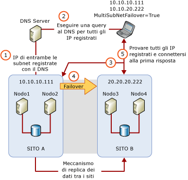

# Clustering su più subnet di SQL Server (SQL Server)
  Un cluster di failover su più subnet di [!INCLUDE[ssNoVersion](../../../includes/ssnoversion-md.md)] è una configurazione in cui ogni nodo del cluster di failover è connesso a una subnet diversa o a un set differente di subnet. Queste subnet possono trovarsi nella stessa posizione o in siti dislocati in località geografiche diverse. Il clustering tra siti dislocati in diverse località geografiche viene talvolta definito come cluster esteso. Poiché non esiste alcuna archiviazione condivisa a cui possono accedere tutti i nodi, i dati devono essere replicati tra le archiviazioni dati nelle diverse subnet. Grazie alla replica dei dati risultano disponibili più copie dei dati. Pertanto, oltre a una disponibilità elevata, un cluster di failover su più subnet offre una soluzione di ripristino di emergenza.  
  
   
##   Clustering di failover su più subnet di SQL Server (due nodi, due subnet)  
 Nella figura seguente è illustrata un'istanza di cluster di failover (FCI) con due nodi e due subnet in [!INCLUDE[ssCurrent](../../../includes/sscurrent-md.md)].  
  
   
  
  
##   Configurazioni di istanze di cluster di failover su più subnet  
 Di seguito sono riportati alcuni esempi di FCI di [!INCLUDE[ssNoVersion](../../../includes/ssnoversion-md.md)] in cui vengono utilizzate più subnet:  
  
-   [!INCLUDE[ssNoVersion](../../../includes/ssnoversion-md.md)] SQLCLUST1 sono inclusi i nodi Node1 e Node2. Node1 è connesso a Subnet1. Node2 è connesso a Subnet1. [!INCLUDE[ssNoVersion](../../../includes/ssnoversion-md.md)] L'installazione riconosce tale configurazione come cluster con più subnet e imposta la dipendenza delle risorse di indirizzo IP su **OR**.  
  
-   [!INCLUDE[ssNoVersion](../../../includes/ssnoversion-md.md)] SQLCLUST1 sono inclusi i nodi Node1, Node2 e Node3. Node1 e Node2 sono connessi a Subnet1. Node3 è connesso a Subnet2. [!INCLUDE[ssNoVersion](../../../includes/ssnoversion-md.md)] L'installazione riconosce tale configurazione come cluster con più subnet e imposta la dipendenza delle risorse di indirizzo IP su **OR**. Poiché Node1 e Node2 si trovano nella stessa subnet, questa configurazione garantisce un'elevata disponibilità locale aggiuntiva.  
  
-   [!INCLUDE[ssNoVersion](../../../includes/ssnoversion-md.md)] SQLCLUST1 sono inclusi i nodi Node1 e Node2. Node1 si trova in Subnet1. Node2 è su Subnet1 e Subnet2. [!INCLUDE[ssNoVersion](../../../includes/ssnoversion-md.md)] L'installazione riconosce tale configurazione come cluster con più subnet e imposta la dipendenza delle risorse di indirizzo IP su **OR**.  
  
-   [!INCLUDE[ssNoVersion](../../../includes/ssnoversion-md.md)] SQLCLUST1 sono inclusi i nodi Node1 e Node2. Node1 è connesso a Subnet1 e a Subnet2. Anche Node2 è connesso a Subnet1 e a Subnet2. La dipendenza delle risorse di indirizzo IP viene impostata su **AND** dall'installazione di [!INCLUDE[ssNoVersion](../../../includes/ssnoversion-md.md)] .  
  
    > **NOTA:** questa configurazione non è considerata come una configurazione di cluster di failover su più subnet perché i nodi di tipo cluster si trovano nello stesso set di subnet.  
  
##   Considerazioni relative alle risorse di indirizzo IP  
 In una configurazione del cluster di failover su più subnet, gli indirizzi IP non sono di proprietà di tutti i nodi del cluster di failover e potrebbero non essere tutti online durante l'avvio di [!INCLUDE[ssNoVersion](../../../includes/ssnoversion-md.md)] . A partire da [!INCLUDE[ssSQL11](../../../includes/sssql11-md.md)], è possibile impostare la dipendenza delle risorse di indirizzo IP su **OR**. Questa operazione consente a [!INCLUDE[ssNoVersion](../../../includes/ssnoversion-md.md)] di essere online quando è presente almeno un indirizzo IP valido a cui possa associarsi.  
  
> **NOTA:** Nelle configurazioni di cluster multisito delle versioni di [!INCLUDE[ssNoVersion](../../../includes/ssnoversion-md.md)] precedenti a [!INCLUDE[ssSQL11](../../../includes/sssql11-md.md)]veniva usata una tecnologia V-LAN estesa per esporre un singolo indirizzo IP per il failover nei siti. Grazie alla nuova funzionalità di [!INCLUDE[ssNoVersion](../../../includes/ssnoversion-md.md)] che consente di eseguire il clustering di nodi in subnet diverse, è ora possibile configurare cluster di failover di [!INCLUDE[ssNoVersion](../../../includes/ssnoversion-md.md)] in più siti senza implementare la tecnologia V-LAN estesa.  
  
### Considerazioni sulla dipendenza OR delle risorse di indirizzo IP  
 Se la dipendenza delle risorse di indirizzo IP viene impostata su **OR**, è opportuno considerare il seguente comportamento di failover:  
  
-   Quando si verifica un errore in uno degli indirizzi IP del nodo che attualmente possiede il gruppo di risorse del cluster di [!INCLUDE[ssNoVersion](../../../includes/ssnoversion-md.md)] , il failover non viene attivato automaticamente finché tutti gli indirizzi IP validi in quel nodo non avranno esito negativo.  
  
-   Quando si verifica un failover, [!INCLUDE[ssNoVersion](../../../includes/ssnoversion-md.md)] viene portato online se può essere associato ad almeno un indirizzo IP valido nel nodo corrente. Gli indirizzi IP che non sono stati associati a [!INCLUDE[ssNoVersion](../../../includes/ssnoversion-md.md)] all'avvio saranno elencati nel log degli errori.  
  
   
 Quando si esegue un'installazione side-by-side di una FCI di [!INCLUDE[ssNoVersion](../../../includes/ssnoversion-md.md)] con un'istanza autonoma del [!INCLUDE[ssDEnoversion](../../../includes/ssdenoversion-md.md)], prestare attenzione per evitare conflitti del numero di porta TCP negli indirizzi IP. Di solito i conflitti si verificano quando due istanze del [!INCLUDE[ssDE](../../../includes/ssde-md.md)] sono entrambe configurate per utilizzare la porta TCP predefinita (1433). Per evitare conflitti, configurare un'istanza in modo che venga utilizzata una porta fissa non predefinita. La configurazione di una porta fissa è di solito più facile nell'istanza autonoma. Configurare il [!INCLUDE[ssDE](../../../includes/ssde-md.md)] in modo che vengano utilizzate porte diverse per evitare un conflitto di indirizzo IP/porta TCP non previsto che blocca l'avvio di un'istanza quando si verifica un errore di una FCI di [!INCLUDE[ssNoVersion](../../../includes/ssnoversion-md.md)] nel nodo di standby.  
  
##   Latenza di recupero del client durante i failover  
 Una FCI su più subnet abilita per impostazione predefinita la risorsa cluster RegisterAllProvidersIP per il nome di rete. In una configurazione con più subnet, sia gli indirizzi IP online che offline del nome di rete verranno registrati sul server DNS. L'applicazione client recupera quindi tutti gli indirizzi IP registrati dal server DNS e tenta di connettersi agli indirizzi in sequenza o in parallelo. Ciò significa che il tempo di recupero del client nei failover con più subnet non dipende più dalle latenze di aggiornamento DNS. Per impostazione predefinita, il client prova gli indirizzi IP in sequenza. Quando il client utilizza il nuovo parametro **MultiSubnetFailover=True** facoltativo nella stringa di connessione, prova invece gli indirizzi IP simultaneamente e si connette al primo server che risponde. In questo modo è possibile ridurre la latenza di recupero del client quando si verificano i failover. Per altre informazioni, vedere [Connettività client Always On (SQL Server)](../../../database-engine/availability-groups/windows/always-on-client-connectivity-sql-server.md) e [Creare o configurare un listener del gruppo di disponibilità (SQL Server)](../../../database-engine/availability-groups/windows/create-or-configure-an-availability-group-listener-sql-server.md).  
  
 Con librerie client legacy o provider di dati di terze parti non è possibile utilizzare il parametro **MultiSubnetFailover** nella stringa di connessione. Per assicurarsi che l'applicazione client funzioni in maniera ottimale con FCI su più subnet in [!INCLUDE[ssCurrent](../../../includes/sscurrent-md.md)], provare a regolare il timeout di connessione nella stringa di connessione client di 21 secondi per ogni indirizzo IP aggiuntivo. In questo modo non si verifica il timeout del tentativo di riconnessione del client prima che siano stati scorsi tutti gli indirizzi IP nella FCI su più subnet.  
  
 Il periodo di timeout predefinito della connessione client per [!INCLUDE[ssNoVersion](../../../includes/ssnoversion-md.md)] Management Studio e **sqlcmd** è di 15 secondi.  
  
   
##   Contenuto correlato  
  
|Descrizione del contenuto|Argomento|  
|-------------------------|-----------|  
|Installazione di un cluster di failover di SQL Server|[Creare un nuovo cluster di failover di SQL Server (programma di installazione)](../../../sql-server/failover-clusters/install/create-a-new-sql-server-failover-cluster-setup.md)|  
|Aggiornamento sul posto del cluster di failover di SQL Server esistente|[Eseguire l'aggiornamento di un'istanza del cluster di failover di SQL Server &#40;installazione&#41;](../../../sql-server/failover-clusters/windows/upgrade-a-sql-server-failover-cluster-instance-setup.md)|  
|Gestione del cluster di failover di SQL Server esistente|[Aggiungere o rimuovere nodi in un cluster di failover di SQL Server &#40;programma di installazione&#41;](../../../sql-server/failover-clusters/install/add-or-remove-nodes-in-a-sql-server-failover-cluster-setup.md)|  
|Utilizzare lo snap-in Gestione cluster di failover per visualizzare gli eventi e i log WSFC|[Visualizzare eventi e log per un cluster di failover](http://technet.microsoft.com/library/cc772342\(WS.10\).aspx)|  
|Utilizzare Windows PowerShell per creare un file di log per tutti i nodi (o un nodo specifico) in un cluster di failover WSFC|[Pagina relativa al cluster di failover Get-ClusterLog](http://technet.microsoft.com/library/ee461045.aspx)|  
  

  
  
