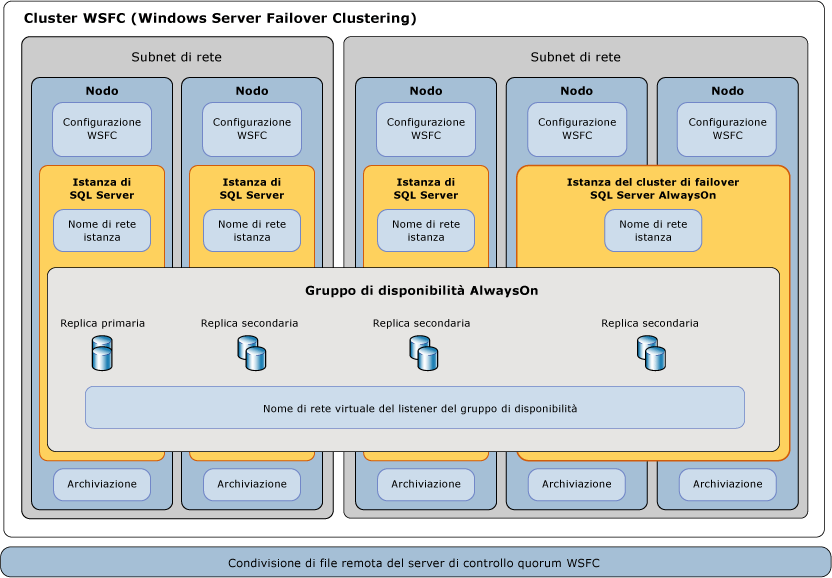

# Windows Server Failover Clustering con SQL Server
[!INCLUDE[appliesto-ss-xxxx-xxxx-xxx-md](../../../includes/appliesto-ss-xxxx-xxxx-xxx-md.md)] Un cluster di failover WSFC (*Windows Server Failover Clustering*) è un gruppo di server indipendenti usati congiuntamente per aumentare la disponibilità di applicazioni e servizi. [!INCLUDE[ssCurrent](../../../includes/sscurrent-md.md)] vengono utilizzate le funzionalità e i servizi di WSFC per supportare le istanze del cluster di failover di [!INCLUDE[ssHADR](../../../includes/sshadr-md.md)] e [!INCLUDE[ssNoVersion](../../../includes/ssnoversion-md.md)] .  
  
   
##   Termini e definizioni  
 Windows Server Failover Clustering (WSFC)  Un cluster di failover WSFC è un gruppo di server indipendenti usati congiuntamente per aumentare la disponibilità di applicazioni e servizi.  
  
 Node  
 Un server che fa parte di un cluster WSFC.
  
 Risorsa cluster  
 Entità fisica o logica che può essere di proprietà di un nodo e che è possibile portare online e offline, spostare tra nodi e gestire come oggetto cluster. Una risorsa cluster può essere solo di proprietà di un nodo singolo in qualsiasi punto nel tempo.  
  
 Ruolo Raccolta di risorse cluster gestita come singolo oggetto cluster per ottenere funzionalità specifiche. Per SQL Server, un ruolo sarà un gruppo di disponibilità Always On (AG) o un'istanza di cluster di failover Always On (FCI). Un ruolo contiene tutte le risorse cluster necessarie per un gruppo di disponibilità o un'istanza di cluster di failover. Failover e failback vengono sempre eseguiti in un contesto di ruoli. Per un'istanza FCI, il ruolo conterrà una risorsa indirizzo IP, una risorsa nome di rete e le risorse di SQL Server. Un ruolo AG conterrà la risorsa gruppo di disponibilità e, se un è configurato un listener, un nome networm e una risorsa IP. 

 Risorsa nome di rete  
 Nome di server logico gestito come risorsa cluster. Una risorsa nome di rete deve essere utilizzata con una risorsa indirizzo IP. Queste voci possono richiedere oggetti in Active Directory Domain Services e/o DNS. 
  
 Dipendenza dalla risorsa  
 Risorsa da cui dipende un'altra risorsa. Se la risorsa A dipende dalla risorsa B, B è una dipendenza di A. La risorsa A non sarà in grado di avviarsi senza la risorsa B.  
  
  
 Proprietario preferito  
 Nodo in cui si preferisce eseguire un gruppo di risorse. Ogni gruppo di risorse è associato a un elenco di proprietari preferiti ordinato in base alla preferenza. Durante il failover automatico, il gruppo di risorse viene spostato al nodo preferito successivo nell'elenco di proprietari preferiti.  
  
 Possibile proprietario  
 Nodo secondario in cui è possibile eseguire una risorsa. Ogni gruppo di risorse è associato a un elenco di possibili proprietari. È possibile eseguire il failover dei ruoli solo ai nodi elencati come possibili proprietari.   
  
 Modalità quorum  
 Configurazione del quorum in un cluster di failover che determina il numero di errori di nodo supportati dal cluster.  
  
 Forzare il quorum  
 Processo di avvio del cluster anche nel caso in cui sia in comunicazione solo una minoranza degli elementi richiesti per il quorum.  
  

##   Panoramica di Windows Server Failover Clustering  
 In Windows Server Failover Clustering sono disponibili funzionalità di infrastruttura che supportano gli scenari di disponibilità elevata e ripristino di emergenza delle applicazioni server ospitate quali Microsoft [!INCLUDE[ssNoVersion](../../../includes/ssnoversion-md.md)] e Microsoft Exchange. Se si verifica un errore in un nodo o servizio cluster, i servizi ospitati su tale nodo possono essere trasferiti automaticamente o manualmente a un altro nodo disponibile in un processo noto come *failover*.  
  
 I nodi del cluster WSFC funzionano insieme per garantire collettivamente questi tipi di funzionalità:  
  
-   **Notifiche e metadati distribuiti.** I metadati del servizio WSFC e delle applicazioni ospitate vengono gestiti in ogni nodo del cluster. I metadati includono la configurazione e lo stato di WSFC oltre alle impostazioni delle applicazioni ospitate. Le modifiche apportate ai metadati o allo stato di un nodo vengono automaticamente propagate agli altri nodi del cluster WSFC.  
  
-   **Gestione delle risorse.** I singoli nodi del cluster WSFC possono rendere disponibili risorse fisiche, ad esempio l'archiviazione a collegamento diretto, le interfacce di rete e l'accesso all'archiviazione su dischi condivisi. Le applicazioni ospitate effettuano la registrazione come risorse cluster e possono configurare dipendenze di avvio e integrità su altre risorse.  
  
-   **Monitoraggio dello stato.** Il rilevamento dello stato del nodo primario e tra nodi viene effettuato tramite una combinazione di comunicazioni di rete di tipo heartbeat e di monitoraggio delle risorse. Lo stato complessivo del cluster WSFC è determinato dai voti di un quorum di nodi nel cluster.  
  
-   **Coordinamento del failover.** Ogni risorsa è configurata per essere ospitata su un nodo primario e può essere trasferita automaticamente o manualmente a uno o più nodi secondari. I criteri di failover basati sull'integrità controllano il trasferimento automatico della proprietà della risorsa tra i nodi. Quando si verifica il failover, viene inviata una notifica ai nodi e alle applicazioni ospitate affinché siano in grado di reagire nel modo appropriato.  
  
 Per altre informazioni, vedere [Panoramica di Clustering di failover - Windows Server](https://technet.microsoft.com/library/hh831579(v=ws.11).aspx)  
  
##   Tecnologie AlwaysOn e WSFC di SQL Server  
 [!INCLUDE[ssCurrent](../../../includes/sscurrent-md.md)] *AlwaysOn* è una nuova soluzione per la disponibilità elevata e il ripristino di emergenza basata su WSFC. Le funzionalità Always On offrono soluzioni integrate e flessibili che aumentano la disponibilità delle applicazioni, garantiscono un migliore rendimento degli investimenti in componenti hardware e semplifica la distribuzione e la gestione della disponibilità elevata.  
  
 Per le istanze di [!INCLUDE[ssHADR](../../../includes/sshadr-md.md)] e del cluster di failover AlwaysOn viene utilizzata la tecnologia della piattaforma WSFC che prevede la registrazione dei componenti come risorse cluster WSFC.  Le risorse correlate vengono combinate in un *ruolo*, che può essere reso dipendente dalle altre risorse del cluster WSFC. Il cluster WSFC può quindi rilevare e segnalare la necessità di riavviare l'istanza di [!INCLUDE[ssNoVersion](../../../includes/ssnoversion-md.md)] o di eseguirne automaticamente il failover a un altro nodo server del cluster WSFC.  
  
> **IMPORTANTE** Per sfruttare al meglio i vantaggi delle tecnologie [!INCLUDE[ssNoVersion](../../../includes/ssnoversion-md.md)] AlwaysOn, è necessario applicare diversi prerequisiti correlati a WSFC.  
>   
>  Per altre informazioni, vedere [Prerequisiti, restrizioni e consigli per i gruppi di disponibilità AlwaysOn &#40;SQL Server&#41;](../../../database-engine/availability-groups/windows/prereqs-restrictions-recommendations-always-on-availability.md)  
  
### Disponibilità elevata a livello di istanza con istanze del cluster di failover AlwaysOn  
 Un'*istanza del cluster di failover* Always On è un'istanza di [!INCLUDE[ssNoVersion](../../../includes/ssnoversion-md.md)] installata nei nodi di un cluster WSFC. Questo tipo di istanza dipende dalle risorse per l'archiviazione e dal nome di rete virtuale. L'archiviazione può usare Fibre Channel, iSCSI, FCoE o SAS per l'archiviazione su disco condiviso o l'archiviazione collegata in locale con [Spazi di archiviazione diretta (S2D)](http://technet.microsoft.com/windows-server-docs/storage/storage-spaces/storage-spaces-direct-overview). La risorsa del nome di rete virtuale dipende da uno o più indirizzi IP virtuali, ciascuno in una subnet diversa. Anche il servizio SQL Server e il servizio SQL Server Agent vengono registrati come risorse ed entrambi dipendono dalle risorse del nome di rete virtuale e di archiviazione.  
  
 In caso di failover, la proprietà delle risorse di un'istanza viene trasferita dal servizio WSFC a un nodo di failover definito. L'istanza di [!INCLUDE[ssNoVersion](../../../includes/ssnoversion-md.md)] viene quindi riavviata sul nodo di failover e i database vengono recuperati nel modo consueto. In un qualsiasi momento specifico, solo un nodo singolo nel cluster può ospitare l'istanza del cluster di failover e le risorse sottostanti.  
  
> **NOTA:**  un'istanza del cluster di failover AlwaysOn richiede l'archiviazione su disco condiviso simmetrica, ad esempio una rete di archiviazione SAN o una condivisione file SMB.  I volumi dell'archiviazione su disco condiviso devono essere disponibili a tutti i nodi di failover potenziali nel cluster WSFC.  
  
 Per altre informazioni, vedere [Istanze del cluster di failover AlwaysOn &#40;SQL Server&#41;](../../../sql-server/failover-clusters/windows/always-on-failover-cluster-instances-sql-server.md)  
  
### Disponibilità elevata a livello di database con [!INCLUDE[ssHADR](../../../includes/sshadr-md.md)]  
 Un *gruppo di disponibilità* Always On è costituito da uno o più database utente il cui failover viene eseguito contemporaneamente. Un gruppo di disponibilità è costituito da una *replica di disponibilità primaria* e da una a quattro repliche secondarie gestite tramite lo spostamento dati basato su log di SQL Server per la protezione dei dati senza la necessità di archiviazione condivisa. Ogni replica è ospitata da un'istanza di [!INCLUDE[ssNoVersion](../../../includes/ssnoversion-md.md)] in un nodo diverso del cluster WSFC. Il gruppo di disponibilità e un nome di rete virtuale corrispondente sono registrati come risorse nel cluster WSFC.  
  
 Tramite un *listener del gruppo di disponibilità* sul nodo della replica primaria si risponde alle richieste client in ingresso per connettersi al nome di rete virtuale e, in base agli attributi nella stringa di connessione, si indirizza ogni richiesta all'istanza di [!INCLUDE[ssNoVersion](../../../includes/ssnoversion-md.md)] appropriata.  
  
 In caso di failover, anziché trasferire la proprietà delle risorse fisiche condivise a un altro nodo si utilizza WSFC per riconfigurare una replica secondaria su un'altra istanza di [!INCLUDE[ssNoVersion](../../../includes/ssnoversion-md.md)] come replica primaria del gruppo di disponibilità. La risorsa del nome di rete virtuale del gruppo di disponibilità viene quindi trasferita a tale istanza.  
  
 In un qualsiasi momento specifico, solo una singola istanza di [!INCLUDE[ssNoVersion](../../../includes/ssnoversion-md.md)] può ospitare la replica primaria dei database di un gruppo di disponibilità; tutte le repliche secondarie associate devono trovarsi ciascuna in un'istanza separata e ogni istanza deve risiedere su nodi fisici separati.  
  
> **NOTA:** [!INCLUDE[ssHADR](../../../includes/sshadr-md.md)] non richiedono la distribuzione di un'istanza del cluster di failover né l'uso di archiviazione condivisa simmetrica (SAN o SMB).  
>   
>  È possibile utilizzare un'istanza del cluster di failover con un gruppo di disponibilità per migliorare la disponibilità di una replica di disponibilità. Per evitare potenziali race condition nel cluster WSFC, tuttavia, non è consentito eseguire il failover automatico del gruppo di disponibilità a o da una replica di disponibilità ospitata in un'istanza del cluster di failover.  
  
 Per altre informazioni, vedere [Panoramica di Gruppi di disponibilità AlwaysOn &#40;SQL Server&#41;](../../../database-engine/availability-groups/windows/overview-of-always-on-availability-groups-sql-server.md)  
  
##   Monitoraggio dello stato e failover di WSFC  
 La disponibilità elevata per una soluzione AlwaysOn viene realizzata attraverso il monitoraggio dello stato proattivo delle risorse cluster WSFC fisiche e logiche, insieme al failover automatico e alla riconfigurazione dell'hardware ridondante.  Un amministratore di sistema può inoltre iniziare un *failover manuale* di un gruppo di disponibilità o un'istanza di [!INCLUDE[ssNoVersion](../../../includes/ssnoversion-md.md)] da un nodo a un altro.  
  
### Criteri di failover per nodi, istanze del cluster di failover e gruppi di disponibilità  
 I *criteri di failover* vengono configurati a livello di nodo WSFC, di istanza del cluster di failover di [!INCLUDE[ssNoVersion](../../../includes/ssnoversion-md.md)] e di gruppo di disponibilità.  Tali criteri, basati sulla gravità, la durata e la frequenza degli stati non integri delle risorse cluster e sulla velocità di risposta del nodo, possono attivare un riavvio del servizio o un *failover automatico* delle risorse cluster da un nodo a un altro oppure attivare lo spostamento di una replica primaria del gruppo di disponibilità da un'istanza di [!INCLUDE[ssNoVersion](../../../includes/ssnoversion-md.md)] a un'altra.  
  
 Il failover di una replica del gruppo di disponibilità non ha effetti sull'istanza di [!INCLUDE[ssNoVersion](../../../includes/ssnoversion-md.md)] sottostante.  Con il failover di un'istanza del cluster di failover le repliche del gruppo di disponibilità ospitate vengono spostate con l'istanza.  
  
 Per altre informazioni, vedere [Criteri di failover per istanze del cluster di failover](../../../sql-server/failover-clusters/windows/failover-policy-for-failover-cluster-instances.md).  
  
### Rilevamento dell'integrità delle risorse WSFC  
 Ogni risorsa di un cluster WSFC è in grado di segnalare il proprio stato e la propria integrità, periodicamente o su richiesta. Un'ampia gamma di circostanze potrebbe indicare un errore della risorsa; ad esempio, interruzione dell'alimentazione, errori di disco o memoria, errori nella comunicazione di rete o servizi che non rispondono.  
  
 È possibile rendere dipendenti l'una dall'altra risorse cluster WSFC quali reti, archiviazione o servizi. L'integrità cumulativa di una risorsa è determinata dal rollup successivo dell'integrità e con l'integrità di ognuna delle dipendenze della risorsa.  
  
### Rilevamento dell'integrità tra nodi WSFC e voto del quorum  
 Ogni nodo di un cluster WSFC partecipa alla comunicazione heartbeat periodica per condividere il proprio stato di integrità con gli altri nodi. I nodi che non rispondono sono considerati in stato di errore.  
  
 Il *quorum* è un meccanismo che consente di verificare che il cluster WSFC sia attivo e in esecuzione e che siano online risorse sufficienti nel cluster WSFC. Se il cluster WSFC ha voti a sufficienza, è integro e in grado di garantire la tolleranza di errore a livello di nodo.  
  
 Una *modalità quorum* è configurata nel cluster WSFC per determinare la metodologia usata per il voto del quorum, nonché quando eseguire un failover automatico o portare il cluster offline. 
  
> **SUGGERIMENTO** La procedura consigliata prevede di avere sempre un numero dispari di voti del quorum in un cluster WSFC.  Ai fini del voto del quorum, non è necessario che [!INCLUDE[ssNoVersion](../../../includes/ssnoversion-md.md)] sia installato in tutti i nodi nel cluster. Un server aggiuntivo può fungere da membro del quorum o è possibile configurare il modello del quorum WSFC per utilizzare una condivisione file remota come elemento per la risoluzione dei conflitti.  
>   
>  Per altre informazioni, vedere [Modalità quorum WSFC e configurazione del voto (SQL Server)](../../../sql-server/failover-clusters/windows/wsfc-quorum-modes-and-voting-configuration-sql-server.md)  
  
### Ripristino di emergenza eseguito forzando il quorum  
 A seconda delle procedure operative e della configurazione del cluster WSFC, è possibile generare failover sia automatici sia manuali pur mantenendo una soluzione [!INCLUDE[ssNoVersion](../../../includes/ssnoversion-md.md)] Always On affidabile e a tolleranza d'errore. Se tuttavia un quorum di nodi votanti idonei nel cluster WSFC non assicura la comunicazione reciproca o se la convalida dell'integrità del cluster WSFC ha esito negativo, è possibile che il cluster WSFC passi alla modalità offline.  
  
 Se il cluster WSFC passa alla modalità offline a causa di un'emergenza non pianificata o di un errore persistente a livello di hardware o di comunicazione, è necessario un intervento amministrativo manuale per *forzare un quorum* e riportare online i nodi del cluster ancora esistenti in una configurazione non a tolleranza d'errore.  
  
 Successivamente, sarà inoltre necessario effettuare una serie di passaggi per riconfigurare il cluster WSFC, recuperare le repliche di database interessate e ristabilire un nuovo quorum.  
  
 Per altre informazioni, vedere [Ripristino di emergenza WSFC tramite quorum forzato (SQL Server)](../../../sql-server/failover-clusters/windows/wsfc-disaster-recovery-through-forced-quorum-sql-server.md)  
  
##   Relazione dei componenti AlwaysOn di SQL Server con WSFC  
 Sono presenti diversi livelli di relazione tra le funzionalità e i componenti di [!INCLUDE[ssNoVersion](../../../includes/ssnoversion-md.md)] AlwaysOn e WSFC.  
  
 I gruppi di disponibilità AlwaysOn sono ospitati nelle istanze di [!INCLUDE[ssNoVersion](../../../includes/ssnoversion-md.md)] .  
 Una richiesta client con cui viene specificato un nome di rete del listener del gruppo di disponibilità logico per connettersi a un database primario o secondario viene reindirizzata al nome di rete dell'istanza appropriato dell'istanza di [!INCLUDE[ssNoVersion](../../../includes/ssnoversion-md.md)] sottostante o dell'istanza del cluster di failover [!INCLUDE[ssNoVersion](../../../includes/ssnoversion-md.md)].  
  
 Le istanze di SQL Server sono ospitate attivamente in un solo nodo.  
 Se presente, un'istanza di [!INCLUDE[ssNoVersion](../../../includes/ssnoversion-md.md)] autonoma risiede sempre in un solo nodo con un nome di rete dell'istanza statico.  Se presente, un'istanza FCI di [!INCLUDE[ssNoVersion](../../../includes/ssnoversion-md.md)] è attiva su uno di due o più nodi di failover possibili con un solo nome di rete dell'istanza virtuale.  
  
 I nodi sono membri di un cluster WSFC.  
 I metadati e lo stato della configurazione WSFC per tutti i nodi sono archiviati in ciascun nodo. In ciascun server possono essere disponibili volumi di archiviazione o archiviazione condivisa (SAN) asimmetrica per i database utente o di sistema. Ogni server dispone almeno di un'interfaccia di rete fisica su una o più subnet IP.  
  
 Il servizio WSFC consente di monitorare l'integrità e di gestire la configurazione per un gruppo di server.  
 I meccanismi WSFC propagano le modifiche ai metadati di configurazione WSFC e lo stato a tutti i nodi del cluster WSFC. Se si usa un disco di controllo, anche i metadati vengono salvati sul disco. Per impostazione predefinita, ogni nodo del cluster WSFC ottiene un voto del quorum e, se necessario, viene usato e configurato un controllo.
 
 [!INCLUDE[ssHADR](../../../includes/sshadr-md.md)] sono sottochiavi del cluster WSFC.  
 Se si elimina e si ricrea un cluster WSFC, è necessario disabilitare e riabilitare la funzionalità [!INCLUDE[ssHADR](../../../includes/sshadr-md.md)] in ogni istanza del server abilitata per [!INCLUDE[ssHADR](../../../includes/sshadr-md.md)] nel cluster WSFC originale. Per altre informazioni, vedere [Abilitare e disabilitare la funzionalità Gruppi di disponibilità AlwaysOn &#40;SQL Server&#41;](../../../database-engine/availability-groups/windows/enable-and-disable-always-on-availability-groups-sql-server.md).  
  
   
  
##   Attività correlate  
  
-   [Visualizzare le impostazioni NodeWeight per il quorum del cluster](../../../sql-server/failover-clusters/windows/view-cluster-quorum-nodeweight-settings.md)  
  
-   [Configurare le impostazioni NodeWeight per il quorum del cluster](../../../sql-server/failover-clusters/windows/configure-cluster-quorum-nodeweight-settings.md)  
  
-   [Forzare l'avvio di un cluster WSFC senza un quorum](../../../sql-server/failover-clusters/windows/force-a-wsfc-cluster-to-start-without-a-quorum.md)  
  
##   Contenuto correlato  
  
-   [Tecnologie di Windows Server: cluster di failover](http://technet.microsoft.com/library/cc732488\(v=WS.10\).aspx)  

-   [Panoramica di Spazi di archiviazione diretta \(S2D\) ](http://technet.microsoft.com/windows-server-docs/storage/storage-spaces/storage-spaces-direct-overview)

-   [Cluster di failover in Windows Server 2008 R2](http://technet.microsoft.com/library/ff182338\(WS.10\).aspx)  
  
-   [Visualizzare eventi e registri per un cluster di failover](http://technet.microsoft.com/library/cc772342\(WS.10\).aspx)  
  
-   [Pagina relativa al cluster di failover Get-ClusterLog](http://technet.microsoft.com/library/ee461045.aspx)  
  
## Vedere anche  
 [Istanze del cluster di failover Always On (SQL Server)](../../../sql-server/failover-clusters/windows/always-on-failover-cluster-instances-sql-server.md)   
 [Panoramica di Gruppi di disponibilità AlwaysOn &#40;SQL Server&#41;](../../../database-engine/availability-groups/windows/overview-of-always-on-availability-groups-sql-server.md)   
 [Modalità quorum WSFC e configurazione del voto (SQL Server)](../../../sql-server/failover-clusters/windows/wsfc-quorum-modes-and-voting-configuration-sql-server.md)   
 [Criteri di failover per istanze del cluster di failover](../../../sql-server/failover-clusters/windows/failover-policy-for-failover-cluster-instances.md)   
 [Ripristino di emergenza WSFC tramite quorum forzato (SQL Server)](../../../sql-server/failover-clusters/windows/wsfc-disaster-recovery-through-forced-quorum-sql-server.md)  
 [SQL Server 2016 Supports Windows Server 2016 Storage Spaces Direct](http://blogs.technet.microsoft.com/dataplatforminsider/2016/09/27/sql-server-2016-now-supports-windows-server-2016-storage-spaces-direct/) (Supporto di SQL Server 2016 per Spazi di archiviazione diretta di Windows Server 2016)
  
