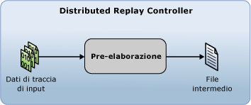

# Preparazione dei dati di traccia di input
[!INCLUDE[appliesto-ss-xxxx-xxxx-xxx-md](../../includes/appliesto-ss-xxxx-xxxx-xxx-md.md)]Prima di poter avviare una riproduzione distribuita con il [!INCLUDE[msCoName](../../includes/msconame-md.md)] [!INCLUDE[ssNoVersion](../../includes/ssnoversion-md.md)] funzionalità riesecuzione distribuita, è necessario preparare i dati di traccia di input avviando la fase di pre-elaborazione dallo strumento di amministrazione riesecuzione distribuita. Nella fase di pre-elaborazione Distributed Replay Controller elabora i dati di traccia e genera un file intermedio:  
  
   
  
 Per altre informazioni sulla fase di pre-elaborazione, vedere [Riesecuzione distribuita di SQL Server](../../tools/distributed-replay/sql-server-distributed-replay.md).  
  
> [!NOTE]  
>  È necessario acquisire i dati di traccia di input in una versione di [!INCLUDE[ssNoVersion](../../includes/ssnoversion-md.md)] compatibile con Distributed Replay. I dati di traccia di input devono essere compatibili anche con il server di destinazione su cui si desidera riprodurre i dati di traccia. Per altre informazioni sui requisiti relativi alla versione, vedere [Requisiti relativi a Riesecuzione distribuita](../../tools/distributed-replay/distributed-replay-requirements.md).  
  
### Per preparare i dati di traccia di input  
  
1.  **Modificare le impostazioni di configurazione della pre-elaborazione (facoltativo)**: se si vogliono modificare le impostazioni di configurazione della pre-elaborazione, ad esempio se filtrare o meno le sessioni di sistema o configurare il tempo di inattività massimo, è necessario modificare l'elemento `<PreprocessModifiers>` del file XML di configurazione della pre-elaborazione `DReplay.exe.preprocess.config`. Se si modifica il file di configurazione della pre-elaborazione, è consigliabile modificarne una copia anziché l'originale. Per modificare le impostazioni, effettuare le operazioni seguenti:  
  
    1.  Creare una copia del file di configurazione della pre-elaborazione predefinito `DReplay.exe.preprocess.config`e rinominare il nuovo file. Il file di configurazione della pre-elaborazione predefinito si trova nella cartella di installazione dello strumento di amministrazione.  
  
    2.  Modificare le impostazioni di configurazione della pre-elaborazione nel nuovo file di configurazione.  
  
    3.  Quando si avvia la fase di pre-elaborazione dell'evento (fase successiva), usare il parametro *config_file* dell'opzione **preprocess** per specificare il percorso del file di configurazione modificato.  
  
     Per altre informazioni sul file di configurazione della pre-elaborazione, vedere [Configurare Riesecuzione distribuita](../../tools/distributed-replay/configure-distributed-replay.md).  
  
2.  **Avviare la fase di pre-elaborazione**: per preparare i dati di traccia di input, è necessario eseguire lo strumento di amministrazione con l'opzione **preprocess**. Per altre informazioni, vedere [Opzione preprocess &#40;strumento di amministrazione Riesecuzione distribuita&#41;](../../tools/distributed-replay/preprocess-option-distributed-replay-administration-tool.md).  
  
    1.  Aprire l'utilità del prompt dei comandi di Windows (**CMD.exe**) e passare al percorso di installazione dello strumento di amministrazione Riesecuzione distribuita (**DReplay.exe**).  
  
    2.  (Facoltativo) Usare il parametro *controller* , **-m**, per specificare il controller, se il servizio controller viene eseguito in un computer diverso dallo strumento di amministrazione.  
  
    3.  Usare il parametro *input_trace_file* con **-i**per specificare il percorso e il nome dei file di traccia di input.  
  
    4.  Usare il parametro *controller_working_directory* con **-d**per specificare il percorso nel controller in cui salvare il file intermedio.  
  
    5.  Facoltativo: usare il parametro *config_file* con **-c**per specificare il percorso del file di configurazione della pre-elaborazione. Utilizzare questo parametro per puntare al nuovo file di configurazione se è stata modificata una copia del file di configurazione della pre-elaborazione predefinito.  
  
    6.  (Facoltativo) Usare il parametro *status_interval* con **-f**per specificare se si vuole che lo strumento di amministrazione visualizzi messaggi di stato a una frequenza diversa da 30 secondi.  
  
     Avviando, ad esempio, la fase di pre-elaborazione nello stesso computer del servizio controller per un file di traccia in `c:\trace1.trc`, una directory di lavoro del controller in `c:\WorkingDir` e un messaggio di stato visualizzato con una frequenza predefinita pari a 30 secondi, è necessario usare la sintassi seguente: `dreplay preprocess -i c:\trace1.trc -d c:\WorkingDir`  
  
3.  Al termine della fase di pre-elaborazione, il file intermedio viene archiviato nella directory di lavoro del controller. Per avviare la fase di riproduzione dell'evento, è necessario eseguire lo strumento di amministrazione con l'opzione **replay** . Per altre informazioni, vedere [Riprodurre dati di traccia](../../tools/distributed-replay/replay-trace-data.md).  
  
## Vedere anche  
 [Riesecuzione distribuita di SQL Server](../../tools/distributed-replay/sql-server-distributed-replay.md)   
 [Requisiti relativi a riesecuzione distribuita](../../tools/distributed-replay/distributed-replay-requirements.md)   
 [Opzioni della riga di comando dello strumento di amministrazione &#40; utilità riesecuzione distribuita &#41;](../../tools/distributed-replay/administration-tool-command-line-options-distributed-replay-utility.md)   
 [Configurare Distributed Replay](../../tools/distributed-replay/configure-distributed-replay.md)  
  
  
