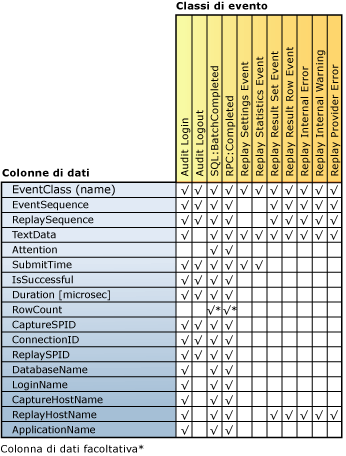

# Controllo dei risultati della riproduzione
[!INCLUDE[appliesto-ss-xxxx-xxxx-xxx-md](../../includes/appliesto-ss-xxxx-xxxx-xxx-md.md)] Al termine di una riesecuzione distribuita in Riesecuzione distribuita di [!INCLUDE[msCoName](../../includes/msconame-md.md)] [!INCLUDE[ssNoVersion](../../includes/ssnoversion-md.md)], l'attività di riesecuzione per ogni client può essere acquisita e salvata in file di traccia dei risultati in ogni client. Per acquisire questa attività, è necessario usare il parametro **-o** quando si esegue lo strumento di amministrazione con l'opzione **replay** . Per altre informazioni sull'opzione replay, vedere [Opzione replay &#40;Distributed Replay Administration Tool&#41;](../../tools/distributed-replay/replay-option-distributed-replay-administration-tool.md).  
  
 La posizione in cui vengono archiviati i file di traccia dei risultati è specificata dall'elemento XML `<ResultDirectory>` nel file di configurazione del client `DReplayClient.xml`, disponibile in ogni client. I file di traccia nella directory dei risultati del client vengono sovrascritti a ogni riproduzione.  
  
 Per specificare il tipo di output da acquisire nei file di traccia dei risultati, modificare il file di configurazione della riproduzione, ovvero `DReplay.exe.replay.config`. È possibile utilizzare l'elemento XML `<OutputOptions>` per specificare se registrare il conteggio delle righe o il contenuto del set di risultati.  
  
 Per altre informazioni su queste impostazioni di configurazione, vedere [Configurare Distributed Replay](../../tools/distributed-replay/configure-distributed-replay.md).  
  
## Classi di evento acquisite in file di traccia dei risultati  
 Nella tabella seguente sono elencate tutte le classi di evento acquisite nei dati di traccia dei risultati.  
  
|Category|Nome classe di evento|Frequenza di acquisizione|Punto di acquisizione|  
|--------------|---------------------|-----------------------|----------------------|  
|Eventi riproducibili|Audit Login|Una volta per ogni evento Audit Login nei dati di traccia originali|Al completamento corretto o non corretto dell'evento|  
||Audit Logout|Una volta per ogni evento Audit Logout nei dati di traccia originali|Al completamento corretto o non corretto dell'evento|  
||SQL:BatchCompleted|Una volta per ogni evento SQL:BatchStarting nei dati di traccia originali|Al completamento corretto o non corretto dell'evento|  
||RPC:Completed|Una volta per ogni evento RPC:Starting nei dati di traccia originali|Al completamento corretto o non corretto dell'evento|  
|Statistiche e risultati|Replay Settings Event|Una volta|Primo evento della traccia dei risultati|  
||Replay Statistics Event|Una volta|Ultimo evento della traccia dei risultati|  
||Replay Result Set Event|Una volta per ogni evento SQL:BatchStarting e RPC:Starting.   Acquisito solo se il valore dell'opzione `<RecordResultSet>` nel file di configurazione della riproduzione è stato impostato su `Yes`.||  
||Replay Result Row Event|Una volta per ogni riga nel set di risultati per eventi SQL:BatchStarting e RPC:Starting.   Acquisito solo se il valore dell'opzione `<RecordResultSet>` nel file di configurazione della riproduzione è stato impostato su `Yes`.||  
|Errori e avvisi|Replay Internal Error|Una volta per ogni errore interno|Durante la condizione di errore interno|  
||Replay Provider Error|Una volta per ogni errore del provider|Durante la condizione di errore del provider|  
  
 Si noti quanto segue:  
  
-   Per ogni evento riprodotto correttamente nel server di destinazione, è disponibile una classe di evento di output corrispondente.  
  
-   Per ogni errore o annullamento di un evento, è possibile che vengano generati più errori.  
  
## Mapping di colonne della classe di evento  
 Nella figura seguente sono elencate le colonne della traccia dei risultati disponibili per ogni tipo di classe di evento acquisita durante la riproduzione.  
  
   
  
## Descrizioni delle colonne per la traccia dei risultati  
 Nella tabella seguente vengono descritte le colonne dei dati di traccia dei risultati.  
  
|Nome colonna di dati|Tipo di dati|Description|ID colonna|  
|----------------------|---------------|-----------------|---------------|  
|EventClass|**nvarchar**|Nome della classe di evento.|1|  
|EventSequence|**bigint**|Per gli errori del provider e gli errori interni e gli avvisi, sequenza di eventi di acquisizione corrispondente all'errore o all'avviso.   Per tutte le altre classi di evento, sequenza dell'evento nei dati di traccia originali.|2|  
|ReplaySequence|**bigint**|Per gli errori del provider e gli errori interni e gli avvisi, sequenza di eventi di riproduzione corrispondente all'errore o all'avviso.   Per tutte le altre classi di evento, sequenza dell'evento assegnato durante la riproduzione.|3|  
|TextData|**ntext**|Il contenuto di TextData dipende da EventClass.   Per Audit Login e ExistingConnection, opzioni impostate per la connessione.   Per SQL:BatchStarting, corpo della richiesta batch.   Per RPC:Starting, stored procedure chiamata.   Per Replay Settings Event, questa colonna contiene le impostazioni definite nel file di configurazione della riproduzione.   Per Replay Statistics Event, contiene le informazioni seguenti:   - Computer SQL Server di destinazione della riproduzione   - Numero totale di eventi riproducibili   - Numero di errori del provider   - Numero di errori interni   - Avvisi interni   - Numero totale di errori   - Percentuale di superamento complessiva   - Durata della riproduzione (HH:MM:SS:MMM)   Per Replay Result Set Event, indica l'elenco delle intestazioni di colonna dei risultati restituiti.   Per Replay Result Row Event, indica il valore restituito di tutte le colonne per la riga.   Per Replay Internal Warning e Replay Provider Error, questa colonna contiene gli avvisi o gli errori del provider.|4|  
|Attention|**bigint**|Durata di attenzione, in microsecondi, per l'evento. Viene calcolata dall'evento Attention dalla traccia di acquisizione. Se non è stato specificato alcun timeout query per l'evento, la colonna non è popolata (null).|5|  
|SubmitTime|**datetime**|Data e ora in cui è stato inviato l'evento a [!INCLUDE[ssNoVersion](../../includes/ssnoversion-md.md)].|6|  
|IsSuccessful|**int**|Flag booleano che indica se un evento specifico è stato eseguito correttamente e che sono stati restituiti set di risultati al lato client.   Un evento che genera un avviso, ad esempio quando viene annullato un evento a causa di un evento Attention o di un timeout specificato da un utente, viene considerato riuscito.   IsSuccessful può essere impostato su uno dei valori seguenti:   1 = eseguito correttamente   0 = non riuscito|7|  
|Duration [microsec]|**bigint**|Durata del tempo di risposta, in microsecondi, per l'evento. La misurazione inizia quando l'evento di accesso, disconnessione, RPC o del linguaggio viene inviato a [!INCLUDE[ssNoVersion](../../includes/ssnoversion-md.md)].   Se l'evento riesce, la misurazione termina nel momento in cui viene utilizzato il set di risultati completo.   Se l'evento non riesce, la misurazione termina al momento dell'errore o dell'annullamento dell'evento.|8|  
|RowCount|**bigint**|Popolata a seconda del valore di `<RecordRowCount>` nel file di configurazione della riproduzione:   Se `<RecordRowCount>` è uguale a Yes, questa cella contiene il numero di righe nel set di risultati restituite da [!INCLUDE[ssNoVersion](../../includes/ssnoversion-md.md)].   Se `<RecordRowCount>` è uguale a No, questa cella non è popolata (null).|9|  
|CaptureSPID|**int**|ID univoco della sessione di acquisizione per l'evento.|10|  
|ConnectionID|**int**|ID univoco della connessione di acquisizione per l'evento.|11|  
|ReplaySPID|**int**|ID univoco della sessione di riproduzione per l'evento.|12|  
|DatabaseName|**nvarchar**|Nome del database in cui viene eseguita l'istruzione dell'utente.|13|  
|LoginName|**nvarchar**|Nome di accesso dell'utente. Può corrispondere a un account di accesso di sicurezza di [!INCLUDE[ssNoVersion](../../includes/ssnoversion-md.md)] o alle credenziali di accesso di Microsoft Windows, nel formato *nome_dominio*\\*nome_utent*.|14|  
|CaptureHostName|**nvarchar**|Nome del computer in cui viene eseguito il servizio client durante l'acquisizione.|15|  
|ReplayHostName|**nvarchar**|Nome del computer in cui viene eseguito il client durante la riproduzione.|16|  
|ApplicationName|**nvarchar**|Nome dell'applicazione client che ha creato la connessione [!INCLUDE[ssNoVersion](../../includes/ssnoversion-md.md)] durante l'acquisizione.|17|  
  
## Vedere anche  
 [SQL Server Distributed Replay](../../tools/distributed-replay/sql-server-distributed-replay.md)   
 [Requisiti relativi a Riesecuzione distribuita](../../tools/distributed-replay/distributed-replay-requirements.md)   
 [Opzioni della riga di comando dello strumento di amministrazione &#40;Utilità Riesecuzione distribuita&#41;](../../tools/distributed-replay/administration-tool-command-line-options-distributed-replay-utility.md)   
 [Configurare Riesecuzione distribuita](../../tools/distributed-replay/configure-distributed-replay.md)  
  
  
