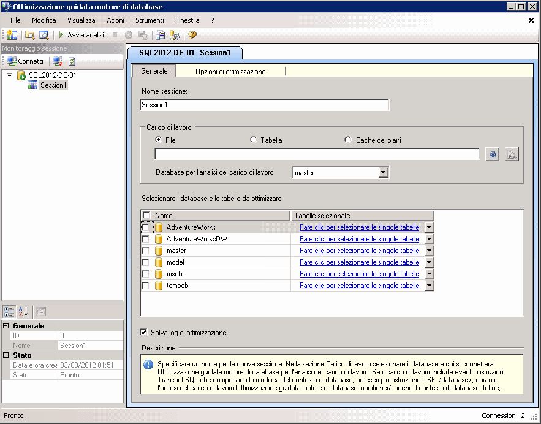

# Lezione 1-1-avviare Ottimizzazione guidata motore di Database
Accedere in primo luogo all'interfaccia utente grafica (GUI) dello strumento Ottimizzazione guidata motore di database. Al primo uso, per inizializzare l'applicazione è necessario che lo strumento Ottimizzazione guidata motore di database sia avviato da un membro del ruolo predefinito del server **sysadmin** . Dopo l'inizializzazione i membri del ruolo predefinito del database **db_owner** possono usare lo strumento Ottimizzazione guidata motore di database per ottimizzare i database di cui sono proprietari. Per altre informazioni sull'inizializzazione di Ottimizzazione guidata motore di database, vedere [Avvio e utilizzo di Ottimizzazione guidata motore di database](../../relational-databases/performance/start-and-use-the-database-engine-tuning-advisor.md).  
  
### Accesso all'interfaccia utente grafica dello strumento Ottimizzazione guidata motore di database  
  
1.  Dal menu **Start** di Windows scegliere **Tutti i programmi**, [!INCLUDE[ssCurrentUI](../../includes/sscurrentui-md.md)], **Strumenti per le prestazioni**e quindi fare clic su **Ottimizzazione guidata motore di database**.  
  
2.  Nella finestra di dialogo **Connetti al server** verificare le impostazioni predefinite e quindi fare clic su **Connetti**.  
  
Per impostazione predefinita, la configurazione all'avvio dello strumento Ottimizzazione guidata motore di database è quella illustrata nella figura seguente:  
  
  
  
> [!NOTE]  
> Nella scheda e nella casella **Nome sessione** vengono visualizzati il nome del computer e l'istanza a cui si è connessi. Inoltre, vengono visualizzate la data e l'ora correnti.  
  
Al primo avvio dell'interfaccia utente grafica dello strumento Ottimizzazione guidata motore di database vengono visualizzati due riquadri principali.  
  
-   Il riquadro sinistro contiene Monitoraggio sessione in cui sono elencate tutte le sessioni di ottimizzazione eseguite sull'istanza di [!INCLUDE[msCoName](../../includes/msconame-md.md)] [!INCLUDE[ssNoVersion](../../includes/ssnoversion-md.md)] . All'avvio dello strumento Ottimizzazione guidata motore di database, nella parte superiore del riquadro viene visualizzata una nuova sessione. È possibile assegnare un nome alla sessione nel riquadro adiacente. L'elenco contiene inizialmente una sola sessione. Si tratta della sessione predefinita creata automaticamente dallo strumento Ottimizzazione guidata motore di database per impostazione predefinita. Dopo aver eseguito l'ottimizzazione dei database, tutte le sessioni di ottimizzazione per l'istanza di [!INCLUDE[ssNoVersion](../../includes/ssnoversion-md.md)] alle quali si è connessi verranno elencate al di sotto della nuova sessione. È possibile fare clic con il pulsante destro del mouse su una sessione di ottimizzazione per rinominarla, chiuderla, eliminarla o clonarla. Se si fa clic con il pulsante destro del mouse nell'elenco è possibile ordinare le sessioni in base al nome, allo stato, alla data e all'ora di creazione oppure creare una nuova sessione. Nella parte inferiore del riquadro vengono visualizzati i dettagli della sessione di ottimizzazione selezionata. È possibile scegliere di visualizzare i dettagli organizzati in categorie usando il pulsante **Per categoria** oppure in un elenco alfabetico usando il pulsante **Per nome** . È inoltre possibile nascondere Monitoraggio sessione trascinando il bordo destro del riquadro verso il lato sinistro della finestra. Per visualizzarlo nuovamente, trascinare il bordo del riquadro verso destra. Monitoraggio sessione consente di visualizzare sessioni di ottimizzazione precedenti e di utilizzarle per la creazione di nuove sessioni con definizioni simili. È inoltre possibile utilizzare Monitoraggio sessione per valutare le indicazioni di ottimizzazione. Per altre informazioni, vedere [Visualizzare e utilizzare l'output di Ottimizzazione guidata motore di database](../../relational-databases/performance/view-and-work-with-the-output-from-the-database-engine-tuning-advisor.md). Usare il pulsante **Indietro** nel browser per tornare a questa esercitazione.  
  
-   Il riquadro destro contiene le schede **Generale** e **Opzioni di ottimizzazione** . In questo riquadro è possibile definire la sessione di ottimizzazione del Motore di database. Nella scheda **Generale** è possibile digitare un nome per la sessione di ottimizzazione, specificare il file o la tabella del carico di lavoro da usare e selezionare i database e le tabelle che si vuole ottimizzare in questa sessione. Un carico di lavoro è un set di istruzioni [!INCLUDE[tsql](../../includes/tsql-md.md)] eseguite sui database che si desidera ottimizzare. Lo strumento Ottimizzazione guidata motore di database utilizza file di traccia, tabelle di traccia, script [!INCLUDE[tsql](../../includes/tsql-md.md)] o file XML come input del carico di lavoro per l'ottimizzazione dei database. Nella scheda **Opzioni di ottimizzazione** è possibile selezionare le strutture di progettazione fisica dei database (indici e viste indicizzate) e la strategia di partizionamento che verrà seguita dallo strumento Ottimizzazione guidata motore di database durante l'analisi. In questa scheda è inoltre possibile specificare il tempo massimo consentito per l'ottimizzazione di un carico di lavoro con lo strumento Ottimizzazione guidata motore di database. Per impostazione predefinita, lo strumento Ottimizzazione guidata motore di database eseguirà l'ottimizzazione di un carico di lavoro in un'ora.  
  
> [!NOTE]  
> Ottimizzazione guidata motore di database può richiedere i file XML come input quando un [!INCLUDE[tsql](../../includes/tsql-md.md)] script viene importato da [!INCLUDE[msCoName](../../includes/msconame-md.md)] [!INCLUDE[ssManStudioFull](../../includes/ssmanstudiofull-md.md)] Editor di Query. Per altre informazioni, vedere la sezione relativa all'avvio dello strumento Ottimizzazione guidata motore di database dall'editor di query di [!INCLUDE[ssManStudioFull](../../includes/ssmanstudiofull-md.md)] in [Avvio e utilizzo di Ottimizzazione guidata motore di database](../../relational-databases/performance/start-and-use-the-database-engine-tuning-advisor.md).  
  
## Attività successiva della lezione  
[Layout e impostazione delle opzioni dello strumento](../../tools/dta/lesson-1-2-setting-tool-options-and-layout.md)  
  
  
  

