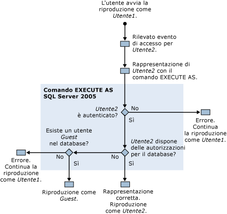

# Autorizzazioni necessarie per l'esecuzione di SQL Server Profiler
  Per impostazione predefinita, l'esecuzione di [!INCLUDE[ssSqlProfiler](../../includes/sssqlprofiler-md.md)] richiede le stesse autorizzazioni utente necessarie per le stored procedure Transact-SQL utilizzate per la creazione di tracce. Per eseguire [!INCLUDE[ssSqlProfiler](../../includes/sssqlprofiler-md.md)], è necessario che agli utenti venga concessa l'autorizzazione ALTER TRACE. Per altre informazioni, vedere [GRANT - autorizzazioni per server &#40;Transact-SQL&#41;](../../t-sql/statements/grant-server-permissions-transact-sql.md).  
  
> [!IMPORTANT]  
>  Gli utenti che dispongono dell'autorizzazione SHOWPLAN, ALTER TRACE o VIEW SERVER STATE possono visualizzare le query acquisite nell'output di Showplan. Poiché tali query possono contenere informazioni riservate, ad esempio password, è consigliabile concedere tali autorizzazioni solo agli utenti che possono visualizzare le informazioni riservate, ad esempio ai membri del ruolo predefinito del database db_owner oppure ai membri del ruolo predefinito del server sysadmin. È inoltre consigliabile salvare file Showplan o file di traccia che contengono eventi correlati a Showplan solo in una posizione che utilizza il file system NTFS e limitare l'accesso agli utenti autorizzati a visualizzare le informazioni riservate.  
  
## Autorizzazioni per la riproduzione di tracce  
 Per riprodurre le tracce, è necessario che l'utente che desidera eseguire questa operazione disponga dell'autorizzazione ALTER TRACE.  
  
 Durante la riproduzione, in [!INCLUDE[ssSqlProfiler](../../includes/sssqlprofiler-md.md)] viene tuttavia utilizzato il comando EXECUTE AS, se nella traccia riprodotta viene rilevato un evento Audit Login. In [!INCLUDE[ssSqlProfiler](../../includes/sssqlprofiler-md.md)] questo comando viene utilizzato per rappresentare l'utente associato all'evento di accesso.  
  
 Se [!INCLUDE[ssSqlProfiler](../../includes/sssqlprofiler-md.md)] rileva un evento di accesso in una traccia che si desidera riprodurre, verranno eseguite le verifiche delle autorizzazioni seguenti:  
  
1.  Utente1, che dispone dell'autorizzazione ALTER TRACE, inizia la riproduzione di una traccia.  
  
2.  Nella traccia riprodotta viene rilevato un evento di accesso per Utente2.  
  
3.  [!INCLUDE[ssSqlProfiler](../../includes/sssqlprofiler-md.md)] utilizza il comando EXECUTE AS per rappresentare Utente2.  
  
4.  [!INCLUDE[ssNoVersion](../../includes/ssnoversion-md.md)]tenta di eseguire l'autenticazione di Utente2 e, in base ai risultati, si verifica una delle operazioni seguenti:  
  
    1.  Se non è possibile eseguire l'autenticazione di Utente2, [!INCLUDE[ssSqlProfiler](../../includes/sssqlprofiler-md.md)] restituisce un errore e continua la riproduzione della traccia come Utente1.  
  
    2.  Se l'autenticazione di Utente2 viene eseguita, la riproduzione della traccia continua come Utente2.  
  
5.  Vengono controllate le autorizzazioni di Utente2 nel database di destinazione e, in base ai risultati, si può verificare una delle situazioni seguenti:  
  
    1.  Se Utente2 dispone delle autorizzazioni per il database di destinazione, la rappresentazione ha esito positivo e la riproduzione della traccia viene eseguita come Utente2.  
  
    2.  Se Utente2 non dispone delle autorizzazioni per il database di destinazione, il server verifica se esiste un utente Guest nel database.  
  
6.  Viene verificata l'esistenza di un utente Guest nel database di destinazione e, in base ai risultati, si può verificare una delle situazioni seguenti:  
  
    1.  Se esiste un account Guest, la riproduzione della traccia viene eseguita come account Guest.  
  
    2.  Se nel database di destinazione non esiste un account Guest, viene restituito un errore e la riproduzione della traccia viene eseguita come Utente1.  
  
 Nella figura seguente viene illustrato il processo di verifica delle autorizzazioni per la riproduzione delle tracce:  
  
   
  
## Vedere anche  
 [Stored procedure di SQL Server Profiler &#40;Transact-SQL&#41;](../../relational-databases/system-stored-procedures/sql-server-profiler-stored-procedures-transact-sql.md)   
 [Riprodurre le tracce](../../tools/sql-server-profiler/replay-traces.md)   
 [Creare una traccia &#40; SQL Server Profiler &#41;](../../tools/sql-server-profiler/create-a-trace-sql-server-profiler.md)   
 [Riprodurre una tabella di traccia &#40; SQL Server Profiler &#41;](../../tools/sql-server-profiler/replay-a-trace-table-sql-server-profiler.md)   
 [Riprodurre un file di traccia &#40;SQL Server Profiler&#41;](../../tools/sql-server-profiler/replay-a-trace-file-sql-server-profiler.md)  
  
  

